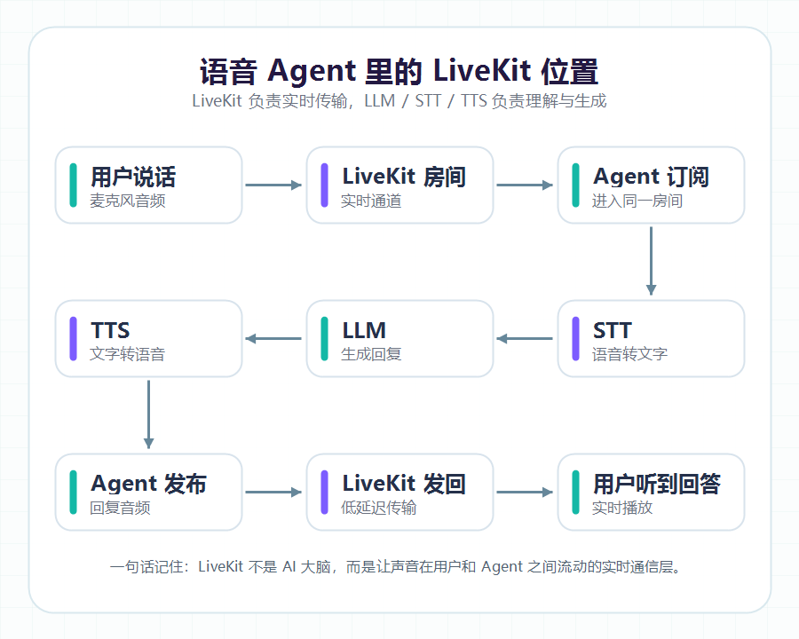
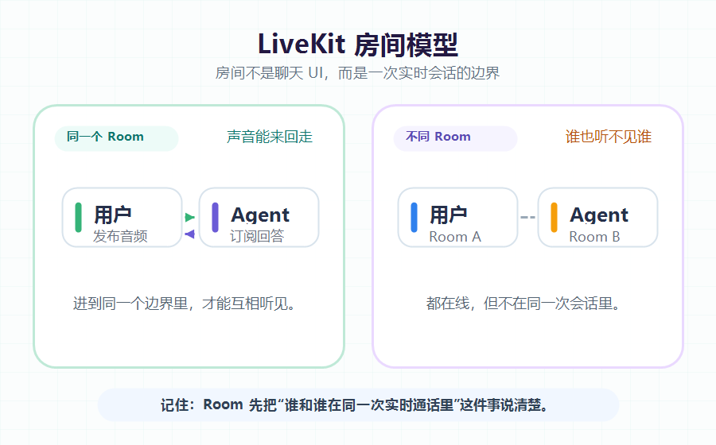

大家好，我是「山丘代码铺」。

> 这篇文章不讲源码，也不讲部署。
>
> 只解决一个问题：**LiveKit 到底是干什么的？**
>
> 如果你也第一次在语音 Agent 项目里看到 LiveKit，可以先从这篇开始。

这篇文章想聊聊我实习后接触到的第一个音视频组件：**LiveKit**。

刚到公司实习的时候，mentor 让我先去看 LiveKit。

说实话，第一次看到这个名字的时候，我是有点懵的。

因为它经常和 AI Agent、实时语音助手、语音对话这些词一起出现。

所以我一开始很容易把它想歪：

- LiveKit 是不是某种 AI 模型？
- 或者是一个聊天机器人框架？
- 再不济，也是个 Agent 工具包？

后来翻文档、看 README，再结合项目里的代码，我才慢慢发现：不是。

**LiveKit 本身不负责“变聪明”，也不负责“回答问题”。**

它更像是一个实时通信底座，也可以简单理解成一个“实时会议室”。

用户、网页、后端服务、AI Agent 都可以进到这个会议室里，然后互相传声音、视频和数据。

大模型负责思考，STT 负责把语音转成文字，TTS 负责把文字念出来。

而 LiveKit 负责的是：

> **LiveKit 不负责让 AI 变聪明。**
>
> **它负责别让大家失联。**

## 01｜先把误会拆开

第一次接触 LiveKit 的时候，我很容易把它误会成 AI 相关的东西。

原因也正常。

现在很多语音 Agent 项目都会用 LiveKit。

用户在网页上说话，Agent 听到声音，把语音转成文字，交给大模型思考，再把回答合成语音说回来。

整个体验看起来就像是在和 AI 实时通话。

但后来我发现，这里面其实分工很清楚。

简单拆一下：

- **LLM**：负责理解和生成内容
- **STT**：负责把语音转成文字
- **TTS**：负责把文字合成语音
- **Agent 代码**：负责把这些流程串起来
- **LiveKit**：负责让声音、视频、数据实时传来传去

所以 LiveKit 不负责“脑子”。

它更像“电话线”和“会议室”。

大模型像电话那头会思考的人，STT 和 TTS 像语音和文字之间的翻译器，而 LiveKit 就是中间那条线。

线本身不会回答问题。

但没有这条线，大家就只能各说各的，谁也听不见谁。

## 02｜为什么普通接口不够用？

以前我学后端，最熟悉的是 HTTP 接口。

前端发一个请求，后端处理一下，再返回一个结果。

比如登录、查列表、提交表单，这种模式很好理解：**你问我一次，我回你一次。**

但语音对话不是这样的。

说话是一段连续的声音流，不是一个普通 JSON。

你不能让用户先讲一分钟，然后把录音上传给后端，后端处理完再慢慢回一句。

那就不像实时对话了，更像：**“请留言，系统稍后回复你。”**

真正的语音 Agent，需要的是：

- 用户一边说，系统一边收
- Agent 一边处理，一边回应
- 中间网络有点抖，声音也尽量别断
- 用户和 Agent 要在同一个实时会话里

这些事情如果都自己从底层做，就会碰到 WebRTC、连接状态、音视频流、权限控制等一堆细节。

LiveKit 做的事情，就是把这些复杂东西封装起来。

你可以先把它理解成：**一个帮你管理实时语音/视频房间的服务。**

为了方便理解，我画了一个很简化的流程图：

图：语音 Agent 链路里的实时通信位置

## 03｜用“房间”理解 LiveKit

理解 LiveKit，我觉得最容易从“房间”开始。

这里的房间不是微信群，也不是页面上的聊天室 UI。

它更像一次实时会话的容器。

比如：

- 用户和语音 Agent 的一次对话，可以是一个房间
- 多人视频会议，可以是一个房间
- 客服通话，也可以是一个房间

进到同一个房间的人，才能互相听见、看见，或者交换数据。

如果用户进了 A 房间，Agent 进了 B 房间，那就尴尬了。

就像两个人约好开会，结果一个去了 301，一个去了 302。

大家都很努力，但谁也听不见谁。

为了让这个概念更直观，我又画了一张“房间模型”：

图：Room 可以理解为一次实时会话的容器

这张图想表达的其实很简单：

**房间不是 UI，而是一次实时会话的边界。**

用户和 Agent 进到同一个边界里，声音才有机会来回走。

在语音 Agent 项目里，可以先记住这条线：用户进房间，Agent 也进房间；用户把声音发进去，Agent 再把声音发回来。

所以 LiveKit 在这里做的事情，不是替 Agent 思考，而是保证用户和 Agent 能在同一个实时通道里说上话。

## 04｜我现在怎么理解 LiveKit？

如果用最简单的话总结，我现在会这样理解：

> **LiveKit 不是 AI 的大脑，而是语音 Agent 的实时通话房间。**

大模型负责想，STT 负责听写，TTS 负责开口说。

LiveKit 负责把大家拉到同一个房间里，让声音和数据能稳定、低延迟地传来传去。

所以它解决的不是“怎么让 AI 更聪明”，而是：**怎么让用户和 Agent 像打电话一样实时交流。**

这是我实习中第一次接触 LiveKit 后，对它建立起来的第一层理解。

## 写在最后

这篇文章先不展开部署，也不深挖源码。

先把一个问题讲清楚：**LiveKit 到底是干什么的？**

下一篇，我会继续记录：怎么把 LiveKit 在本地跑起来，以及部署时最容易卡住的几个点。

以后慢慢写，慢慢补，慢慢爬坡。
