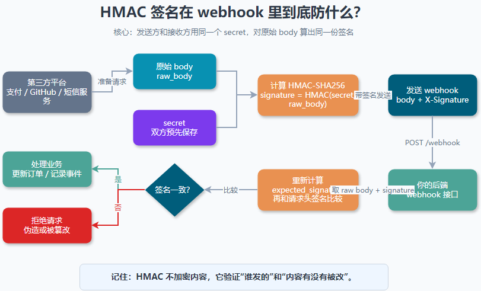

大家好，我是「山丘代码铺」。

> 这篇文章不讲复杂密码学公式，也不展开 HMAC 的完整数学推导。
>
> 只解决一个问题：**HMAC 签名到底在防什么？为什么 webhook 回调里经常要验签？**
>
> 如果你也看到过 `signature`、`secret`、`timestamp`、`webhook`、`raw body` 这些词有点懵，可以先从这篇开始。

刚开始看到 HMAC 签名的时候，我其实有点误会。

我以为它是在“加密请求内容”。

后来才发现，不是。

HMAC 签名不是为了把内容藏起来。

它更像是在回答两个问题：

> **这个请求真的是对方发的吗？**
>
> **这个请求内容在路上有没有被改过？**

尤其是在 webhook 回调里，这两个问题非常要命。

因为 webhook 接口通常是暴露在公网的。

只要别人知道你的回调地址，理论上谁都可以往这个地址发请求。

比如：

```text
POST https://your-app.com/webhook/payment
```

如果你的接口什么都不校验，只要收到一条：

```json
{
  "event": "payment.succeeded",
  "orderId": "10086"
}
```

就直接把订单改成“已支付”，那事情就有点刺激了。

刺激到可以先去喝口水。

---

## 01｜先从 webhook 回调说起

webhook 可以先简单理解成：

> **不是你主动去问别人结果，而是别人有结果后主动通知你。**

比如支付场景里，用户下单以后，你的系统会把用户带到支付平台。

用户付款完成后，支付平台需要告诉你的系统：

> 这笔订单已经支付成功了。

这时候支付平台就会请求你的回调接口。

大概像这样：

```text
支付平台  --->  你的后端 webhook 接口
```

请求里可能会带：

- 事件类型：`payment.succeeded`
- 订单号：`order_123`
- 金额：`99.00`
- 时间：`2026-06-02 10:00:00`

你的后端收到以后，就可以更新订单状态、发放权益、通知用户。

听起来很顺。

但问题也在这里：

> **既然这个接口在公网，那我怎么知道请求真的是支付平台发来的？**

如果攻击者自己构造一条“支付成功”的请求发过来呢？

如果中间有人把金额、订单号、事件类型改了呢？

这就是 webhook 回调里为什么经常会出现签名校验。

---

## 02｜如果没有签名，会发生什么？

假设你的系统有一个回调地址：

```text
https://your-app.com/webhook/payment
```

支付平台付款成功后，会给你发一条回调：

```json
{
  "event": "payment.succeeded",
  "orderId": "A001",
  "amount": 99
}
```

如果你的后端只看 body 里的内容：

> event 是 `payment.succeeded`，那我就把订单改成已支付。

这就有风险。

因为攻击者也可以发一条很像的请求：

```json
{
  "event": "payment.succeeded",
  "orderId": "A001",
  "amount": 99
}
```

从你的接口视角看，它们长得一模一样。

但一个是真的支付平台发来的。

另一个可能是别人伪造的。

所以问题不在于 JSON 长什么样。

问题在于：

> **谁有资格说这笔订单支付成功了？**

Webhook 里的 HMAC 签名，就是用来给这个请求加一层“身份证明”。

---

## 03｜HMAC 可以先理解成什么？

先给一个不那么教科书的理解：

> **HMAC 是用一个双方都知道的 secret，对消息算出来的一段签名。**

这个 secret 只有两边知道：

- webhook 发送方知道，比如支付平台；
- webhook 接收方知道，也就是你的后端。

别人不知道。

发送方发请求前，会拿这个 secret 和原始请求内容算一个签名。

大概像这样：

```text
signature = HMAC(secret, raw_body)
```

然后发送方把签名放到请求头里：

```text
X-Signature: abc123...
```

你的后端收到请求以后，也拿同一个 secret 和收到的原始 body 再算一遍。

如果你算出来的签名，和请求头里带过来的签名一样，就说明：

> **这个请求大概率是知道 secret 的那一方发来的。**
>
> **请求内容也没有被改过。**

如果对不上，那就直接拒绝。

简单说：

> **body 是信的内容。**
>
> **secret 是只有双方知道的印章。**
>
> **HMAC 签名就是盖出来的印。**

别人可以伪造一封信。

但如果不知道印章怎么盖，就很难伪造出能对上的签名。

---

## 04｜HMAC 到底在防什么？

我现在会把 HMAC 在 webhook 里防的事情拆成两类。

第一类：**防伪造。**

也就是防止别人随便调用你的 webhook 接口，假装自己是支付平台、GitHub、短信平台或者别的第三方服务。

因为攻击者不知道 secret。

他就算知道你的接口地址，也能构造 body，但算不出正确签名。

第二类：**防篡改。**

假设原始请求是：

```json
{
  "event": "payment.succeeded",
  "orderId": "A001",
  "amount": 99
}
```

如果有人把 `amount` 改成 `1`，或者把 `orderId` 改成别的订单，那么 body 变了。

body 一变，HMAC 算出来的签名也会变。

你的后端用收到的 body 重新计算签名时，就会发现对不上。

所以 HMAC 不只是看“有没有签名”。

它看的是：

> **这个签名，是否刚好对应这份原始内容。**

这也是为什么很多 webhook 文档都会强调：验签时要用 **原始请求体 raw body**。

因为哪怕 JSON 内容看起来一样，只要中间被框架重新格式化了，比如空格、换行、字段顺序发生变化，算出来的签名都可能不一样。

这点很容易踩坑。

---

## 05｜那 HTTPS 不是已经安全了吗？

我第一次看 webhook 签名时，还有一个疑问：

> 既然请求已经走 HTTPS 了，为什么还要 HMAC？

后来我慢慢理解，这两个东西解决的问题不一样。

HTTPS 更像是在保护“路上”。

它主要保证请求在传输过程中不容易被偷看、被篡改。

但 webhook 接口本身是公开入口。

别人完全可以不从“路上”截你的请求，而是自己直接发一个新请求到你的接口。

这时候 HTTPS 只能保证：

> 这个攻击者和你的服务器之间的连接是加密的。

但它不能证明：

> 这个请求真的是支付平台发来的。

HMAC 解决的是应用层的问题：

> **谁有 secret，谁才有资格生成正确签名。**

所以 HTTPS 和 HMAC 不是二选一。

更合理的理解是：

> **HTTPS 保护传输链路。**
>
> **HMAC 验证请求来源和内容完整性。**

---

## 06｜一个真实一点的验签流程

假设支付平台和你的系统提前约定了一个 secret：

```text
secret = whsec_xxx
```

支付平台要发一条 webhook：

```json
{
  "event": "payment.succeeded",
  "orderId": "A001",
  "amount": 99
}
```

它会做几件事：

1. 取原始 body；
2. 用 secret 对 body 算 HMAC-SHA256；
3. 把算出来的签名放进请求头；
4. 把请求发给你的 webhook 地址。

你的后端收到以后，也做几件事：

1. 取原始 body；
2. 取请求头里的 signature；
3. 用本地保存的 secret 重新算一遍 HMAC；
4. 比较两个签名是否一致；
5. 一致才处理业务，不一致直接拒绝。



> 图里最重要的一点是：发送方算 signature，接收方算 expected_signature，最后比较它们是不是同一份 raw body 和同一个 secret 算出来的结果。

可以把它理解成这样：

```text
第三方平台：
raw_body + secret  ->  signature

你的后端：
raw_body + secret  ->  expected_signature

如果 signature == expected_signature：
  继续处理 webhook
否则：
  拒绝请求
```

注意，这里比较签名时，最好使用安全的比较函数，而不是普通字符串比较。

原因是普通比较可能暴露一些细微的时间差。

虽然刚开始学的时候不用被这个细节吓到，但在真实项目里，很多语言和框架都会提供类似 `timingSafeEqual`、`compare_digest` 这样的安全比较方法。

能用就用。

---

## 07｜HMAC 不能防什么？

这点也很重要。

HMAC 很有用，但它不是万能护身符。

它主要防伪造和篡改。

但有些事情，不能只靠 HMAC。

比如：**重放攻击。**

假设攻击者没有改请求，也不知道 secret。

但他想办法拿到了一次真实 webhook 请求，然后把这份一模一样的请求又发了一遍。

由于 body 没变，签名也没变。

如果你的系统只看 HMAC，可能会觉得：

> 签名是对的，那就处理吧。

这就有问题。

所以很多 webhook 方案还会加时间戳。

比如签名内容不只是 body，而是：

```text
timestamp + raw_body
```

你的后端验签时，会顺便检查：

> 这个 timestamp 距离现在是不是太久了？

如果太久，就拒绝。

另外，业务上也要做事件去重。

比如同一个 `event_id` 只处理一次。

简单说：

> **HMAC 防伪造和篡改。**
>
> **timestamp 防太旧的请求被重放。**
>
> **event_id 去重防同一个事件被重复处理。**

这三个经常要一起看。

---

## 08｜我现在怎么理解 HMAC 签名？

如果用一句话总结，我现在会这样理解：

> **HMAC 不是加密内容，而是给内容做“带密钥的签名”。**

它在 webhook 里最核心的价值是：

- 确认请求是不是知道 secret 的那一方发来的；
- 确认原始 body 有没有被改过；
- 让你的公网回调接口不要谁发都信。

以前我看到 webhook 签名，只觉得它是在“多加一道校验”。

现在再看，它其实是在解决一个很具体的问题：

> **我怎么知道这条回调是真的？**

尤其是支付成功、发货通知、代码仓库事件、短信状态回调这类场景。

这些回调一旦被伪造，业务状态就可能直接错。

所以 HMAC 签名看起来只是请求头里一串字符。

但它背后保护的是：

> **不要让别人随便替第三方系统说话。**

---

## 写在最后

这是我理解 webhook 签名时补上的一层概念。

一开始我以为 HMAC 是“把内容加密一下”。

后来才发现，它真正做的是：

> **用 secret 给原始内容算一个签名。**
>
> **接收方再算一遍，对得上才信。**

它防的不是“别人看见内容”。

它防的是：

- 别人伪造一条 webhook；
- 别人篡改 webhook 内容；
- 系统把不该信的请求当真。

但它也不是万能的。

真实项目里还要注意：

- 用原始 body 验签；
- secret 不要放前端；
- 用安全比较函数；
- 加 timestamp 限制有效时间；
- 用 event_id 做幂等和去重。

如果以后单独展开，我想再写几篇：

- 为什么 webhook 验签一定要用 raw body？
- timestamp 为什么能缓解重放攻击？
- 接口签名和 JWT 有什么区别？
- 幂等到底是在防什么？

这些问题我现在也不是一开始就全懂。

很多都是在看项目、查资料、踩坑之后，才慢慢有了一点理解。

这篇先把 HMAC 在 webhook 里“到底防什么”讲到这里。

后面继续一篇一篇拆。

山丘不急，慢慢往上爬。
