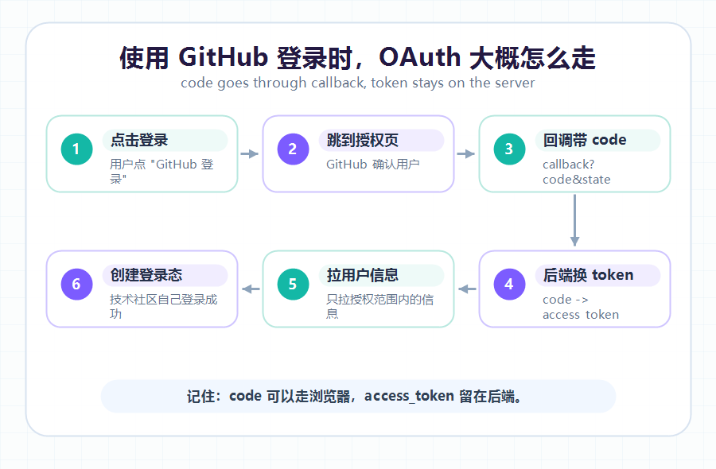

大家好，我是「山丘代码铺」。

> 这篇文章不讲 OAuth 2.0 的完整协议细节，也不背标准文档。
>
> 只解决一个问题：**OAuth 到底是干什么的，为什么登录不直接返回 token？**
>
> 如果你也看到 OAuth、code、access_token、callback、state 这些词有点懵，可以先从这篇开始。

刚开始接触 OAuth 的时候，我其实挺不理解的。

登录就登录呗。

用户点一下“使用某某账号登录”，授权方确认一下这个人是谁，然后业务系统知道用户是谁，不就结束了吗？

为什么中间要绕这么一大圈：

- 先跳到授权页面；
- 授权完再跳回 callback；
- URL 里带回来一个 code；
- 后端拿 code 去换 access_token；
- 再用 access_token 去获取用户信息。

我当时最直接的疑问就是：

> **为什么不直接把 access_token 返回回来？**
>
> 或者更简单一点，为什么不直接把用户信息返回回来？

后来结合项目里的登录流程看了一圈，又查了一些资料，才慢慢明白：

OAuth 不是为了把事情搞复杂。

它是在解决一个很现实的问题：

> **让一个系统在不拿到用户密码的情况下，安全地获得用户授权。**

这个点想明白以后，后面的 code、token、state，就没有一开始那么玄了。

---

## 01｜OAuth 先简单理解一下

先给一个不那么教科书的理解：

> **OAuth 是一种授权机制。**
>
> **它让一个系统在不拿到用户密码的情况下，获得用户允许访问的一部分资源。**

这里最关键的词不是“登录”，而是“授权”。

比如一个网站想借第三方账号确认你的身份，它真正想要的通常不是你的密码，而是想确认：

- 你是谁；
- 你允许它读取哪些信息；
- 它能在什么范围内访问这些信息。

OAuth 做的事情，就是把这件事拆开：

用户先去可信的授权方那里确认授权，授权方再给业务系统一个可以继续换取访问凭证的 code。

业务系统拿到凭证后，再去授权方拉取用户允许访问的信息。

所以从用户视角看，这像是“第三方登录”。

但从底层逻辑看，它先发生的是“授权”：

> **我同意这个网站读取我的部分信息，但我不把密码交给它。**

这样理解以后，再看后面的 code、access_token、callback，就会顺一点。

---

## 02｜先从一个生活例子说起

假设你住在一个小区，朋友要来找你。

最不安全的做法是什么？

你直接把家门钥匙给朋友。

这样他当然能进来，但问题也很明显：

- 他可能弄丢钥匙；
- 他可能复制一把；
- 他以后随时都能进来；
- 你很难控制他到底能进哪里。

更合理的方式是什么？

你给他一张临时访客码。

这张码只能用一次，只能进小区，可能还有时间限制。朋友拿着访客码到门卫那里登记，门卫确认没问题，再给他放行。

这就比直接给钥匙安全很多。

OAuth 里的 **code**，就有点像这张临时访客码。

而 **access_token**，更像真正能访问资源的通行证。

所以 OAuth 不想直接把 access_token 暴露在浏览器跳转里，而是先给一个短期、一次性的 code。

然后让后端拿这个 code，再去换真正的 access_token。

简单说就是：

> **code 是临时票据。**
>
> **access_token 才是真正能访问资源的凭证。**

---

## 03｜OAuth 到底在解决什么问题？

以前我一开始很容易把 OAuth 理解成“登录功能”。

但后来发现，这么理解不太准确。

OAuth 的核心其实不是登录，而是授权。

只是很多“第三方登录”场景，会先通过 OAuth 授权拿到用户基本信息，然后业务系统再根据这些信息创建自己的登录态。

比如你用一个第三方系统登录某个网站。

这个网站想知道你是谁，或者想读取你的头像、昵称、邮箱，但它不应该拿到你的账号密码。

否则就会变成：

> “你把微信密码给我，我帮你去微信查一下你是谁。”

这听起来就很离谱。

正常人应该都会犹豫：

> 我只是想登录你的网站，不是想把家底都交给你。

OAuth 的做法是：

1. 用户跳到授权方那里；
2. 用户在授权方那里确认授权；
3. 授权方给业务系统一个 code；
4. 业务系统后端用 code 换 access_token；
5. 再用 access_token 去获取用户允许访问的信息。

举个更真实一点的例子。

假设你打开一个技术社区，点击“使用 GitHub 登录”。

这个技术社区不应该让你输入 GitHub 密码。它会把你带到 GitHub 的授权页面，让 GitHub 来确认你是谁，也让你自己决定要不要授权。

你点同意以后，GitHub 不会把你的密码给这个技术社区，也不会直接把 access_token 扔在浏览器地址栏里。

它会先把一个 code 带回技术社区的 callback 地址。

然后技术社区的后端拿这个 code 去 GitHub 换 access_token，再用 access_token 调 GitHub 的接口，拿到你授权过的基础信息。

最后，技术社区再根据这些信息，在自己的系统里创建登录态。

所以你看到的是：

> “我用 GitHub 登录成功了。”

但背后真正发生的是：

> **先授权，再换 token，再拉用户信息，再建立自己的登录态。**



图：使用 GitHub 登录时，code 先通过 callback 回来，access_token 由后端再去换。

这样业务系统不用知道用户密码。

用户也不用把自己的账号密码交给第三方网站。

这就是 OAuth 很重要的价值：

> **我允许你访问一部分信息，但我不把密码给你。**

---

## 04｜为什么不直接返回 access_token？

这是我第一次看 OAuth 流程时最疑惑的点。

既然后端最后还是要拿 access_token，那为什么授权方不一开始就把 access_token 返回回来？

这不是多此一举吗？

后来我发现，问题主要出在“返回回来”的路上。

OAuth 授权完成后，通常会通过浏览器跳回业务系统的 callback 地址。

大概是这种感觉：

```text
https://your-app.com/callback?code=xxxx&state=yyyy
```

这个跳转会经过浏览器。

如果直接把 access_token 放在 URL 里，就会有一些风险：

- 浏览器历史记录里可能留下；
- 服务端或网关日志里可能被记录；
- 被前端脚本、插件、调试工具看到；
- 被复制、截图、转发时泄露；
- 中间链路出问题时更难控制。

至于为什么不直接返回用户信息，也类似：用户信息属于资源，应该由业务系统在拿到授权后，通过服务端去授权方拉取，而不是在浏览器跳转里直接暴露。

而 access_token 是真正能访问资源的凭证。

它一旦泄露，别人可能就能拿着它去访问用户授权过的信息。

所以 OAuth 更安全的做法是：

> **不要直接把真正的通行证放在前端跳转里。**
>
> **先给一个短命的 code，再让后端去换 token。**

code 就算被看到，风险也相对小很多。

因为它通常有几个限制：

- 有效期很短；
- 只能使用一次；
- 需要匹配 client_id、redirect_uri 等信息；
- 对后端应用来说，还会结合 client_secret 完成交换。

所以 code 更像一张“临时取票凭证”。

而 access_token 是真正的票。

临时凭证可以走浏览器跳转。

真正的票，最好由后端私下去换。

---

## 05｜后端为什么更适合换 token？

因为后端能保管一些前端不该知道的东西。

比如 **client_secret**。

这个东西可以理解成业务系统和授权方之间的密钥。

如果把 client_secret 放到前端，那就等于把“系统身份证明”公开了。用户打开浏览器、抓个包、看下源码，可能就能看到。

这肯定不行。

所以比较常见的做法是：

1. 前端负责把用户带到授权页面；
2. 授权完成后，浏览器回到 callback；
3. 后端拿到 code；
4. 后端带上 code、client_id、client_secret、redirect_uri 去换 access_token；
5. 后端再用 access_token 去请求用户信息；
6. 最后后端给自己的系统创建登录态。

也就是说：

> **前端负责跳转。**
>
> **后端负责换 token。**
>
> **真正敏感的东西，不要放在前端。**

这也是我后来理解 OAuth 后很重要的一点。

很多安全设计看起来麻烦，其实是在分清楚：

> 哪些东西可以暴露在浏览器里？
>
> 哪些东西只能留在服务端？

这个边界一旦想清楚，很多“为什么非要多一步”的问题，就会慢慢有答案。

---

## 06｜access_token 又是干什么的？

access_token 可以简单理解成一张访问通行证。

拿到它以后，业务系统就可以去授权方那里访问用户允许的资源。

比如：

- 获取用户基本信息；
- 获取头像；
- 获取邮箱；
- 获取某些开放接口权限。

但它不是万能钥匙。

access_token 一般会有范围限制，也就是 **scope**。

比如用户只授权你读取基本信息，那你就不能拿它去做别的事情。

所以 access_token 不是：

> “我拥有了你的账号。”

更准确地说是：

> **用户允许某个系统，在一定范围内、一定时间内，访问某些资源。**

这也是 OAuth 和直接给密码最大的区别。

密码像总钥匙。

access_token 更像一张有限权限、会过期的通行证。

---

## 07｜state 又是干什么的？

OAuth 里还有一个经常出现的参数：**state**。

我刚开始看到它的时候，也以为它只是随便带的一个字符串。

后来才知道，它主要是用来保护这次授权流程，避免一些伪造请求的问题。

可以先简单理解成：

> **state 是这次登录流程的“防伪标记”。**

业务系统在发起 OAuth 登录前，先生成一个随机 state，并保存起来。

等授权方跳回 callback 的时候，会把 state 原样带回来。

后端拿到以后会检查：

> 这个 state 是不是我之前发出去的那个？

如果对不上，就说明这次回调可能有问题。

有点像你寄快递前自己贴了一个暗号。

快递回来时你检查一下：

> 嗯，是我当初发出去的那一单。

如果没有 state，攻击者就可能尝试伪造 callback，让系统误以为这是一次正常登录。

所以 state 的作用不是登录本身，而是保护登录流程不要被冒用。

简单说：

> **code 用来换 token。**
>
> **state 用来确认这次回调是不是自己发起的。**

---

## 08｜我现在怎么理解 OAuth？

如果用最简单的话总结，我现在会这样理解：

> **OAuth 不是让第三方系统拿到你的密码。**
>
> **而是让你授权它，在有限范围内访问你的部分信息。**

整个流程看起来绕，但每一步都有原因：

- 跳到授权方：让用户在可信的地方确认授权；
- 返回 code：避免直接暴露 access_token；
- 后端换 token：保护 client_secret 和敏感凭证；
- 用 token 拉用户信息：在授权范围内访问资源；
- 校验 state：确认这次回调没有被伪造。

以前我看 OAuth，只觉得它步骤多。

现在再看，感觉它其实是在做一件事：

> **尽量不把真正敏感的东西暴露在不安全的地方。**

这也是很多后端安全设计里反复出现的思想。

不是为了绕。

是为了少出事。

---

## 写在最后

这是我实习里接触 OAuth 流程后，慢慢补起来的一层理解。

一开始我最困惑的是：

> 为什么不直接返回 access_token？
>
> 为什么还要 code 换 token？

后来才发现，这个“多一步”，其实是在把风险挡在外面。

code 是临时票据。

access_token 是真正的访问凭证。

前端可以参与跳转，但真正敏感的交换，最好放在后端完成。

这篇文章没有展开 OAuth 的所有模式，也没有细讲 refresh_token、scope、PKCE 的完整机制。

先把最常见、也最容易困惑的问题讲清楚：

> **OAuth 到底是干什么的？为什么要 code 换 token？**

PKCE 这个词我先不展开，它可以理解成给授权码流程再加一道保险。后面我会单独写一篇。

后面如果继续写，我准备再单独记录几个问题：

- access_token 和 refresh_token 有什么区别？
- state 为什么能防 CSRF？
- PKCE 到底是在防什么？
- 后端拿到用户信息后，怎么和自己系统的登录态结合？

以后慢慢写，慢慢补，慢慢爬坡。
