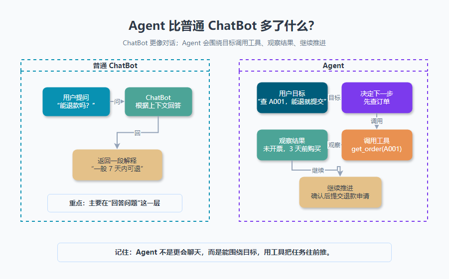

大家好，我是「山丘代码铺」。

> 这篇文章不讲复杂的 Agent 框架，也不堆一堆英文缩写。
>
> 只解决一个问题：**Agent 到底是什么？它比普通 ChatBot 多了什么？**
>
> 如果你也经常看到 Agent、ChatBot、工具调用、Workflow、Memory 这些词混在一起，可以先从这篇开始。

刚开始看到 Agent 这个词的时候，我其实也有点懵。

因为很多产品看起来都差不多。

都是一个聊天框。

你输入一句话，它回你一段话。

那为什么有的叫 ChatBot，有的叫 Agent？

难道 Agent 只是一个更高级、更会聊天的机器人吗？

后来我慢慢发现，不完全是。

普通 ChatBot 更像是在回答问题。

Agent 更像是在围绕一个目标推进任务。

先给一个很粗糙但好记的版本：

> **ChatBot 主要负责对话。**
>
> **Agent 不只是对话，还会调用工具、观察结果、继续决定下一步。**

这句话先记住。



> 图里最重要的一点是：ChatBot 更像问一句回一句，Agent 会围绕目标调用工具、观察结果，并继续推进任务。

后面我们用一个真实一点的例子慢慢拆。

---

## 01｜ChatBot 可以先理解成什么？

ChatBot 就是聊天机器人。

最简单的理解是：

> **你发一句话，它回一句话。**

比如你问：

```text
OAuth 是什么？
```

它回答：

```text
OAuth 是一种授权机制……
```

你再问：

```text
HashMap 为什么线程不安全？
```

它继续解释：

```text
因为 HashMap 没有同步机制……
```

这就是很典型的 ChatBot 体验。

它擅长：

- 回答问题；
- 解释概念；
- 总结内容；
- 翻译文本；
- 帮你生成一段文案；
- 根据上下文继续聊天。

但它有一个明显边界：

> **它通常只是在说，不一定真的能做。**

比如你问：

```text
帮我查一下订单 A001 能不能退款。
```

如果它没有接订单系统，它只能说：

```text
我无法直接查询你的订单。
```

它可以告诉你退款规则。

但它不知道订单 A001 的真实状态。

这就是普通 ChatBot 的边界。

---

## 02｜那 Agent 多了什么？

Agent 这个词现在用得很泛。

不同公司、不同框架，对它的定义也不完全一样。

但从后端同学的视角，可以先抓住一个核心：

> **Agent 是一个能围绕目标，使用工具，观察结果，并继续推进任务的 AI 系统。**

它不是只回答一句话。

它会多做几步。

比如用户说：

```text
帮我看看订单 A001 能不能退款，可以的话帮我提交申请。
```

一个普通 ChatBot 可能只能回答退款规则。

但一个 Agent 可能会这样做：

```text
1. 判断用户想做什么：查订单 + 判断退款条件 + 可能提交申请
2. 调用订单工具：get_order("A001")
3. 观察订单结果：购买时间、支付状态、是否开票
4. 调用退款规则工具或检索知识库
5. 判断是否符合退款条件
6. 如果需要提交申请，先让用户确认
7. 用户确认后，调用 create_refund_request
8. 把最终结果告诉用户
```

你看，它不是只“聊”。

它在一步一步推进一个任务。

所以我现在会把 Agent 理解成：

> **一个带目标、带工具、能根据中间结果继续行动的 AI 助手。**

---

## 03｜用客服退款例子看一遍

假设你在做一个 AI 客服。

用户问：

```text
我买的课程不想学了，可以退款吗？
```

如果只是 ChatBot，它可以根据知识库回答：

> 购买 7 天内，且没有开票，通常可以申请退款。

这没问题。

但用户继续说：

```text
那帮我查一下订单 A001 能不能退。
```

这时候就不是单纯聊天了。

系统得知道订单 A001 的真实信息。

比如：

- 订单是不是存在；
- 是不是当前用户的订单；
- 购买时间是不是超过 7 天；
- 有没有开票；
- 有没有已经退款过；
- 是不是活动商品。

这些信息不在模型脑子里。

也不应该让模型瞎编。

这时候 Agent 需要调用工具：

```text
get_order(order_id = "A001")
```

拿到结果后，再继续判断。

如果订单符合退款条件，Agent 也不能直接偷偷退款。

它可能要先问一句：

```text
这笔订单符合退款条件，是否确认提交退款申请？
```

用户确认后，再调用：

```text
create_refund_request(order_id = "A001")
```

最后再回复：

```text
退款申请已提交，预计 1-3 个工作日处理。
```

这个过程里，Agent 至少做了三件 ChatBot 不一定会做的事：

> **调用工具。**
>
> **根据工具结果继续判断。**
>
> **把任务推进到一个完成状态。**

这就是差别。

---

## 04｜Agent Loop 是什么？

很多文章讲 Agent，会提到 Agent Loop。

这个词听起来有点玄。

但先别被它吓到。

可以把它理解成一个循环：

```text
看目标
  ↓
决定下一步
  ↓
调用工具
  ↓
观察结果
  ↓
再决定下一步
  ↓
直到任务结束
```

还是刚才的退款例子。

Agent 一开始看到用户目标：

```text
帮我查订单 A001 能不能退款，可以的话提交申请。
```

它先决定：

```text
我得先查订单。
```

于是调用 `get_order`。

工具返回：

```text
订单存在，购买时间 3 天前，未开票，未退款。
```

Agent 再判断：

```text
看起来符合退款条件，但提交申请前需要用户确认。
```

于是它问用户确认。

用户确认后，它再调用 `create_refund_request`。

这就是一个很简单的 Agent Loop。

它不像固定接口流程那样，一开始就把每一步写死。

它会根据中间结果，继续选择下一步。

这也是 Agent 看起来更“智能”的地方。

---

## 05｜Agent 比 ChatBot 多的不是一个名字

如果只看页面，它们可能都长得像一个聊天框。

但从工程上看，Agent 多出来的东西不少。

### 1. 工具

Agent 通常会接工具。

比如：

- 查订单；
- 查知识库；
- 发邮件；
- 创建工单；
- 查询数据库；
- 调用日历；
- 调用支付或退款接口。

这些工具让 AI 不只是回答，还能接触真实系统。

### 2. 上下文

Agent 需要知道任务进行到哪一步。

比如：

```text
订单已经查过了
退款规则已经判断过了
用户还没有确认
```

如果没有上下文，它每一步都像失忆一样。

### 3. 决策

Agent 要决定下一步做什么。

比如：

```text
先查订单，还是先查退款规则？
现在能提交申请，还是要先问用户确认？
工具调用失败了，要不要重试？
```

这一步就是 Agent 和普通问答系统很大的区别。

### 4. 边界

Agent 能做事，所以更需要边界。

比如：

- 哪些工具可以调用；
- 哪些操作必须用户确认；
- 哪些数据不能返回；
- 调用失败怎么处理；
- 日志和审计怎么记录。

Agent 越能干，越不能随便放飞。

这点很重要。

---

## 06｜Agent 不等于“让模型自由发挥”

有一段时间，我对 Agent 有个误解。

我以为 Agent 就是：

> 让模型自己想办法，想怎么做就怎么做。

后来才发现，真放开了反而很危险。

尤其是后端系统里。

如果 Agent 接了订单、支付、用户、工单这些系统，就不能让它随便调用。

比如用户说：

```text
帮我把这个订单退了。
```

Agent 不能直接就退。

它至少要检查：

- 用户有没有权限；
- 订单是不是属于这个用户；
- 订单是否符合退款规则；
- 是否需要用户二次确认；
- 退款接口是否幂等；
- 调用失败怎么补偿；
- 结果怎么记录日志。

所以工程里的 Agent，不是一个“完全自由的模型”。

它更像是：

> **模型负责判断和选择，系统负责约束和执行。**

这个理解很关键。

因为很多 Agent 项目真正难的地方，不是让模型说得更像人。

而是：

> **怎么让它在正确边界里做正确的事。**

---

## 07｜Agent 和 Workflow 有什么区别？

这个问题也很容易混。

Workflow 可以理解成固定流程。

比如：

```text
用户提交订单
  ↓
校验库存
  ↓
创建订单
  ↓
扣减库存
  ↓
发消息通知
```

每一步基本是提前写好的。

流程清楚、边界清楚、结果可控。

Agent 更适合那些路径没那么固定的任务。

比如：

```text
帮我分析这个用户为什么一直退款失败。
```

它可能要：

- 查订单；
- 查退款记录；
- 查支付渠道；
- 查日志；
- 看错误码；
- 总结原因；
- 给出下一步建议。

不同用户的情况不一样，下一步也不一样。

这时候 Agent 的价值就更明显。

但这不代表所有事情都要做成 Agent。

如果一个任务流程非常固定，用 Workflow 可能更简单、更稳定。

所以可以先这样记：

> **流程固定，优先 Workflow。**
>
> **路径不固定，需要根据中间结果继续判断，可以考虑 Agent。**

---

## 08｜后端同学怎么理解 Agent？

如果从后端视角看，Agent 不是一个神秘东西。

它更像一个组合系统：

```text
大模型
  +
工具
  +
上下文
  +
控制循环
  +
权限和边界
  +
日志和追踪
```

大模型负责理解用户意图，判断下一步。

工具负责连接真实系统。

上下文负责记录任务状态。

控制循环负责让任务一步一步推进。

权限和边界负责防止它乱来。

日志和追踪负责出了问题能查清楚。

这样看以后，Agent 就不只是一个“会聊天的产品功能”。

它是一个需要认真设计的后端工程系统。

这也是为什么我觉得后端同学很适合学 Agent。

因为 Agent 最后一定会落到这些问题上：

- 怎么接 API；
- 怎么控权限；
- 怎么做幂等；
- 怎么处理超时；
- 怎么记录日志；
- 怎么排查失败；
- 怎么评估结果。

这些都不是纯前端聊天框能解决的。

---

## 写在最后

Agent 这个词现在很火。

但越火的词，越容易被讲得很玄。

我现在更愿意把它拉回一个朴素的问题：

> **它到底能不能围绕一个目标，把事情往前推进？**

如果只是你问一句，它答一句，那更像 ChatBot。

如果它能调用工具、观察结果、继续决定下一步，并在边界里把任务完成，那就开始接近 Agent。

其实这里还有几个问题值得思考：

- 工具调用到底发生在哪一步？
- Agent 为什么需要 Memory？
- Agent 和 Workflow 到底怎么选？
- Agent 为什么一定要做日志和追踪？
- Agent 失控一般是哪里失控？

这篇先把 Agent 到底是什么，以及它比普通 ChatBot 多了什么讲到这里。

后面继续一篇一篇拆。

山丘不急，慢慢往上爬。
