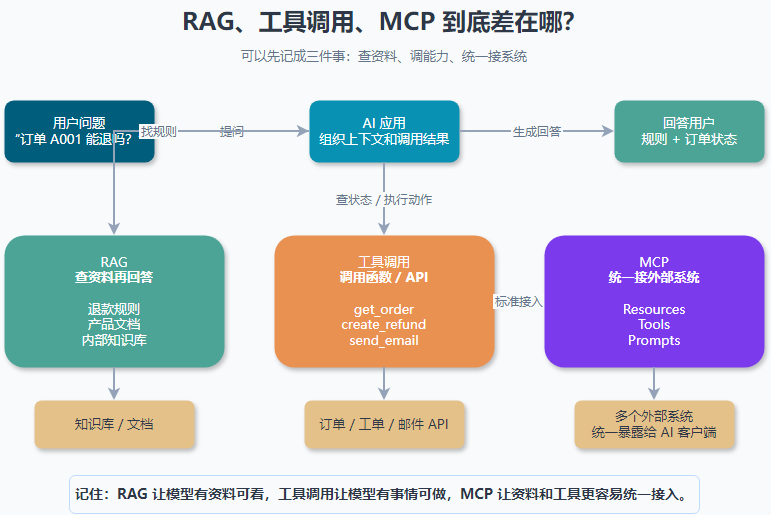

大家好，我是「山丘代码铺」。

> 这篇文章不讲复杂的 Agent 架构，也不堆一堆英文缩写。
>
> 只解决一个问题：**RAG、MCP、工具调用到底有什么区别？**
>
> 如果你也经常看到 RAG、MCP、tool calling、function calling 这些词混在一起，可以先从这篇开始。

刚开始看 AI 应用开发的时候，我有一段时间特别容易混。

一会儿看到别人说：

> 做知识库问答，要用 RAG。

一会儿又看到：

> 让模型查天气、查订单，要用工具调用。

再过一阵子，又满屏都是：

> MCP 是 AI 应用的统一协议。

看多了以后，脑子里就会冒出一个很朴素的问题：

> **这几个东西到底是不是一回事？**

如果不是，它们分别在解决什么问题？

后来我慢慢发现，很多困惑不是因为概念太难，而是因为我们把它们放在了同一层比较。

其实它们不完全是一类东西。

先给一个粗糙但好记的版本：

> **RAG 是查资料再回答。**
>
> **工具调用是让模型调用外部函数或 API。**
>
> **MCP 是把外部资料和工具，用统一协议接给 AI 应用。**

这句话先记住。



> 图里最重要的一点是：RAG 解决“资料从哪来”，工具调用解决“外部能力怎么用”，MCP 解决“外部系统怎么统一接进来”。

后面再用一个真实一点的例子慢慢拆。

---

## 01｜先从一个 AI 客服例子说起

假设你要做一个 AI 客服助手。

它要帮用户处理退款问题。

用户可能会问：

> 我买的课程不想学了，可以退款吗？

这个问题听起来简单，但 AI 不能靠拍脑袋回答。

它得知道你们公司的退款规则。

比如：

- 购买 7 天内可以退款；
- 已开票订单要先冲红发票；
- 某些活动商品不支持退款；
- 企业订单走单独流程。

这些规则可能写在内部文档、飞书文档、Notion、FAQ 或者后台配置里。

这时候，系统要做的第一件事不是“调用接口”，而是：

> **先把相关资料找出来，再交给模型回答。**

这就很像 RAG。

用户又问：

> 那你帮我查一下订单 A001 能不能退。

这时候只看退款规则还不够。

你还得知道订单 A001 的真实状态：

- 是谁买的；
- 什么时候买的；
- 有没有开票；
- 有没有退款过；
- 是不是活动商品；
- 当前订单状态是什么。

这些信息通常不在知识库文档里，而在业务数据库或者订单系统里。

这时候就需要调用接口。

比如：

```text
get_order(order_id = "A001")
```

模型判断自己需要查订单，于是发起一次工具调用。

应用拿到这个调用请求后，真的去调用订单接口，再把结果返回给模型。

这就很像工具调用。

再往后，如果用户说：

> 符合退款条件的话，帮我提交退款申请。

这时候就不只是“查”了，而是要“做”。

系统可能要调用：

```text
create_refund_request(order_id = "A001")
```

这也是工具调用，只不过它有写入动作，风险更高，通常需要权限校验、日志记录，甚至让用户二次确认。

再想一层。

如果这个 AI 客服不只接订单系统，还要接：

- 知识库；
- 工单系统；
- CRM；
- 财务系统；
- 邮件系统；
- 日历系统。

每接一个系统都重新写一套适配逻辑，就会很乱。

这时候就会出现 MCP 这种东西。

它想解决的是：

> **能不能用一种统一的方式，把外部系统的资料、工具、工作流接给 AI 应用？**

所以你可以先这样理解：

> RAG 关心“资料怎么找出来”。
>
> 工具调用关心“模型怎么调用外部能力”。
>
> MCP 关心“外部能力怎么标准化接进来”。

---

## 02｜RAG：先查资料，再回答

RAG 全称是 Retrieval-Augmented Generation。

不用一开始就背这个英文。

先把它理解成：

> **模型回答前，先去外部知识库里找相关资料。**

一个很常见的流程是这样：

```text
用户提问
  ↓
检索相关文档
  ↓
把文档片段放进上下文
  ↓
模型基于这些资料回答
```

比如用户问：

> 你们的退款规则是什么？

系统先去知识库里搜“退款规则”“课程退款”“发票冲红”等相关内容。

搜到以后，把这些资料塞给模型。

然后模型再组织成一段人能看懂的话。

所以 RAG 的重点不是“模型会不会调接口”。

它的重点是：

> **不要让模型只靠训练时记住的东西回答，而是让它参考当前给到的资料。**

这对很多场景都很有用：

- 公司内部知识库问答；
- 产品文档问答；
- 法务、财务、客服制度查询；
- 代码库说明；
- 项目资料总结。

但 RAG 也有边界。

它更擅长回答“资料里写了什么”。

它不天然擅长做这些事：

- 查询实时订单状态；
- 创建一张工单；
- 给用户发邮件；
- 修改数据库记录；
- 调用支付接口发起退款。

这些就不是单纯“查资料”能解决的了。

---

## 03｜工具调用：让模型调用外部函数

工具调用可以先理解成：

> **你告诉模型：这些函数你可以用。模型需要的时候，会请求调用其中某一个。**

注意这里有个细节：

模型通常不是自己真的去执行代码。

它更像是说：

> 我现在需要调用 `get_order`，参数是 `order_id = A001`。

真正执行这个函数的，是你的应用程序。

大概像这样：

```text
用户：帮我查一下订单 A001
  ↓
模型：我需要调用 get_order
  ↓
应用：执行 get_order("A001")
  ↓
订单系统：返回订单状态
  ↓
应用：把结果交回模型
  ↓
模型：组织语言回复用户
```

工具调用解决的是模型本身做不到的事。

比如：

- 查实时天气；
- 查订单状态；
- 创建日程；
- 发邮件；
- 搜索网页；
- 查询数据库；
- 调用支付系统。

所以我现在会把工具调用理解成：

> **模型负责判断“该用哪个工具”。**
>
> **应用负责真正执行工具。**

这也解释了为什么工具调用要特别注意安全。

如果只是查天气，风险还小一点。

但如果工具是：

```text
delete_user
refund_order
send_email
update_database
```

那就不能让模型随便调。

你至少要考虑：

- 这个工具能不能被当前用户使用；
- 参数是否合法；
- 是否需要用户确认；
- 调用结果要不要记录日志；
- 调错了能不能回滚。

工具调用让 AI 从“会说”往“能做”走了一步。

但这一步不能只看技术，还要看权限和边界。

---

## 04｜MCP：统一接外部系统的方式

MCP 全称是 Model Context Protocol。

可以先把它理解成：

> **一种让 AI 应用连接外部系统的开放协议。**

如果说工具调用是“模型可以调用函数”，那 MCP 更关心：

> 这些函数、资料、提示词模板，怎么被 AI 应用发现、理解和调用？

一个 MCP Server 可以向 AI 应用暴露几类东西：

- Resources：资料，比如文件、数据库记录、知识库内容；
- Tools：工具，比如查订单、发邮件、创建工单；
- Prompts：提示模板，比如“帮我总结会议”“生成周报”。

你可以把 MCP 想成一个统一插口。

过去，一个 AI 应用要接 GitHub、数据库、Notion、Slack、订单系统，可能每个都要单独写适配。

有了 MCP 后，外部系统可以通过 MCP Server 把自己的能力暴露出来。

AI 应用再通过统一协议去发现和使用这些能力。

所以 MCP 不是一个“回答问题的方法”。

它更像是一个连接标准。

它可以接资料，也可以接工具，还可以接提示模板。

这也是为什么 MCP 经常会和 RAG、工具调用一起出现。

因为它们在真实项目里确实会组合使用。

比如：

> MCP Server 暴露一个“搜索知识库”的工具。
>
> AI 应用通过工具调用使用它。
>
> 搜索出来的资料再作为 RAG 的上下文给模型回答。

你看，它们不是互相替代。

它们更像是在同一条链路里的不同位置。

---

## 05｜最容易混的几个点

### 1. RAG 和工具调用是不是一回事？

不是。

RAG 更偏“查资料”。

工具调用更偏“调用函数/API”。

只是很多 RAG 系统里，检索知识库这一步也可以被包装成一个工具。

所以你会看到：

```text
search_docs(query)
```

它看起来是工具调用。

但它的用途是为了 RAG。

也就是说：

> **检索可以通过工具调用实现。**
>
> **但 RAG 和工具调用不是同一个概念。**

### 2. MCP 和工具调用是不是一回事？

也不是。

工具调用关注的是：

> 模型怎么请求调用一个工具。

MCP 关注的是：

> 工具和资源怎么以统一协议暴露给 AI 应用。

可以这么说：

> **工具调用是模型使用工具的一种机制。**
>
> **MCP 是外部系统提供工具和资源的一种协议。**

一个工具可以不通过 MCP 提供。

比如你在自己后端直接写一个 `get_order` 函数，然后把它注册给模型。

这也是工具调用。

但如果你希望这个订单系统能被多个 AI 客户端复用，比如 Claude、Cursor、你自己的客服助手都能接，那 MCP 就更有意义。

### 3. MCP 是不是更高级的 RAG？

不是。

MCP 不是 RAG 的升级版。

RAG 是一种应用模式。

MCP 是一种连接协议。

MCP 可以给 RAG 提供资料来源，也可以提供搜索工具。

但 MCP 本身不负责：

- 怎么切分文档；
- 怎么做向量检索；
- 怎么做重排；
- 怎么判断资料是否相关；
- 怎么评估回答有没有引用正确。

这些还是 RAG 系统自己要处理的问题。

---

## 06｜什么时候该用谁？

如果你的问题是：

> 模型不知道我们公司的内部资料。

优先考虑 RAG。

比如：

- 公司制度问答；
- 产品文档问答；
- 课程内容问答；
- 项目资料总结。

如果你的问题是：

> 模型需要查实时数据，或者真的执行动作。

优先考虑工具调用。

比如：

- 查订单；
- 查库存；
- 创建工单；
- 发送邮件；
- 发起退款。

如果你的问题是：

> 外部系统很多，我希望 AI 应用用统一方式接入。

再考虑 MCP。

比如：

- 一个 AI 助手要同时接文件、数据库、GitHub、工单系统；
- 一个工具希望被多个 AI 客户端复用；
- 你不想为每个 AI 应用重复写一套集成逻辑。

真实项目里，经常不是三选一。

更常见的是组合：

```text
RAG 负责查资料
工具调用负责查实时数据和执行动作
MCP 负责把外部资料和工具标准化接进来
```

---

## 07｜我现在怎么记这三个词

我现在会用一个很土但管用的比喻记它们。

假设 AI 是一个刚入职的同事。

RAG 像是你递给他一份资料夹：

> 你先看这些资料，再回答用户。

工具调用像是你给他几个内部系统按钮：

> 要查订单就点这个，要创建工单就点那个。

MCP 像是公司统一规定了一套窗口：

> 所有部门都按这个方式提供资料和按钮，这样新人不用每个部门重新学一遍接口。

所以一句话总结：

> **RAG 让模型有资料可看。**
>
> **工具调用让模型有事情可做。**
>
> **MCP 让资料和工具更容易统一接入。**

这样分开以后，再看到这几个词，就不会那么乱了。

---

## 写在最后

很多 AI 应用的名词，第一次看都很像。

RAG、工具调用、MCP、Agent、Workflow、Memory，全都挤在一起。

看起来像是在讲同一件事。

但真的拆开以后，会发现它们解决的是不同层面的问题。

其实这里还有几个问题值得思考：

- 向量数据库到底在 RAG 里干什么？
- 为什么 RAG 有时候会查到资料但答不准？
- 工具调用为什么一定要做权限和确认？
- MCP Server 到底怎么写？
- Agent 和 Workflow 又有什么区别？

这篇先把 RAG、MCP、工具调用的区别讲到这里。

后面继续一篇一篇拆。

山丘不急，慢慢往上爬。
