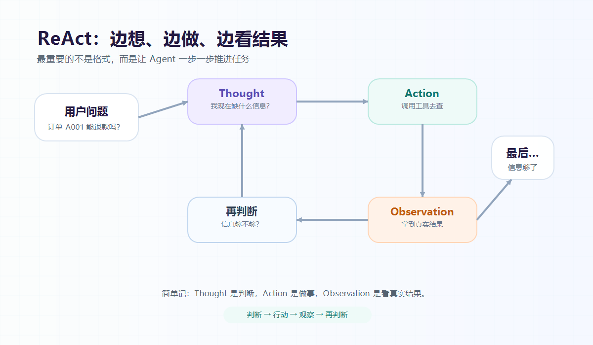

大家好，我是「山丘代码铺」。

这篇文章只解决一个问题：

> **ReAct 到底是什么？为什么 Agent 经常要“边想边做”？**

刚开始看到 ReAct 的时候，我第一反应是：

> 这是不是 React 前端框架拼错了？

后来才发现，不是。

AI Agent 里的 ReAct，一般指：

```text
Reason + Act
```

也就是：

```text
推理 + 行动
```

它想表达的事情其实很朴素：

> **一个能做事的 Agent，不应该只坐在那里回答问题。**
>
> **它应该先判断下一步，再调用工具，观察结果，然后继续判断。**

简单说：

> **ReAct 是一种让 Agent 边想、边做、边看结果、再继续推进任务的模式。**

这句话先记住。



图：ReAct 最核心的是“判断、行动、观察、再判断”这个循环。

后面我们用一个真实一点的例子慢慢拆。

---

## 01｜先从一个退款例子说起

假设你要做一个 AI 客服助手。

用户问：

```text
我这个订单 A001 可以退款吗？
```

如果只是普通问答，模型可能会直接回答：

```text
一般情况下，购买 7 天内可以退款。
```

这个回答看起来没问题，但从业务角度看很危险。

因为它根本不知道订单 A001 的真实情况。

它不知道订单状态，不知道购买时间，不知道有没有使用过，也不知道这个商品是否支持退款。

所以一个真正能干活的 Agent，不能只靠嘴说。

它得先判断：

> 我现在缺什么信息？

缺订单信息，就查订单。

查完订单以后，发现还要确认商品规则，那就继续查商品。

等信息够了，再给用户明确答复。

所以这个过程不是简单的一问一答。

它更像这样：

```text
判断下一步
  -> 调用工具
  -> 观察结果
  -> 再判断下一步
  -> 最后回答
```

这就是 ReAct 想表达的核心。

---

## 02｜ReAct 的三个关键动作

ReAct 里最常见的结构是三个词：

```text
Thought
Action
Observation
```

翻译得接地气一点：

```text
Thought：我现在怎么判断
Action：我接下来要做什么
Observation：我做完以后看到了什么结果
```

放到退款例子里，大概就是：

```text
Thought：用户问订单 A001 能不能退款，我不能直接回答，要先查订单。
Action：调用 get_order 查询订单。
Observation：订单是 3 天前创建，状态是 paid，没有退款过。

Thought：订单初步满足条件，但还要看商品是否支持退款。
Action：调用 get_product 查询商品规则。
Observation：商品支持 7 天内退款。

Thought：现在信息够了，可以回答用户。
```

你看，ReAct 最重要的不是这个格式有多高级。

而是它让模型不要一上来就拍结论。

它会先判断自己缺什么信息，然后通过工具拿到真实结果，再继续判断。

这里有一个点很关键：

> **Observation 不应该是模型自己猜出来的。**

它应该来自真实工具的返回结果。

比如查订单工具返回订单状态，查商品工具返回退款规则，查日志工具返回真实错误信息。

如果 Agent 把自己猜的内容当成真实结果，那后面推得越认真，偏得也可能越远。

---

## 03｜为什么不能让模型一次性回答？

有人可能会问：

> 模型这么聪明，为什么不把所有问题一次性想完？

因为真实项目里，很多信息一开始根本不在上下文里。

比如用户问：

```text
帮我看看这个接口为什么 500。
```

模型一开始并不知道日志里报了什么错，也不知道最近有没有发布，更不知道数据库有没有慢查询。

它必须一步一步查。

先查日志。

看到数据库超时。

再查数据库监控。

发现某张表慢查询突然变多。

再查最近发布。

最后才可能定位到：

> 某个新发布的查询少了索引，导致接口超时。

这其实和后端同学平时排查问题很像。

不是一开始就知道答案，而是：

```text
先有一个判断
  -> 查一个证据
  -> 根据证据修正判断
  -> 再查下一个证据
```

ReAct 只是把这个过程搬到了 Agent 里。

所以它听起来像 AI 概念，但其实很像工程师平时干活。

---

## 04｜ReAct 和工具调用是什么关系？

这里很容易混。

ReAct 和工具调用不是一回事。

可以先这样记：

> **工具调用是一种能力。**
>
> **ReAct 是一种使用工具的过程。**

工具调用解决的是：

> 模型能不能调用外部函数或 API？

比如查订单、查库存、查知识库、创建工单。

但有了工具，不代表 Agent 就会把事情做好。

它还要知道：

- 什么时候该调用工具；
- 先调用哪个工具；
- 工具返回以后怎么理解；
- 下一步还要不要继续查；
- 什么时候应该停止；
- 最后怎么回答用户。

所以工具调用像是你有很多按钮。

ReAct 像是你知道什么时候按哪个按钮，按完以后看结果，再决定下一步。

这也是为什么 ReAct 经常和 Agent 放在一起讲。

因为 Agent 不是只会聊天。

Agent 要围绕目标推进任务。

而推进任务，往往就需要：

```text
判断
行动
观察
再判断
```

---

## 05｜我现在怎么理解 ReAct

我现在不太愿意把 ReAct 理解成一个特别玄的 AI 框架。

它更像一种朴素的工作方式。

普通问答模型像是在说：

```text
你问我，我回答。
```

ReAct 风格的 Agent 更像是在说：

```text
我先判断缺什么。
缺资料就去查资料。
缺状态就去查系统。
查完以后看结果。
结果不够就继续查。
够了再回答你。
```

这个过程不神秘。

我们平时写后端、排故障、对接接口，其实也经常这么做。

先判断。

再行动。

看结果。

然后继续判断。

ReAct 只是把这种工作方式变成了 Agent 可以执行的一套循环。

---

## 写在最后

ReAct 这个词看起来有点学术。

但拆开以后，它没有那么玄。

它其实是在提醒我们：

> **一个能做事的 Agent，不能只会生成答案，还要能根据真实反馈一步一步推进。**

从后端视角看，ReAct 最像的不是魔法。

而是我们平时排查问题、调用接口、验证结果的过程。

其实这里还有几个问题值得思考：

- ReAct 和 Workflow 到底怎么选？
- Agent 的工具应该怎么设计才不容易乱用？
- 为什么有些 Agent 会一直循环停不下来？
- 多步工具调用的日志应该怎么存？
- 哪些危险动作必须让用户二次确认？

这篇先把 ReAct 是什么讲到这里。

后面继续一篇一篇拆。

山丘不急，慢慢往上爬。
