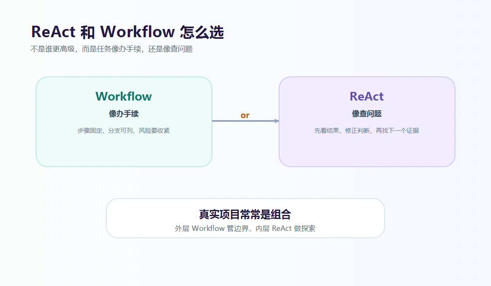

大家好，我是「山丘代码铺」。

上一篇我们讲了 ReAct。

简单说，ReAct 就是让 Agent：

```text
先判断
  -> 再行动
  -> 看结果
  -> 继续判断
```

看完以后，很自然会冒出另一个问题：

> **ReAct 和 Workflow 到底怎么选？**

是不是只要做 AI Agent，就应该用 ReAct？

是不是 Workflow 就不够智能？

其实不是。

我现在更愿意用一句很土的话记：

> **像办手续，用 Workflow。**
>
> **像查问题，用 ReAct。**

这句话先记住。



图：能提前写清楚步骤的，更像 Workflow；下一步要看结果再决定的，更像 ReAct。

后面慢慢拆。

---

## 01｜Workflow 更像办手续

Workflow 可以先理解成：

> **一套提前设计好的流程。**

比如一个用户注册流程：

```text
接收手机号
  -> 校验验证码
  -> 创建用户
  -> 初始化资料
  -> 发送欢迎通知
```

每一步要做什么，基本是提前定好的。

中间当然也会有判断。

验证码错了，就返回失败。

手机号已注册，就提示登录。

但整体流程不会乱跳。

它更像后端里常见的业务流程编排。

比如：

- 下单；
- 支付；
- 退款；
- 审批；
- 开票；
- 发通知；
- 同步数据。

这些事情的共同点是：

> **流程大体稳定，分支也能提前列出来。**

这种时候，用 Workflow 通常更舒服。

因为它清楚、可测、可控。

哪里出错了，也比较好排查。

所以 Workflow 不是“不智能”。

它是在把确定的事情确定下来。

这在工程里很重要。

---

## 02｜ReAct 更像查问题

ReAct 更适合另一类任务：

> **一开始不知道下一步该做什么，要先查一下，看结果再决定。**

比如用户问：

```text
帮我看看这个接口为什么 500。
```

这时候很难提前写死流程。

因为原因太多了。

可能是最近发布出问题。

可能是数据库慢查询。

可能是第三方接口超时。

也可能只是某个参数不对。

你不能一上来就固定执行十几个步骤。

更自然的方式是：

先查日志。

日志里看到数据库超时。

再查数据库监控。

监控里看到某张表慢查询变多。

再查最近发布。

最后才可能发现：

> 新版本里某个查询条件变了，索引没吃上。

这个过程的关键是：

> **下一步不是提前写死的，而是被上一步的结果推出来的。**

这就很像 ReAct。

它不是按固定剧本走。

它更像一个工程师在排查问题：

```text
先猜一个方向
  -> 查一个证据
  -> 修正判断
  -> 再查下一个证据
```

---

## 03｜用退款例子看区别

我们还是用退款例子。

用户说：

```text
我要申请退款。
```

如果你们的退款规则很明确：

- 7 天内可退；
- 已开票先处理发票；
- 活动商品不可退；
- 已退款订单不能重复退；
- 最后创建退款工单。

那这个事情就很适合 Workflow。

大概是：

```text
查订单
  -> 查商品规则
  -> 判断是否可退
  -> 提示用户确认
  -> 创建退款工单
```

这套流程基本稳定。

后端可以清楚地控制每一步。

每个分支也能写测试。

这时候没必要为了显得智能，非要让 Agent 自由发挥。

Workflow 就很好。

但如果用户问的是：

```text
我退款失败了，你帮我看看为什么。
```

这就不太一样了。

退款失败可能是订单状态异常。

可能是支付渠道不支持原路退回。

可能是发票还没处理。

也可能是退款接口超时。

这时候下一步要查什么，取决于当前看到什么。

先查订单状态。

订单没问题，就查退款流水。

流水显示接口失败，再查错误码。

错误码看不懂，再查渠道文档。

这种情况就更像 ReAct。

所以同样是“退款”，也不一定只选一种。

关键不是业务名字。

关键是：

> **这个任务的步骤能不能提前稳定写出来。**

---

## 04｜真实项目里经常是组合

真实项目里，ReAct 和 Workflow 经常不是二选一。

更常见的是组合。

比如一个 AI 客服系统，可以是这样：

```text
用户输入
  -> 判断意图
  -> 进入对应 Workflow
  -> 复杂节点里使用 ReAct
  -> 危险动作前回到 Workflow 确认
  -> 执行结果记录日志
```

用户说：

```text
我要申请退款。
```

系统进入退款 Workflow。

查订单、查规则、判断资格、让用户确认、创建工单。

但用户说：

```text
我昨天退款失败了，你帮我看看哪里卡住了。
```

这时候可以在“分析失败原因”这个节点里用 ReAct。

它先查订单，再查退款流水，再查错误码，再给出判断。

等它分析完以后，如果要重新发起退款，就回到 Workflow。

因为重新发起退款是一个危险动作。

需要确认、权限、幂等和日志。

所以可以这样理解：

> **Workflow 负责把确定流程管住。**
>
> **ReAct 负责处理不确定的探索过程。**

这两个东西不是敌人。

外层用 Workflow 控制边界。

内层在必要时用 ReAct 做探索。

这样既不会太死，也不会太飘。

---

## 写在最后

很多 Agent 文章会让人感觉：

> 只要用了 ReAct，系统就更智能。

但做项目的时候，不能只看“智能感”。

还要看稳定性、成本、权限、测试和排查。

从后端视角看，我现在更愿意这样选：

> **确定的流程，用 Workflow 管住。**
>
> **不确定的探索，用 ReAct 推进。**

如果任务像办手续，用 Workflow。

如果任务像查问题，用 ReAct。

如果任务既有固定流程，又有不确定分析，就组合起来。

不要为了 Agent 而 Agent。

也不要为了 Workflow 而 Workflow。

先看任务本身。

它到底是流程问题，还是探索问题。

其实这里还有几个问题值得思考：

- Workflow 里哪些节点可以交给大模型？
- ReAct Agent 怎么避免一直循环？
- 多步工具调用的日志应该怎么设计？
- 危险动作前的人类确认应该放在哪一步？
- Agent 的工具描述到底要写多细？

这篇先把 ReAct 和 Workflow 怎么选讲到这里。

后面继续一篇一篇拆。

山丘不急，慢慢往上爬。
