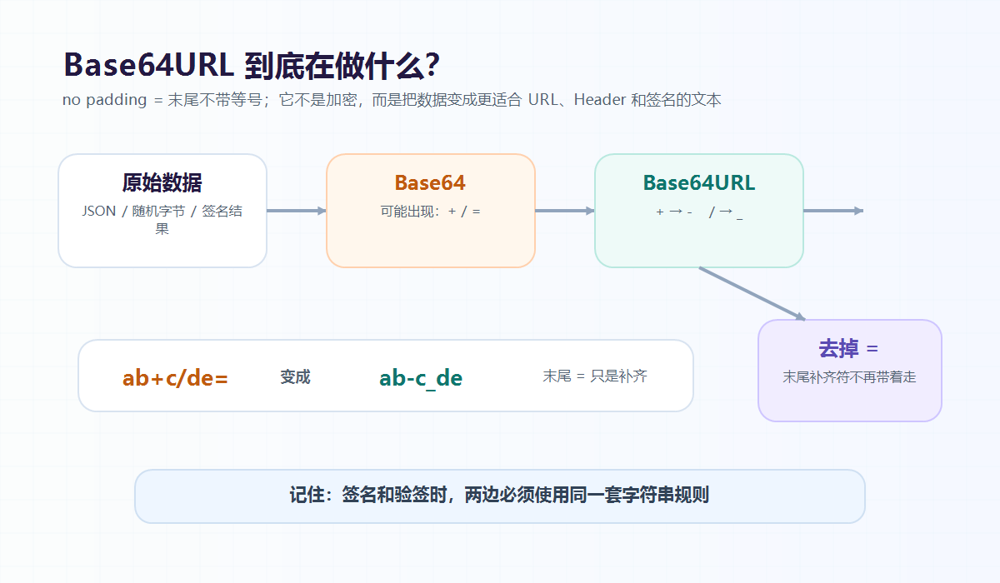

大家好，我是「山丘代码铺」。

这篇文章不讲复杂的编码标准，也不背 RFC。

只解决一个很小但很常见的问题：

> **JWT 里的字符串为什么经常没有等号？**
>
> **`base64url_no_padding` 到底是什么意思？**

如果你看过 JWT、OAuth、PKCE、签名链接，或者某些后端配置项，可能会见过类似这样的值：

```text
base64url_no_padding
```

第一次看到它的时候，我其实挺疑惑。

Base64 我大概听过。

URL 我也知道。

但是这几个词拼在一起以后，就变得有点别扭：

```text
base64 + url + no padding
```

这是新的加密算法吗？

为什么还要强调 no padding？

那个 padding 到底是什么东西？

后来在看 JWT、签名、token 生成逻辑的时候，才慢慢发现：

> **它不是为了把数据变得更神秘。**
>
> **它是为了让一段二进制数据，变成更适合在 URL、Header、签名字符串里传输的文本。**

这句话先记住。



图：Base64URL 的核心不是加密，而是把普通 Base64 里不适合 URL 的字符换掉，再把末尾补齐用的等号省掉。

后面慢慢拆。

---

## 01｜先从 JWT 说起

JWT 看起来通常是这样的：

```text
xxxxx.yyyyy.zzzzz
```

中间用两个点分成三段：

```text
header.payload.signature
```

如果你把前两段拿去解码，会发现里面其实是 JSON。

比如 header 可能长这样：

```json
{
  "alg": "HS256",
  "typ": "JWT"
}
```

payload 可能长这样：

```json
{
  "userId": "10086",
  "role": "admin"
}
```

问题来了。

JSON 明明是这样的：

```json
{"alg":"HS256","typ":"JWT"}
```

为什么放进 JWT 以后，会变成一串看起来很不像 JSON 的字符？

因为 JWT 不能直接把原始 JSON 往里塞。

它需要把 JSON 变成一段稳定、可传输、可参与签名的文本。

这时候就会用到 Base64URL。

但是 JWT 里的编码结果，又不是我们平时最常见的普通 Base64。

它通常是：

```text
base64url without padding
```

也就是我们常看到的：

```text
base64url_no_padding
```

这个名字看起来有点长，其实是在说三件事：

- 用 Base64 的思路编码；
- 用 URL 友好的字符表；
- 去掉末尾补齐用的等号。

这三件事分开看，就没那么玄了。

---

## 02｜Base64 不是加密

先把一个误会拆掉。

Base64 不是加密。

它只是编码。

加密的重点是：

> **没有密钥，看不懂。**

编码的重点是：

> **换一种表示方式，方便传输或保存。**

Base64 做的事情，可以先粗糙理解成：

> **把一堆原始字节，变成一串可打印的文本字符。**

为什么要这么做？

因为很多系统、协议、文本格式，处理文本比处理任意二进制更方便。

比如一段图片、随机数、签名结果，本质上都可能是二进制数据。

二进制里可能出现各种不可见字符。

这些字符如果直接塞进 URL、JSON、HTTP Header、日志、配置文件，就很容易出问题。

Base64 就像是给这些字节换了一件“文本外套”。

穿上以后，它就可以比较安全地在文本世界里走。

比如普通 Base64 里，结果通常会出现这些字符：

```text
A-Z
a-z
0-9
+
/
=
```

前面的大小写字母和数字都很好理解。

比较麻烦的是这三个：

```text
+ / =
```

它们在普通文本里没什么问题。

但是一旦放进 URL，事情就开始不那么顺了。

---

## 03｜普通 Base64 放进 URL 为什么麻烦？

假设你要做一个邮箱确认链接。

后端生成一段 token，然后拼到 URL 里：

```text
https://example.com/verify?token=xxxx
```

这个 token 可能是随机字节，也可能是带签名的信息。

如果它用普通 Base64 编码，里面可能出现：

```text
+ / =
```

这些字符放在 URL 里，各有各的麻烦。

`+` 在某些 URL 查询参数解析场景里，可能会被当成空格处理。

`/` 在路径里有特殊含义，表示路径分隔。

`=` 本身也常用来分隔参数名和值。

当然，你可以说：

> 那我 URL encode 一下不就行了吗？

是的，可以。

但现实项目里，token 经常会在很多地方流转：

- 放进 URL；
- 放进 Header；
- 写进日志；
- 存进数据库；
- 被前端复制；
- 被网关转发；
- 被不同语言的 SDK 解析。

每多一个需要转义和还原的环节，就多一点出错空间。

所以更稳的做法是：

> **干脆一开始就使用一套更适合 URL 的字符表。**

这就是 Base64URL 出现的原因。

---

## 04｜Base64URL 到底改了什么？

Base64URL 没有把 Base64 整个推翻。

它主要改了两个字符：

```text
+  ->  -
/  ->  _
```

也就是：

- 普通 Base64 里的 `+`，在 Base64URL 里变成 `-`；
- 普通 Base64 里的 `/`，在 Base64URL 里变成 `_`。

这样一来，编码结果就更适合出现在 URL 里。

比如普通 Base64 可能长这样：

```text
ab+c/de=
```

Base64URL 可能就会变成：

```text
ab-c_de=
```

注意，这一步不是加密强度变高了。

也不是数据突然更安全了。

只是字符更适合在 URL 里传。

这也是为什么它叫：

```text
base64url
```

它的重点不是“更高级的 Base64”。

它的重点是：

> **URL safe。**

也就是对 URL 更友好。

---

## 05｜那 no padding 又是什么？

接下来讲最后一个词：

```text
no_padding
```

padding 直译是“填充”。

在 Base64 里，它通常表现为末尾的等号：

```text
=
```

或者：

```text
==
```

为什么需要这个等号？

因为 Base64 编码有一个固定规则：

> **每 3 个字节，编码成 4 个字符。**

但真实数据长度不一定刚好是 3 的倍数。

比如有时候只剩 1 个字节。

有时候只剩 2 个字节。

这时候为了凑齐 4 个字符的位置，Base64 就会在末尾补上 `=`。

可以先粗糙记成：

> **`=` 不是原始数据的一部分。**
>
> **它只是用来告诉解码器：这里是补齐出来的位置。**

所以你会看到一些普通 Base64 字符串末尾带着：

```text
=
```

或者：

```text
==
```

但是在很多 Base64URL 场景里，这个 padding 会被省略。

于是就变成：

```text
base64url_no_padding
```

也就是：

> **用 Base64URL 编码，但末尾不带 `=`。**

---

## 06｜去掉等号以后，还能解码吗？

这个问题我一开始也很在意。

如果 `=` 是补齐信息，那去掉以后，不会丢数据吗？

一般不会。

因为原始有效信息不在 `=` 里。

解码的时候，可以根据字符串长度推回去需要补几个等号。

Base64 编码后的长度通常要凑到 4 的倍数。

所以如果一个 Base64URL 字符串长度不是 4 的倍数，解码器可以按需要补回来。

粗糙写成伪代码，大概是：

```text
如果长度差 2 位，就补 ==
如果长度差 1 位，就补 =
如果刚好是 4 的倍数，就不用补
```

当然，这只是帮助理解。

真实代码里不要随便手写一套编码器。

优先用语言或库里明确支持的 Base64URL 编码能力。

因为不同库对 padding 的默认行为不一样。

有的会保留 `=`。

有的会自动去掉 `=`。

有的解码时接受无 padding。

有的解码时必须先补齐。

这就是后端项目里容易踩坑的地方。

不是原理很难。

而是：

> **两边用的规则必须完全一致。**

---

## 07｜为什么 JWT 喜欢 no padding？

再回到 JWT。

JWT 是三段字符串：

```text
header.payload.signature
```

它经常会放在 HTTP Header 里：

```text
Authorization: Bearer <token>
```

也可能在某些场景里出现在 URL 参数里。

所以它希望自己的字符尽量简单、稳定、少转义。

Base64URL 很适合。

去掉 padding 也很适合。

因为末尾的 `=` 对 JWT 来说没有必要一直带着。

更重要的是，JWT 的签名不是对“解码后的 JSON 随便签一下”。

它签的是前两段已经编码好的字符串。

大概是：

```text
base64url(header) + "." + base64url(payload)
```

然后再生成 signature。

所以对于 JWT 来说，编码结果本身就是签名输入的一部分。

这也是为什么后端验签时不能随便改字符串。

比如你把 padding 补回去，再拿另一套字符串去验签，就可能对不上。

你以为自己只是“格式化一下”。

签名系统会觉得：

> 你签的已经不是同一段文本了。

这点很关键。

在签名、验签、token 这种场景里，很多问题不是因为数据变了。

而是因为：

> **参与签名的字符串表示变了。**

---

## 08｜后端最容易踩的几个坑

第一种坑，是把 Base64 当成加密。

看到一串 token，以为 Base64 以后别人就看不懂了。

其实不是。

Base64 编码的内容，只要没有加密或签名保护，别人照样可以解码。

JWT 的前两段 header 和 payload，本来就不是用来保密的。

所以不要把敏感信息直接塞进普通 JWT payload。

比如密码、身份证号、手机号这类东西，就不应该因为“它看起来是一串乱码”而放心放进去。

第二种坑，是混用普通 Base64 和 Base64URL。

有的代码生成 token 时用了普通 Base64。

另一个地方解码时按 Base64URL 处理。

或者反过来。

结果就是某些 token 正常，某些 token 偶尔失败。

因为只有当编码结果刚好出现 `+` 或 `/` 的时候，问题才冒出来。

这种 bug 很烦。

它不是每次都复现。

它像是在告诉你：

> 今天这个随机数比较有想法。

第三种坑，是 padding 规则不一致。

A 系统生成的时候去掉了 `=`。

B 系统解码的时候要求必须有 `=`。

如果 B 系统没有自动补齐，就会解码失败。

第四种坑，是验签前“顺手处理”了字符串。

比如：

- URL decode 多做了一次；
- 把 `-` 和 `_` 换回去以后再签；
- 把 padding 补回去以后再签；
- 重新序列化 JSON 后再签。

这些操作看起来都像是在“还原数据”。

但在签名场景里，你要非常小心。

因为对方签的可能不是你重新整理后的内容。

而是最初那段精确的字符串。

---

## 09｜我现在怎么记

现在我看到：

```text
base64url_no_padding
```

会把它拆成三句话：

> **Base64：把字节变成文本。**
>
> **URL：字符表更适合放进 URL。**
>
> **No padding：末尾不带补齐用的 `=`。**

它不是一种新的安全魔法。

它更像是一种工程约定。

这个约定解决的是：

> **怎么把一段数据变成紧凑、稳定、适合传输、适合参与签名的字符串。**

所以它经常出现在：

- JWT；
- OAuth PKCE；
- 签名 URL；
- webhook 签名；
- 随机 token；
- 一些认证授权协议里。

这些场景背后都有一个共同点：

> **字符串要跨系统流转，而且常常还要参与签名或校验。**

只要这个点想明白，`base64url_no_padding` 就没那么吓人了。

它只是把几件朴素的工程需求揉到了一起：

- 要能表示二进制；
- 要适合放进 URL；
- 要少一点转义麻烦；
- 要在不同系统之间保持一致。

---

## 写在最后

这篇其实讲的是一个很小的点。

小到它经常藏在配置值、库函数参数、协议说明里。

但真实写后端的时候，这类小点又很容易影响大问题。

尤其是一旦它和 token、签名、验签、回调、OAuth 混在一起，出错以后就很难一眼看出来。

因为表面上看，大家都在处理“同一个 token”。

实际上，参与校验的可能已经不是同一个字符串表示了。

所以以后再看到 `base64url_no_padding`，可以先不用慌。

它大概就在说：

> **别用普通 Base64 那套容易和 URL 打架的字符。**
>
> **末尾补齐的等号也先别带。**
>
> **大家按同一套规则编码、传输、验签。**

其实这里还有几个问题值得思考：

- JWT payload 既然能解码，为什么还需要签名？
- OAuth PKCE 里的 `code_verifier` 和 `code_challenge` 又为什么常用 Base64URL？
- 签名时到底应该签原始 JSON，还是签编码后的字符串？

这篇先把 `base64url_no_padding` 讲到这里。

后面继续一篇一篇拆。

山丘不急，慢慢往上爬。
