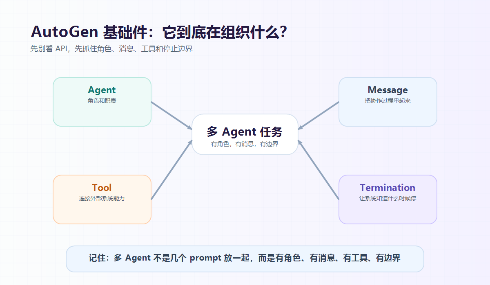

大家好，我是「山丘代码铺」。

AutoGen 这个名字很容易让人误会。

第一次看到它，我也以为它是一个“自动生成代码”的工具。

但从 AI Agent 工程角度看，AutoGen 真正想解决的不是“自动生成”，而是：

> **当一个任务需要多个 Agent 协作时，怎么把它们组织起来？**

一个 Agent 能回答问题。

那多个 Agent 怎么一起干活？

更关键的是：

- 谁先说话？
- 谁能调工具？
- 工具结果给谁看？
- 谁来复核结果？
- 什么时候停止？
- 出了问题怎么观察？

这些问题，才是 AutoGen 最值得拆的地方。

先补充一句背景：

> **如果你今天准备新开生产项目，要注意 AutoGen 目前已经进入 maintenance mode。**
>
> 微软现在更推荐新用户看 Microsoft Agent Framework，已有 AutoGen 用户也被建议逐步迁移。

那为什么还值得写 AutoGen？

因为它把多 Agent 协作里几个最关键的工程问题讲得很清楚：

```text
Agent
Message
Tool
Team
Termination
```

学 AutoGen，不一定是为了马上押注这个框架。

更重要的是理解：

> **多 Agent 系统到底怎么被工程化。**

这一篇先讲上半部分：

- Agent 是什么；
- Message 为什么重要；
- Tool 到底怎么接；
- Termination 为什么是安全边界。

下一篇再讲 Team、AgentChat/Core、Workflow 对比，以及什么时候该用多 Agent。



图：AutoGen 的基础感觉可以先抓住四个词：Agent 负责角色，Message 串起过程，Tool 连接外部能力，Termination 收住边界。

---

## 01｜先别把 AutoGen 想成“魔法框架”

很多 AI 框架刚开始看都容易让人产生一种错觉：

> 只要用了这个框架，Agent 就能自动规划、自动协作、自动完成复杂任务。

但真实项目里最好先把预期放低一点。

AutoGen 不是一个“你把需求扔进去，它自己把系统做完”的东西。

它更像是一套搭 Agent 系统的脚手架。

脚手架能帮你把很多重复的、容易写乱的东西整理好。

比如：

- Agent 怎么定义；
- 消息怎么传；
- 工具怎么接；
- 多个 Agent 怎么组队；
- 谁来决定下一个发言者；
- 满足什么条件就停下来；
- 运行过程怎么观察。

但它不会替你决定：

- 业务边界怎么划；
- 工具权限怎么收；
- 哪些动作必须人工确认；
- 什么结果才算完成；
- 异常时应该怎么兜底。

这些还是后端系统设计要自己想清楚。

所以我更愿意把 AutoGen 理解成：

> **一个帮助你搭多 Agent 协作系统的工程框架。**

或者再土一点：

> **它不是让一个模型变成十倍聪明。**
>
> **而是把多个 Agent 的对话、工具、顺序和停止条件组织起来。**

这才是这组文章的主线。

---

## 02｜Agent：一个有角色的处理单元

AutoGen 里最容易先看到的是 Agent。

Agent 可以先简单理解成：

> **一个带角色、带模型、可能带工具、还能接收消息和回复消息的处理单元。**

比如你要做一个退款问题分析助手。

它可能会有几个 Agent：

```text
order_agent
refund_agent
summary_agent
```

它们分别负责：

```text
order_agent 负责查询订单状态
refund_agent 负责分析退款流水
summary_agent 负责把结果讲给用户
```

这个角色说明很重要。

因为多 Agent 系统最怕的一件事就是：

> **每个 Agent 都觉得自己什么都能干。**

那最后就会变成几个人一起抢话筒。

看起来很热闹，实际上没有边界。

所以 Agent 的第一层意义不是“多几个模型实例”。

而是把任务拆成几个相对明确的职责：

- 谁负责理解问题；
- 谁负责查资料；
- 谁负责调接口；
- 谁负责复核；
- 谁负责总结。

从后端角度看，这有点像服务拆分。

不是为了拆而拆。

而是让每个模块知道：

> 我能做什么，我不能做什么，我应该把结果交给谁。

---

## 03｜Message：协作过程要变成消息流

如果只有一个 Agent，事情比较简单。

用户发一句话，Agent 回一句话。

但一旦有多个 Agent，问题就来了：

> A Agent 说的话，B Agent 怎么知道？
>
> B Agent 调工具的结果，C Agent 怎么看到？
>
> 最终是谁把这些信息整理给用户？

AutoGen 的一个重要思路是：

> **把协作过程变成消息流。**

不要把 Agent 协作想成几个神秘大脑在暗中同步。

更朴素一点，它就是一条一条消息在流动。

比如：

```text
用户：帮我看一下订单 A001 为什么退款失败

planner_agent：先查订单状态

order_agent：订单存在，支付成功，退款状态 FAILED

refund_agent：退款流水显示渠道返回余额不足

summary_agent：原因可能是商户账户余额不足，需要补足后重试
```

这个过程看起来像聊天。

但工程上更重要的是：

> **每一步都留下了可观察的消息。**

谁说了什么。

谁调用了什么工具。

工具返回了什么。

为什么下一步轮到这个 Agent。

最后为什么停止。

这些东西如果都只是藏在一段 while 循环里，后面调试会非常痛苦。

AutoGen 把它们显式变成消息和事件，就更像一条流水账。

流水账听起来不高级。

但在后端系统里，流水账很重要。

因为复杂系统不是只看最后结果。

还要看：

> **这个结果是怎么一步一步来的。**

---

## 04｜Tool：模型提出意图，后端负责执行

如果 Agent 只能聊天，那它还是比较像 ChatBot。

它可以解释问题，可以生成文字。

但它不能真正查询订单、读取文件、执行代码、访问接口。

所以工具很关键。

工具可以先理解成：

> **Agent 能调用的外部能力。**

比如：

```text
get_order(order_id)
get_refund_record(order_id)
search_docs(query)
run_code(code)
```

AutoGen 里的工具调用，大概可以理解成几步：

1. 你把工具的名字、描述、参数结构告诉模型；
2. 模型根据当前消息判断要不要调用工具；
3. 如果要调用，它生成一段结构化的调用请求；
4. 框架执行这个工具；
5. 工具结果再作为消息返回给 Agent；
6. Agent 根据结果继续回答或继续下一步。

这里最重要的一点是：

> **模型不是直接伸手去碰你的数据库。**

它只是提出：

```text
我想调用 get_order，参数是 order_id=A001
```

所以工具调用本质上不是“让模型获得权限”。

而是让模型提出一个结构化意图：

- 我要调用哪个工具；
- 我要传什么参数；
- 为什么现在需要调用。

真正的权限校验、参数校验、接口调用、失败重试、审计日志，仍然应该由后端系统控制。

这也是后端必须把好关的地方。

工具不是随便暴露越多越好。

每个工具都应该考虑：

- 参数怎么校验；
- 权限怎么控制；
- 超时怎么办；
- 失败结果怎么返回；
- 是否允许写操作；
- 危险动作前要不要人工确认。

AutoGen 可以帮你把工具接进 Agent 流程。

但工具边界还是你自己设计。

这点千万不能省。

---

## 05｜Termination：停止条件不是小配件

多 Agent 最容易出问题的地方之一，就是停不下来。

前面写 ReAct 的时候我们也聊过：

> 探索可以，但必须有边界。

AutoGen 里也有类似的东西，叫 termination condition。

可以先理解成：

> **团队运行到什么程度，就应该停止。**

比如：

- 最多聊 10 轮；
- 某个 Agent 说了 `APPROVE`；
- 使用 token 超过上限；
- 运行时间超过限制；
- 出现某个 handoff；
- 外部系统点了停止按钮。

从实现角度看，termination condition 不是一句口号。

它更像一个会检查消息或事件的判断逻辑。

它看到某些条件满足，就告诉 Team：

> 这轮任务可以结束了。

为什么这很重要？

因为多 Agent 对话如果没有停止条件，就像几个服务互相重试。

A 觉得信息不够，找 B。

B 觉得还要补充，找 C。

C 又说需要 A 再确认。

最后可能绕一圈又回来了。

这时候系统看起来还在工作。

实际上只是在消耗 token、时间和用户耐心。

所以停止条件不是小配件。

它是安全边界。

从后端角度看，它有点像：

- 最大重试次数；
- 超时时间；
- 熔断条件；
- 状态机终止态；
- 人工介入点。

没有这些东西，多 Agent 系统很容易从“智能协作”变成“无限循环”。

---

## 06｜用一句话收一下

到这里，我们先不急着看 Team 类型，也不急着比较框架。

先把 AutoGen 的底层感觉抓住：

> **Agent 负责角色。**
>
> **Message 负责串起过程。**
>
> **Tool 负责连接外部能力。**
>
> **Termination 负责让系统知道什么时候停。**

这几个东西合起来，才让多 Agent 协作有了工程味。

不是几个 prompt 放在一起。

不是几个模型轮流说话。

而是：

> **有角色，有消息，有工具，有边界。**

其实这里还有几个问题值得思考：

- 多个 Agent 放在一起以后，谁来决定下一个发言？
- AutoGen 里的 Team 到底有哪些协作模式？
- AgentChat 和 Core 又分别在管什么？

这篇先把 AutoGen 的基础机制讲到这里。

下一篇继续拆 Team、AgentChat/Core 和 Workflow 的区别。

山丘不急，慢慢往上爬。
