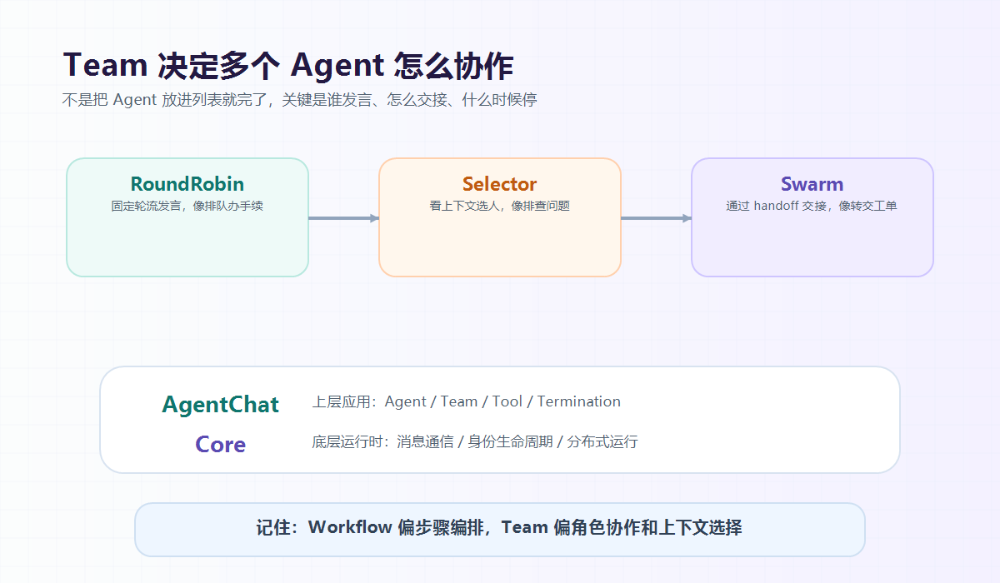

大家好，我是「山丘代码铺」。

上一篇我们先把 AutoGen 的基础件讲了一遍：

```text
Agent
Message
Tool
Termination
```

简单说：

- Agent 负责角色；
- Message 负责串起过程；
- Tool 负责连接外部能力；
- Termination 负责让系统知道什么时候停。

但这些还不够。

因为多个 Agent 放在一起，不会自动变成一个团队。

你还要回答几个问题：

- 谁先发言？
- 下一个轮到谁？
- 任务怎么交接？
- 多 Agent 和 Workflow 有什么区别？
- AgentChat 和 Core 又分别是什么？

这一篇就继续拆这些问题。



图：Team 不是 Agent 列表，而是协作规则。RoundRobin 偏固定轮流，Selector 偏上下文选择，Swarm 偏 handoff 交接。

---

## 01｜Team：不是把 Agent 放进列表就完了

只有 Agent 还不够。

因为多个 Agent 放在一起，不会自动变成一个团队。

你需要告诉系统：

> 这些 Agent 怎么协作？

这就是 AutoGen 里 Team 的作用。

Team 可以先理解成：

> **一组 Agent 的协作规则。**

不是所有多 Agent 协作都长一个样。

在 AutoGen AgentChat 里，Team 也不是一个纯抽象说法，而是有不同协作模式。

比如：

```text
RoundRobinGroupChat
```

适合固定轮流发言。

比如写文章：

```text
作者 Agent -> 审稿 Agent -> 修改 Agent -> 总结 Agent
```

这种就像排队办手续，一个接一个来。

再比如：

```text
SelectorGroupChat
```

适合根据上下文选择下一个 Agent。

比如排查线上问题。

你一开始可能不知道该查日志、查数据库，还是查三方接口。

这时候更像：

```text
看当前上下文
  -> 决定下一个该谁处理
```

还有一种：

```text
Swarm
```

适合通过 handoff 在 Agent 之间交接任务。

比如客服 Agent 判断问题需要人工确认，就把控制权交给用户。

或者订单 Agent 发现问题属于支付渠道，就交给支付 Agent。

这类模式更像：

```text
当前 Agent 做到某一步
  -> 发出 handoff
  -> 另一个 Agent 接手
```

所以 Team 的关键不是“把 Agent 放进一个列表”。

而是决定：

- 谁能参与；
- 共享哪些上下文；
- 下一个谁说话；
- 每次说完以后要不要停；
- 最后怎么返回结果。

这就很后端。

因为它本质上是在写协作协议。

---

## 02｜用退款例子把 Team 串起来

假设我们要做一个退款问题分析助手。

用户问：

```text
订单 A001 退款失败了，帮我看看原因。
```

用 AutoGen 的思路，可以拆成几个 Agent：

```text
planner_agent：决定排查顺序
order_agent：查询订单
refund_agent：查询退款流水
summary_agent：总结给用户
```

然后给其中一些 Agent 配工具：

```text
order_agent -> get_order
refund_agent -> get_refund_record
summary_agent -> 不一定需要工具
```

再用一个 Team 把它们组织起来。

如果流程很固定，可以轮流来：

```text
planner -> order -> refund -> summary
```

如果流程不固定，可以让系统根据上下文选择下一个 Agent。

最后加上停止条件：

```text
最多 8 条消息
或者 summary_agent 给出最终总结
或者用户要求停止
```

用伪代码写出来，大概像这样：

```text
agents = [
  planner_agent,
  order_agent,
  refund_agent,
  summary_agent
]

tools = {
  order_agent: [get_order],
  refund_agent: [get_refund_record]
}

team = Team(
  agents=agents,
  mode="selector",
  termination=[
    max_messages(8),
    text_mention("FINAL_ANSWER")
  ]
)

result = team.run("订单 A001 为什么退款失败？")
```

注意，这不是真实 API，只是帮助理解。

它想表达的是：

> **多 Agent 不是几个 prompt 放在一起。**
>
> **而是角色、工具、协作规则和停止条件一起设计。**

这样，一个多 Agent 流程才算有点工程样子。

它有：

- 角色；
- 消息；
- 工具；
- 协作规则；
- 停止条件；
- 可观察过程。

这几个东西合起来，才像一个可以调试、可以约束、可以逐步扩展的系统。

---

## 03｜AgentChat 和 Core：一个管应用，一个管运行时

如果继续往底层看，AutoGen 可以分成几层理解。

刚入门时最容易接触的是：

```text
AgentChat
```

它更像上层应用接口。

你可以用它理解：

- Agent；
- Team；
- Tool；
- Termination；
- 常见的多 Agent 对话模式。

再往下是：

```text
Core
```

Core 更像底层运行时。

可以先粗糙理解成：

> **它提供了一套更底层的 Agent 运行时，让 Agent 通过消息通信，并管理 Agent 的身份、生命周期和运行环境。**

这就比“几个对象互相调用方法”更像一个后端系统。

因为真实 Agent 系统可能会变复杂：

- Agent 不一定都在同一个进程里；
- 有些 Agent 可能跑在不同机器上；
- 有些消息是请求响应；
- 有些消息是事件通知；
- 有些任务需要流式输出；
- 有些系统需要日志、追踪、调试。

所以可以先这么记：

> **AgentChat 更适合快速理解和搭应用。**
>
> **Core 更适合需要深度定制运行时和消息机制的复杂系统。**

刚入门不要一上来钻 Core。

先用 AgentChat 理解 Agent、Team、Tool、Termination。

等你真的需要自定义运行时、消息路由、事件处理、分布式通信时，再回头看 Core。

这样学习成本会低很多。

---

## 04｜AutoGen 和普通 Workflow 有什么区别？

看到这里，可能会有一个问题：

> 这不就是 Workflow 吗？

有点像，但不完全一样。

我现在会这样区分：

> **Workflow 更像“我提前把流程画好了”。**
>
> **Agent Team 更像“我提前定义好角色和规则，但允许下一步根据上下文变化”。**

比如退款失败这个任务。

如果订单不存在，就不用查退款流水。

如果退款流水显示三方错误，就需要查支付渠道。

如果信息不足，就可能要问用户。

如果已经能总结，就应该停。

可以用一个小表记：

| 对比项 | Workflow | AutoGen 多 Agent |
| --- | --- | --- |
| 流程 | 通常固定 | 可根据上下文变化 |
| 核心 | 步骤编排 | 角色协作 |
| 适合 | 稳定业务流程 | 不确定性较高的分析任务 |
| 风险 | 灵活性不足 | 成本高、不可控、易循环 |
| 后端关注点 | 状态机、任务编排 | 消息、工具、权限、终止条件 |

所以 AutoGen 更适合那些：

- 需要多个角色协作；
- 中间步骤不完全固定；
- 需要工具和对话来回推进；
- 需要观察每一步消息；
- 需要让某个 Agent 复核另一个 Agent 的结果。

但反过来说，如果任务很简单，别一上来就多 Agent。

官方文档里也有类似提醒：

> 简单任务先用单 Agent，单 Agent 不够了，再考虑 Team。

这句话很朴素，但很重要。

因为多 Agent 不是免费午餐。

它会带来更多 token 消耗、更多不确定性、更多调试成本。

能用一个稳定 Workflow 解决的事情，就别硬上多 Agent。

---

## 05｜现在还要不要学 AutoGen？

这个问题要分开看。

如果你是新开生产项目，那就要注意：

> AutoGen 已经进入 maintenance mode。

这意味着它不再是微软主推的新项目起点。

微软现在更推荐 Microsoft Agent Framework。

所以从“押注框架”的角度看，AutoGen 不一定是新项目首选。

但从“理解多 Agent 工程”的角度看，它仍然很值得拆。

因为它把几个关键问题摆得很清楚：

- Agent 不是聊天昵称，而是职责边界；
- Tool 不是让模型拿权限，而是结构化调用意图；
- Team 不是 Agent 列表，而是协作协议；
- Termination 不是装饰，而是停止边界；
- Core 不是 API 大全，而是消息和运行时。

这些东西换到 LangGraph、CrewAI、Microsoft Agent Framework 里，名字可能会变。

但问题不会消失。

因为只要你做多 Agent，就绕不开：

- 怎么拆角色；
- 怎么传消息；
- 怎么接工具；
- 怎么控制权限；
- 怎么避免循环；
- 怎么观察过程；
- 怎么让人介入。

这才是 AutoGen 对后端同学真正有价值的地方。

---

## 写在最后

这两篇不是为了把 AutoGen 的 API 全讲完。

也不是为了说它一定比别的框架更好。

我们只是借 AutoGen 看懂一件事：

> **多 Agent 系统最难的，往往不是 prompt，而是协作规则。**

一个 Agent 能不能回答问题，是第一层。

多个 Agent 能不能有组织地一起干活，是另一层。

再往后，就是更工程化的问题：

- 成本怎么控；
- 权限怎么收；
- 失败怎么兜；
- 过程怎么追踪；
- 用户什么时候介入；
- 哪些任务根本不该多 Agent。

其实这里还有几个问题值得思考：

- AutoGen、LangGraph、CrewAI、Microsoft Agent Framework 到底怎么选？
- 多 Agent 一定比单 Agent 更好吗？
- 什么任务适合 Agent Team，什么任务更适合普通 Workflow？

这篇先把 Team、Core 和 Workflow 的区别讲到这里。

后面继续一篇一篇拆。

山丘不急，慢慢往上爬。
