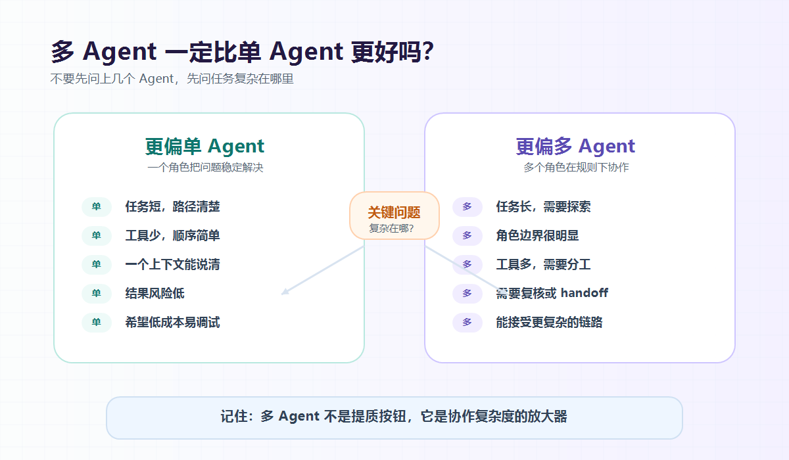

大家好，我是「山丘代码铺」。

前面两篇我们借 AutoGen 拆了一下多 Agent 协作：

```text
Agent
Message
Tool
Team
Termination
```

讲完以后，很自然会冒出一个问题：

> **既然有多 Agent，那是不是多 Agent 就一定比单 Agent 更好？**

这个问题特别容易让人踩坑。

因为多 Agent 听起来更高级。

一个 Agent 做事，像一个人单干。

多个 Agent 协作，听起来像一个小团队：

```text
规划 Agent
执行 Agent
复核 Agent
总结 Agent
```

看起来分工明确，流程完整，还很有工程感。

但真实项目里，事情没有这么简单。

很多时候，多 Agent 不是把系统变聪明了，而是把系统变复杂了。

所以这篇我们就专门聊一个问题：

> **多 Agent 到底什么时候值得用，什么时候反而不如单 Agent？**



图：多 Agent 不是默认升级项。先看任务路径、角色边界、工具风险和停止条件，再决定要不要拆成多个 Agent。

---

## 01｜先说结论：多 Agent 不是默认答案

如果让我先给一个结论，我会这样说：

> **能用单 Agent 稳定解决的问题，先不要急着上多 Agent。**

这句话听起来有点保守。

但后端同学应该很熟悉这种感觉。

一个接口能解决的问题，不一定要拆成三个服务。

一个同步流程能跑通的问题，不一定要上消息队列。

一个普通定时任务能完成的问题，不一定要上分布式调度。

不是这些东西不好。

而是每多引入一个组件，系统都会多一层成本：

- 多一层状态；
- 多一层错误来源；
- 多一层调试路径；
- 多一层协作规则；
- 多一层不可控。

多 Agent 也是一样。

它不是免费升级包。

它更像是在系统里引入了一组会说话、会调用工具、会互相影响的执行单元。

这当然可能提升能力。

但也一定会增加复杂度。

所以判断多 Agent 值不值得用，不能只看它是不是更“智能”。

更应该问：

> **它有没有真的降低任务复杂度？**

如果只是把一个简单任务拆成几个 Agent 轮流发言，那多半是在制造复杂度。

---

## 02｜单 Agent 到底能做什么？

先别急着嫌单 Agent 简单。

很多业务场景，一个 Agent 已经够用了。

比如：

```text
用户问：订单 A001 为什么退款失败？
```

一个单 Agent 可以做这几件事：

1. 理解用户问题；
2. 判断需要查询订单；
3. 调用 get_order；
4. 判断需要查询退款记录；
5. 调用 get_refund_record；
6. 根据结果总结原因；
7. 给用户一个回答。

这就是一个很典型的工具调用型 Agent。

它不一定需要拆成：

```text
planner_agent
order_agent
refund_agent
summary_agent
```

因为这个任务的链路其实不复杂。

查询订单、查询退款、总结原因，都可以放在同一个上下文里完成。

单 Agent 的好处是很明显的：

- 上下文集中；
- 成本更低；
- 调试更简单；
- 停止条件更清楚；
- 用户体验更直接。

出了问题，也比较容易定位。

比如它查错了订单，那就看工具参数。

它总结错了原因，那就看工具结果和 prompt。

它没有继续查退款记录，那就看它的推理路径。

至少问题还在一个 Agent 的边界里。

这对工程排查很重要。

---

## 03｜多 Agent 多出来的，不只是“人手”

很多人理解多 Agent，会下意识把它想成：

> 多几个 Agent，就像多几个员工，任务自然做得更快更好。

但系统不是公司群聊。

你多加一个 Agent，不只是多了一个“人手”。

你还多了这些问题：

```text
谁先说？
谁后说？
谁能调用工具？
工具结果给谁看？
谁有最终解释权？
谁来判断任务完成？
两个 Agent 意见冲突怎么办？
一个 Agent 胡乱扩展问题怎么办？
循环对话停不下来怎么办？
```

这些问题都不是小问题。

在单 Agent 里，很多事情天然收在一个上下文里。

但在多 Agent 里，每个 Agent 都可能看到不同的信息，承担不同的角色，有不同的行为倾向。

这时候系统设计的重点就变了。

你不再只是写一个 prompt。

你是在设计一套协作协议。

这套协议里至少要说明：

- 每个 Agent 的职责边界；
- 每个 Agent 能不能调用工具；
- Agent 之间怎么传递消息；
- 什么时候轮到谁说话；
- 最终答案由谁生成；
- 什么时候必须停止。

所以多 Agent 的难点，不是“多写几个 Agent 名字”。

而是：

> **你要为它们的协作负责。**

这件事没想清楚，多 Agent 很容易变成几个 Agent 互相聊天。

看起来很努力。

实际没推进。

---

## 04｜多 Agent 什么时候真的有价值？

那多 Agent 是不是就没必要了？

当然不是。

它有价值，但它适合的问题不是“简单问题换个高级写法”。

它更适合下面几类场景。

### 第一类：任务天然有多种角色

比如代码审查。

你可能真的希望有不同视角：

```text
security_agent：看安全风险
performance_agent：看性能问题
style_agent：看代码风格
summary_agent：汇总结果
```

这时候多 Agent 有意义。

因为不同 Agent 不是在重复劳动。

它们关注的是不同维度。

如果只让一个 Agent 同时扮演所有角色，它也能做，但很容易漏掉重点。

多 Agent 的价值在于：

> **把不同关注点拆成清晰角色。**

注意，这里的关键不是 Agent 数量。

而是角色之间确实有差异。

如果四个 Agent 只是换了名字，实际都在做同一件事，那就没必要。

### 第二类：任务需要明显的复核

有些场景里，生成结果不是最难的。

难的是验证结果。

比如：

```text
一个 Agent 生成 SQL；
另一个 Agent 检查 SQL 是否会误删数据；
再由系统决定是否允许执行。
```

这里多 Agent 的价值不是让回答更热闹。

而是把“生成”和“审查”拆开。

这很像后端系统里的审批流程。

写操作、危险操作、影响资金或权限的操作，都不应该只靠一个模型自己说了算。

当然，真正的权限控制仍然应该在后端系统里。

但多 Agent 可以帮助你把复核过程显式化。

至少它让系统多了一道检查视角。

### 第三类：任务路径不固定

有些任务不是固定流程。

比如线上问题排查。

用户说：

```text
昨晚 10 点以后支付成功率下降了，帮我查原因。
```

这时候很难提前写死流程。

可能要看：

- 支付网关日志；
- 数据库慢查询；
- 三方接口状态；
- 版本发布时间；
- 监控指标；
- 用户投诉内容。

不同线索会把任务引向不同方向。

这时多 Agent 可能有价值。

比如：

```text
monitor_agent 看指标
log_agent 查日志
release_agent 看发版记录
payment_agent 看通道状态
```

它们不是简单排队执行。

而是根据上下文不断收敛问题。

这种任务就比“查一个订单状态”更适合多 Agent。

因为它的不确定性更高。

### 第四类：需要人机交接

还有一种场景是 handoff。

也就是任务做到某一步，必须交给另一个 Agent 或者人。

比如客服场景：

```text
普通咨询 -> 客服 Agent 处理
涉及退款 -> 订单 Agent 接手
涉及敏感操作 -> 人工确认
```

这里多 Agent 的价值在于交接。

不是所有 Agent 都从头参与到尾。

而是当前 Agent 发现自己不该继续处理时，把任务交出去。

这比一个 Agent 从头到尾硬撑更稳。

因为它承认了一件事：

> **有些问题不属于当前角色。**

这个边界感很重要。

---

## 05｜多 Agent 什么时候反而不如单 Agent？

反过来看，哪些场景不适合多 Agent？

### 第一种：任务很短

比如：

```text
帮我把这段错误日志解释一下。
```

一个 Agent 直接解释就行了。

如果你非要拆成：

```text
log_reader_agent
error_analyzer_agent
summary_agent
```

大概率只是把一次回答变成三轮对话。

延迟变高，成本变高，调试也变麻烦。

### 第二种：流程很固定

比如一个稳定业务流程：

```text
校验参数
查询数据
生成报表
发送通知
```

这类任务更像 Workflow。

你提前知道每一步要做什么，失败怎么重试，状态怎么流转。

那就没必要让 Agent 来决定下一步。

后端状态机、任务编排、定时任务，可能更合适。

因为它们更可控。

### 第三种：工具风险很高

如果一个任务涉及：

- 扣款；
- 退款；
- 删除数据；
- 修改权限；
- 发送外部通知；
- 变更线上配置。

那不要因为用了多 Agent，就觉得安全了。

多 Agent 不等于自动安全。

两个 Agent 互相确认，也不等于真正的权限校验。

真正的安全边界仍然应该在后端系统里：

```text
权限校验
参数校验
操作审计
幂等控制
人工确认
回滚方案
```

如果这些没有，Agent 数量再多也不踏实。

### 第四种：你还没想清楚停止条件

多 Agent 最怕停不下来。

一个 Agent 说还需要补充信息。

另一个 Agent 说需要重新检查。

第三个 Agent 说建议再确认一遍。

然后系统就开始循环。

这时候它看起来不是坏了。

它看起来是在认真工作。

但实际上只是在消耗 token。

所以如果你还没想清楚：

```text
最多跑几轮？
谁可以给最终答案？
什么条件下必须停？
什么情况交给人？
```

那就先别急着上多 Agent。

---

## 06｜一个实用判断表

如果要快速判断，我会用这个表：

| 问题 | 更偏单 Agent | 更偏多 Agent |
| --- | --- | --- |
| 任务长度 | 短任务 | 长任务 |
| 流程稳定性 | 步骤清楚、路径固定 | 路径不确定、需要探索 |
| 角色差异 | 一个角色能完成 | 多个视角明显不同 |
| 工具调用 | 少量工具、顺序简单 | 多类工具、需要分工 |
| 结果风险 | 低风险解释或总结 | 高风险，需要复核 |
| 调试成本 | 希望简单可追踪 | 能接受更复杂的链路 |
| 停止条件 | 很清楚 | 必须显式设计 |

再压缩成一句话：

> **单 Agent 适合把一个问题解决干净。**
>
> **多 Agent 适合把一个复杂任务拆成有边界的协作。**

这两个不是谁取代谁。

而是适合不同复杂度的问题。

---

## 07｜后端视角：先从单 Agent 做到可控

如果你真的要在项目里落地 Agent，我建议顺序不要反过来。

不要一上来就设计一堆 Agent。

更稳的路线是：

```text
先做单 Agent
  -> 接少量工具
  -> 明确权限和日志
  -> 加停止条件
  -> 跑真实任务
  -> 发现单 Agent 不够
  -> 再拆多 Agent
```

也就是说，多 Agent 最好不是一开始拍脑袋设计出来的。

而是从真实任务里长出来的。

当你发现一个单 Agent 开始承担太多角色时，再拆。

比如它既要规划，又要查数据，又要写 SQL，又要审查 SQL，又要总结结果。

这时你可以考虑拆成：

```text
planner_agent
data_agent
review_agent
summary_agent
```

但这个拆分应该来自问题本身。

不是来自“多 Agent 看起来更高级”。

后端做系统最怕什么？

最怕为了架构感而架构。

Agent 系统也一样。

---

## 08｜别把多 Agent 当成“提质按钮”

还有一个误区也很常见：

> 单 Agent 答得不好，那我多加几个 Agent，是不是就好了？

不一定。

如果问题出在：

- 工具数据不准；
- prompt 边界不清；
- 业务规则没有描述；
- 返回结果没有校验；
- 模型能力本身不够；
- 上下文给得太乱。

那多 Agent 不会自动解决这些问题。

它可能只是让错误传播得更隐蔽。

一个 Agent 理解错了问题。

第二个 Agent 基于错误理解继续分析。

第三个 Agent 再把错误总结得很有条理。

最后输出看起来非常完整。

但方向从第一步就错了。

这其实更危险。

因为它不像单 Agent 那样一眼能看出问题。

所以多 Agent 不是提质按钮。

它更像一个放大器。

你把清晰的角色、可靠的工具、明确的规则放进去，它可能放大协作能力。

你把混乱的上下文、不清楚的边界、危险的工具放进去，它也会放大混乱。

---

## 写在最后

回到标题：

> **多 Agent 一定比单 Agent 更好吗？**

答案是：

> **不一定。**

多 Agent 不是单 Agent 的升级版。

它更像另一种工程形态。

单 Agent 的重点是：

```text
一个角色把一个问题解决稳定
```

多 Agent 的重点是：

```text
多个角色在规则下协作解决复杂任务
```

如果任务本身不复杂，多 Agent 可能只是增加成本。

如果任务确实需要不同角色、不同工具、不同视角和明确复核，那多 Agent 才有价值。

所以不要问：

> 我要不要上多 Agent？

可以先问：

> 我这个任务到底复杂在哪里？
>
> 是一个 Agent 能稳定完成，还是已经出现了明显的角色边界？
>
> 多一个 Agent 是降低复杂度，还是制造复杂度？

把这几个问题想清楚，多 Agent 才不是噱头。

它才会变成真的工程能力。

其实这里还有几个问题值得继续拆：

- 单 Agent 怎么设计工具边界？
- 多 Agent 的成本和延迟怎么控制？
- Agent 之间的复核，到底能不能替代真实校验？

这篇先把多 Agent 和单 Agent 的取舍讲到这里。

后面继续一篇一篇拆。

山丘不急，慢慢往上爬。
