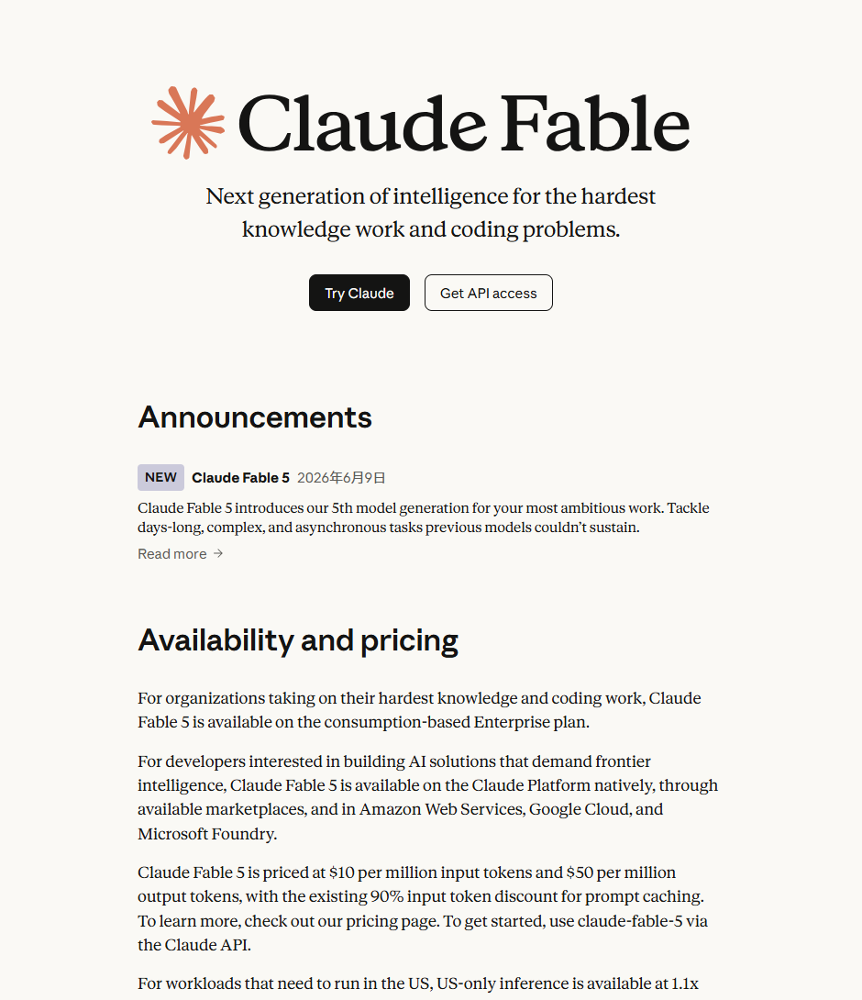
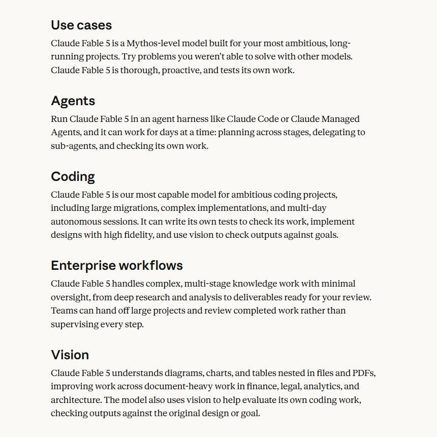
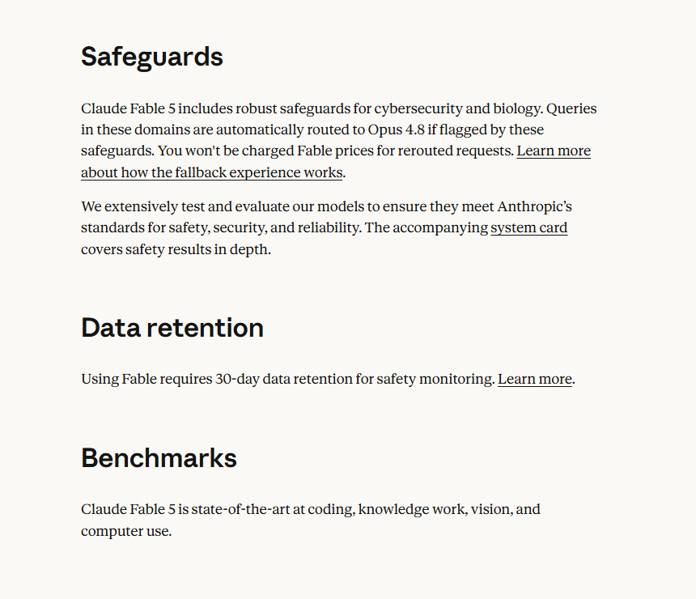

大家好，我是「山丘代码铺」。

昨天那版写得有点散。

我把 Claude Fable 5 讲成了一个很大的后端工程话题，什么状态管理、权限、成本、观测都铺开了。

那些当然重要，但如果这篇是讲 Fable 5 本身，主线应该更直接：

> **Claude Fable 5 到底有什么特色？**

所以这篇重写一下。

不先讲一堆 Agent 系统设计，也不追着 benchmark 跑。

就看 Anthropic 官方页面里反复强调的几个点。



*截图来源：Anthropic Claude Fable 官方页面*

先说结论。

Claude Fable 5 的特点，不是简单的“更会聊天”。

它更像是 Anthropic 想推出来的一个：

```text
面向复杂知识工作和复杂编码任务的高阶执行模型
```

这里有几个关键词很重要：

```text
days-long
complex
asynchronous
agent harness
tests its own work
vision check
safeguards
```

翻译成人话就是：

它想干的不是一次问答，而是更长、更复杂、更像真实工作的任务。

---

## 01｜第一个特色：它主打长周期任务

Fable 5 官方介绍里，最显眼的一句话不是“跑分第一”。

而是它能处理以前模型撑不住的长周期、复杂、异步任务。

这个定位很关键。

以前我们用模型，经常是这种感觉：

```text
我问一个问题
模型答一次
我再追问
模型再答一次
```

本质上还是对话。

但 Fable 5 想处理的是这种任务：

```text
你先理解目标
再拆成几个阶段
中间自己查资料
自己写代码
自己跑测试
自己看结果
不行再改
最后交付一个可 review 的东西
```

这就不是普通聊天了。

这更像把一个任务交给一个 worker。

注意，我这里说的是“像”，不是说它真的可以完全替代人。

真正的区别在于：它的能力展示重点从“回答得准不准”，开始转向“能不能把一个长任务推进下去”。

这对 Agent 方向很关键。

因为 Agent 最大的难点，往往不是第一步。

第一步很多模型都能做。

难的是跑到第 5 步、第 8 步、第 20 步以后，还记得目标，还能修正路线，还知道自己有没有做完。

---

## 02｜第二个特色：它明显是给 Agent 场景准备的

官方 use cases 里，第一个就是 Agents。



*截图来源：Anthropic Claude Fable 官方页面*

这个顺序挺有意思。

它不是先说“问答更聪明”，也不是先说“摘要更准确”。

它先说：

```text
Agents
Coding
Enterprise workflows
Vision
```

这说明 Fable 5 的产品定位非常清楚。

它不是只想当一个模型接口，而是想放进 Agent harness 里跑。

比如 Claude Code，Claude Managed Agents，或者企业自己搭的 Agent runtime。

官方提到的几个动作也很典型：

```text
跨阶段规划
委派给 sub-agent
检查自己的工作
连续工作很久
```

这里面最值得注意的是“委派给 sub-agent”。

这说明 Fable 5 不只是被当成一个生成器。

它更像一个调度型大脑：

```text
我知道这个任务要拆成几段
我知道哪一段可以交给别的 Agent
我知道结果回来以后要继续判断
```

这就和我们前面讲 AutoGen、多 Agent 时的思路接上了。

多 Agent 真正难的地方，不是堆很多角色名。

而是：

```text
谁先做
谁接着做
谁检查
什么时候停
中间结果怎么传
失败以后怎么恢复
```

Fable 5 这次的特色之一，就是它在模型层面更适合参与这类长链路协作。

---

## 03｜第三个特色：它强调自我验证

我觉得这是这次最值得单独拎出来讲的点。

官方页面里有一句意思很明确：

Fable 5 会测试自己的工作。

在 coding 场景里，官方还提到它可以写自己的测试，用视觉能力检查输出是否符合目标。

这比“会写代码”重要。

因为代码生成本身，已经不是新鲜事了。

真正让后端同学头疼的是：

```text
它写出来的东西能不能跑
跑不通会不会修
修完会不会再测
测完会不会知道哪里还有风险
```

一个只会生成代码的模型，像是一个很快的打字员。

一个会围绕目标自检的模型，才更像工程任务里的执行单元。

当然，这里要冷静一点。

模型说“我检查了”，不等于系统真的通过了。

后端工程里，最终还是要靠真实工具兜底：

```text
单测
集成测试
lint
类型检查
CI
日志
人工 review
```

但 Fable 5 把“自我验证”放到核心卖点里，说明一个趋势：

以后模型能力的竞争，不只是谁更会写。

还会是谁更会检查自己写出来的东西。

---

## 04｜第四个特色：它不是只做代码，而是覆盖完整工作场景

Fable 5 的 use cases 不是单点能力。

它分了四块：

```text
Agents
Coding
Enterprise workflows
Vision
```

这四块合起来，其实是在描述一种完整工作方式。

先有 Agent 执行长任务。

再有 Coding 处理复杂工程任务。

然后 Enterprise workflows 覆盖研究、分析、交付物这些企业知识工作。

最后 Vision 让它能看图、看表格、看 PDF 里的结构，也能拿视觉能力检查代码产物。

这就和普通文本模型不太一样。

普通文本模型更像：

```text
你给我文字
我还你文字
```

Fable 5 的方向更像：

```text
你给我一个复杂目标
我可以读文档
看图表
写代码
跑检查
再把结果交回来
```

这就是为什么它会和 Agent 绑定得这么紧。

因为真实任务从来不只是一段纯文本。

真实任务里有代码仓库、接口文档、设计图、日志、表格、PDF、测试结果，还有一堆中间状态。

如果模型只会处理聊天框里的文字，那它很难真的接近“完成任务”。

Fable 5 的特色，是它把这些能力往一个更完整的工作闭环里收。

---

## 05｜第五个特色：它强，但边界也更明显

越强的模型，越不能只看能力。

Fable 5 这次有两个很明显的边界。



*截图来源：Anthropic Claude Fable 官方页面*

第一个边界是 safeguards。

官方说，在网络安全和生物相关领域，如果请求被安全策略命中，会自动路由到 Claude Opus 4.8。

这个点很有意思。

因为它说明 Fable 5 不是一个“所有场景都原样开放”的模型。

它更像是：

```text
能力很强
但高风险领域有额外护栏
必要时会 fallback
```

从普通用户角度看，这是安全策略。

从后端角度看，这是运行时行为。

也就是说，你调用的可能是 Fable 5，但某些请求实际会被切到别的模型。

这不是坏事。

但如果你把它接进产品里，就要知道这件事。

至少要想清楚：

```text
用户要不要知道发生了 fallback
日志里要不要记录实际响应模型
不同模型的回答风格差异怎么处理
成本怎么计算
```

第二个边界是 30 天数据留存。

官方页面写得很明确：使用 Fable 需要 30 天数据留存，用于安全监控。

这对个人玩一玩可能不是大问题。

但对企业场景就很关键。

因为很多公司在接大模型时，不只是问：

```text
这个模型强不强
```

还会问：

```text
数据会不会留存
留存多久
用于什么目的
有没有训练
内部数据能不能发出去
是否符合公司合规要求
```

所以 Fable 5 的特色不是“无限开放的最强模型”。

它更像一个有明确安全边界和访问条件的高能力模型。

这个边界感，本身就是这次发布的一部分。

---

## 外面的人主要在讨论什么

我看了一些外部讨论，大家的关注点基本分成三类。

第一类是兴奋。

很多人关心它在长周期 coding、复杂任务、工具调用、多阶段工作里的表现。

比如 Simon Willison 试着把一个“原本只是今天的 stretch goal”的功能交给 Fable，最后牵出了底层库的一组配套改动。

这类反馈关注的不是“它会不会回答”，而是“它能不能把一串工程任务推进完”。

第二类是成本。

Fable 5 的 API 价格是：

```text
input:  $10 / 百万 token
output: $50 / 百万 token
```

这个单价不低。

更重要的是，长周期 Agent 任务不只看单价。

它还会多轮思考、多次工具调用、多次验证。

所以真正应该算的是：

```text
完成一个任务花多少钱
```

而不是：

```text
调用一次模型花多少钱
```

第三类是护栏。

越强的模型，大家越关心它到底开放到什么程度。

Fable 和 Mythos 的关系、fallback、30 天留存、网络安全和生物领域的限制，都会变成使用前要看的条件。

这也说明一个趋势：

未来看模型，不能只看能力表。

还要看：

```text
访问边界
安全策略
数据策略
实际可用场景
```

---

## 我更愿意怎么理解 Fable 5

如果用一句话概括 Fable 5 的特色，我会这么说：

> **它不是更大的聊天窗口，而是更适合长周期任务的高阶 Agent worker。**

这个定位挺重要。

因为它提醒我们，模型正在从“回答问题”往“完成任务”走。

但这不代表所有事情都要丢给 Fable 5。

它更适合这些场景：

```text
复杂代码迁移
多文件重构
长链路 bug 排查
复杂文档分析
需要自检的工程任务
需要视觉检查的实现任务
需要多阶段推进的 Agent 流程
```

它不适合这些场景：

```text
普通问答
简单摘要
一次性小工具调用
高频低价值请求
合规边界没想清楚的企业数据任务
```

也就是说，它不是默认入口。

它更像任务系统里的高级 worker。

平时不要乱派。

但遇到真正复杂、长周期、有明确收益的任务，它就值得上场。

---

## 写在最后

Claude Fable 5 这次最有意思的地方，不是“又一个更强模型发布了”。

而是它把几件事同时摆到了台前：

```text
长周期任务
Agent harness
sub-agent 协作
自我验证
视觉检查
企业工作流
安全 fallback
数据留存
```

这些词放在一起，其实就是 AI Agent 往工程化推进时绕不开的几个方向。

所以这篇我不想把它讲成模型新闻。

更想把它当成一个信号：

> 模型厂商正在把能力从“生成答案”，推向“接住复杂任务”。

而任务一旦变复杂，后端同学就会重新变得很重要。

因为你要管工具、管权限、管状态、管日志、管成本、管回滚。

模型越强，越需要一个靠谱的系统来接住它。

所以如果只把 Fable 5 看成“更贵、更强、更会写代码的 Claude”，反而看浅了。

我更愿意把它的特色浓缩成五个词：

```text
长周期
Agent
自检
视觉
边界感
```

这五个词背后，才是它和普通聊天模型拉开距离的地方。

它不是所有场景都该用的默认模型。

它更适合那些真的复杂、真的长、真的需要反复验证的任务。

如果你的需求只是问答、摘要、短代码，它可能太重。

如果你的需求是跨阶段推进、处理复杂材料、写完还要检查，它才有发挥空间。

Claude Fable 5 最特别的地方，不是它更会说，而是它更像能做事。
