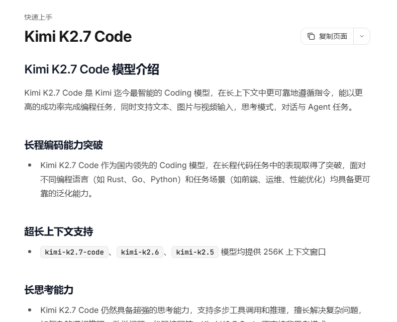
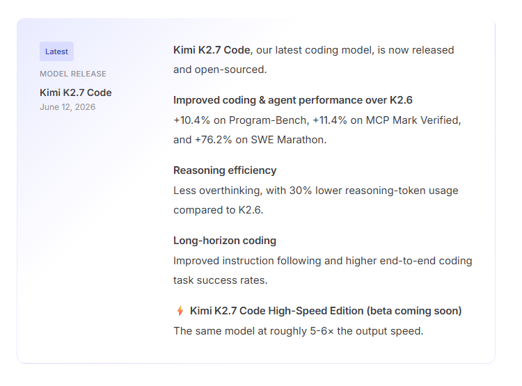

大家好，我是「山丘代码铺」。

Kimi K2.7 Code 发布了。

如果只看官方首页，很容易被那句“当前最强 Coding 模型”带着走。

这句话当然有吸引力。

但我觉得，Kimi K2.7 Code 真正值得写的地方，不是“又一个更强的写代码模型来了”。

现在模型发布太快了。

今天你说最强，明天别人也说最强。

如果每篇文章都写成：

```text
跑分更高了
速度更快了
价格更香了
能挑战谁了
```

很快就会变成一篇热闹但过时很快的新闻稿。

我更想看的是另一个问题：

> **Kimi K2.7 Code 把 AI 编程往哪推了一步？**

看完官方文档和 Kimi Code 的更新记录后，我的感觉是：

> **AI 编程不再只拼模型会不会写代码，而是在拼一整套工程闭环。**

这个闭环里有模型能力，也有上下文、工具、CLI、IDE、协议、成本、限速、日志和验证。

单看一个模型，容易看窄。

把它放回开发链路里看，才更有意思。



图：Kimi K2.7 Code 官方文档里的模型介绍。截图来源：Kimi API 开放平台。

---

## 01｜它不是一个“代码补全升级版”

先说结论。

Kimi K2.7 Code 不太像传统代码补全工具。

传统代码助手解决的是局部效率：

```text
你写一半，它补一段。
你贴报错，它解释一下。
你要函数，它生成一个。
```

这当然有用。

但 K2.7 Code 的官方定位明显更重。

文档里反复出现的是这些词：

```text
Coding
256K 上下文
思考模式
多步工具调用
Agent 任务
文本、图片、视频输入
```

这说明它想处理的不是一个孤立代码片段。

它更像是面向真实工程任务：

```text
读代码
理解需求
分析现有实现
调用工具
修改文件
看结果
继续修正
最后交付一个可 review 的改动
```

这和“补全一段代码”不是一个层级。

代码补全解决的是“写得快一点”。

Agent 编程解决的是“任务能不能被推进下去”。

后端同学应该很熟悉这种差别。

一个函数写得快，不代表一个需求能稳定上线。

真正麻烦的，往往是需求边界、旧逻辑兼容、测试失败、日志定位、回滚方案和代码 review。

所以看 K2.7 Code，别只看它会不会写出漂亮代码。

更要看它能不能进入工程现场。

---

## 02｜256K 上下文，价值是装下更多现场

Kimi K2.7 Code 提供 256K 上下文。

长上下文这件事，大家已经听过很多次。

但在 Coding 场景里，它的意义不是“能塞更多字”。

而是有机会装下更多任务现场。

真实开发任务里，模型需要看的东西经常不止一个文件：

```text
需求描述
接口文档
表结构
相关代码
调用链
错误日志
测试输出
历史约束
```

如果上下文太短，模型很容易只看到局部。

它看到了报错，但没看到业务规则。

它看到了当前文件，但没看到调用链。

它看到了需求，但没看到旧逻辑为什么那么写。

于是它写出来的代码可能局部成立，放进项目里就不稳。

所以 256K 上下文对 Coding Agent 的价值，是让模型更有机会理解“现场”。

但这里也要冷静。

长上下文不等于自动懂项目。

你把一整个仓库塞进去，不代表模型就变成资深维护者。

后端系统仍然要负责组织上下文：

```text
哪些文件必须看
哪些目录不能碰
哪些测试必须跑
哪些业务规则不能破
哪些日志才是关键证据
```

上下文窗口只是给了空间。

怎么装、装什么、什么时候更新，还是工程问题。

---

## 03｜只支持思考模式，说明它不是轻量快问快答

K2.7 Code 有一个细节很值得注意：

它不支持非思考模式。

也就是说，它不是被设计成一个所有请求都默认走的轻量模型。

官方文档里还提到，它支持多步工具调用和推理，适合复杂问题、逻辑推理和代码编写。

这个定位很明确：

```text
它不是为了每次都最快返回。
它是为了把复杂任务想完整。
```

这和 Agent 编程的方向是对上的。

因为真正的编码任务，通常不是一步完成。

它要经历一串动作：

```text
理解目标
拆任务
查文件
改代码
跑命令
读结果
判断失败原因
继续修
```

如果模型只追求快，很容易前两步看着很爽，后面开始乱。

长思考模式的意义，是让模型更适合参与长链路任务。

但代价也很明显：

```text
思考更长
上下文更大
工具更多
成本更容易上来
```

所以它不是“所有问题都上 K2.7 Code”。

更合理的用法是：简单问题走轻量模型，复杂工程任务再路由给它。

---

## 04｜工具调用约束，才是真正的工程味

K2.7 Code 文档里有一段 Tool Use 说明，我觉得比很多跑分更值得看。

它提到两个约束：

```text
tool_choice 只能用 auto 或 none
多步工具调用时，要保留 reasoning_content
```

这看起来像 API 细节。

但对后端来说，这其实很关键。

因为工具调用从来不是“模型会用工具”这么简单。

真实系统里，工具调用是一套协议。

模型负责提出结构化意图：

```text
我要调用哪个工具
传什么参数
为什么现在需要它
```

后端负责真正执行：

```text
参数校验
权限校验
接口调用
失败重试
超时控制
审计日志
结果回填
```

然后模型再基于工具结果继续推理。

这中间任何一环没接好，Agent 都会跑偏。

所以这些约束说明了一件事：

> **Agent loop 是有状态、有协议、有上下文要求的。**

很多 Agent 项目跑不稳，不是模型第一句话答错了。

而是工具调用链路没有设计好。

模型发起调用以后，后端怎么接、怎么记、怎么回填、怎么停，这些才是落地难点。

---

## 05｜Kimi Code 生态，比单个模型名更重要

如果只看 `kimi-k2.7-code`，它是一个模型。

但如果把 Kimi Code 一起看，它就不只是模型了。

Kimi Code 文档里提到，它可以用于官方 CLI、VS Code，也可以接入 Claude Code、Roo Code、OpenCode 等第三方 Coding Agent。

它还兼容 OpenAI 和 Anthropic 协议。

并且在第三方工具里，推荐使用稳定模型 ID：

```text
kimi-for-coding
```

这个细节很有意思。

因为它说明 Kimi 想给开发工具一个稳定入口：

```text
工具不变
模型后台升级
开发者继续沿用原来的工作流
```

这比单纯发布一个模型更工程化。

模型能力要真正进入开发流程，不能只靠一个 API。

它还要回答这些问题：

```text
终端里能不能用
编辑器里能不能用
现有 Coding Agent 能不能接
协议是不是兼容
额度和限速能不能撑住
团队成本能不能看清
```

如果这些问题解决不好，模型再强也容易停在 demo 里。

如果这些问题解决得顺，模型能力才会进入日常开发。

所以 K2.7 Code 这次最值得看的，不只是模型升级。

而是它正在被包进一套开发者工具生态里。



图：Kimi Code What's New 里对 K2.7 Code 的更新说明。截图来源：Kimi Code Docs。

---

## 06｜别只看单价，要看任务总成本

K2.7 Code 的定价也值得看。

官方定价页写的是每 1M tokens：

```text
缓存命中：¥1.30
输入：¥6.50
输出：¥27.00
上下文：262,144 tokens
```

同时，Kimi Code 的更新记录里提到，相比 K2.6，K2.7 Code 推理 token 使用量降低 30%。

这个点很重要。

因为 Agent 编程不能只看单次调用多少钱。

它要看任务总成本。

一个真实任务可能会经历：

```text
读上下文
思考
查文件
调用工具
改代码
跑测试
读报错
再修改
再验证
```

这不是一次请求。

这是一条链路。

所以真正应该问的是：

```text
完成一个真实任务要花多少钱？
失败率是多少？
重试几次？
人还要补多少？
最终 diff 能不能合？
```

这就像后端算成本。

你不能只看单个接口的价格。

你要看整条链路的吞吐、重试、缓存、失败率和人工兜底。

K2.7 Code 提到上下文缓存，也提到推理 token 降低。

这说明模型厂商也开始意识到：

> **Agent 编程不仅拼能力，也拼成本效率。**

未来开发团队真正要做的，不是无脑把所有请求都打到最强模型。

而是做模型路由：

```text
简单任务走轻量模型
复杂任务走强模型
高风险任务加复核
长任务设置预算
工具调用设置上限
失败以后及时停止
```

这才是工程闭环。

---

## 写在最后

Kimi K2.7 Code 值得写。

但我不想把它写成一篇“谁又超过谁”的文章。

那种写法太快过时。

我更愿意把它看成一个信号：

> **AI 编程正在从模型能力竞争，进入工程闭环竞争。**

单个模型会继续更新。

榜单也会继续变化。

但长期看，真正能留下来的不是一句“最强”。

而是一整套能跑真实任务的链路：

```text
模型
上下文
工具
CLI
IDE
协议
日志
成本
验证
回滚
```

Kimi K2.7 Code 这次有意思的地方，正是它已经不只是在讲模型。

它开始把 Coding 模型放进一个更完整的开发系统里。

这件事，比“它是不是今天最强”更重要。
