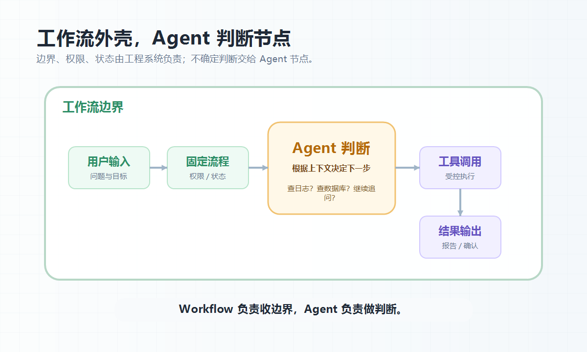
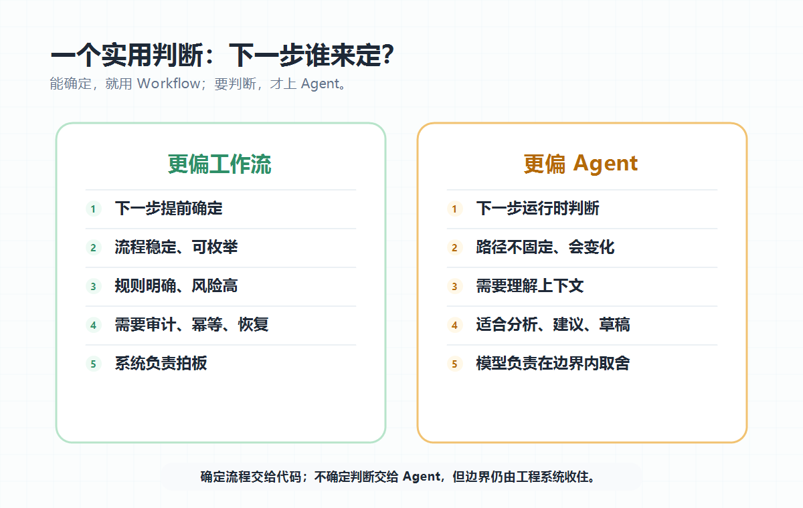

大家好，我是「山丘代码铺」。

最近看 Agent 框架时，我一直被一个问题绕住：

> **Agent 到底是不是 Workflow？**

因为很多 Agent 例子，看起来都像流程。

客服助手是：理解用户问题，查询订单，查询退款，总结原因，返回答案。

代码助手也是：读需求，查文件，改代码，跑测试，修报错，输出结果。

你说它是 Workflow，好像没问题。

你说它是 Agent，也好像没问题。

那问题来了：

这不就是 Workflow 吗？

为什么还要单独讲 Agent？

我以前也这么想过。

后来越看越觉得，这个问题不能只看“有没有步骤”。

因为 Workflow 有步骤，Agent 也会产生步骤。

真正的区别不是有没有流程，而是：

> **下一步由谁决定？**

这个问题想明白以后，Agent 和 Workflow 的边界就清楚很多了。

---

## 01｜区别不在有没有流程，而在谁决定下一步

我现在会这样理解：

> **Workflow 是提前写好的控制流。**
>
> **Agent 是把一部分控制权交给模型的执行单元。**

换成后端视角，就更好懂。

Workflow 更像你写好的业务流程：先校验参数，再查订单，再查退款记录，最后生成结论。

它的核心是确定性：

- 流程提前设计好；
- 节点提前定义好；
- 分支提前写清楚；
- 状态提前管理好。

Agent 不一样。

Agent 更像你给模型一个目标、一组工具和一套边界，然后让它根据当前上下文决定下一步。

比如用户问：

> 这笔退款为什么失败？

Agent 可能先查订单。

查完发现订单不存在，就直接回答。

查完发现订单存在，但退款流水缺失，它再查退款系统。

查完发现三方返回错误，它可能继续查支付渠道状态。

如果信息还不够，它可能反问用户。

也就是说，Agent 的路径不是一开始就完全写死的。

它会边看信息，边决定下一步。

所以我会把两者区别压成一句话：

> **Workflow 的重点是“流程怎么走”。**
>
> **Agent 的重点是“谁来判断下一步怎么走”。**

这就是关键。

---

## 02｜为什么 Agent 看起来像 Workflow？

Agent 容易被看成 Workflow，是因为它跑完以后，也会形成一串步骤。

一个工具调用型 Agent，大概会经历：

```text
用户提问 -> 模型分析 -> 调用工具 -> 观察结果 -> 继续判断 -> 给出答案
```

很多 ReAct、Tool Calling、Agent Loop，本质上都有这个味道。

所以从外面看，Agent 当然有 Workflow 的形状。

但这里有一个细节：

> **Workflow 的步骤通常由系统提前编排。**
>
> **Agent 的步骤很多时候是运行时长出来的。**

这就像排查线上问题。

如果是固定巡检 Workflow，它可能每次都按顺序看 CPU、内存、错误日志、慢查询。

这个流程很稳定。

不管线上到底出了什么问题，它都按检查清单走。

但如果是一个排障 Agent，它可能先看用户描述，发现是支付成功率下降，就去查支付日志；发现异常集中在某个渠道，就继续查渠道响应码；发现异常从某次发布后开始，就再去看发布记录。

它不是按固定清单走完。

它是根据线索改变路径。

这就是 Agent 的味道。

它不是没有流程。

它是流程里有一段“判断权”交给了模型。

---

## 03｜Workflow 强在确定性，Agent 强在不确定性

讲 Agent 之前，不能先把 Workflow 贬低了。

很多时候，Workflow 反而是更好的答案。

比如退款流程：校验用户权限、校验订单状态、校验退款金额、创建退款单、调用支付网关、写操作日志、发送通知。

这种流程就不应该让 Agent 自由发挥。

每一步都很明确。

每个分支都要可追踪。

失败以后要知道卡在哪。

重复请求要做幂等。

关键操作要有审计。

这种场景里，Workflow 是主角。

因为它需要的是确定性，不是灵活性。

反过来，Agent 强在处理“不好提前写死”的部分。

比如用户问：

> 我的服务昨天晚上开始变慢，帮我看看可能是什么原因。

这时候原因可能很多：数据库慢查询、缓存穿透、三方接口变慢、某个版本发布、机器负载升高、队列堆积、配置变更、流量突增。

你当然可以写一个大 Workflow，把所有检查都跑一遍。

但这很笨。

它会查很多没必要的东西。

也可能查完一堆数据以后，仍然不知道下一步该看哪。

这时候 Agent 有价值。

它可以根据当前线索选择下一步：先查 10 点附近有没有发布；如果没有，再看监控指标；如果 DB CPU 飙升，再查慢查询；如果某个接口查询量暴涨，再继续查调用方和流量来源。

这个路径不是提前完整画出来的。

它是被线索牵出来的。

> **Workflow 擅长跑确定流程，Agent 擅长推进不确定任务。**

如果流程能写清楚，就先写清楚。

如果路径需要边看边判断，再考虑 Agent。

---

## 04｜最容易踩的坑：把确定流程交给 Agent

很多 Agent 项目跑不稳，问题就出在这里：

把 Agent 当成万能 Workflow。

原本应该写死的业务规则，不写。

原本应该做权限校验的地方，不做。

原本应该有状态机的地方，交给模型自己判断。

原本应该有失败分支的地方，期待模型“聪明处理”。

结果系统就会变得很飘。

比如你做一个报销助手。

用户说：

> 帮我提交这张发票报销。

Agent 可以识别发票内容，可以判断还缺哪些信息，可以帮用户填写说明，也可以调用工具创建报销草稿。

但真正提交报销、走审批、变更财务状态，最好还是走 Workflow。

因为这些动作背后有明确规则：金额上限、部门预算、审批链、发票验真、重复报销校验、操作审计。

这些不是 Agent 自由判断的地方。

Agent 可以参与。

但不能越权。

更合理的设计是：

```text
Agent 负责理解和补全
Workflow 负责校验和流转
后端负责权限和状态
用户负责最终确认
```

这样系统才稳。

如果把这些都塞给 Agent，它短期看起来很灵活，长期一定难维护。

因为你不知道它为什么这么走。

也不知道它下一次还会不会这么走。

---

## 05｜更稳的结构：Workflow 外壳，Agent 节点

不是所有事情都适合写成死 Workflow。

有些团队害怕 Agent 不稳定，于是把所有路径都画成流程图。

如果用户问法、工具结果、下一步判断都在变化，流程图很快就会变成一团线。

这时候其实说明：

> **你在用 Workflow 硬撑一个不确定任务。**

我现在更认可的结构是：

> **外层是 Workflow，内层某些节点是 Agent。**

外层 Workflow 负责任务入口、用户身份、权限校验、状态流转、超时控制、重试策略、人工确认、审计日志和最终提交。

内层 Agent 负责理解自然语言、判断需要哪些信息、选择合适工具、综合工具结果、生成解释和提出下一步建议。

比如一个故障排查助手，可以这样设计：

```text
Workflow:
  创建排查任务
  限制只读工具
  设置最大轮数和预算
  调用诊断 Agent
  汇总诊断报告
  高风险操作交给人确认

Agent:
  根据现象选择查监控、日志、发布记录还是数据库
  根据结果继续收敛原因
  输出怀疑点、证据和建议
```

这个结构的好处是边界清楚。

Agent 有空间判断。

但它不能乱跑。

Workflow 有确定性。

但它不需要枚举所有排查路径。

这就像给一个工程师安排任务。

你不会把每一步都写死到“先看第 38 行日志，再查第 12 个指标”。

但你会给他边界：只能查生产日志，不能改生产配置；最多排查 30 分钟；涉及重启服务必须找人确认；最后给出证据链，不要只给猜测。

Agent 系统也应该这样。

不是放养。

也不是捆死。



图：更稳的 Agent 系统，通常不是放养模型，而是用 Workflow 收住边界，让 Agent 只处理需要判断的不确定部分。

---

## 06｜一个简单判断：能确定就 Workflow，要判断才 Agent

如果还觉得抽象，可以用这个问题判断：

> **下一步是否需要模型根据上下文判断？**

如果不需要，那大概率是 Workflow。

比如支付成功后发送通知、订单超时后取消、审批通过后生成合同、每天凌晨同步数据、失败后重试三次。

这些任务没有必要交给 Agent 判断。

直接写流程更稳。

如果需要，那可能适合 Agent。

比如用户这句话到底想查什么，当前错误更像配置问题还是代码问题，工具结果之间有没有矛盾，还缺哪条信息才能回答，下一步应该查日志还是查数据库。

这些问题很难用固定分支写完。

它们需要理解、比较、推理和取舍。

这就是 Agent 可以发挥的地方。

| 问题 | 更偏 Workflow | 更偏 Agent |
| --- | --- | --- |
| 下一步 | 提前确定 | 运行时判断 |
| 路径 | 稳定、可枚举 | 不固定、会变化 |
| 规则 | 明确业务规则 | 需要理解上下文 |
| 风险 | 高风险操作 | 分析、建议、草稿 |
| 状态 | 强状态流转 | 弱状态或临时状态 |
| 重点 | 可控、可审计 | 灵活、可探索 |



图：判断 Agent 和 Workflow 的关键，不是看有没有步骤，而是看下一步是否需要根据上下文重新判断。

再压缩一下：

> **能确定，就用 Workflow。**
>
> **要判断，才上 Agent。**

这句话不一定完美，但很实用。

---

## 07｜写在最后：Agent 不是逃离工程

很多人以为有了 Agent，就可以少写工程代码。

以前要写流程编排，现在让 Agent 自己决定。

这个想法很危险。

Agent 不会让工程消失。

它只是把一部分不确定性从代码里挪到了运行时。

这意味着你反而更需要工程手段兜住它：工具权限、参数校验、执行沙箱、调用日志、最大轮数、成本预算、结果校验、人工确认、失败回退。

没有这些东西，Agent 越聪明，系统越难控。

因为它不是简单执行固定流程。

它会根据上下文改变路径。

路径一变，观测、调试、安全、成本都要跟上。

回到标题：

> **Agent 到底是不是 Workflow？**

我的答案是：

> **不是。**
>
> **但一个能落地的 Agent 系统，必须有 Workflow 的边界。**

Agent 和 Workflow 真正的区别，不是表面上有没有步骤，而是控制权放在哪里。

Workflow 把控制权写进流程里。

Agent 把一部分控制权交给模型，让它根据上下文决定下一步。

所以，Agent 不是 Workflow 的替代品。

它更像是 Workflow 里那个会判断、会取舍、会继续追问的智能节点。

这可能就是 Agent 真正能进项目的方式：

不是把模型放出去自由发挥，而是让它在清楚的工程边界里，负责那些确实需要判断的部分。
