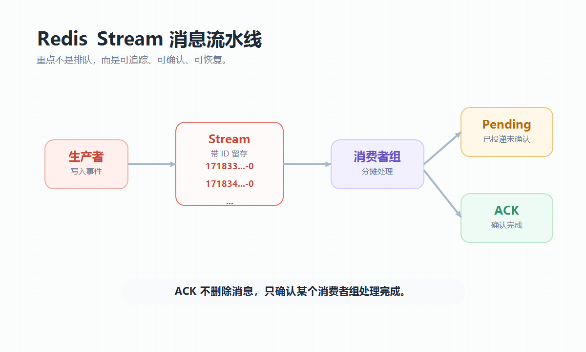
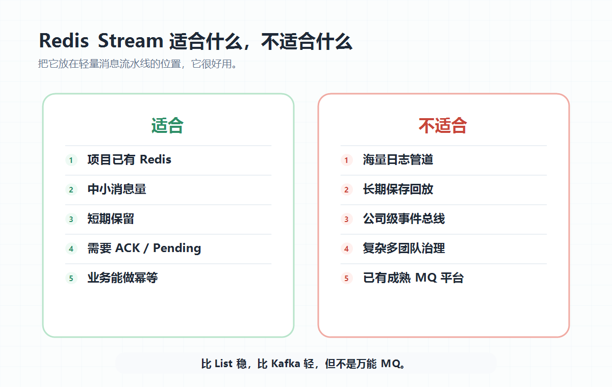

大家好，我是「山丘代码铺」。

项目里一旦出现异步任务，很容易冒出一个问题：

> **要不要上消息队列？**

比如订单成功后发通知，接口收到回调后慢慢处理，业务动作完成后顺手写审计、推送、同步数据。

这些事如果都放在主流程里，接口会变慢，失败也不好兜。

所以很多后端同学第一反应是：

> 上 MQ。

但真到小项目里，又会犹豫。

Kafka 太重。

RabbitMQ 要多维护一套东西。

直接用 Redis List 好像又太粗糙。

这时候 Redis Stream 就会被拿出来。

它看起来很像一个刚刚好的中间选项：

- Redis 本来就在项目里；
- 消息有 ID；
- 能按顺序读；
- 有 Consumer Group；
- 能 ACK；
- 消费者挂了，还能找 pending 消息。

于是很多人会说：

> Redis Stream 不就是 Redis 版消息队列吗？

这句话有一半对。

但另一半很容易误导人。

我现在更愿意这样理解：

> **Redis Stream 不是 Kafka 平替，也不是 List 的简单升级。**
>
> **它更像一条可追踪、可确认、可恢复的轻量消息流水线。**

这个定位想清楚，Redis Stream 才不会被用歪。

---

## 01｜它解决的不是“排队”，而是“可追踪”

如果只是想先进先出，Redis List 已经能做。

生产者写进去，消费者阻塞读取。

简单、直接、好理解。

但 List 做消息队列有一个很尴尬的问题：

> **消息被消费者拿走以后，如果消费者处理到一半挂了，这条消息怎么办？**

你当然可以自己再搞一个 processing list。

但这样写着写着，业务代码就会开始变脏。

你要自己维护“谁拿走了”“有没有处理完”“挂了以后怎么找回来”。

Redis Stream 真正补的是这块。

它让消息不只是被取走，而是有一条可追踪的流水：

- 消息有 ID；
- 消费者组有进度；
- 消息投递后有 pending；
- 处理完成后需要 ACK。

所以 Redis Stream 的重点不是“Redis 终于能排队了”。

Redis 早就能排队。

它真正有价值的地方是：

> **让 Redis 里的异步任务变得更可观察。**

---

## 02｜三个关键词：ID、Consumer Group、ACK

Redis Stream 不用一上来背命令。

先抓住三个关键词就够了。

第一个是 ID。

每条消息写进 Stream 后，都会有一个类似 `1718330000000-0` 的 ID。

这意味着它不像 List 那样“弹出就没了”。

消息会留在 Stream 里，直到你主动裁剪或删除。

第二个是 Consumer Group。

同一个 Stream 可以有多个消费者组。

每个组有自己的消费进度。

同一个组里的多个消费者，可以一起分摊消息。

第三个是 ACK。

消费者拿到消息后，Redis 会先把它记到 pending 里。

处理成功以后，再 ACK。

ACK 的意思不是删除消息。

它只是告诉 Redis：

> 这条消息在这个消费者组里处理完了。

这个 pending 状态很关键。

它让你知道哪些消息已经投递出去，但还没有被确认。

消费者挂了，也不是两眼一黑。

后面可以把长时间没确认的消息重新认领回来。

这就是 Redis Stream 比 List 稳的地方：

> **它把“消费中”这个状态显式暴露出来了。**

图：Redis Stream 的关键不是“能排队”，而是消息有 ID、消费者组有 pending，处理完成后再 ACK。

---

## 03｜它适合做什么？

Redis Stream 适合一类很具体的场景：

> **规模不算特别大，但你希望异步任务能追踪、能确认、能恢复。**

比如订单后置处理。

用户下单成功后，主流程先返回。

后面慢慢做积分、通知、统计、发票、CRM 同步。

这些任务不一定值得单独上 Kafka。

但也不能随便丢。

Redis Stream 就比较合适。

再比如 webhook 回调。

外部系统推过来一个事件，你不想在 HTTP 请求里直接做重逻辑。

可以先写进 Stream，再让消费者慢慢处理。

失败了可以重试。

卡住了可以看 pending。

我会把适合条件压成几条：

- 项目里本来就有 Redis；
- 消息量中小，不是海量日志管道；
- 消息只需要短期保留；
- 需要消费者组、ACK、pending 和重试；
- 业务能接受至少一次投递，并且自己做幂等。

最后一条很重要。

Redis Stream 不是 exactly-once。

只要有重试和 pending 转移，就要默认消息可能重复。

所以处理逻辑一定要幂等。

不要让一条重复消息导致重复扣款、重复发券、重复改状态。

---

## 04｜它不适合做什么？

Redis Stream 很好用，但不要把它当 Kafka 平替。

如果你要做的是公司级事件总线、海量日志采集、多团队订阅、长期保留、复杂回放、跨机房容灾，那 Redis Stream 就不是最舒服的选择。

它底层仍然是 Redis。

这意味着你要关心内存、持久化、主从复制、故障恢复和裁剪策略。

尤其要注意一点：

> **XACK 不会删除消息。**

ACK 只是确认这条消息在某个消费者组里处理完了。

消息本体还在 Stream 里。

如果你一直写，又不裁剪，Stream 会一直长。

所以 Redis Stream 不适合这些场景：

- 消息量巨大，Redis 内存压力不可控；
- 需要长期保存和复杂回放；
- 消费链路很多，治理要求很高；
- 团队已经有成熟 Kafka / Pulsar / RabbitMQ 基础设施。

一句话：

> **Redis Stream 适合轻量消息流水线，不适合当公司级消息中枢。**

把它放在舒服区，它很好用。

硬让它扛 Kafka 的活，它会很累，你也会很累。

图：Redis Stream 更适合轻量异步任务和短期消息流水，不适合承担公司级事件中枢。

---

## 05｜真正落地时，记住这几件事

如果在后端项目里用 Redis Stream，我会先抓几个工程边界。

第一，消息要幂等。

消费失败、重试、pending 重新认领，都可能让一条消息被处理多次。

所以业务上最好有唯一键。

处理前查一次，处理后记状态。

第二，pending 要有人管。

Consumer Group 会记录 pending，但不会自动替你完成业务恢复。

消费者挂了以后，需要定时任务把长时间未确认的消息找回来。

否则 pending 只是“记录了问题”，不是“解决了问题”。

第三，Stream 要裁剪。

ACK 不删除消息，所以必须提前想好保留策略。

只保留最近几万条也好，只保留一段时间也好，别等 Redis 内存报警了才想起来。

第四，监控要补。

至少要看 Stream 长度、pending 数量、最老 pending 的时间、消费延迟和失败次数。

没有这些指标，Redis Stream 很容易变成一个“看起来在跑，其实没人知道卡哪”的黑盒。

---

## 写在最后

回到标题：

> **Redis Stream 到底适合做什么？**

我的答案是：

> **适合做轻量、可追踪、可确认、可恢复的消息流水线。**

它比 Redis List 稳。

因为它有 ID、消费者组、pending 和 ACK。

它又不像 Kafka 那样适合扛公司级事件平台。

因为它仍然跑在 Redis 这套模型里，要关心内存、裁剪、持久化和故障恢复。

所以别把 Redis Stream 看成万能 MQ。

它更像一个很实用的中间档：

> **比 List 稳，比 Kafka 轻。**

如果你的项目已经有 Redis，只是想把一些异步任务从主流程里拆出去，同时还希望能看见谁消费了、谁没确认、哪里卡住了，那 Redis Stream 很值得用。

但真正让它稳下来的，不是 Stream 这个名字。

而是幂等、pending 回收、裁剪策略、监控告警这些工程活。
