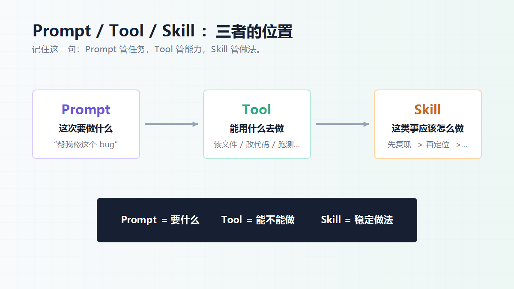
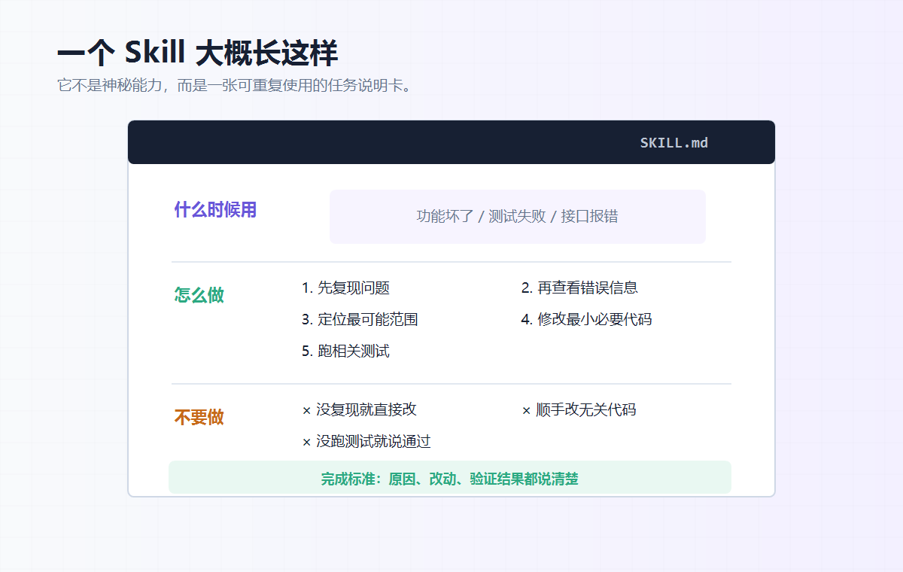

大家好，我是「山丘代码铺」。

有一个词，在 AI Agent 里经常会冒出来：

> **skill**

第一次看到它，很容易把它想复杂。

好像 Agent 有了 skill，就突然多了一种神秘能力，什么都能自动做得更好。

但其实不用这么理解。

这篇不想把它讲玄。

我想把这个词拆得简单一点：

> **Skill 是写给 Agent 的长期说明书。**

它把一类任务的做法提前写好，让 Agent 遇到类似任务时按流程做。

比如：

```text
遇到 bug 怎么排查
遇到 PDF 怎么处理
遇到图片生成怎么描述
遇到代码修改怎么验证
遇到文件操作要注意什么边界
```

这些都可以写进 skill。

这就是全文最核心的一句话：

> **Skill 不是神秘能力，而是一份让 Agent 做某类任务时可反复遵循的说明书。**

---

## 01｜Skill 是什么？

先给一个最短定义：

> **Skill 是一类任务的操作说明。**

它不是只针对这一次对话。

它也不是临时提醒一句。

它更像一张可以反复使用的任务卡片。

比如“调试问题”可以是一类任务。

“处理 PDF”可以是一类任务。

“生成图片”可以是一类任务。

“修改代码并验证”也可以是一类任务。

这些任务都有一个共同点：

> 不是只要会动手就行，还要知道怎么做才稳。

拿调试问题来说。

有经验的人通常不会一上来就乱改。

他会先复现问题，看错误信息，缩小范围，再做最小修改，最后跑测试确认。

如果把这套做法写下来，让 Agent 下次遇到 bug 时照着做，这就是 skill。

所以 skill 的重点不是“让 Agent 多一个能力”。

而是：

> **把一类事情的正确做法写给 Agent。**

---

## 02｜Skill 不是什么？

理解 skill，有时候先排除误会更快。

第一，skill 不是魔法。

不是装了 skill，模型就突然什么都懂。

它只是多了一份做事说明。

第二，skill 不是模型本身。

模型还是那个模型。

Skill 只是告诉它：

```text
这类任务通常怎么判断
通常按什么顺序做
哪些坑不要踩
最后应该交代什么
```

第三，skill 也不是工具本身。

比如读文件、改文件、跑命令、调用接口，这些是工具能力。

Skill 不负责替代这些工具。

它负责告诉 Agent：

> 这些工具该在什么时候用，按什么顺序用，用完以后怎么检查。

所以可以简单说：

> **Skill 是经验流程的封装。**

它把“有经验的人会怎么做”写成规则，交给 Agent。

---

## 03｜Skill、Prompt、Tool 有什么区别？

这三个词最容易混在一起。

我用一个修 bug 的例子讲。

你对 Agent 说：

```text
帮我修一下这个登录接口的 bug。
```

这是 prompt。

Prompt 解决的是：

> **这次要做什么。**

Agent 能读文件、搜索代码、修改文件、运行测试。

这些是 tool。

Tool 解决的是：

> **能用什么去做。**

但还有一个问题：

Agent 应该怎么修？

它是直接改代码，还是先复现问题？

它是只看报错那一行，还是要看调用链？

它改完以后，是不是要跑相关测试？

它没跑测试时，能不能说“应该没问题”？

这些就是 skill 管的事。

Skill 解决的是：

> **这类事应该怎么做。**

所以三者可以这样记：

```text
Prompt：这次做什么
Tool：能用什么做
Skill：应该怎么做
```

这就是 skill 最关键的位置。

它不是任务本身。

也不是工具本身。

它是任务和工具之间那套“做法”。



---

## 04｜一个 Skill 大概长什么样？

我们可以直接看一张很短的 skill 卡片。

比如“调试问题”这个 skill，大概可以写成这样：

```text
Skill：调试问题

什么时候用：
用户说功能坏了、测试失败了、接口报错了。

怎么做：
1. 先复现问题
2. 再查看错误信息
3. 定位最可能的问题范围
4. 修改最小必要代码
5. 跑相关测试

不要做：
- 不要没复现就直接改
- 不要顺手改无关代码
- 不要没跑测试就说通过

完成标准：
- 说清楚原因
- 说清楚改了什么
- 说清楚怎么验证的
```

看到这里，skill 应该就不抽象了。

它不是一段神秘咒语。

它就是一份任务说明。

Agent 看到用户说“测试失败了”，就知道这类任务应该用调试 skill。

用了这个 skill，它就不会一上来乱改。

它会先复现，再定位，再修改，再验证。

这就是 skill 的作用。



---

## 05｜再换几个例子

调试问题只是一个例子。

别的任务也可以写成 skill。

比如 PDF 处理：

```text
什么时候用：
用户要读取、整理、生成或检查 PDF。

怎么做：
先确认 PDF 内容，再提取文字或渲染页面。
如果涉及排版，要看渲染结果。

不要做：
不要只看文字就说排版没问题。
```

比如图片生成：

```text
什么时候用：
用户要封面图、插图、产品图、视觉素材。

怎么做：
先明确主题、画面主体、风格、尺寸和不能出现的内容。

不要做：
不要用一张很泛的 AI 图糊弄过去。
```

比如代码修改：

```text
什么时候用：
用户要改功能、修 bug、补测试。

怎么做：
先读相关代码，再小范围修改，最后跑相关验证。

不要做：
不要顺手重构无关模块。
不要覆盖别人已经改过的内容。
```

这些例子看起来都很朴素。

但这正是 skill 的特点：

> **它不追求神秘，它追求稳定。**

它把容易忘的步骤、容易踩的坑、完成时要交代的内容，提前写下来。

---

## 06｜如果面试官问你：什么是 Skill？

如果面试里被问到：

> **你怎么理解 AI Agent 里的 skill？**

可以不用答得太玄。

我会这样说：

> **Skill 是写给 Agent 的长期说明书。它把一类任务的做法、步骤、边界和完成标准提前写好，让 Agent 遇到类似任务时可以按这套流程执行。**

然后再补一句区别：

> **Prompt 解决的是这次要做什么，Tool 解决的是能用什么做，Skill 解决的是这类事情应该怎么做。**

如果面试官让你举例，可以接着说：

```text
比如修 bug。

用户说“帮我修这个接口问题”，这是 prompt。

Agent 能读代码、改文件、跑测试，这是 tool。

但它应该先复现问题，再看错误信息，再定位范围，再小范围修改，最后跑测试验证，这套做法就是 skill。
```

最后可以总结成一句：

> **Skill 不是让模型突然变聪明，而是把人的经验流程写给 Agent，让它做事更稳定、更可控。**

这样回答就够了。

它没有把 skill 说成一个神秘能力，也没有只停在“工具”这个层面，而是把它放在 Agent 做任务的流程里讲清楚了。

---

## 写在最后

所以，skill 到底是什么？

最简单的理解就是：

> **Skill 是 Agent 做某类任务时要遵守的操作说明。**

Prompt 决定这次做什么。

Tool 决定能不能动手做。

Skill 决定这件事怎么做得更稳。

它不是魔法。

不是模型突然变聪明。

也不是工具本身。

它更像把人的经验流程写给 Agent。

让 Agent 遇到类似任务时，不是每次重新猜，而是按一套已经写好的做法来。

Skill 的价值，不是让 Agent 更神。

而是让 Agent 更靠谱。
