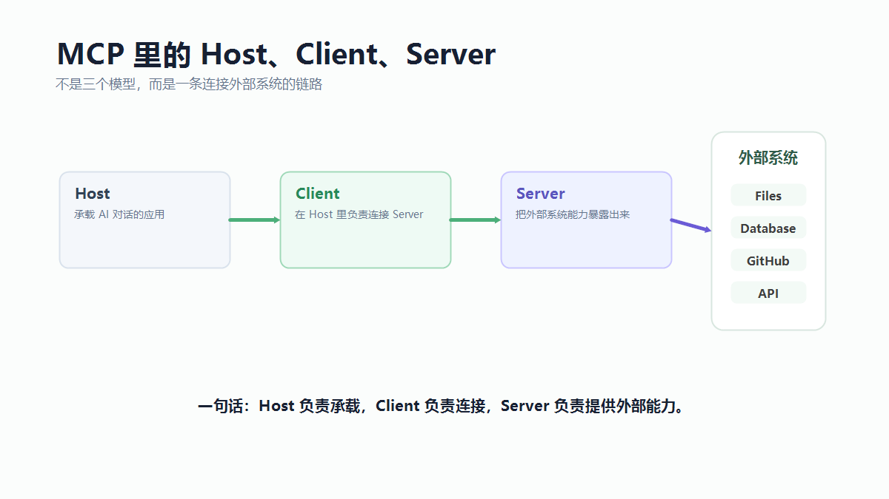
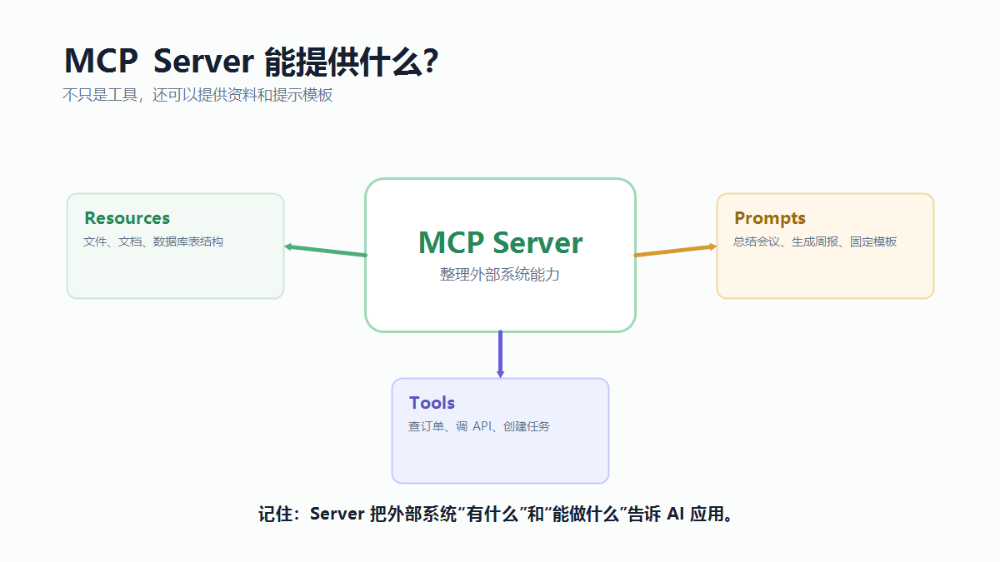

大家好，我是「山丘代码铺」。

最近只要聊 AI Agent，很容易看到一个词：

> **MCP。**

MCP 的全称是 **Model Context Protocol**。

直译过来，可以叫：

> **模型上下文协议。**

也有人会说“大模型上下文协议”。

这几个说法指的是同一个东西。

先别被这个名字吓到。

它里面最关键的词，其实不是“模型”，而是“上下文”和“协议”。

上下文，指的是模型做事时需要看到的资料、工具、系统状态和任务信息。

协议，指的是大家按一套约定来连接和交换这些东西。

所以 MCP 这个名字拆开看，大概就是：

> **给模型接入外部上下文的一套协议。**

第一次看到它，很多人会下意识紧张。

因为它看起来像一个很重的协议。

一会儿是 MCP Server。

一会儿是 MCP Client。

一会儿又冒出来 Tools、Resources、Prompts。

再加上一堆配置文件、权限、连接方式，很容易让人以为：

> **这是不是又是一个很复杂的新框架？**

但如果只是先理解它在解决什么问题，不用一上来钻协议细节。

我会先把 MCP 理解成一句话：

> **MCP 是 AI 应用连接外部系统的一套统一插口。**

再土一点说：

> **它让 AI 应用用比较统一的方式，去接文件、数据库、业务接口、工具和提示模板。**

这篇就先讲这个。

不讲复杂实现。

不讲怎么写 MCP Server。

先把 MCP 这个词讲明白。

---

## 01｜没有 MCP 时，AI 应用怎么接外部系统？

先想一个很普通的场景。

你做了一个 AI 助手，希望它能帮你处理项目里的事情。

它可能需要：

- 读本地文件；
- 查数据库；
- 看 GitHub issue；
- 查内部文档；
- 调接口创建任务；
- 根据固定模板生成周报。

如果没有统一方式，每接一个系统，你都要单独写一套适配。

接 GitHub，写一套。

接数据库，写一套。

接 Notion，写一套。

接公司内部系统，又写一套。

而且不只是“能不能调接口”这么简单。

你还要告诉 AI 应用：

> 这个系统里有什么资料？
>
> 有哪些能力可以调用？
>
> 每个能力需要什么参数？
>
> 哪些操作有风险？
>
> 返回结果应该怎么交给模型？

这些事情如果都散在各个应用里，时间久了就会很乱。

于是 MCP 想解决的问题就出来了：

> **能不能让外部系统按一种统一方式，把自己的资料和能力暴露给 AI 应用？**

这就是 MCP 的位置。

它不是让模型突然变聪明。

它是让模型身边的“外部系统接入”更有规矩。

---

## 02｜MCP 最简单的理解：AI 应用的插口

官方经常把 MCP 类比成 AI 应用里的 USB-C。

这个比喻挺好。

电脑为什么需要 USB-C？

不是因为 USB-C 会让电脑变聪明。

而是因为有了统一接口以后，很多设备就不用各接各的奇怪线了。

显示器、硬盘、键盘、扩展坞，都可以通过相对统一的方式接进来。

MCP 也是类似的意思。

它不是模型。

不是数据库。

不是知识库。

不是工具本身。

它更像一套连接标准：

```text
AI 应用
  ↓
MCP Client
  ↓
MCP Server
  ↓
外部系统
```

这里的外部系统，可以是文件系统，可以是数据库，也可以是 GitHub、飞书、Notion、浏览器、内部业务系统。

所以你可以先这么记：

> **MCP 不是新的大脑，而是新的连接方式。**

它解决的是“怎么接外部系统”，不是“模型本身会不会思考”。

---

## 03｜MCP Host、Client、Server 都是啥？

理解 MCP，最容易卡在三个词上：

```text
MCP Host
MCP Client
MCP Server
```

这三个名字很像，但不是一回事。

先给一个最短版本：

```text
MCP Host：你正在使用的 AI 应用
MCP Client：Host 里面负责连接某个 MCP Server 的连接器
MCP Server：把外部系统的资料和能力暴露出来的一端
```

听起来有点绕。

换成更口语的说法：

> **Host 是你正在用的 AI 产品。**
>
> **Client 是这个 AI 产品里负责接 MCP 的那根线。**
>
> **Server 是外部系统派出来的服务员。**

比如你在一个 AI 编程工具里接了一个 GitHub MCP Server。

那 AI 编程工具就是 Host。

工具里面负责跟 MCP Server 通信的部分，就是 Client。

GitHub MCP Server 负责把 GitHub 的能力暴露出来，比如查 issue、看 PR、读仓库信息。

这个关系可以再写得直白一点：

```text
AI 编程工具（Host）
  里面有一个 GitHub MCP Client
    连到 GitHub MCP Server
      GitHub MCP Server 再去访问 GitHub
```

模型本身不直接变成 GitHub。

它只是通过这套连接，知道：

> 这里有一些 GitHub 相关能力可以用。

这里有几个容易误会的点。

第一，Host 不是“服务器主机”。

它不是我们平时说的 Linux 主机、云服务器、虚拟机。

在 MCP 里，Host 指的是承载 AI 对话和用户交互的应用。

比如一个 AI 编程工具、一个桌面助手、一个聊天客户端，都可以是 Host。

第二，Client 不是“用户客户端”。

它不是浏览器，也不是 App 前端。

它更像 Host 里面的一段连接逻辑。

一个 Host 可以同时连接多个 MCP Server。

通常每连一个 MCP Server，就会有一个对应的 MCP Client 负责通信。

第三，Server 不是“模型服务器”。

MCP Server 不负责训练模型，也不负责生成回答。

它负责把外部系统的能力整理出来，告诉 Host：

```text
我这里有哪些 Resources
我这里有哪些 Tools
我这里有哪些 Prompts
这些东西应该怎么调用
```

所以这三个角色的区别，可以压成一句话：

> **Host 负责承载 AI 应用，Client 负责连接，Server 负责提供外部能力。**

再换个生活化一点的说法：

```text
Host 像办公室
Client 像办公室里接电话的人
Server 像外部部门的服务窗口
```

用户在办公室里提出需求。

接电话的人负责联系外部服务窗口。

外部服务窗口查资料、办事情，再把结果返回来。

这就是 MCP 的基本结构。



---

## 04｜MCP Server 能提供什么？

一个 MCP Server 通常可以暴露三类东西：

```text
Resources：资料
Tools：工具
Prompts：提示模板
```

先说 Resources。

Resources 可以理解成“可读取的资料”。

比如：

- 一个文件；
- 一段文档；
- 一个数据库表结构；
- 一条业务记录；
- 一个项目里的配置。

它的重点是：

> **把上下文给 AI 应用看。**

再说 Tools。

Tools 可以理解成“可调用的动作”。

比如：

- 查询订单；
- 搜索 issue；
- 调用接口；
- 创建工单；
- 计算一段数据；
- 触发某个业务流程。

它的重点是：

> **让 AI 应用不只是看资料，还能请求做一件事。**

最后是 Prompts。

Prompts 可以理解成“预设好的提示模板”。

比如：

- 总结会议；
- 生成周报；
- 分析日志；
- 按固定格式写代码评审意见。

它的重点是：

> **把一类常见任务的提示方式沉淀下来。**

所以，MCP Server 不是只能提供工具。

它也可以提供资料和提示模板。

只不过在很多讨论里，大家最容易先注意到 Tools。



---

## 05｜MCP 和普通 API 有什么区别？

很多后端同学第一次看到 MCP，会问一个很正常的问题：

> **这不就是 API 吗？**

有点像，但不完全一样。

普通 API 更像是给程序员用的。

你读接口文档，知道有一个接口：

```text
GET /orders/{id}
```

然后你在代码里决定什么时候调它、传什么参数、怎么处理返回值。

MCP 更像是给 AI 应用接外部能力的一套包装方式。

它不仅关心“能不能调接口”，还关心：

> 这个工具叫什么？
>
> 它是干什么的？
>
> 需要哪些参数？
>
> 返回什么内容？
>
> AI 应用怎么发现它？
>
> 调用时怎么经过客户端和服务端协作？

所以可以这么理解：

> **API 是外部系统原本提供能力的方式。**
>
> **MCP 是把这些能力包装成 AI 应用更容易发现和使用的方式。**

MCP 并不是要消灭 API。

很多 MCP Server 背后，照样是在调用 API。

只是它把这些 API 重新整理了一下，让 AI 应用接起来更统一。

---

## 06｜为什么 Agent 会特别需要 MCP？

普通聊天机器人只要回答问题就行。

但 Agent 不一样。

Agent 经常需要做事。

它可能要先读文件，再查资料，再调用工具，再把结果写回去。

这时候它就会不断遇到外部系统。

问题是，外部系统太多了。

文件是一套方式。

数据库是一套方式。

GitHub 是一套方式。

公司内部接口又是一套方式。

如果每个 AI 应用都自己接一遍，重复成本很高。

而且容易乱。

MCP 的价值就在这里：

> **让外部系统用更标准的方式，向 Agent 暴露上下文和能力。**

这样一来，一个 MCP Server 写好以后，理论上可以被多个支持 MCP 的 AI 应用接入。

你不用每换一个 AI 工具，就重新写一套集成。

这对 Agent 很重要。

因为 Agent 真正要落地，不只是模型聪明。

还要能稳定、安全、可控地接进真实系统。

---

## 07｜MCP 不是什么？

理解 MCP，也要知道它不是什么。

第一，MCP 不是模型。

装了 MCP，不代表模型本身变强了。

它只是多了一条连接外部系统的路。

第二，MCP 不是 RAG。

RAG 解决的是：

> **怎么检索资料，再让模型参考资料回答。**

MCP 解决的是：

> **外部资料和工具怎么接给 AI 应用。**

MCP 可以给 RAG 提供资料来源，也可以提供搜索工具。

但 MCP 本身不负责切分文档、向量检索、重排、评估回答质量。

第三，MCP 不是万能权限系统。

MCP 可以帮你标准化暴露工具。

但工具能不能调用、调用前要不要确认、危险操作怎么审计，这些仍然要认真设计。

比如一个工具叫：

```text
delete_database
refund_order
send_company_email
```

光有 MCP 不够。

你还得有权限、确认、日志、回滚策略。

所以不要把 MCP 想成魔法。

它只是把连接方式标准化。

安全边界还是要自己守住。

---

## 08｜用一个例子串起来

假设你要做一个项目助手。

你希望它能回答：

> 这个项目最近有哪些高优先级 bug？

如果项目助手接了一个 issue 系统的 MCP Server。

这个 Server 可能提供一个工具：

```text
search_issues(query, priority, status)
```

模型看到用户的问题后，判断自己需要查 issue。

于是请求调用这个工具。

MCP Server 去真正查询 issue 系统。

查到以后，把结果返回给 AI 应用。

模型再组织成一段总结。

如果用户继续说：

> 帮我把最严重的那个整理成修复任务。

MCP Server 可能还有一个工具：

```text
create_task(title, description, assignee)
```

这时候系统就不只是读资料了，而是要执行动作。

这类动作就更需要权限和确认。

你可以看到，MCP 在这里不是答案本身。

它更像那根线。

把 AI 应用和 issue 系统接起来。

至于模型怎么判断、工具怎么设计、危险操作怎么确认，仍然是工程问题。

---

## 09｜什么时候你真的需要 MCP？

不是所有 AI 小功能都需要 MCP。

如果你只是写一个很小的 Demo，只调用一个自己后端里的函数，直接写工具调用就够了。

没必要为了显得先进，硬上 MCP。

但如果你遇到这些情况，MCP 就开始有意义了：

- 外部系统很多；
- 同一套能力希望多个 AI 客户端复用；
- 想把资料、工具、提示模板统一暴露出来；
- 不想每个 AI 应用都重复写一套集成；
- 希望未来接入更多支持 MCP 的客户端。

一句话：

> **当你的问题从“调用一个工具”变成“管理一堆外部能力怎么接入”时，MCP 就值得考虑。**

小项目不一定需要。

但 Agent 真要接真实系统，迟早会碰到类似问题。

---

## 10｜如果面试官问你：什么是 MCP？

如果面试里被问到：

> **你怎么理解 MCP？**

不要一上来背一堆协议名。

先把位置讲清楚。

可以这样回答：

> **MCP，全称 Model Context Protocol，可以理解成模型上下文协议。它是一套让 AI 应用连接外部系统的开放协议。它的作用不是让模型本身变聪明，而是让外部系统可以用统一方式，把资料、工具和提示模板暴露给 AI 应用。**

然后补上三个角色：

> **MCP Host 是真正承载 AI 对话的应用，比如 AI 编程工具或桌面助手。MCP Client 是 Host 里面负责连接某个 MCP Server 的连接器。MCP Server 是外部系统的一端，负责提供 Resources、Tools 和 Prompts。**

再补一个例子，回答会更稳：

```text
比如一个 AI 编程工具想接 GitHub。

AI 编程工具是 Host。
它内部会有一个 MCP Client 负责连接 GitHub MCP Server。
GitHub MCP Server 暴露查 issue、看 PR、读仓库信息这些能力。

模型不是直接访问 GitHub，而是通过 Host、Client、Server 这条链路使用这些能力。
```

如果面试官追问“那 MCP 和 API 有什么区别”，可以继续说：

> **API 是外部系统原本提供能力的方式，主要给程序员调用。MCP 更像是把这些能力包装成 AI 应用能发现、理解和调用的形式。很多 MCP Server 背后还是在调 API，但它把接入方式标准化了。**

最后可以收成一句：

> **MCP 的价值不是替代模型、API 或 RAG，而是把外部系统接入 AI 应用这件事做得更统一、更可复用。**

这样回答就比较完整。

它既讲了定义，也讲了结构，还讲了边界。

---

## 写在最后

所以，MCP 到底是什么？

我会这样记：

> **MCP 是 AI 应用连接外部系统的一套统一插口。**

它不替代模型。

不替代 API。

不替代 RAG。

也不替你自动解决安全问题。

它真正解决的是：

> **外部系统怎么更标准地把资料、工具和提示模板交给 AI 应用。**

Prompt 决定这次要做什么。

Tool 决定能不能动手做。

Skill 决定这类事应该怎么做。

而 MCP 更像是在后面补了一句：

> **这些资料和工具，能不能用一套统一方式接进来。**

如果说 Agent 要真正进入项目现场，那它不能只靠聊天。

它要读资料、查系统、调接口、拿上下文、执行动作。

MCP 的价值，不是让 Agent 更神。

而是让 Agent 接真实世界时，不至于每次都重新拉一堆乱七八糟的线。
