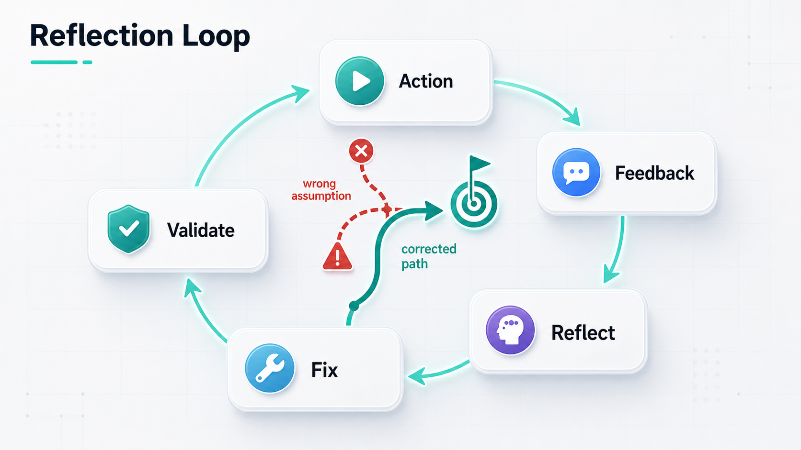
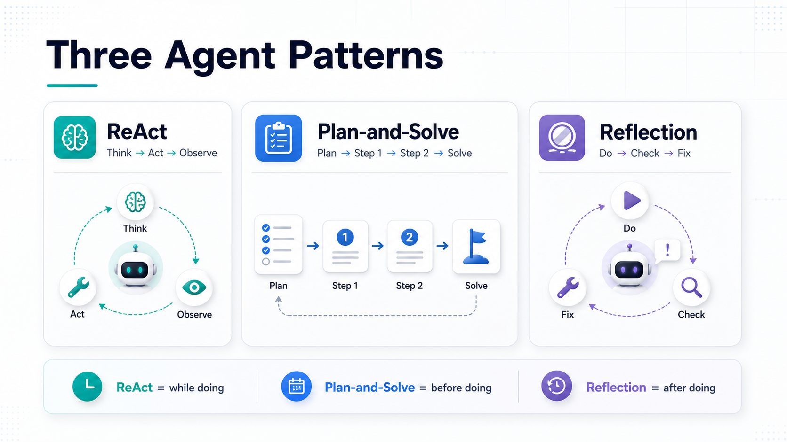

大家好，我是「山丘代码铺」。

前面讲 ReAct 的时候，我们说过一句话：

> **Agent 不应该只坐在那里回答问题，它要能边判断、边行动、边看结果。**

这其实已经比普通聊天机器人往前走了一大步。

但真实项目里，还有一个问题很常见：

> **Agent 能行动了，但它可能一路错下去。**

比如它一开始判断错了方向。

然后根据这个错误方向查资料。

查完以后又继续沿着这个方向解释。

最后整段回答看起来很完整，但其实从第一步开始就歪了。

这时候就会引出另一个 Agent 里经常出现的词：

> **Reflection。**

直译过来，可以叫“反思”。

注意，这里不是 Java 里的“反射”。

在 AI Agent 语境里，Reflection 更接近：

> **让 Agent 做完一步或一轮任务后，回头检查自己刚才做得对不对，再决定要不要修正。**

这篇就先把它讲清楚。

不讲复杂论文。

不把它包装成神秘能力。

先记住一句话：

> **Reflection 是给 Agent 加一个“回头看”的环节。**

---

## 01｜Reflection 是什么？

先给一个最短定义：

> **Reflection 是一种让 Agent 根据结果或反馈，检查并修正自己行为的模式。**

再说得更土一点：

> **做完以后别急着往下冲，先回头看看刚才哪里可能错了。**

比如 Agent 写了一段代码。

它不能只说：

```text
代码已经修改完成。
```

它应该继续看：

```text
测试有没有过？
报错说明了什么？
我刚才的判断是不是错了？
有没有改到无关代码？
下一次应该怎么修？
```

这就是 Reflection 想做的事情。

它不是让模型真的拥有“自我意识”。

也不是说模型突然变成一个会深刻反省的人。

它更像一个工程动作：

> **把检查、总结、修正这一步显式放进 Agent 流程里。**

所以 Reflection 的重点不是“想得更玄”。

而是：

> **让 Agent 不要只会往前跑，还要会纠偏。**

---

## 02｜用一个修 bug 的例子理解

假设你让 Agent 修一个接口 bug。

用户说：

```text
这个登录接口有时候会 500，帮我看一下。
```

一个没有 Reflection 的 Agent，可能会这样做：

```text
看报错
猜是 token 解析问题
改 token 相关代码
说已经修复
```

看起来它做了事。

但问题是，它可能猜错了。

真正原因也许不是 token。

而是某个用户没有绑定默认组织，代码里取组织 ID 的时候空指针了。

如果 Agent 不回头检查，它就很容易把一个错误判断继续写得很认真。

有 Reflection 的流程会多一步：

```text
先做一次判断
尝试修改或验证
观察结果
回头检查：刚才的判断是否成立
如果不成立，改掉假设，再继续
```

比如它改了 token 逻辑以后，测试还是失败。

这时候 Reflection 不应该说：

```text
再多改一点 token 逻辑。
```

而应该停一下：

```text
刚才我假设问题出在 token 解析。
但测试仍然失败，说明这个假设可能不成立。
新的错误信息指向 user.organizationId 为空。
接下来应该检查用户组织绑定逻辑，而不是继续改 token。
```

这段“停下来重新看”的过程，就是 Reflection。

它的价值不是让 Agent 看起来更会说话。

而是让 Agent 在做错的时候，有机会把方向拉回来。

---

## 03｜Reflection 的基本循环

Reflection 通常可以理解成这样一个循环：

```text
先生成一个结果
  -> 检查结果
  -> 总结问题
  -> 修正下一步
  -> 再试一次
```

放到 Agent 任务里，就是：

```text
行动
  -> 观察反馈
  -> 反思刚才哪里可能错了
  -> 调整计划或答案
  -> 继续行动
```

这里最关键的是“反馈”。

Reflection 不能只是让模型自言自语：

```text
我觉得我刚才做得不错。
```

这没有太大意义。

更有用的 Reflection，通常要基于真实反馈。

比如：

- 测试结果；
- 编译错误；
- 接口返回；
- 日志信息；
- 用户追问；
- 评审意见；
- 检索到的新资料。

没有反馈，反思很容易变成空想。

有反馈，反思才有抓手。

所以可以这样记：

> **Reflection 不是让 Agent 随便想一想，而是让它根据反馈重新校准。**



图：Reflection 的关键不是“想一想”，而是基于反馈检查、修正，再继续。

---

## 04｜它和 ReAct、Plan-and-Solve 有什么区别？

这三个词经常放在一起看：

```text
ReAct
Plan-and-Solve
Reflection
```

它们都和 Agent 怎么做事有关，但侧重点不一样。

**ReAct** 更强调：

> **边想边做边观察。**

也就是：

```text
判断下一步
调用工具
观察结果
再判断下一步
```

适合那种下一步要看结果才能决定的任务。

比如排查问题、查资料、调用工具推进任务。

**Plan-and-Solve** 更强调：

> **先列计划，再按计划解决。**

它关心的是，不要一上来就急着回答。

先把问题拆成几步，再一步一步做。

适合那种结构比较清楚、可以提前拆步骤的任务。

比如写方案、整理迁移步骤、分析一个复杂问题。

**Reflection** 更强调：

> **做完以后回头检查，发现问题再修正。**

它关心的是，Agent 做了一轮以后，不要默认自己一定是对的。

要能根据结果、错误或反馈，重新判断。

可以压成三句话：

```text
ReAct：边做边看。
Plan-and-Solve：先想清楚再做。
Reflection：做完回头检查。
```

这三种方式并不冲突。

真实 Agent 里，它们经常可以组合。

比如：

```text
先用 Plan-and-Solve 拆任务
中间用 ReAct 调工具推进
每一轮失败后用 Reflection 纠偏
```

所以不要把它们看成互斥选项。

它们更像 Agent 做事时的三个动作习惯。



图：ReAct 更像边做边看，Plan-and-Solve 更像先计划再做，Reflection 更像做完以后回头纠偏。

---

## 05｜Reflection 不是什么？

理解 Reflection，也要先排掉几个误会。

第一，Reflection 不是魔法。

不是加一句“请你反思一下”，模型就一定会变正确。

如果没有真实反馈，没有检查标准，没有边界，它很可能只是把原来的错误换一种说法再讲一遍。

第二，Reflection 不是无限重试。

有些 Agent 一失败就反思，一反思就重试，一重试又失败。

最后陷进循环里。

这不是靠谱，这是失控。

所以 Reflection 通常要配合限制：

```text
最多反思几轮
每轮必须基于什么反馈
什么时候停止
什么时候交给人
```

第三，Reflection 不是替代验证。

Agent 说“我检查过了”，不等于真的正确。

代码还是要跑测试。

接口还是要看返回。

数据还是要对来源。

Reflection 的作用是帮助它发现可能的问题。

但真正的验证，最好还是交给可观察的结果。

所以一句话：

> **Reflection 可以帮助 Agent 纠偏，但不能替代事实验证。**

---

## 06｜什么时候适合用 Reflection？

Reflection 适合那些容易“第一遍不准”的任务。

比如写代码。

第一版可能能跑，但边界没处理好。

跑完测试以后，Agent 可以根据失败用例反思哪里漏了。

比如写长文章。

第一版可能结构完整，但重点跑偏。

看完要求以后，可以让 Agent 回头检查：

```text
有没有回答核心问题？
有没有讲太复杂？
有没有把定义讲清楚？
有没有跑到别的话题上？
```

比如做资料分析。

第一次总结可能抓错重点。

拿到更多资料后，可以让 Agent 重新判断前面的结论是否站得住。

比如多步工具调用。

某个工具失败了，或者返回结果和预期不一样。

这时候 Reflection 可以帮助 Agent 不要机械重试，而是先判断：

```text
是参数错了？
是工具不适合？
是权限不够？
还是一开始理解错了用户需求？
```

但如果任务很简单，没必要强行上 Reflection。

比如用户只是问一个确定事实，或者只要格式转换。

这时候加一大段反思，反而显得啰嗦。

Reflection 的价值在于纠偏。

没有明显偏差风险的任务，就不用硬加。

---

## 07｜工程里怎么用得稳一点？

如果真要在 Agent 里加 Reflection，我会先关注四件事。

第一，要有反馈来源。

不要只让模型凭感觉反思。

最好让它基于测试、日志、工具返回、用户反馈来反思。

第二，反思要短。

Reflection 不是写小作文。

它最好回答几个具体问题：

```text
刚才的假设是什么？
反馈是否支持这个假设？
如果不支持，新的判断是什么？
下一步最小动作是什么？
```

第三，要限制轮数。

比如最多反思两轮或三轮。

到点还解决不了，就说明需要换策略，或者让人介入。

第四，要避免伪证据。

Agent 不能自己编一个“测试已经通过”来支撑自己的反思。

它必须引用真实看到的结果。

这点很重要。

因为 Reflection 一旦基于假反馈，就会让错误看起来更有逻辑。

所以稳一点的 Reflection，不是让 Agent 更会自圆其说。

而是让它更愿意承认：

> **我刚才的判断不成立，应该换一个方向。**

---

## 08｜如果面试官问你：什么是 Reflection？

如果面试里被问到：

> **你怎么理解 Agent 里的 Reflection？**

可以这样回答：

> **Reflection 是一种让 Agent 在完成一步或一轮任务后，根据结果、错误或外部反馈，检查自己刚才的判断和行动是否正确，并据此修正下一步的模式。**

然后补一句边界：

> **它不是让模型拥有真正的自我意识，也不是万能纠错。它更像是在 Agent 流程里加入一个显式的复盘和纠偏环节。**

再举一个例子：

```text
比如 Agent 修 bug。

它先根据报错做出一个假设并修改代码。
如果测试仍然失败，它不能只是继续沿着原来的假设乱改。
它应该回头看测试失败信息，判断刚才的假设是否成立。
如果不成立，就更新判断，再选择下一步动作。
```

最后可以用一句话收住：

> **ReAct 让 Agent 边做边观察，Reflection 让 Agent 做完以后能回头纠偏。两者可以组合使用。**

这样回答就比较稳。

既讲了定义，也讲了作用，还讲清楚了它不是什么。

---

## 写在最后

所以，Reflection 到底是什么？

我会这样记：

> **Reflection 是让 Agent 做完以后回头检查，并根据反馈修正自己的过程。**

它不是神秘能力。

不是自我意识。

也不是一句“请反思”就能解决所有问题。

它真正有价值的地方在于：

> **让 Agent 不要一路错下去。**

ReAct 让 Agent 会边想边做。

Plan-and-Solve 让 Agent 先把步骤想清楚。

Reflection 则提醒 Agent：

> **做完以后，也要回头看一眼。**

很多时候，Agent 靠不靠谱，不只看它第一步能不能想出来。

还要看它发现自己走偏以后，能不能停下来，改方向，再继续。

这就是 Reflection 最朴素的价值。
