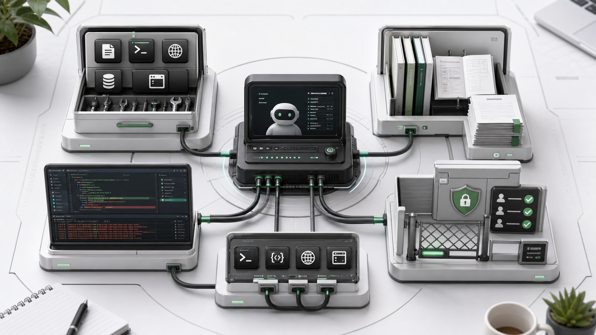
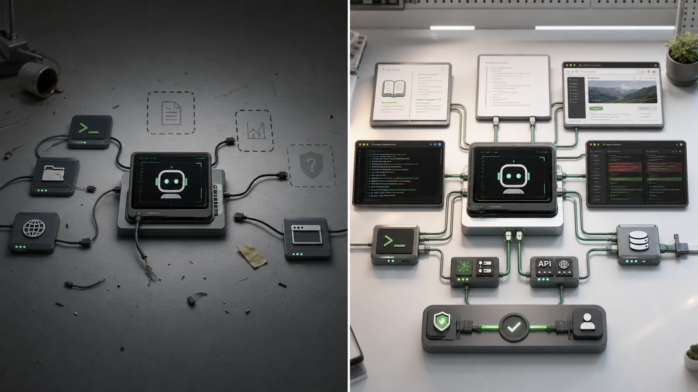

大家好，我是「山丘代码铺」。

聊 Agent 的时候，我们很容易盯着一个词：

> **Tools。**

模型能不能读文件？

能不能跑命令？

能不能打开浏览器？

能不能查数据库？

能不能调用 API？

这些当然重要。

没有工具，Agent 很多时候就只能停在聊天。

但做项目久了以后，会发现一个问题：

> **只给 Agent 一堆工具，并不等于它就能稳定做事。**

它还需要知道资料在哪里。

需要看到当前环境发生了什么。

需要知道动作怎么发出去。

需要知道哪些地方能动，哪些地方必须先问。

这些东西合在一起，才更接近一个词：

> **Harness。**

这个词不太好直译。

你可以先把它理解成：

> **把 Agent 套进真实工作现场的那套运行外壳。**

再工程一点说：

> **Harness 是 Agent 能在一个具体环境里观察、理解、行动和受约束的整套条件。**

这篇就把它拆明白。

不是讲一个新框架。

也不是造一个更玄的词。

而是想说明一件事：

> **Agent 真正能不能落地，拼的不是有没有某个工具，而是有没有一套完整的 Harness。**

---

## 01｜先给一个公式

如果用一行话来拆 Harness，我会这样写：

```text
Harness = Tools + Knowledge + Observation + Action Interfaces + Permissions
```

再展开一点：

```text
Tools:          文件读写、Shell、网络、数据库、浏览器
Knowledge:      产品文档、领域资料、API 规范、风格指南
Observation:    git diff、错误日志、浏览器状态、传感器数据
Action:         CLI 命令、API 调用、UI 交互
Permissions:    沙箱隔离、审批流程、信任边界
```



图：Harness 不是单个工具，而是 Tools、Knowledge、Observation、Action Interfaces 和 Permissions 一起组成的工作现场。

这几个词单独看都不新。

但合在一起，就能解释很多 Agent 项目里的真实问题。

比如一个 Agent 明明有 Shell 工具，为什么还是修不好 bug？

因为它可能缺错误日志。

明明能读文件，为什么写出来的代码不符合项目习惯？

因为它缺风格指南和已有约定。

明明能调用接口，为什么不敢让它自动执行？

因为权限边界没设计好。

所以 Harness 的重点不是“再加一个工具”。

而是问：

> **Agent 做这件事时，周围那套现场条件完整吗？**

---

## 02｜Tools：先让 Agent 有手

Tools 是大家最熟的部分。

它解决的是：

> **Agent 能用什么能力去做事。**

比如：

- 读写文件；
- 搜索代码；
- 执行 Shell；
- 访问网络；
- 查询数据库；
- 操作浏览器；
- 调用内部接口。

这些能力就像给 Agent 装上手。

没有手，它最多只能分析。

有了手，它才可能改代码、查状态、跑测试、创建任务、整理资料。

但这里有一个容易误会的点：

> **Tool 只是能力入口，不等于完整工作环境。**

你给 Agent 一个 Shell，它确实能执行命令。

但它知道该跑哪个测试吗？

知道这个仓库用 pnpm、npm 还是 uv 吗？

知道哪些命令会删数据吗？

知道失败日志要怎么看吗？

不知道。

这些不属于单个 tool 本身。

它们属于更大的 Harness。

所以 Tools 很重要，但它只是第一层。

---

## 03｜Knowledge：让 Agent 知道项目里的规矩

第二块是 Knowledge。

它解决的是：

> **Agent 做事时应该参考什么知识和约定。**

比如：

```text
产品文档
领域资料
API 规范
数据库表结构
代码风格指南
团队约定
历史决策
上线流程
```

很多 Agent 失败，不是因为它不会调用工具。

而是因为它不知道这个项目的上下文。

比如你让它改一个支付回调。

如果它不知道业务里有这些约束：

```text
订单状态只能单向流转
回调可能重复发送
签名失败必须记录审计日志
金额字段统一用分
退款走单独流程
```

那它就算能读文件、改代码、跑测试，也可能写出一个看起来能跑、实际不合业务规矩的实现。

这就是 Knowledge 的位置。

它不是工具。

它更像项目里的“常识地基”。

Agent 要做真实任务，不能只知道语言语法。

它还要知道：

> **这个项目到底怎么运转。**

---

## 04｜Observation：让 Agent 看见反馈

第三块是 Observation。

它解决的是：

> **Agent 做事过程中能看到什么环境反馈。**

这个词特别关键。

因为 Agent 不是一次性生成答案就结束。

它经常要边做边看。

比如：

```text
git diff
错误日志
测试输出
浏览器页面状态
接口响应
数据库查询结果
队列消费状态
监控告警
```

这些都不是“知识库里的资料”。

它们是现场反馈。

举个简单例子。

Agent 修改了一个前端页面。

如果它只能读代码，看不到浏览器页面，那它只能猜页面有没有崩。

如果它能打开浏览器、截图、检查控制台错误、观察按钮状态，它就能根据真实反馈继续修。

后端也是一样。

它改了一个接口。

如果看不到测试输出、日志、响应码、数据库状态，那它只能说“理论上应该可以”。

但工程里最怕的就是这句话。

Observation 的价值就在这里：

> **让 Agent 不只是会动手，还能看到动手之后发生了什么。**

没有 Observation，Agent 很容易变成闭眼操作。

有了 Observation，它才可能形成闭环。

---

## 05｜Action Interfaces：动作到底从哪里发出去

第四块是 Action Interfaces。

它和 Tools 很像，但角度不一样。

Tools 更偏“有什么能力”。

Action Interfaces 更偏：

> **这些动作通过什么接口被真实执行。**

比如：

```text
CLI 命令
API 调用
UI 交互
消息队列事件
工作流触发器
浏览器点击
数据库写入
```

为什么要单独说它？

因为同样是“创建一条任务”，执行方式可能完全不同。

一种是调 API：

```text
POST /tasks
```

一种是跑 CLI：

```text
task create --title "修复登录问题"
```

一种是操作网页 UI：

```text
打开任务系统
点击新建
填写标题
提交
```

这三种对 Agent 来说都叫“做动作”。

但稳定性、权限、可观察性、可回滚性都不一样。

API 通常更清晰。

CLI 往往适合工程环境。

UI 交互更接近人的操作，但也更容易受页面变化影响。

所以 Harness 里要明确：

> **Agent 的动作从哪里出去，结果从哪里回来，失败时怎么判断。**

这不是小事。

因为 Agent 一旦从“回答问题”走向“执行动作”，Action Interface 就是它和真实系统之间的门。

门设计得不好，Agent 不是做不了事，就是容易乱做事。

---

## 06｜Permissions：不是能做就该做

最后一块是 Permissions。

它解决的是：

> **Agent 到底被允许做什么。**

这一块经常被低估。

很多 Demo 里，只要工具能调，就直接让 Agent 调。

但真实项目里不行。

因为动作有风险。

比如：

```text
删除文件
修改数据库
发送邮件
发布文章
退款
推送代码
重启服务
改线上配置
```

这些动作不是技术上能不能做的问题。

而是信任边界的问题。

Agent 可以读什么？

可以写什么？

哪些命令必须在沙箱里跑？

哪些动作需要用户审批？

哪些接口只能查，不能改？

哪些操作必须留下审计日志？

这些都属于 Permissions。

所以一个好的 Harness，不只是给 Agent 开门。

它还要设计护栏。

可以这样理解：

> **Tools 决定 Agent 有没有手，Permissions 决定这双手能伸到哪里。**

没有 Permissions 的 Agent，很难进入生产环境。

因为你不可能放心让它拿着所有权限到处跑。

---

## 07｜为什么只说 Tools 不够？

现在回头看，就能明白为什么“给 Agent 接工具”只是第一步。

假设你要做一个代码 Agent。

只给它 Tools，大概是这样：

```text
能读文件
能改文件
能跑命令
能搜索代码
```

看起来已经很强。

但真正要稳定工作，它还需要：

```text
Knowledge：知道项目结构、技术栈、编码约定、业务规则
Observation：能看到测试结果、错误日志、git diff、页面状态
Action Interfaces：知道通过什么命令或接口执行动作
Permissions：知道哪些文件能改，哪些命令危险，哪些动作要确认
```

这些加起来，才是它的 Harness。

再换成客服 Agent 也一样。

只给它一个“查询订单”的工具，不够。

它还要知道：

```text
产品政策是什么
用户问题怎么分类
订单状态怎么解释
哪些话术不能说
什么时候必须转人工
退款动作是否需要审批
回复发出后能不能撤回
```

所以 Harness 不是某个领域专有词。

它更像一套通用的工程视角：

> **别只问 Agent 有什么工具，要问它被放进了怎样的工作现场。**



图：只有工具时，Agent 只能摸到几个能力入口；完整 Harness 会把知识、反馈、动作入口和权限边界一起接上。

---

## 08｜Harness 和 MCP、Skill 有什么关系？

前面讲过 MCP，也讲过 Skill。

这里顺手把几个词放在一起看。

MCP 更像在解决：

> **外部资料和工具怎么标准接入。**

Skill 更像在解决：

> **某类任务应该按什么流程做。**

而 Harness 更像在描述：

> **Agent 做事时，周围完整的运行环境是什么。**

它们不是同一层东西。

比如一个 Agent 的 Harness 里，可以包含 MCP 接进来的工具和资源。

也可以包含某个 Skill 规定的操作流程。

但 Harness 不等于 MCP。

也不等于 Skill。

它比单个协议或单个任务说明更大一点。

可以压成三句话：

```text
MCP：怎么把外部能力接进来
Skill：这类任务应该怎么做
Harness：Agent 在什么现场里做事
```

这个区分很有用。

因为很多时候我们以为自己缺的是模型能力，其实缺的是 Harness。

不是模型不会写代码。

而是它不知道项目约定。

不是模型不会修 bug。

而是它看不到日志和测试反馈。

不是模型不能调用工具。

而是权限和动作接口没有设计清楚。

---

## 09｜如果面试官问你：什么是 Harness？

如果面试里被问到：

```text
你怎么理解 Agent 里的 Harness？
```

可以不用答得太玄。

先给一句话：

> **Harness 是 Agent 被放进一个具体环境里做事时，围绕它的一整套工具、知识、观察反馈、行动接口和权限边界。**

然后展开：

> 它不只是 Tools。Tools 只说明 Agent 能调用什么能力。真正的 Harness 还要包括产品文档、API 规范、错误日志、git diff、浏览器状态、CLI 或 API 这些动作入口，以及沙箱、审批和信任边界。

再举一个代码 Agent 的例子：

```text
一个代码 Agent 不能只会读写文件和跑命令。

它还要知道项目的技术栈和编码约定；
能看到测试失败、日志和 git diff；
知道用什么命令构建、测试、提交；
也要知道哪些操作危险，哪些修改需要确认。

这些合起来，才是它的 Harness。
```

最后收一句：

> **Harness 的价值，是让 Agent 不只是有工具，而是能在真实项目现场里安全、可观察、可控制地做事。**

这样回答就够了。

它把 Tools 讲进去了，但没有停在 Tools。

也把工程里最关键的闭环和权限讲出来了。

---

## 写在最后

所以，Harness 到底是什么？

我会这样记：

> **Harness 是 Agent 的工作现场。**

Tools 让它有手。

Knowledge 让它懂规矩。

Observation 让它看见反馈。

Action Interfaces 让动作真正发出去。

Permissions 让它知道边界在哪里。

这几块合在一起，Agent 才不是一个只会聊天的模型，也不是一个拿着工具乱跑的脚本。

它才有机会变成一个能在项目里做事的工程参与者。

很多 Agent 项目卡住，并不是因为少了一个更炫的模型。

而是因为它周围那套 Harness 太薄。

看不见现场。

摸不到正确的动作入口。

不知道项目规矩。

也没有清楚的信任边界。

把 Harness 补起来，Agent 才真正有地方落脚。
