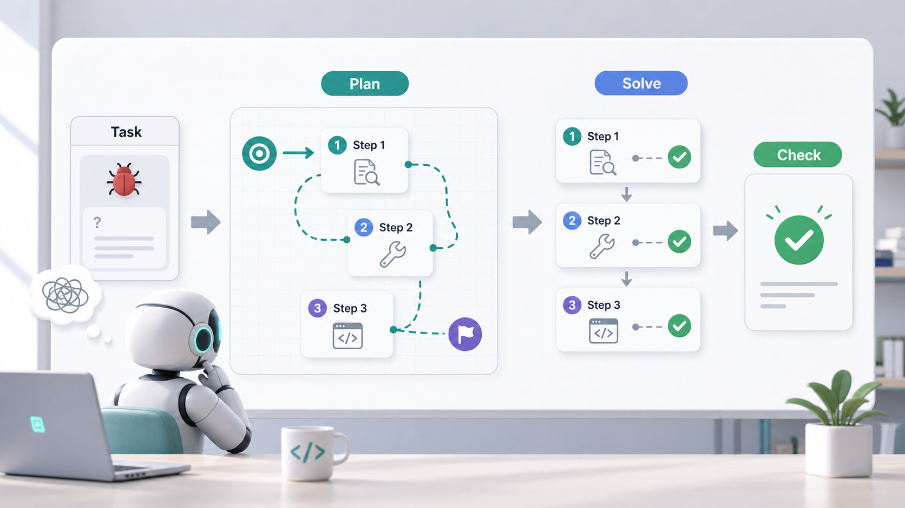
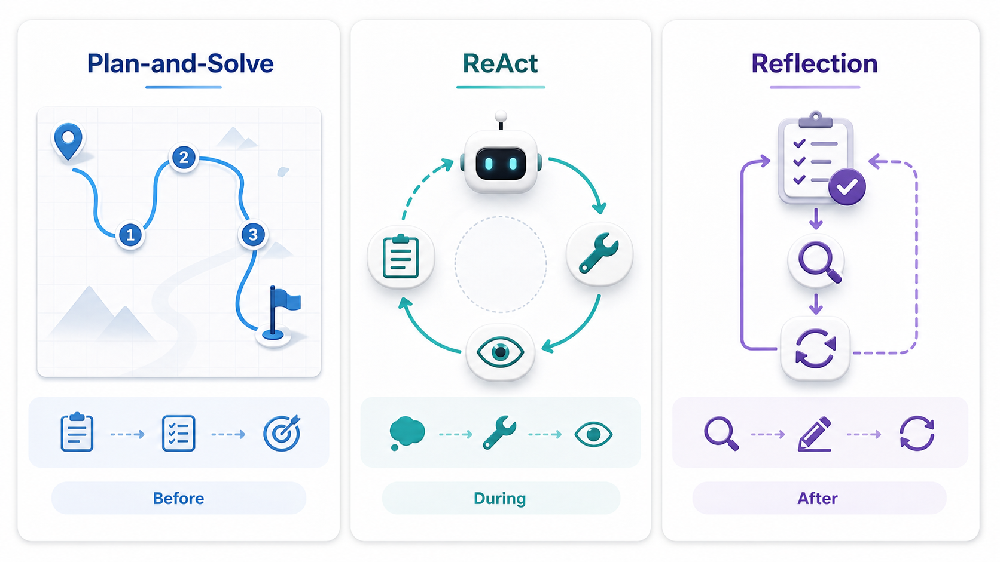

大家好，我是「山丘代码铺」。

前面我们讲过 ReAct，也讲过 Reflection。

一个强调：

> **边想、边做、边观察。**

另一个强调：

> **做完之后回头检查、修正。**

那中间其实还缺一块。

很多时候，Agent 不是不会做，也不是不能调用工具。

它的问题是：

> **一上来就开始做，还没想清楚这件事应该分几步。**

比如你让它：

```text
帮我分析一下这个接口为什么变慢了。
```

它可能马上去看一份日志。

看到日志里有数据库查询，就开始说数据库慢。

看到数据库慢，又开始建议加索引。

最后说了一大堆，看起来很忙，但你会发现：

> 它压根没有先把问题拆开。

接口变慢，可能是数据库。

也可能是缓存失效。

也可能是下游接口超时。

也可能是最近发布改了逻辑。

也可能是流量突然上来了。

如果 Agent 不先列一个基本排查路径，很容易抓到一个线索就一路冲下去。

这时候就会引出另一个常见词：

> **Plan-and-Solve。**

这篇就把它讲清楚。

不讲太玄。

先记住一句话：

> **Plan-and-Solve 就是让 Agent 先计划，再解决。**

---

## 01 | Plan-and-Solve 是什么？

先给一个最短定义：

> **Plan-and-Solve 是一种让 Agent 先把任务拆成步骤，再按步骤完成任务的模式。**

拆开看，其实就两个动作：

```text
Plan：先做计划
Solve：再解决问题
```

它想避免的是这种情况：

```text
问题刚出现
Agent 立刻开始回答
中间想到哪说到哪
最后漏掉关键步骤
```

Plan-and-Solve 希望 Agent 先停一下，问自己：

```text
这件事的目标是什么？
要分成哪几步？
每一步要看什么信息？
最后怎么判断完成？
```

然后再开始执行。

所以它不是一个很神秘的东西。

它更像我们平时做复杂任务时的一个习惯：

> **先把事拆明白，再一件一件做。**

比如写一篇技术文章。

普通做法可能是：

```text
想到哪写到哪。
```

Plan-and-Solve 的做法是：

```text
先确定主题
再列出读者最容易困惑的点
再安排文章结构
再补例子
最后收结论
```

你看，它没有变魔法。

只是把“先想清楚结构”这件事显式放到了前面。

---

## 02 | 用一个修 bug 的例子理解

假设你让 Agent 修一个问题：

```text
登录接口偶尔返回 500，帮我排查一下。
```

如果没有计划，Agent 可能会这样做：

```text
看一眼报错
猜是 token 问题
改 token 逻辑
跑一下
说修好了
```

问题是，它可能猜错。

登录接口 500，可能和 token 有关。

但也可能是：

- 用户数据为空；
- Redis 偶发超时；
- 组织信息没绑定；
- 最近改了登录后审计日志；
- 某个异常没有被捕获；
- 某个第三方接口偶尔失败。

如果一上来就改代码，很容易变成“拿着锤子找钉子”。

Plan-and-Solve 会要求它先给出一个排查计划。

比如：

```text
计划：
1. 先复现 500，确认触发条件
2. 查看错误日志，找真实异常栈
3. 判断问题发生在登录主流程、token 生成、用户信息查询，还是后置动作
4. 根据异常栈定位最小代码范围
5. 修改最小必要代码
6. 跑相关测试或补一个回归用例
```

然后再按这个计划去做。

这时候 Agent 的行为会稳定很多。

因为它不是看见一个线索就冲。

它会先知道：

> **我现在处在第几步，我下一步为什么要这么做。**

这就是 Plan-and-Solve 的核心价值。

不是让 Agent 显得更聪明。

而是让它少漏步骤，少乱跳，少凭感觉下结论。

---

## 03 | 为什么不能让 Agent 直接开干？

因为真实任务很少是一个动作就能完成的。

尤其是工程里的任务。

比如：

```text
帮我接一个支付回调
帮我优化一个慢接口
帮我整理一篇技术文章
帮我把一个功能从 A 系统迁到 B 系统
帮我分析这段代码有没有风险
```

这些任务都有一个共同点：

> **它们不是单点问题，而是一串动作。**

如果 Agent 没有先拆任务，就容易出现几种情况。

第一，漏步骤。

比如写支付回调，只写了验签和更新订单，忘了幂等、重复通知、异常重试、日志记录。

第二，顺序错。

比如还没搞清楚现有数据结构，就先开始改接口。

第三，目标漂移。

本来是修一个 bug，修着修着开始重构整个模块。

第四，验证缺失。

代码改完了，但没有说明怎么证明它真的修好了。

所以 Plan-and-Solve 其实是在提醒 Agent：

> **复杂任务不要急着回答，先把路线画出来。**

这和我们平时写代码也很像。

小改动可以直接动手。

但稍微复杂一点的需求，最好先在脑子里过一遍：

```text
入口在哪？
影响哪些模块？
数据怎么流？
异常怎么处理？
最后怎么验证？
```

Plan-and-Solve 只是把这个过程写进 Agent 的工作方式里。

---

## 04 | Plan 和 Solve 分别在做什么？

Plan-and-Solve 这个词看起来像一个整体。

但真正理解它，最好把它拆成两段。

第一段是 Plan。

Plan 不是随便列几个漂亮标题。

它要解决的是：

```text
这个任务应该怎么拆？
哪些步骤必须先做？
哪些信息还缺？
哪些地方容易出错？
完成标准是什么？
```

一个好的 Plan，应该能让人看出来这件事的路径。

比如：

```text
目标：解释 Plan-and-Solve 是什么

计划：
1. 先给一句话定义
2. 再用一个修 bug 的例子解释
3. 说明为什么复杂任务不能直接开干
4. 对比 ReAct 和 Reflection
5. 最后给一个面试回答
```

这个计划很朴素，但它有用。

因为它告诉 Agent：

> 这篇文章不是随便聊 Agent，而是要把 Plan-and-Solve 讲明白。

第二段是 Solve。

Solve 不是机械照抄计划。

它是在执行计划的过程中，把每一步真正做完。

比如排查 bug 时：

```text
计划里说先复现，那就真的去复现。
计划里说看日志，那就真的看日志。
计划里说定位最小范围，那就不要顺手改一堆无关代码。
计划里说验证，那就真的跑测试或说明验证方式。
```

所以 Plan-and-Solve 不是“先写一段计划给用户看”这么简单。

它真正想做的是：

> **用计划约束后面的行动。**

如果计划写得很好，但后面完全不按计划执行，那就只是装样子。



图：Plan-and-Solve 的关键不是先写一段漂亮计划，而是先把路线拆清楚，再按步骤执行和检查。

---

## 05 | 它和 ReAct、Reflection 有什么区别？

这三个词很容易放在一起看：

```text
ReAct
Plan-and-Solve
Reflection
```

它们都在讲 Agent 怎么做事。

但重点不一样。

**ReAct** 更像：

> **边做边看。**

它关心的是：

```text
我现在应该做什么动作？
工具返回了什么结果？
下一步要怎么调整？
```

适合那种必须一边查一边推进的任务。

比如查日志、查资料、调用工具、根据结果继续判断。

**Plan-and-Solve** 更像：

> **先拆再做。**

它关心的是：

```text
任务能不能先分成几步？
每一步应该解决什么？
不要一上来就跳到答案。
```

适合结构比较清楚、可以先规划的任务。

比如写方案、做迁移、分析问题、整理文章、处理一组待办。

**Reflection** 更像：

> **做完回头看。**

它关心的是：

```text
刚才做得对不对？
有没有根据反馈修正？
要不要换一个方向？
```

适合需要检查、纠偏、总结、重试的任务。

可以压成三句话：

```text
Plan-and-Solve：动手前，先计划。
ReAct：执行中，边做边观察。
Reflection：做完后，回头检查。
```

它们不是互相排斥的。

真实 Agent 里，经常会组合使用。

比如一个比较完整的工作流可以是：

```text
先用 Plan-and-Solve 拆任务
中间用 ReAct 调工具、看结果、继续推进
失败后用 Reflection 检查问题、修正方向
```

这三个放在一起，其实就像一个工程师做事的节奏：

```text
先想清楚
再动手做
做完检查
```



图：Plan-and-Solve 更像动手前先规划，ReAct 更像执行中边做边观察，Reflection 更像做完后回头修正。

---

## 06 | 如果面试官问你：什么是 Plan-and-Solve？

如果面试官问：

```text
你怎么理解 Agent 里的 Plan-and-Solve？
```

不要一上来背论文。

可以先用一句话讲清楚：

> **Plan-and-Solve 是一种让 Agent 先规划任务步骤，再按步骤解决问题的模式。**

然后补一层解释：

> 它的核心是避免模型一上来就直接给答案，尤其是复杂任务里，先把问题拆成几个子任务，再逐步处理，可以减少漏步骤、乱跳和目标漂移。

再给一个例子：

> 比如排查接口 500，不应该马上猜是 token 问题然后改代码，而是先计划：复现问题、看日志、定位异常范围、做最小修改、最后验证。

最后可以对比一下：

> 它和 ReAct、Reflection 的区别是：Plan-and-Solve 偏向动手前的任务拆解；ReAct 偏向执行过程中的观察和行动；Reflection 偏向执行后的检查和修正。

如果压成一个完整回答，可以这样说：

```text
Plan-and-Solve 是一种 Agent 任务处理模式。
它让 Agent 在解决复杂问题前，先生成一个明确计划，把任务拆成若干步骤，然后再按步骤执行。

它解决的不是模型会不会调用工具，而是模型会不会一上来就直接回答、漏掉关键环节。

比如修一个登录接口 500 的问题，Plan-and-Solve 会先规划：复现、看日志、定位范围、修改、验证，而不是直接猜原因改代码。

和 ReAct 相比，它更强调执行前的规划；和 Reflection 相比，它更强调事前拆解，而不是事后反思。

简单说，Plan-and-Solve 就是让 Agent 先想清楚路线，再开始解决问题。
```

这个回答就够了。

不需要把它说成多复杂的理论。

面试里最重要的是让对方听出来：

> **你知道它解决的是“复杂任务怎么拆、怎么按步骤做”的问题。**

---

## 07 | 最后怎么记？

Plan-and-Solve 最简单的理解就是：

> **先计划，再解决。**

它不是让 Agent 更会表演。

而是让 Agent 面对复杂任务时，不要一上来就乱冲。

如果说 ReAct 解决的是：

> **执行过程中怎么根据观察继续推进。**

Reflection 解决的是：

> **执行之后怎么根据反馈修正。**

那 Plan-and-Solve 解决的就是：

> **执行之前怎么先把任务拆明白。**

所以以后再看到这个词，可以先别想复杂。

就把它当成 Agent 做事前的一张任务路线图。

路线不一定完美。

但没有路线，复杂任务很容易走散。

Plan-and-Solve 的价值，不是让 Agent 变得更神。

而是让它在动手前，先知道自己要怎么做。
