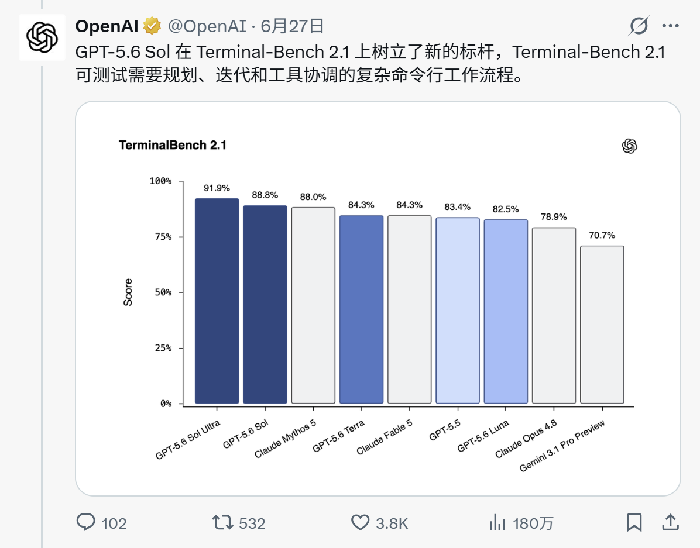
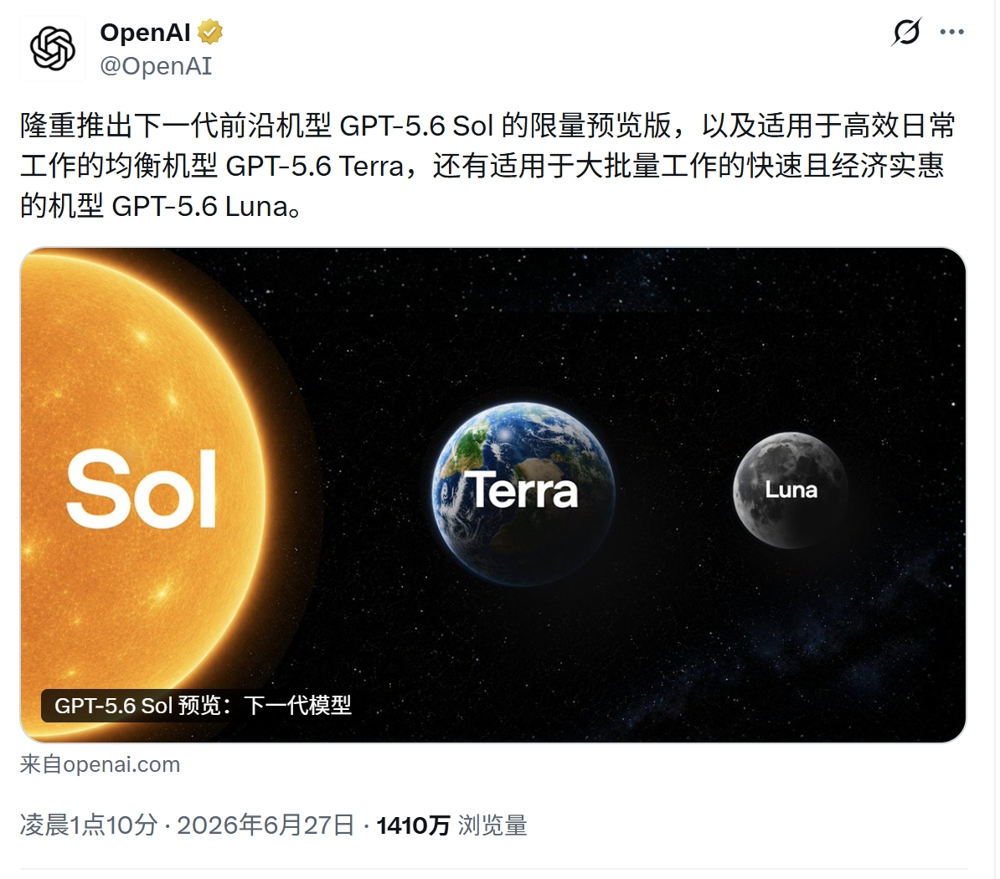
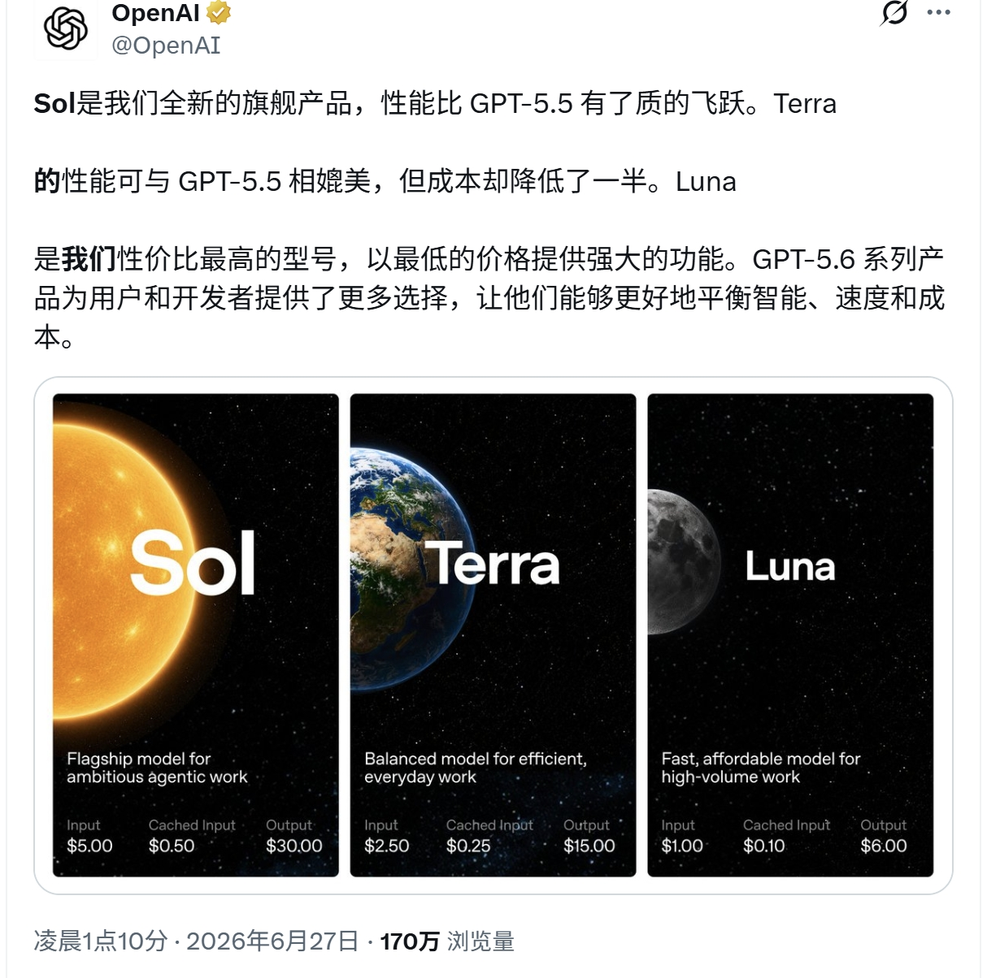
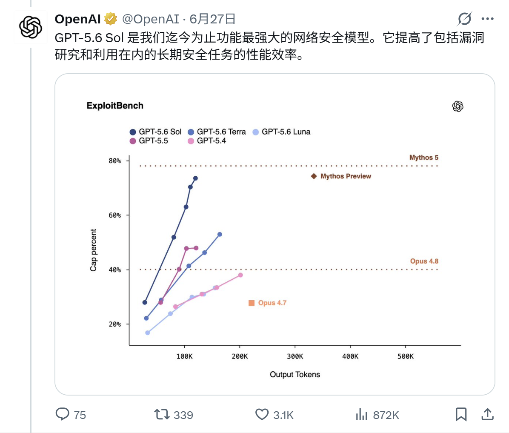

大家好，我是「山丘代码铺」。

这两天 OpenAI 预览 GPT-5.6，最先刷屏的是三个名字：

```text
Sol
Terra
Luna
```

太阳、地球、月亮。

说实话，第一眼看起来有点像一次命名升级。

但多看两张图，就会发现这次不是简单换个名字。

GPT-5.6 真正值得看的地方，是 OpenAI 没有只推一个“最强模型”，而是把同一代模型拆成了三种位置：

```text
Sol：往上拉能力上限
Terra：承接日常主力任务
Luna：处理高频、快速、低成本任务
```

先说一个现实情况。

这次 GPT-5.6 还是 limited preview。

按照 OpenAI 帮助中心的说法，预览阶段 GPT-5.6 Sol、Terra、Luna 通过 API 和 Codex 面向少量受信任伙伴和组织开放；ChatGPT 在预览阶段暂不包含 GPT-5.6，也没有公开申请入口。

所以这篇不是“马上怎么用”。

更像是先把这次发布看明白：它到底不是一次普通的模型迭代。

---

## 先看 Sol 这张图

如果只说“Sol 是最强模型”，其实没什么意思。

每次新模型发布，都会说自己更强。

更有意思的是它强在什么类型的任务上。

这次 OpenAI 特意提到 Terminal-Bench 2.1。



图里能看到：

```text
GPT-5.6 Sol Ultra：91.9%
GPT-5.6 Sol：88.8%
GPT-5.5：83.4%
GPT-5.6 Luna：82.5%
```

Terminal-Bench 不是那种单纯问知识点的榜。

它更接近命令行里的真实工作流。

比如一个 Agent 要修一个 bug，通常不是回答一句“你应该改这里”就结束。

它得先看项目结构。

再找相关文件。

再读错误日志。

改一版。

跑测试。

失败了还要继续判断下一步。

最后还得看 diff 有没有乱动别的东西。

这就是为什么这张图值得看。

Sol 的提升，不只是“它更会说”。

而是它更像能在复杂工程现场里多走几步。

这种能力，对代码 Agent、自动化排障、复杂工具调用，比普通聊天能力更重要。

官方还提到两个新词：`max` 和 `ultra`。

`max` 是给 Sol 更多时间做深度推理。

`ultra` 更进一步，不只是让一个模型慢慢想，而是通过 subagents 加速复杂工作。

这个方向挺关键。

因为很多难任务，本来就不是一次回答能解决的。

它更像一组小任务的协作。

这也是我觉得 GPT-5.6 有意思的地方：它不只是把单个模型变强，也在把“模型怎么干活”往更复杂的形态推。

---

## Terra 和 Luna 反而更接近真实流量

不过，真正做应用的人，不能只盯着 Sol。

因为生产环境里，最难的往往不是“有没有最强模型”。

而是：

```text
大量普通请求怎么处理？
成本怎么压住？
延迟怎么稳定？
哪些请求需要升级到更强模型？
```

这时候 Terra 和 Luna 的意义就出来了。



Terra 的定位是均衡。

它适合日常工作：文档理解、会议总结、知识库问答、普通代码辅助、结构化提取。

OpenAI 对 Terra 的说法是，性能接近 GPT-5.5，但成本大约降到一半。

这句话比“榜单第一”更工程。

因为大多数业务里，真正跑量的不是极限难题，而是中等难度任务。

Luna 则是最快、最省的档位。

它适合分类、摘要、批量改写、轻量提取、初步筛选。

有意思的是，截图里 Luna 在 Terminal-Bench 2.1 上也有 82.5%，离 GPT-5.5 的 83.4% 不远。

这说明低成本档不一定只是“能用但很弱”。

在一些任务上，它可能已经足够当第一层处理器。

也就是说，一个实际系统里，可能不是所有请求都上 Sol。

更合理的是：

```text
Luna 先接高频低风险请求
Terra 处理大部分日常任务
Sol 留给复杂、高价值、高风险任务
```

这就不是单纯换模型了。

这是模型路由。

---

## 价格表把这件事说得更明白

这张价格图也很直观。



按每 100 万 token 计费：

```text
GPT-5.6 Sol
输入：$5.00
输出：$30.00

GPT-5.6 Terra
输入：$2.50
输出：$15.00

GPT-5.6 Luna
输入：$1.00
输出：$6.00
```

这个价格梯度，其实就是产品定位。

Sol 贵，因为它负责上限。

Terra 砍一半，适合做主力。

Luna 再往下压，用来跑量。

很多时候，AI 应用不是被“模型不够强”卡住。

而是被“所有任务都用同一个模型”卡住。

简单任务用贵模型，成本扛不住。

复杂任务用便宜模型，效果兜不住。

中间任务没有主力档，系统就很难稳定。

所以 GPT-5.6 这次让我觉得有变化的地方，不只是 Sol 变强。

而是它把模型家族拆成了更适合工程分工的形态。

---

## 安全图也别只当安全图看

这次发布里，安全相关内容占了很大篇幅。

尤其是网络安全、漏洞研究、长链路任务。



这张图当然可以理解成：GPT-5.6 Sol 在安全任务上更强了。

但我更愿意从另一个角度看。

安全任务往往不是一次问答。

它需要读上下文、拆步骤、尝试、观察结果、继续调整。

这和代码 Agent、自动化排障、复杂研究任务很像。

所以这类能力的提升，其实也在说明：模型对长链路任务的处理更成熟了。

但另一面也很现实。

模型越能干，边界越要清楚。

尤其是涉及代码执行、安全测试、自动化操作时，系统不能只问：

```text
模型能不能做？
```

还要问：

```text
这个动作该不该自动做？
要不要人工确认？
日志留在哪里？
失败了怎么降级？
风险请求怎么审查？
```

能力上去以后，权限和审计也得跟上。

否则强模型不是生产力，而是新的风险入口。

---

## 写在最后

所以，GPT-5.6 这次我不会只把它看成“Sol 又多强”。

Sol 当然重要。

它代表上限。

特别是在命令行工作流、代码 Agent、安全长链路任务里，这种上限很有价值。

但 Terra 和 Luna 也同样重要。

因为真实系统不是只跑最难的 1% 请求。

更多时候，它要处理大量普通请求。

要控制成本。

要稳定延迟。

要把不同任务分给不同模型。

这才是 GPT-5.6 这次更值得看的地方：

> **模型正在从一个“默认入口”，变成一组可以分工的工程资源。**

以后做 AI 应用，问题可能不再只是：

```text
我该用哪个最强模型？
```

而是：

```text
这个任务应该走 Sol、Terra，还是 Luna？
```

这句话听起来没那么热闹。

但它更接近真实工程。

很多系统最后变强，不是因为所有请求都交给最贵的模型。

而是因为不同任务，终于被放到了合适的位置上。

---

资料来源：

- OpenAI：Previewing GPT-5.6 Sol: a next-generation model
- OpenAI Help Center：A preview of GPT-5.6 Sol, Terra, and Luna
- OpenAI：GPT-5.6 Preview System Card
