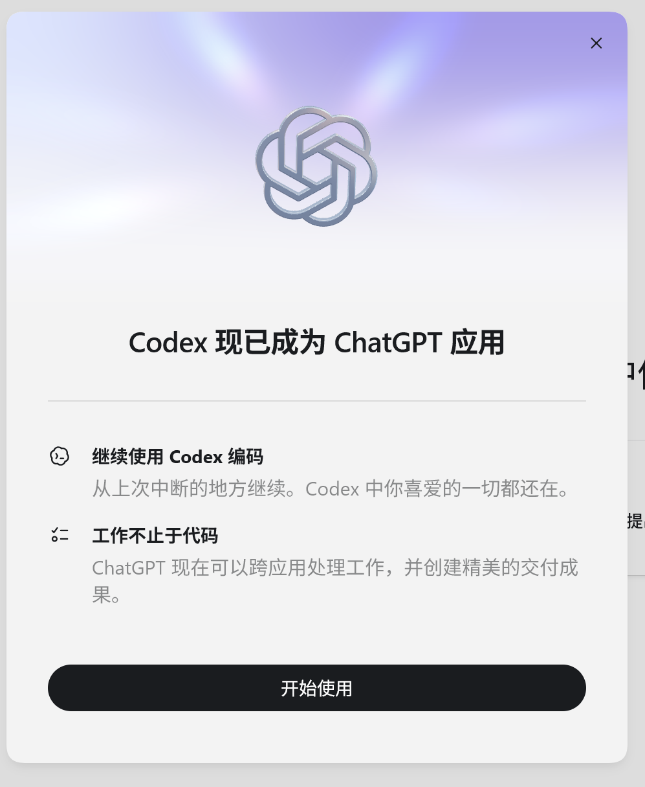
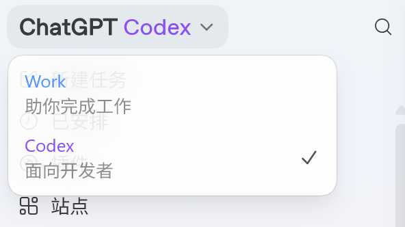
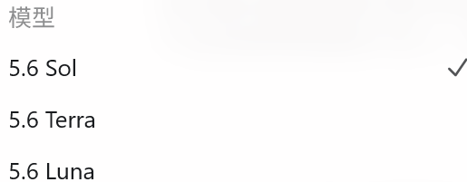
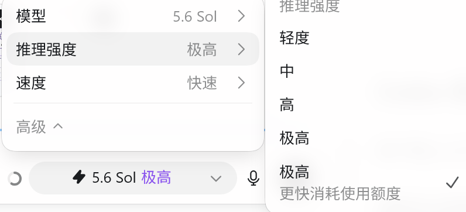

大家好，我是「山丘代码铺」。

今天打开 Codex，发现它没了。

原来熟悉的 Codex 窗口，更新之后直接变成了 ChatGPT。第一次看到这个界面时，我还以为应用被替换了。

随后弹出的提示写得很直接：

图：Codex 更新后出现的新版提示

**Codex 现已成为 ChatGPT 应用。**

再看了一遍官方更新才明白，Codex 并没有下线。OpenAI 是把原来的 Codex App 并进了新的 ChatGPT 桌面应用。

而且这次一起到来的，不只有应用合并。GPT-5.6 正式全面开放，Codex 自己补了几处新功能，ChatGPT 里也多了一个 Work 入口。

---

## Codex 没消失，只是软件换了名字

从 7 月 9 日开始，Codex App 正式并入新的 ChatGPT 桌面应用。原来的用户照常更新，就会看到现在这个界面。

但 Codex 的写代码流程没有被换掉。官方说得很明确：Codex 仍然保留独立的编程体验。

新版应用里可以看到三个入口：Chat、Work 和 Codex。

图：新版应用里的 Work 与 Codex 入口

Chat 还是平时聊天和整理想法的地方；Codex 继续负责代码、仓库和工程任务；Work 则用来处理文件、应用和需要连续执行多步的工作。

所以，如果原来主要使用 Codex，第一感觉很可能就是：软件改名了。打开项目、读取仓库、修改代码，还是在 Codex 页面里完成。它也可以继续设成应用启动后的默认页面，图标仍然能换回 Codex。

真正改变的是外面的这一层：以前分开的 ChatGPT 和 Codex，现在被放进了同一个桌面应用，旁边还多了 Work。

不过，入口合并不代表所有会话会自动共享完整上下文。切换到 Codex 后，仍然要确认当前项目、文件和背景是否已经提供。官方没有承诺这些内容会自动全部打通。

---

## GPT-5.6 也一起来了

同一天，GPT-5.6 结束限量预览，开始向 ChatGPT、Codex 和 OpenAI API 全面开放。

这次同时带来了 Sol、Terra 和 Luna。Sol 是旗舰档，Terra 面向日常工作，Luna 更快也更便宜。

图：GPT-5.6 Sol、Terra 和 Luna

先说明一下价格口径：下面写的是 2026 年 7 月的标准 API 价格，单位都是每 100 万 Token，分别看输入、缓存输入和输出。通过 ChatGPT 或 Codex 套餐使用时，并不会按这张 API 价目表逐条扣费。

| 模型 | 输入 | 缓存输入 | 输出 |
| --- | ---: | ---: | ---: |
| Sol | $5.00 | $0.50 | $30.00 |
| Terra | $2.50 | $0.25 | $15.00 |
| Luna | $1.00 | $0.10 | $6.00 |

表：GPT-5.6 标准 API 价格对比，单位为美元 / 100 万 Token

一眼看下来，Terra 的三项价格都是 Sol 的一半；Luna 的输入和输出价格只有 Sol 的五分之一。Sol 则与 GPT-5.5 保持同价。

### Sol：能力上限最高

Sol 是旗舰档。官方把它放在质量和推理深度优先的位置，适合复杂分析、代码、研究和高级工作流。

放进 Codex 里，它更适合跨多个仓库的改动、架构调整、难排查的 Bug、代码审查，以及需要长时间连续执行的任务。简单改个文案或调整格式，用 Sol 往往有些浪费。

### Terra：日常主力

Terra 是官方给出的日常默认档。它不是“能力砍半版 Sol”，而是在能力、速度和消耗之间做平衡。

日常写代码、普通调试、整理资料、修改页面、搜索代码库，通常都更适合 Terra。它也适合交给子 Agent 做扫描、检索和相对独立的工作，不必每个步骤都用最高档。

### Luna：速度和批量优先

Luna 主要解决速度与成本问题，适合轻量任务和大批量处理。

批量小改、格式清理、信息提取、分类、生成固定结构内容，或者让子 Agent 快速扫一遍文件，都更符合 Luna 的定位。遇到复杂重构、关键代码和需要深度推理的任务，它不该是第一选择。

在 Codex 套餐里，区别会体现在额度消耗上。官方给 Plus 用户的估算是：每 5 小时大约可发送 15～90 条 Sol 本地消息、20～110 条 Terra 消息，或 50～280 条 Luna 消息。这个范围会随着代码库大小、上下文、推理强度和工具调用变化，另外还可能有每周限制。

GPT-5.6 还增加了 `max` 和 `ultra`。`max` 是让模型多花时间探索和检查，`ultra` 则会让多个 Agent 并行推进任务。

图：GPT-5.6 Sol 可以调整推理强度

比三个模型名字更值得看的，是 GPT-5.6 开始专门补 Agent 长任务里的几个问题。

它增加了持久化推理，可以在多轮任务里继续利用前面的推理结果；Programmatic Tool Calling 可以让模型用代码组织多次工具调用；Multi-agent 则负责把适合拆分的工作并行推进。

这些能力放进 Codex，解决的都不是“回答得更像人”，而是怎样少忘一点上下文、少停下来等人接手，把一件复杂任务连续做下去。

---

## Codex 自己也更新了几处实用功能

除了换上 GPT-5.6，Codex 的操作体验也有变化。

现在可以直接在 Diff 里编辑。Codex 改完代码后，如果只是某一行不合适，可以自己顺手修正，不必再发一条指令让任务重新跑一遍。

PR 审查被放进了侧边栏。看改动、检查问题和继续修改，可以留在同一个应用里完成，少在浏览器、GitHub 和 Codex 之间来回切换。

一个项目现在还能连接多个仓库。真实需求经常同时涉及前端、后端和部署配置，以前可能要分别开任务、重复交代背景；现在可以把几个仓库放进同一个项目，让 Codex 看完整条改动链路。

Computer Use 之前已经存在，这次不是新增。真正更新的是速度，新版由 GPT-5.6 驱动。

比如修改网页后，Codex 可以打开实际页面复现问题、检查结果，再继续调整。相比只改源码，这种“改完自己看一遍”的过程更接近真实开发。

---

## 新出现的 Work

新版 ChatGPT 里最陌生的入口，应该就是 Work。它不是另一个 Codex，而是把类似的 Agent 工作方式搬到了代码之外。

Work 可以读取已经连接并授权的文件和应用，连续完成多个步骤，最后生成文档、表格、演示文稿或 Sites。

比如做一份月度经营分析，它可以把表格、邮件和 Slack 里的资料放在一起处理，再整理成分析文档和汇报 PPT。

这样再看 Chat、Work 和 Codex 的关系就比较清楚了：Chat 用来聊，Work 负责资料和交付，Codex 继续处理项目和代码。

---

## GPT-5.6 补的是 Agent 最容易断掉的地方

现在用 Codex，最让人头疼的往往不是它不会写代码，而是任务一长就容易断：改了后端忘了前端，打开浏览器却没有检查报错，做到一半偏离了最初要求，最后还得人重新接回来。

GPT-5.6 这次增加的持久化推理、工具调用和多 Agent，正好都指向这些问题。再配上更快的 Computer Use，Codex 才有机会在改完代码以后继续运行、检查和修正，而不是交出一个 Diff 就结束。

这才是这次更新真正有意思的地方。软件叫什么并不重要，重要的是模型能不能在一条长任务里保持上下文、调用工具、检查结果，并把前后步骤接起来。

> **如果这些能力能稳定落到真实项目里，Codex 的进步就不只是代码写得更快，而是更接近把一件工程任务从头到尾做完。**

---

资料来源：

- [OpenAI：GPT-5.6: Frontier intelligence that scales with your ambition](https://openai.com/index/gpt-5-6/)
- [OpenAI Developers：Using GPT-5.6](https://developers.openai.com/api/docs/guides/latest-model)
- [OpenAI API：Pricing](https://developers.openai.com/api/docs/pricing)
- [ChatGPT Learn：Codex Pricing](https://learn.chatgpt.com/docs/pricing)
- [OpenAI：ChatGPT is now a partner for your most ambitious work](https://openai.com/index/chatgpt-for-your-most-ambitious-work/)
- [ChatGPT Learn：What's new，July 6-10, 2026](https://learn.chatgpt.com/docs/whats-new)
