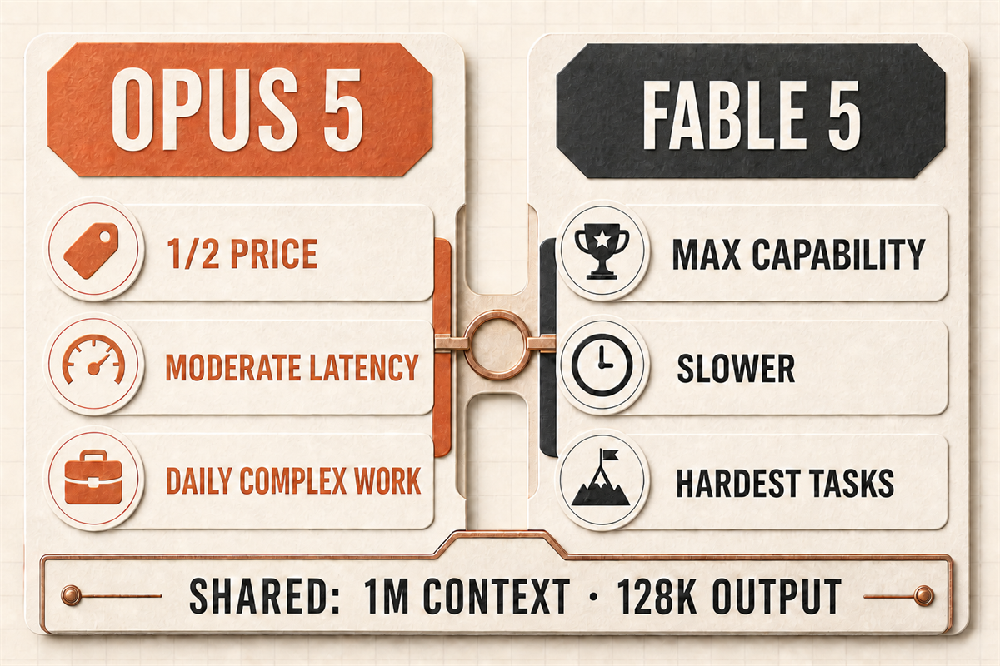

大家好，我是「山丘代码铺」。

Anthropic 在 7 月 24 日正式发布了 Claude Opus 5。

这次最值得看的，不是它比上一代 Opus 提升了多少。

真正有意思的是：Anthropic 直接把它放到了 Fable 5 旁边比较。

官方给 Opus 5 的定位是：

**智能水平接近 Fable 5，价格只有后者的一半。**

Fable 5 是 Anthropic 在 6 月发布的最高能力模型，专门处理最困难的推理和长时间 Agent 任务。它代表的是 Claude 当前公开模型的能力上限。

一个多月后，Opus 5 把这个上限往日常使用的价格区间拉近了一大截。

---

## 先看两款模型的位置

根据 Anthropic 的[模型说明](https://platform.claude.com/docs/en/about-claude/models/overview)，两款模型的基础规格是：

```text
                 Claude Opus 5       Claude Fable 5

输入价格         5 美元 / MTok        10 美元 / MTok
输出价格         25 美元 / MTok       50 美元 / MTok
上下文窗口       100 万 token         100 万 token
最大输出         12.8 万 token        12.8 万 token
相对延迟         中等                  较慢
官方定位         复杂编码与企业任务     最高难度推理与长程 Agent
```



图：Opus 5 更像日常复杂任务主力，Fable 5 负责最高能力上限

规格看起来很接近，价格刚好相差一倍。

所以 Opus 5 的问题不是“能不能超过旧 Opus”，而是：

**它用一半价格，拿到了 Fable 5 的多少能力？**

---

## 编码能力：只差不到 0.5%

在 CursorBench 3.2 上，Opus 5 开到最大 `effort` 后，和 Fable 5 的最高成绩相差不到 0.5%。

但完成每项任务的成本，只有 Fable 5 的一半。

这个结果很关键。

因为 CursorBench 测的不是单独写一个函数，而是模型在真实代码库里的表现，包括理解项目、修改文件、调用工具和完成任务。

至少在这项评测里，Opus 5 已经摸到了 Fable 5 的编码能力上限。

Anthropic 还给了另外两个结果：

- 在 Frontier-Bench v0.1 上，Opus 5 超过了参与比较的其他模型；
- 在 `high`、`xhigh` 和 `max` effort 下，Opus 5 的单位成本表现都优于其他参评模型。

这不代表 Opus 5 在所有编程任务上都等于 Fable 5。

但它说明，在相当一部分复杂编码任务里，Fable 5 多出来的那一倍价格，换到的已经不是一倍能力，而是最后几个百分点的上限。

---

## 计算机操作：三分之一成本超过 Fable 5

在 OSWorld 2.0 上，Opus 5 用略高于 Fable 5 三分之一的任务成本，就超过了 Fable 5 的最佳成绩。

OSWorld 测的是模型操作真实计算机界面的能力。

它不只需要看懂屏幕，还要连续点击、输入、切换页面，并根据界面变化调整下一步动作。

这类任务最容易暴露 Agent 的问题：

- 操作几步以后忘记目标；
- 页面变化后还在执行旧计划；
- 遇到意外状态就停住；
- 自以为完成了，却没有检查结果。

Opus 5 在这项评测里超过 Fable 5，说明它的提升不只是代码生成，而是“看界面、做操作、检查结果”这一整条执行链路。

官方公布的案例也能对应上这一点。

Opus 5 完成前端页面后，会分别用桌面和手机宽度打开页面，发现移动端产品被藏在首屏下面、结账按钮跑出屏幕，然后在交付前主动修掉。

这已经不是“会写前端”，而是会用浏览器验收自己的前端。

---

## 长任务：开始出现 Fable 5 的行为特征

Fable 5 最重要的定位，是最困难的推理和长时间 Agent 工作。

Opus 5 这次明显追上来的，也是这部分能力。

Anthropic 和早期客户给出的案例里，反复出现几种行为：

- 不只修表面症状，会继续寻找根因；
- 缺少验证条件时，自己补测试工具；
- 能在大型代码库里跨多个文件完成修改；
- 任务很长时，依然记得最初的目标和边界；
- 发现方案有问题时，会提出异议并给出替代方案。

Cursor 的早期评价说得很直接：Opus 5 不仅在成绩上接近 Fable 5，还表现出了许多相同的行为特征。

Devin 的测试则显示，它在困难调试和根因分析任务上尤其突出。

这才是“接近 Fable 5”更有价值的部分。

模型不只是偶尔答对一道难题，而是开始用更完整的方式处理复杂任务。

---

## Fable 5 仍然强在哪里？

Opus 5 并没有取代 Fable 5。

Anthropic 当前的模型选择建议仍然是：

- 复杂的 Agent 编码和企业任务，优先从 Opus 5 开始；
- 需要最高能力上限的工作，使用 Fable 5。

Fable 5 依然是 Anthropic 最强的公开模型，适合最困难的推理和最长周期的 Agent 工作。

在 CursorBench 3.2 的最高成绩上，它仍然略高于 Opus 5。

差别可以简单理解成：

```text
Fable 5：追求最高上限
Opus 5：用一半价格，拿到接近上限的能力
```

当任务难到最后几个百分点也会决定成败时，Fable 5 仍然有价值。

但大量以前必须上 Fable 5 才有把握的复杂编码、计算机操作和长任务，现在可能已经落进 Opus 5 的能力范围。

---

## 还有一个容易忽略的区别：数据保留

Fable 5 属于 Anthropic 的 Covered Model。

官方要求它保留 30 天数据，而且不支持零数据保留。

Opus 5 没有这项面向通用访问的模型级数据保留要求。

对普通体验者来说，这个区别没有跑分显眼。

但对企业代码、内部文档、财务分析和研究数据来说，它可能比 0.5% 的评测差距更重要。

模型选型从来不只看谁最强，还要看价格、延迟、数据规则和接入限制能不能进入真实生产环境。

---

## Opus 5 和 Fable 5 怎么选？

复杂编码、代码审查、前端开发、计算机操作和日常 Agent，优先用 Opus 5。它的相关评测已经接近甚至超过 Fable 5，价格只有一半，延迟也更低。

极难推理、超长周期开放式任务，或者内部评测证明 Opus 5 仍不能稳定通过时，再用 Fable 5。多花的一倍价格，买的是最难任务里最后一点能力上限。

如果业务严格要求零数据保留，Fable 5 不在候选范围内，因为它有模型级 30 天数据保留要求。

一句话：**大多数复杂任务用 Opus 5，必须追求最高上限的少数任务再上 Fable 5。**

---

## 官方还发布了 Opus 5 提示指南

Anthropic 随 Opus 5 一起发布了[专门的提示指南](https://platform.claude.com/docs/en/build-with-claude/prompt-engineering/prompting-claude-opus-5)。

不过官方没有要求用户重写提示词。

原有的 Opus 提示词可以直接使用。那份指南主要处理几个 Opus 5 的行为特点：

- 默认回答可能更长；
- 容易主动做较多验证；
- 窄任务里可能顺手扩大范围；
- 比以前更愿意调用子 Agent。

只有实际遇到这些问题时，再限制输出长度、任务边界或委派数量即可，不需要为了新模型重新发明一套提示词。

---

## Opus 5 真正改变了什么？

Opus 5 不是简单接替上一代。

它更像是 Anthropic 把 Fable 5 的一部分能力下放到了 Opus 价格档：

```text
价格只有 Fable 5 的一半
复杂编码成绩逼近 Fable 5
计算机操作的成本效率超过 Fable 5
具备更多 Fable 5 式的长任务和自我验证行为
延迟更低，也没有 Fable 5 的模型级 30 天数据保留要求
```

Fable 5 仍然守着最高能力上限。

Opus 5 真正抢走的，是原本只有最高价模型才能稳定处理的那部分日常复杂任务。

这可能才是它最有分量的升级。
