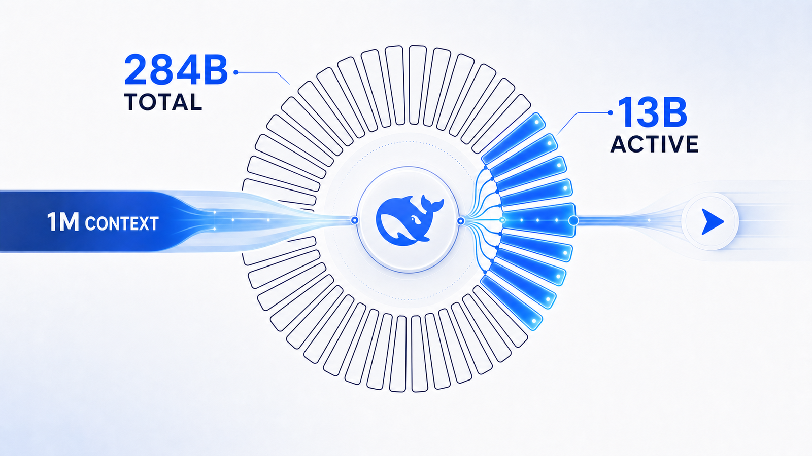
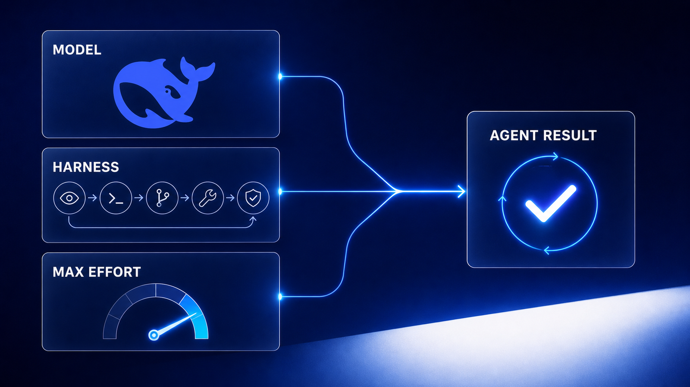

大家好，我是「山丘代码铺」。

7 月 31 日，DeepSeek-V4-Flash 正式版 API 开放公测。

如果只看名字，它很像 Preview 版的一次常规更新。但官方公布的结果完全不是“小修小补”：

**模型架构没变，参数规模没变，只重新做了后训练，Agent 成绩却集体跳了一大截。**

最夸张的是 DeepSWE，从 7.3 直接涨到 54.4；Terminal Bench 2.1 达到 82.7，已经接近 Claude Opus 4.8 的 85.0。

这次真正值得看的，不是 DeepSeek 又发了一个便宜模型，而是它证明了一件事：**Agent 的上限，不只取决于模型有多大，也取决于模型怎么训练、外面套着什么执行框架。**

---

## 先看它到底涨了多少

DeepSeek 的[官方模型卡](https://huggingface.co/deepseek-ai/DeepSeek-V4-Flash-0731)给出了正式版、Flash Preview 和 V4-Pro Preview 的同场成绩。

| 测试 | Flash Preview | Flash 正式版 | 提升 |
| --- | ---: | ---: | ---: |
| Terminal Bench 2.1 | 61.8 | 82.7 | +20.9 |
| NL2Repo | 39.4 | 54.2 | +14.8 |
| CyberGym | 38.7 | 76.7 | +38.0 |
| DeepSWE | 7.3 | 54.4 | +47.1 |
| Toolathlon Verified | 49.7 | 70.3 | +20.6 |

这几项测试有一个共同点：都不是“给一道题，模型回答一次”。

它们测的是模型能不能在终端、代码仓库和工具环境里连续工作：先理解目标，再拆解步骤，调用工具，读取结果，发现失败后调整方案，最后完成任务。

换句话说，这次提升最集中的地方不是聊天，也不是知识问答，而是**把事情做完**。

而且正式版不只是超过自己的 Preview。上面五项测试里，它也全部超过了参数规模更大的 V4-Pro Preview。

尤其是 DeepSWE，Flash 正式版 54.4，V4-Pro Preview 只有 12.8。小模型反超大模型，靠的显然不是多背了一点知识，而是整个 Agent 行为被重新训练了。

---

## 参数没变，变的是后训练

DeepSeek 在[官方更新日志](https://api-docs.deepseek.com/zh-cn/updates/)里写得很明确：DeepSeek-V4-Flash-0731 与 Preview 版保持相同的模型架构和规模，**只重新进行了后训练**。

它仍然是一款 MoE 模型：

- 总参数 284B；
- 每个 token 激活 13B 参数；
- 支持 1M 上下文；
- 权重采用 MIT 许可证开放。



图：284B 参数都在，但每个 token 只激活其中的 13B。

这些规格在 4 月就已经存在，7 月正式版并没有靠扩大模型解决问题。

所谓后训练，可以简单理解为：预训练让模型“会很多东西”，后训练决定它“遇到任务时怎么做”。

Agent 真正容易失败的地方，往往不是不会写代码，而是行为不稳定：

- 工具调用一次失败就停；
- 看到新结果后仍按旧计划执行；
- 修改了代码，却没有运行测试；
- 做到一半忘了最初目标；
- 自以为完成了，实际没有检查交付物。

这些结果至少说明，重新后训练显著改善了长链路行为。模型不仅要给出正确答案，还要在环境里持续观察、执行和纠错。

不过这里有一个必须说清楚的限制。

DeepSeek 的公开测试使用了尚未发布的 **DeepSeek Harness minimal mode**，并开启 `max` 推理强度，参数为 `temperature=1.0`、`top_p=0.95`。

所以这些涨幅不能全部简单归功于模型权重。它实际反映的是：

```text
重新后训练的模型
+ 更适合它的 Agent 执行框架
+ 更高的推理预算
= 最终跑分
```



图：Agent 跑分来自整套系统，不能只看模型权重。

在 Harness 开源、第三方完成复测之前，我们可以确认“这套系统明显变强了”，但还不能精确拆出模型和框架各自贡献了多少。

---

## 它真的逼近 Opus 4.8 了吗？

按 DeepSeek 自己公布的同框评测，答案是：**部分 Agent 任务已经很接近，但还没有全面追平。**

| 测试 | V4-Flash 正式版 | Opus 4.8 |
| --- | ---: | ---: |
| Terminal Bench 2.1 | 82.7 | 85.0 |
| DeepSWE | 54.4 | 58.0 |
| Agents' Last Exam | 25.2 | 25.7 |
| Toolathlon Verified | 70.3 | 76.2 |
| NL2Repo | 54.2 | 69.7 |

Terminal Bench 只差 2.3 分，DeepSWE 差 3.6 分，Agents' Last Exam 只差 0.5 分；但在 NL2Repo 上仍然差了 15.5 分。

所以“Agent 能力逼近 Opus 4.8”不是完全没依据，但更准确的说法应该是：**它已经进入同一张能力比较表，在部分任务上贴得很近，在仓库级生成等任务上仍有明显差距。**

而且这组 Opus 4.8 数据同样来自 DeepSeek 的评测，不是 Anthropic 或独立机构的结论。

独立测评方面，[Artificial Analysis](https://artificialanalysis.ai/models/deepseek-v4-flash) 给 DeepSeek-V4-Flash-0731 的 Intelligence Index 打了 50 分，在其同类模型比较中排第 3；V4-Pro 为 44 分。

这至少说明，正式版的提升不只存在于 DeepSeek 自己挑选的几项 Agent 测试里。但“全面达到 Opus 级别”，现在还说早了。

---

## 真正狠的是：这个能力卖得太便宜

DeepSeek 的[官方人民币价格](https://api-docs.deepseek.com/zh-cn/quick_start/pricing/)是：

```text
缓存命中输入：0.02 元 / 百万 token
普通输入：      1 元 / 百万 token
输出：          2 元 / 百万 token
```

同一页面上的 V4-Pro 是输入 3 元、输出 6 元。也就是说，Flash 正式版在多项 Agent 测试反超 Pro 的同时，常规输入和输出价格只有它的三分之一。

它还原生支持 Responses API，并由 DeepSeek 官方专门适配 Codex；上下文长度为 1M，最大输出可到 384K。对于需要反复读取代码、执行命令、回看日志的 Agent，这些不是附带参数，而是能不能跑长任务的基础条件。

这会改变模型路由最现实的一笔账。

过去，便宜模型虽然单个 token 便宜，但长任务中途失败、反复重跑，最后未必省钱。现在 V4-Flash 正式版开始跨过“能稳定完成一部分复杂 Agent 任务”的门槛，便宜才真正转化成了系统成本优势。

Artificial Analysis 的测试也暴露了另一面：V4-Flash 在其 Intelligence Index 中生成了约 2.1 亿输出 token，同类模型中位数约为 1 亿。它很便宜，但 `max` 模式并不节省 token。

所以它的优势不是“怎么跑都不要钱”，而是**即使愿意给它更大的推理预算，总成本仍然很低。**

---

## 这次更新最重要的信号

DeepSeek-V4-Flash 正式版最有分量的地方，不是某一项跑分超过了谁，而是这三个事实同时出现：

```text
模型架构和参数规模没有变化
Agent 成绩出现数十分的跃升
API 价格仍然只有 1 元输入、2 元输出
```

这说明 Agent 竞争正在从“谁的基础模型最大”，转向一整套系统能力的竞争：后训练怎么教模型使用工具，Harness 怎么组织执行循环，推理预算怎么分配，失败后怎么恢复。

284B 总参数、每次只激活 13B 的 Flash，靠重新后训练和专用 Agent 框架，已经把多项成绩推到 Opus 4.8 附近。

它还没有全面追平最强闭源模型，官方 Harness 也尚未公开，独立复测仍然不够多。

但有一件事已经很清楚：**以前必须交给昂贵旗舰模型的 Agent 任务，正在出现一个价格低得多的新执行层。**

这可能比又多一个“榜单前三”，更值得关注。

**Flash 都已经这么强了，接下来真正让人期待的，是 DeepSeek-V4-Pro 正式版还能把上限推到哪里。**
