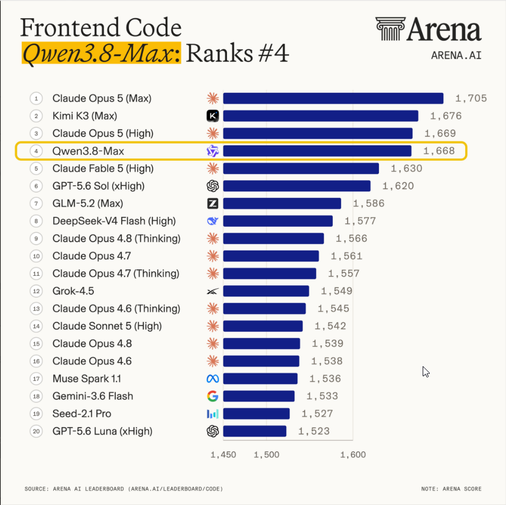
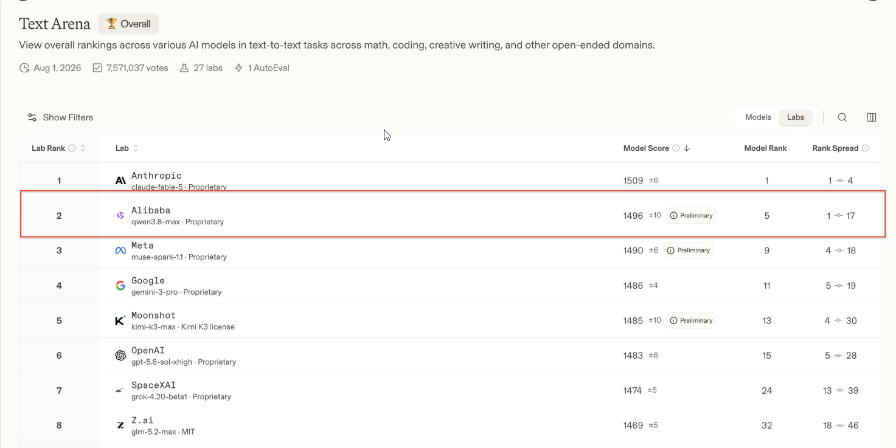

大家好，我是「山丘代码铺」。

事情是这样的。

前两天，DeepSeek-V4-Flash 刚把 Agent 能力和价格往前推了一截。

大家还没来得及消化，8 月 3 日，阿里又把 Qwen3.8-Max 端了上来。

乍一看，还是熟悉的大模型发布配方。2.4T 总参数，每次激活 95B，1M 上下文，再配上一整页密密麻麻的跑分。

不是哥们，现在看一次模型发布，越来越像在看上市公司的财报了。。。

但把 Qwen 官方发布、Arena.ai 的社区盲测和 Terminal-Bench 官网放在一起看，这次真正扎眼的，并不是 2.4T 这个大数字。

而是一件特别具体的事。

**Qwen3.8-Max 的前端编程，冲到了全球第 4。**

只比 Claude Opus 5 High 少 1 分。

这就有点东西了。

说实话，我还没有拿它跑过一个完整项目，所以这篇不装实测。咱们只聊目前能确认的官方信息和第三方结果，也顺便回答一个大家最关心的问题，Qwen3.8-Max 到底是什么水平。

## 编程已经冲进全球前四

先看 Arena.ai 公布的 Frontend Code 榜单。

Qwen3.8-Max 得到 1668 分，排名第 4。

它只比 Claude Opus 5 High 少 1 分，同时超过了 Claude Fable 5 High、GPT-5.6 Sol、DeepSeek-V4 Flash 和 Claude Opus 4.8。

很多朋友可能不知道，Frontend Code Arena 测的不是模型会不会做一道算法题，而是直接把需求丢给模型，看它能不能做出一个真正能看的前端页面。

页面好不好看，能不能用，最后交给真实用户盲选。

你想想看，这比单纯刷题更接近日常开发。真实需求很少会规规矩矩地告诉你该用什么算法，更多时候就是一句话，一个参考图，再加上一堆说不清楚的修改意见。

Qwen3.8-Max 能在这种榜单里排到第 4，而且和 Opus 5 High 只差 1 分，至少说明它的代码能力已经不是国产模型里不错，而是放到全球最强那一桌，也能坐得很稳。

Qwen 官方自己的 Agent 测试也涨得很猛。Terminal Bench 2.1 从 74.5 涨到 86.6，PaperBench 从 64.8 涨到 93.0，FrontierSWE 从 40.7 涨到 73.5。

这块需要注意一下。

这些数字是 Qwen 官方自测，适合用来观察 Qwen3.8-Max 相比上一代进步了多少，不能直接当成第三方盖章。尤其是 86.6 这个 Terminal Bench 2.1 成绩，截至我整理资料时，Terminal-Bench 官方榜单还没有 Qwen3.8-Max 的正式提交。

厂商自测和第三方榜单，还是得分开看。

不过代码变强，只是这次升级的一部分。

## 文本和视觉也在第一梯队

Qwen3.8-Max 的普通文本能力，也往前跨了一大步。

在 Arena 的 Text 榜单里，Qwen3.8-Max 得到 1496 分。阿里在实验室榜排第 2，Qwen3.8-Max 在单模型榜排第 5。

它比 Fable 5 低 13 分，又比 GPT-5.6 Sol xHigh 高 13 分。

文本这块其实不用讲得太复杂。写作、分析、数学和开放式问答，它已经进了头部，但目前还不是第 1。

而且 Text Arena 现在给它挂着 `Preliminary`，投票继续增加以后，名次还可能变化。

反倒是视觉成绩，挺让我意外。

Qwen3.8-Max 在 Vision Arena 拿到 1305 分，排第 2，只比第 1 名 Fable 5 High 低 13 分。

代码第 4，文本第 5，视觉第 2。

把这三项放在一起，Qwen3.8-Max 的位置就很清楚了。它不是所有能力全面第 1，也没有足够证据证明它已经整体超过 Opus 5、Fable 5 或 GPT-5.6 Sol。

但它已经稳稳坐进全球第一梯队。

编程和视觉尤其强，文本也没有偏科。

我自己的判断是，这比某一项刷到榜首更重要。因为一个真正拿来干活的 Agent，既要读懂人的要求，又要写代码、看屏幕、调工具。只练出一块肌肉，很难把完整任务接下来。

## Agent 开始连续干十几天

顺着这个再聊聊 Agent。

Qwen3.8-Max 这次最有意思的展示，不是某个分数涨了几分，而是它开始尝试连续工作十几天。

在 Qwen 官方的自动编程案例里，它从一个空文件夹开始开发 `oh-my-cli`。自己整理需求、领取 issue、写代码、跑测试、提交 PR，失败了再回来修改。

截至 7 月 30 日，这套流程已经自主运行大约 16 天，留下 265 次提交、127 个 PR 和 151 个 issue。完整过程现在还放在公开的 [GitHub 仓库](https://github.com/qwen-code-dev-bot/oh-my-cli)里，谁都可以去翻。

16 天。

不是问一句答一句，也不是写完一个函数就结束，而是在不断报错、改需求和重新尝试的过程中，始终记得自己要做什么。

这玩意真正难的地方就在这里。

一个项目跑上几百轮以后，前面任何一次错误都可能把后面带偏。模型不仅要聪明，还得能记住目标，发现自己走歪了，再想办法拽回来。

官方还展示了连续 500 多轮的芯片设计优化，以及模拟 365 天电商经营的任务。坦率的讲，这些都还是厂商自己组织的案例，不能证明普通用户现在也能稳定复现。

但方向很清楚。

大模型正在从给你一个答案，往连续把事情做完走。

办公和视觉 Agent 也是同一条线。Qwen 官方测试里，JobBench 从 31.3 涨到 53.4，Vision2Web 从 42.1 涨到 69.0。

这些测试不是让模型看一张图然后告诉你图里有什么，而是让它看懂屏幕，点击界面，填写内容，再根据操作后的画面继续判断。图片在这里不只是图片，而是 Agent 的眼睛。

当然，能看、能点、能写，并不等于它已经能代替一个团队。

说真的，我们还差得远。

16 天的自动编程很酷，但它能不能稳定复现，真实项目里要花多少钱，中途需要多少人工救场，这些都要等更多开发者真正用起来才知道。

这也是为什么我不太想把文章写成 Qwen3.8-Max 全面碾压。跑分可以证明它已经拿到了上桌的资格，却不能替你回答每一个具体项目好不好用。

## 开放权重，API 已经上线

回到普通开发者最实际的问题，这次还有两个变化。

一个是开放权重。

过去 Qwen 的 Max 模型主要通过 API 提供，Qwen3.8-Max 是第一个准备开放权重的 Max 级模型。Max 权重要等到下周，参数更小的 Qwen3.8-27B 也会一起开放。

不过 2.4T 总参数摆在那里，本地部署门槛不会低。对大多数个人开发者来说，27B 可能更实际，Max 还是更适合走云端 API 或大型算力集群。

另一个是接入门槛。

Qwen3.8-Max 的 API 已经上线，输入 2 美元每百万 token，输出 6 美元每百万 token，兼容 OpenAI Responses 和 Anthropic API，也能接入 Codex、Claude Code、Qwen Code。

它支持 `low`、`medium` 和 `xhigh` 三档推理强度，再加上 1M 上下文，可以一次处理更大的代码仓库和更长的任务记录。

看着很爽，但这里也别忘了，上下文越长，费用越高。真正拿它跑 Agent，历史消息、缓存和任务拆分还是得好好控制。不然模型没累，账单先给人干懵了。

写到这里，我突然想起很多年前大家聊国产手机。

最早总是在讲便宜，后来是屏幕、影像、快充，一块一块把自己的长板打出来。再后来，大家不再天天追问它像不像国外某一款，因为它已经有了自己的路线。

国产大模型现在也有点像这个阶段。

我们当然还不能因为一张榜单就宣布谁赢了。但过去大家更常说追上了、接近了、性价比不错，现在 Qwen、DeepSeek 这些模型已经开始在代码、Agent、多模态和成本上，一项一项拿出能跟全球头部正面对比的东西。

这才是我觉得最让人兴奋的地方。

开头说，DeepSeek-V4-Flash 刚把 Agent 能力和价格往前推了一截，Qwen3.8-Max 紧接着又把编程、文本、视觉和长程任务一起抬了上来。

一个刚发完，另一个又跟上。

前两天是 DeepSeek，现在是阿里 Qwen。

**国产大模型，真的越来越好了。**

文中数据主要参考 [Qwen3.8-Max 官方发布文章](https://qwen.ai/blog?id=qwen3.8)、[Qwen 官方发布帖](https://x.com/Alibaba_Qwen/status/2084100707423289643)、[Frontend Code Arena 排名](https://x.com/arena/status/2084108703729615026)、[Text Arena 排名](https://x.com/arena/status/2084108707814920644)、[Vision Arena 排名](https://x.com/arena/status/2084108711665270942)和 [Terminal-Bench 2.1 官方榜单](https://www.tbench.ai/leaderboard/terminal-bench/2.1)。
