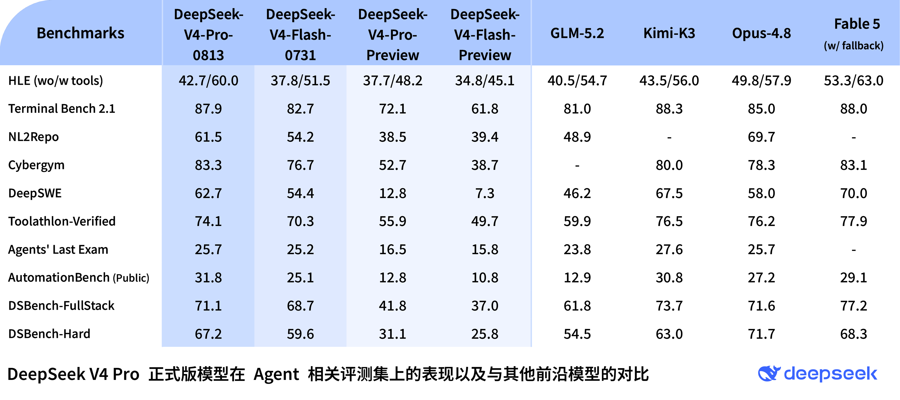
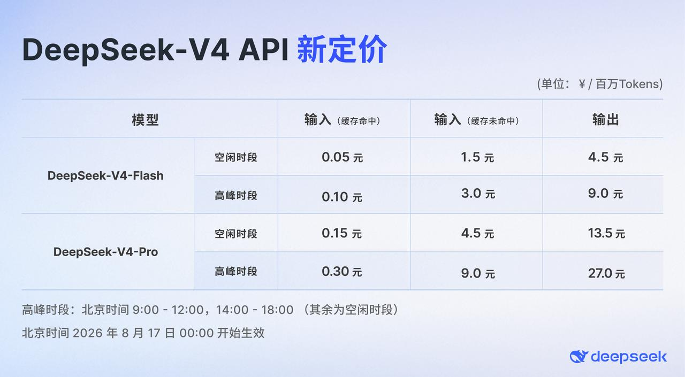

大家好，我是「山丘代码铺」。

半个月前写 DeepSeek-V4-Flash，我在结尾留了一个问题。Flash 已经这么强了，V4 Pro 正式版还能把上限推到哪里？

现在，答案来了。

DeepSeek-V4-Pro 正式版已经上线 App、网页端和 API。普通用户可以在 App 和网页端打开「专家模式」，开发者继续调用 `deepseek-v4-pro`，模型名没有变。

官方发布页没讲多少场面话，最显眼的就是一张 Agent 跑分表。

我把正式版、4 月的预览版和刚发布不久的 V4 Flash 对了一遍，第一反应是，前面那句期待没有落空。

DeepSWE 从 12.8 涨到 62.7。

Terminal Bench 2.1 从 72.1 涨到 87.9，NL2Repo 从 38.5 涨到 61.5，Cybergym 从 52.7 涨到 83.3。哪怕拿它跟 V4 Flash 正式版比，这几项也全部更高。

跑分看多了容易麻木，但 DeepSWE 这一项，我觉得还是值得多说两句。它让模型进入真实代码仓库，找到问题，修改代码，运行检查，再处理途中冒出来的错误。写出一段看起来像样的代码还不够，任务得真的往前走，最后还要通过验证。

预览版得到 12.8，正式版涨到 62.7。

同一项测试，差了将近 50 分。

说真的，这才是 V4 Pro 最该变强的地方。聊天时聪明一点，普通用户未必马上感觉得到。一个代码任务跑了几十步，模型少走弯路，也少重来几次，省下来的时间和调用费都很具体。

## 它已经到了什么水平

只跟自家旧版比还不够，放到全球模型里，才看得出这次 V4 Pro 到底有多少斤两。

DeepSeek 在同一张表里放进了 GLM-5.2、Kimi-K3、Opus 4.8 和 Fable 5。

V4 Pro 在 Terminal Bench 2.1 得到 87.9，Opus 4.8 是 85.0，Fable 5 是 88.0。三者几乎挨在一起。Cybergym 上，V4 Pro 是 83.3，Fable 5 是 83.1。AutomationBench 的 31.8，则是表中最高分。

另外几项还能看出差距。DeepSWE 上，V4 Pro 低于 Kimi-K3 的 67.5 和 Fable 5 的 70.0。NL2Repo 得到 61.5，Opus 4.8 是 69.7。工具调用版 HLE 得到 60.0，Fable 5 是 63.0。

把这些数字放在一起，V4 Pro 的位置已经很清楚。它在部分 Agent 任务上贴近 Fable 5，有些项目超过了 Opus 4.8，另外几项还落后几分到十来分。

能跟这些模型放在一张表里逐项比较，而且互有胜负，这就有点东西了。

上图来自 DeepSeek 官方发布页，V4 Pro 正式版、V4 Flash 和几款头部模型的 Agent 成绩都列在里面。

上面这张表来自 DeepSeek，测试也用了自家的 DeepSeek Harness 极简模式。推理强度开到 `max`，`top_p` 设为 0.95，`temperature` 设为 1.0。换一套 Agent 框架，结果可能会变。

好在这一次，Harness 不再停留在「即将发布」。DeepSeek 同一天放出了 Harness v0.1 开发者预览版，使用 MIT 许可证。

此前外面只能看到分数，没法看它怎么带着模型工作。现在代码已经开放，开发者终于可以自己复测，也可以看看那些工具、会话、沙箱和任务循环是怎样接在一起的。

独立评测也已经出来了。

Artificial Analysis 给 V4 Pro 0813 的 `max` 档打了 53 分。4 月版 V4 Pro 是 45 分，V4 Flash 正式版是 52 分。

53 分放在现在的榜单上，大概是什么位置呢？往上看，有 Opus 5、Fable 5、GPT-5.6 Sol、Grok 4.6 和 Kimi-K3。往下看，则是 GLM-5.2、GPT-5.6 Luna 和 Gemini 3.6 Flash。

所以这次可以兴奋，但还没到喊「全面碾压」的时候。它大致处在头部模型的第二排，离最前面的几款还有差距。

这份第三方结果测的是综合能力，不能替 DeepSeek 的 Agent 单项成绩盖章。它至少确认了一件事，V4 Pro 0813 相比 4 月版进步明显，整体水平也到了当前模型榜单的前排。

Artificial Analysis 测到的生成速度大约是每秒 83.2 token。模型支持 1M 上下文，最大输出 384K，目前只接收和输出文本。

这块也别看漏了。它不是多模态模型，需要看图片、看网页截图的任务，还得另找视觉模型配合。

## 价格变了，这一段要看清楚

V4 Pro 现在的 API 价格很低。每百万 token，缓存命中输入 0.025 元，普通输入 3 元，输出 6 元。

这个价格确实狠。

按 100 万输入、20 万输出算一次，不考虑缓存，目前大约花 4.2 元。

这套价格只持续到 8 月 16 日。

8 月 17 日零点以后，DeepSeek 会启用峰谷定价。北京时间 9 点到 12 点、14 点到 18 点属于高峰，其余时间属于闲时。

V4 Pro 闲时的普通输入变成每百万 token 4.5 元，输出 13.5 元。高峰输入 9 元，输出 27 元。刚才那个 100 万输入、20 万输出的任务，闲时约 7.2 元，高峰约 14.4 元。

这张新价格表同样来自 DeepSeek 官方，2026 年 8 月 17 日零点开始生效。

新价格比现在高了不少。所以别拿今天的 3 元输入和 6 元输出，直接去估以后跑 Agent 的账单。

新价格仍然不算高。Agent 任务还有一个特点，很多工作不用当场交付。代码扫描、批量测试和夜间回归可以排到闲时，同一份 token 用量，费用正好少一半。

你想想看，同一个任务，上午十点跑和晚上十点跑，价格差一倍。以后跑这类 Agent，除了选模型，还得看什么时候跑。

这个变化让我想起早些年的云服务器。大家起初只看一台机器每小时多少钱，后来才慢慢学会分时、排队和调度。Agent 任务跑得越久，模型价格里的时间差就越值得算。

## V4 这一代终于完整了

前几天 V4 Flash 发布时，大家惊讶的是，这么低的价格，居然也能把 Agent 跑到这个水平。它每次只激活 13B 参数，价格低，并发上限也高。

V4 Pro 现在把更难的那部分往前推了一截。复杂仓库、长时间调试和频繁调用工具的任务，需要模型在很多轮以后还能记得目标，也要在失败后继续处理。官方数据里，Pro 的优势主要出现在这些地方。

两款模型都支持 `low`、`high` 和 `max` 三档思考强度，也都原生支持 Responses API。DeepSeek 还给 Codex 做了一键配置脚本，Codex CLI、ChatGPT 桌面端和 VS Code 插件共用同一份配置。

模型、Agent 框架和接入方式，这次都摆出来了。剩下的问题要靠真实项目回答。长任务能不能稳定复现官方成绩，新价格下跑一次完整项目到底花多少钱，都需要开发者继续测。

说实话，我们还不能因为一张官方表格就宣布 V4 Pro 已经赢了。但它已经拿到了跟全球头部模型坐在一起比较的资格，这一点也不用含糊。

半个月前那句期待，现在有了答案。

Flash 把成本压了下来，Pro 确实把上限推高了。

**DeepSeek V4 这套牌，终于出齐了。**

文中数据参考 [DeepSeek-V4-Pro 官方发布页](https://api-docs.deepseek.com/zh-cn/news/news260813)、[DeepSeek API 更新日志](https://api-docs.deepseek.com/zh-cn/updates)、[DeepSeek 模型与价格页](https://api-docs.deepseek.com/zh-cn/quick_start/pricing)、[DeepSeek Codex 接入文档](https://api-docs.deepseek.com/zh-cn/quick_start/agent_integrations/codex)、[Artificial Analysis 独立评测](https://artificialanalysis.ai/models/deepseek-v4-pro)和 [AI HOT 事件汇总](https://aihot.virxact.com/story/4f717b32-d278-4c1a-9e48-e10cbfa1c741)。
