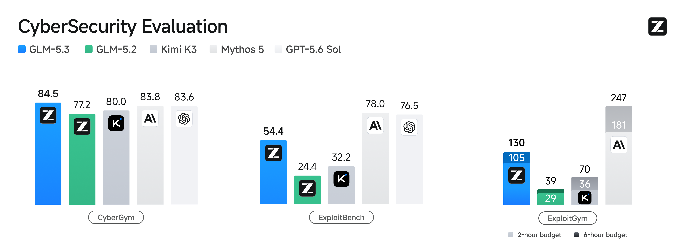
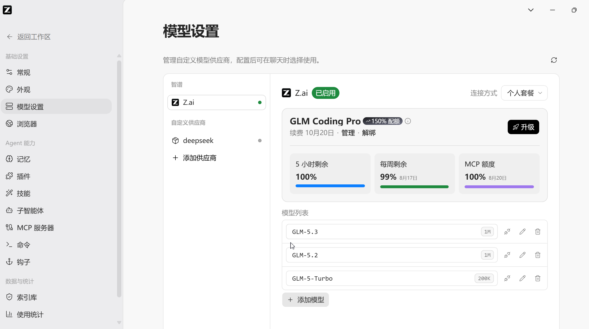

大家好，我是「山丘代码铺」。

昨天，DeepSeek-V4-Pro 正式版刚把 Agent 成绩推到第一梯队。

8 月 14 日下午，智谱紧接着发布了 GLM-5.3。

这两天的模型发布节奏，多少有点不给人喘气了。。。

我把智谱的技术博客、中文模型文档和评测说明对了一遍，最先记住的是一句很干脆的话。

GLM-5.3 沿用了 GLM-5.2 的基座，所有提升都来自后训练。

模型没重新做一套，智谱只在过去一个月里继续扩大长程任务环境，增加任务种类，也投入了更多后训练算力。官方给出的结果里，Z.ai Code Bench 的编程表现比 GLM-5.2 提升 50%，Terminal Bench 3.0 从 4.6 涨到 28.3，DeepSWE v1.1 从 46.2 涨到 66.9。

同一个基座，继续做一个月后训练，Agent 成绩能拉开这么大。

这件事很值得聊。

## 后训练到底做了什么

基础模型决定它大致会什么，后训练会反复塑造它接到任务以后怎样行动。

代码 Agent 最常见的失败，往往很具体。改了代码不跑测试，任务一长，又忘记前面已经确认的工程约束。单独看某一次回答，它写得挺像那么回事。把几十步连起来，问题就全冒出来了。

智谱这次重点扩大的，正是这种长程任务环境。

官方举了一个机器学习基础设施任务。模型拿到的工作环境里有计算集群、存储系统、内部文档和代码库。它需要找到训练栈里的性能瓶颈，改代码、跑实验，最后交付可以测出来的端到端加速，正确性还不能丢。

有些训练任务，工作量接近资深工程师连续做几天。

这跟刷一道编程题的差别很大。真实项目不会把问题切好再递到手里，Agent 得自己找到问题，推进修改，随后用运行结果判断下一步。中间走错了，还得回来。

为了批量造出这样的训练环境，智谱做了一套环境生成和验证流程。研究 Agent 从真实工作中整理任务模式，再把它们变成可以运行的长程环境。Judge Agent 会先尝试任务，确认题目确实有解。Verifier 在看不到参考答案的情况下检查结果，还要防住模型钻奖励规则的空子。

这块特别像我们平时做 Agent 工程。

模型负责执行，环境提供状态，Verifier 决定任务究竟有没有完成。只要最后一层含糊，模型很快就会学会交一份格式齐全、运行失败的作业。

智谱也承认，这套环境生成和验证流程仍然需要相当多的人工参与。距离全自动造任务、全自动判结果，还有不少工作要做。

GLM-5.3 的这次提升，来自让模型在训练阶段完成更多接近真实工作的可运行长程任务。

## 编程能力到了哪一档

先看公开测试。

Terminal Bench 2.1 上，GLM-5.3 得到 88.2。Kimi K3 是 88.3，DeepSeek-V4-Pro 0813 是 87.9，GPT-5.6 Sol 是 88.8。几款模型几乎挨在一起。

图表来自智谱 GLM-5.3 官方发布博客。

难度更高的 Terminal Bench 3.0，GLM-5.3 从上一代的 4.6 涨到 28.3。这个成绩高于 Kimi K3 的 17.4 和 Opus 4.8 的 21.1，低于 Fable 5 的 33.7 与 GPT-5.6 Sol 的 34.6。

按智谱的官方评测，GLM-5.3 在计划开放权重的模型中拿到了最高分。权重本身还要等两周才公开，发布当天并不能下载。

DeepSWE v1.1 上，GLM-5.3 得到 66.9，GLM-5.2 是 46.2。它跟 Kimi K3 的 67.5 已经非常接近，后面还有 Fable 5 的 69.7 和 GPT-5.6 Sol 的 72.7。

另外一些项目还能看到差距。NL2Repo 得到 58.0，低于 DeepSeek-V4-Pro 的 61.1 和 Opus 4.8 的 69.7。SWE-Marathon 得到 42.5，跟 GPT-5.6 Sol 相同，仍低于 Kimi K3 的 48.1 和 Opus 4.8 的 48.8。

把这些数字放在一起，GLM-5.3 的位置就比较清楚了。复杂编程和长程 Agent 进步很大，部分项目已经压过 Opus 4.8。它还没有在每一项上拿到第一，和最强的几款闭源模型也有几分到十来分的距离。

智谱还公布了一项内部测试 Z.ai Code Bench。GLM-5.3 在 Max 档用大约 7.5 万输出 token 得到 34.5%，GLM-5.2 用 9.6 万 token 得到 23.4%。成绩提高了，输出反而更短。

在按 token 计费的场景里，输出更短通常有利于降低调用成本。等待时间会不会缩短，还得看实际吞吐和调用轮数。

不过，Z.ai Code Bench 是智谱自己的私有测试，外面现在没法复现。公开基准里的成绩也来自智谱统一组织的评测。Terminal Bench 3.0 使用 Claude Code 2.1.207 作为 Harness，推理强度开到 Max，单次任务最多允许 600 轮，超时上限是 10 小时。

换一套 Harness，减少推理预算，结果都可能变化。

所以这张表能说明 GLM-5.3 在智谱给定的测试条件下进步很大。等开放平台按量 API 上线、权重公开以后，真实项目里的稳定性还得重新测。

## 安全能力涨得有点快

这次发布最意外的一块，是网络安全。

「涌现」两个字需要讲准。智谱明确在后训练里加入了漏洞发现数据和任务环境。出乎团队预期的部分，是能力随着训练规模上升得很快，模型还开始跨过多个阶段，组织更完整的漏洞利用计划。

白盒漏洞发现测试 CyberGym 上，GLM-5.3 得到 84.5%，高于 GLM-5.2 的 77.2，也略高于 Mythos 5 的 83.8 和 GPT-5.6 Sol 的 83.6。

到了更深的 ExploitBench，GLM-5.3 从 24.4% 涨到 54.4%，增幅超过一倍。差距也在这里显出来了，Mythos 5 是 78.0%，GPT-5.6 Sol 是 76.5%。

图表来自智谱 GLM-5.3 官方发布博客。

智谱自己的判断很克制。GLM-5.3 当前更擅长漏洞利用链前端，到了更深入的利用和完整攻防任务，闭源头部模型依然领先不少。

官方还披露了一组真实项目数据。从 GLM-5.2 开始，智谱与国内多支安全团队合作，让模型检查真实代码库。经过专家复核、筛选和去重，这套持续项目在 269 个项目中找到了 2436 个漏洞。官方技术博客称，其中 1097 个严重性达到中等或更高，最老的缺陷在 1981 年引入。

这组数据覆盖从 GLM-5.2 开始的多版本安全工作，不能全部记在 GLM-5.3 一款模型头上。发布当天，智谱安全披露台账显示 53 个漏洞已经公开，另外 2383 个仍在披露流程里，外界暂时无法逐项核验绝大部分结果。

安全能力越强，开放权重前的检查也越要认真。智谱计划在发布两周后公开 GLM-5.3 权重，前提是完成安全评估和加固。

## 今天能用，但还没完整开放

这里很容易看漏。

GLM-5.3 已经向 GLM Coding Plan 用户全量开放，也能在 ZCode 里使用。开放平台的按量 API 还没有上线，中文开发文档目前明确写着「即将上线」。按量 API 价格尚未公布，完整调用示例和模型体验中心会在上线后开放。

权重同样没有在今天放出，官方给出的时间是两周后。

模型规格已经公开。它只接收和输出文本，支持 1M 上下文，最大输出 128K。在 Coding Plan 里，常规模型标识是 `glm-5.3`，使用完整 1M 上下文需要切到 `glm-5.3[1m]`。

思考强度分为 `low`、`high` 和 `max` 三档，编码任务推荐 `max`。GLM-5.3 不再支持关闭思考，现有程序如果用了 `thinking.type` 为 `disabled`，以后迁移到开放平台按量 API 时需要先改配置，否则请求会直接失败。

所以今天这次发布，可以分成三步看。Coding Plan 和 ZCode 已经能用，开放平台按量 API 近期上线，模型权重等待两周。

截至这篇整理时，我还没有看到足够的独立复测。开放平台按量 API 尚未上线，权重也不在外面，现阶段最完整的数据仍然来自智谱。

我的判断是，GLM-5.3 已经值得认真看，最终水平还要等开发者拿它跑完真实项目。

同一套基座，智谱靠更接近真实工作的训练环境和更严格的验证，把 Agent 行为往前推了一大截。以后判断一个代码模型，得把训练环境一起看。那里有没有可运行的长程任务，结果能不能被可靠验证，会越来越重要。

想让 Agent 把事情做完，就得先让它在训练里，把整件事做过很多遍。

在 ZCode 里面已经可以爽瞪了。

API 很快上线，官方说还要再等等。

文中数据参考 [GLM-5.3 官方技术博客](https://z.ai/blog/glm-5.3)、[智谱 GLM-5.3 中文模型文档](https://docs.bigmodel.cn/cn/guide/models/text/glm-5.3)、[Coding Plan 模型切换文档](https://docs.bigmodel.cn/cn/coding-plan/latest-model)、[智谱安全披露台账](https://cvd.z.ai/)和 [AI HOT 事件条目](https://aihot.virxact.com/items/cmssir12d047oroffnpn5pcx1)。
