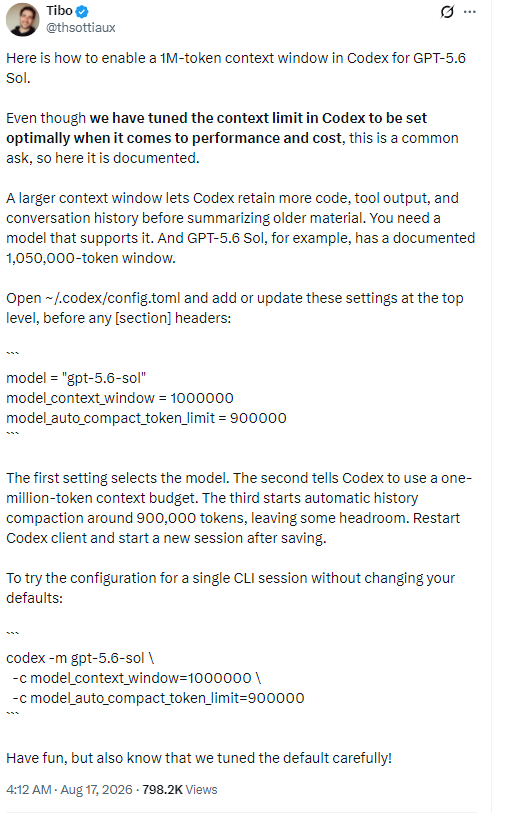

大家好，我是「山丘代码铺」。

今天凌晨四点十二分，Codex 老大哥 Tibo 在 X 上发了一条帖子。

内容很短，开头就一句话。

GPT-5.6 Sol 可以在 Codex 里开启 100 万 token 的上下文窗口。



Tibo 在 X 上公布 Codex 百万上下文配置方法

我看到的时候，这条帖子已经接近 80 万浏览了。

大家对这件事确实很感兴趣。

毕竟 Codex 干的活越来越长。它要读代码、看文档、接住终端输出，还要记住前面已经确认过的要求。任务做久以后，最让人难受的是它开始忘。代码可能会写，前面的约束却记不全了。

前面定好的边界丢了。

刚排查过的错误又查一遍。

聊到后面，它甚至会把已经否掉的方案重新捡回来。。。

上下文窗口变大，主要解决的就是这件事。Codex 在压缩旧内容以前，可以保留更多代码、工具输出和对话记录。

Tibo 还特意补了一句，Codex 现在的默认上下文限制已经在性能和成本之间做过仔细调整。100 万窗口是很多人的共同需求，所以团队把开启方法公开了。

这句话需要记住。

窗口越大，Codex 能带着走的材料越多，处理这些材料需要的计算也会增加。日常改一个小接口、修一个普通 Bug，默认值通常够用。大型代码库、长时间排查、需要连续跑很多轮工具的任务，更容易吃到长上下文的好处。

GPT-5.6 Sol 的官方模型页面标出了 1,050,000 token 的上下文窗口。Tibo 给出的配置没有把它全部用满，而是把 Codex 的上下文预算设为 1,000,000，并在 900,000 token 左右启动自动压缩，给后面的回复和系统处理留出余量。

三行配置分别管三件事。

`model` 选择 GPT-5.6 Sol。

`model_context_window` 把上下文预算设为 100 万。

`model_auto_compact_token_limit` 让 Codex 在 90 万左右开始整理历史内容，别一直顶到窗口边缘。

听起来有点技术，其实改起来非常简单。

## 方法一，自己修改配置文件

Codex 的用户级配置放在 `config.toml` 里。

macOS 和 Linux 默认路径通常是下面这个。

```text
~/.codex/config.toml
```

Windows 默认可以到这里找。

```text
%USERPROFILE%\.codex\config.toml
```

还有一种情况需要留意。如果电脑设置了 `CODEX_HOME` 环境变量，实际生效的文件一般在这里。

```text
$CODEX_HOME/config.toml
```

所以改之前最好先确认一下，自己打开的到底是不是当前 Codex 正在读取的那份文件。

找到文件以后，把下面三行放在最上层，位置要在任何 `[section]` 标题之前。

```toml
model = "gpt-5.6-sol"
model_context_window = 1000000
model_auto_compact_token_limit = 900000
```

如果文件里已经有这三个键，直接更新原来的值，别再复制一份。TOML 里出现重复的顶层键，可能会让配置解析失败。

保存以后，完全退出 Codex，再重新启动，并且新建一个任务。

已经打开的旧任务不会在中途突然扩容，这也是最容易漏掉的一步。

只想临时体验一次，不想改默认配置，也可以从命令行启动一个单独会话。

```text
codex -m gpt-5.6-sol -c model_context_window=1000000 -c model_auto_compact_token_limit=900000
```

这条命令只影响这一次 CLI 会话，关掉以后，原来的默认配置还在。

## 方法二，把这段提示词交给 AI

如果你不想找文件，也不想判断哪个配置正在生效，还有一个更省事的办法。

把下面这段话直接丢给 Codex。

```text
请帮我把当前 Codex 的用户级配置调整为 GPT-5.6 Sol 的百万上下文。

目标配置

model = "gpt-5.6-sol"
model_context_window = 1000000
model_auto_compact_token_limit = 900000

操作要求

1. 先检查 CODEX_HOME 和默认用户目录，定位当前实际生效的 config.toml，并告诉我文件路径。
2. 读取现有配置，只新增或更新上面三个顶层键。它们必须位于任何 [section] 标题之前。
3. 保留文件里的其他设置，不要重写整个配置文件，也不要修改项目级 .codex/config.toml。
4. 如果三个值已经完全相同，不要重复写入，只告诉我当前已经配置完成。
5. 修改后检查是否存在重复键，并验证三个最终值。
6. 最后提醒我重启 Codex，并新建一个任务。
```

这段提示词有两个关键点。

它会先找当前真正生效的配置文件，也会要求 AI 保留其他设置。这样可以避开两个常见坑，一个是改错文件，另一个是为了加三行配置，把原来的 MCP、权限和项目设置整份覆盖掉。

这里说的 AI，得有访问本机文件的能力。Codex、Claude Code 或其他已经连接到本地工作区的编码 Agent 都可以。普通网页里的 ChatGPT 看不到你电脑上的 `config.toml`，它最多告诉你怎么改，不能替你把文件改掉。

## 为什么开完以后可能显示 828K

我顺手看了一眼自己的 Codex。

配置文件里已经写着 100 万，任务里的背景信息窗口却显示总共 828K。


开启百万级配置后，当前任务显示 828K 有效额度

828K 当然不等于 1M。

`model_context_window = 1000000` 写的是模型上下文预算。Codex 界面显示的更像当前任务可以使用的有效额度，它还要给系统指令、工具定义、后续回复和自动压缩留位置。

OpenAI 官方配置参考确认了这两个配置项的作用，但没有公布一套固定的 `1M` 到 `828K` 换算公式。不同客户端版本、工具数量和任务环境，界面数字也可能不同。

所以开完以后看到 828K，不用立刻怀疑自己改失败了。先确认实际生效的 `config.toml`，再确认当前任务是不是重启以后新建的。两项都没问题，这个任务已经在使用百万级配置，只是界面没有把原始的 100 万照抄出来。

这块我建议说得克制一点。

我们可以说 Codex 开启了百万级上下文，不能说界面里 828K 严格等于 100 万。数字该是多少，就写多少。

## 到底要不要开

我自己的判断很简单。

经常让 Codex 跑长任务、读大型项目、连续调用很多工具，可以试试。它能更晚一点压缩历史，前面那些已经确认过的细节也更有机会留下来。

平时只做短任务，没有必要为了数字好看强行开启。Tibo 在原帖结尾又提醒了一次，官方认真调过默认值。

上下文更长解决的是能带多少材料。任务有没有说清楚，资料是不是干净，验收条件够不够明确，依然会决定最后做出来的东西靠不靠谱。

百万上下文很爽。

但它最有价值的地方，大概也不是让一个任务变得更长。

是让 Codex 做到很后面的时候，还记得我们一开始到底要它做什么。

文中配置参考 [OpenAI Codex 配置参考](https://learn.chatgpt.com/docs/config-file/config-reference)和 [GPT-5.6 Sol 官方模型页面](https://developers.openai.com/api/docs/models/gpt-5.6-sol)。Tibo 的 X 原帖内容与发布时间来自本文所附截图。
