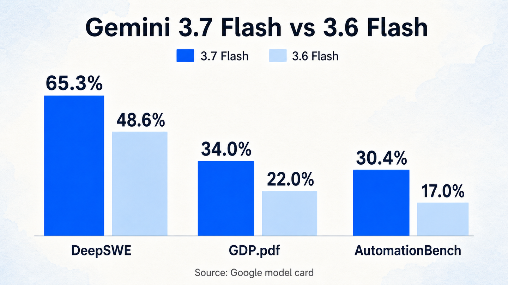
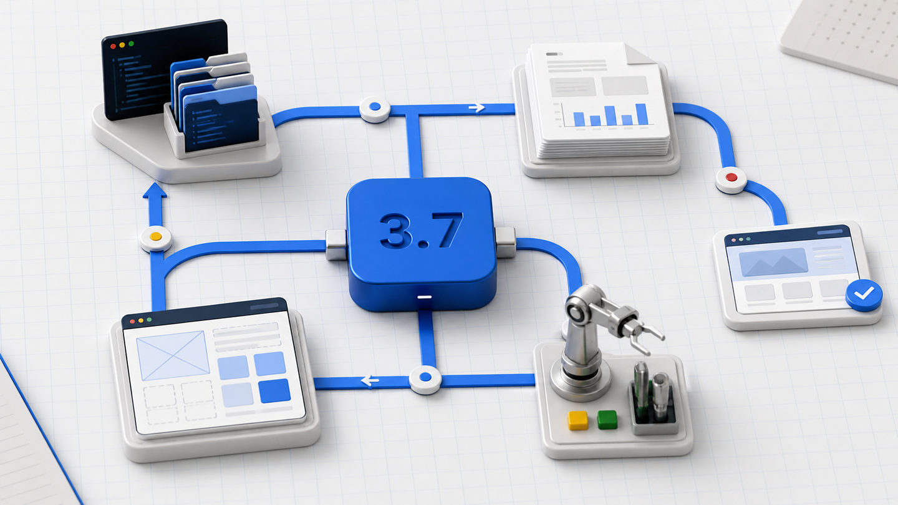
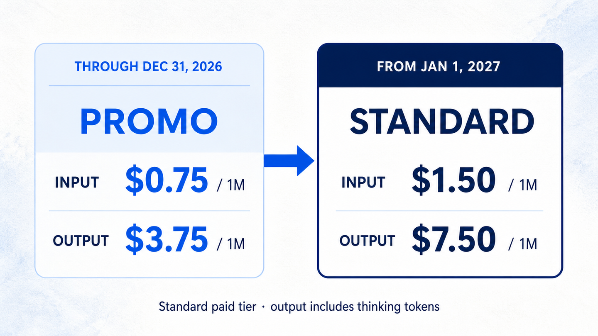

大家好，我是「山丘代码铺」。

8 月 14 日凌晨，Google 发布了 Gemini 3.7 Flash。

看到版本号的时候，我还回去确认了一遍。Gemini 3.6 Flash 在 7 月 21 日发布，两款模型只隔了 23 天。

Google 给出的变化还挺猛。编程、网页开发、复杂文档和企业工作流都涨了一截，年底前的 API 优惠价又正好降到上一代原价的一半。

Gemini API 标准付费层每百万 token，输入 0.75 美元，输出 3.75 美元。

我把 Google 官方发布页和 Artificial Analysis 的早期结果对了一遍。模型卡写明，3.7 Flash 基于 3.6 Flash，Google 则把这次进步归因于开发者反馈和算法改进。

至少这一次，模型更新已经快得很像软件发版。

## 这次到底涨了多少

先看编程。

Google 公布的 FrontierCode 1.1 Main 成绩里，Gemini 3.7 Flash 得到 43.6%，3.6 Flash 是 34.4%。DeepSWE v1.1 从 49.0% 涨到 65.3%。

这两项都在测更接近真实仓库的工作。模型得读代码、找问题、改文件，再把任务推进到验证通过。一次回答写得像样还不够，卡住以后能不能调整，工具调用失败以后能不能接着走，都会影响结果。

DeepSWE 三周大约涨了 16 到 18 个百分点，这个幅度很难当成小修小补略过去。

这里还有一点口径差异。Google 发布博客写的是 65.3% 对 49.0%，模型卡把上一代写成 48.6%，DeepSWE 的公开榜单目前则显示大约 65% 对 47%。任务版本或运行配置可能发生过变化，提升方向一致，小数点不适合当成不会变的绝对值。

网页开发也有提升。WebDev Arena 的 Elo 分数从 1538 涨到 1588。Google 的说法是，3.7 Flash 能用更少的提示生成更完整的应用，对截图、参考图和设计系统的遵循也更好。

再往知识工作看，GDP.pdf 从 22.0% 涨到 34.0%。这项测试会把复杂 PDF 交给模型，里面可能有长表格、图表和密集信息。AutomationBench 则从 17.0% 涨到 30.4%，它关注的是模型能不能把现实里的企业流程真正做完。

图：Gemini 3.7 Flash 与 3.6 Flash 的三项基准对比，数据来自 Google 模型卡。

这五组数字由 Google 官方材料公布或汇总，其中一部分来自第三方榜单，并非本文独立复测。测试条件和选择哪些结果，仍然掌握在 Google 手里。现阶段可以确认的是，3.7 Flash 在这些口径下比 3.6 Flash 进步明显。它能不能在不同 Agent 框架和真实代码库里稳定复现，还要看接下来的独立测试。

Artificial Analysis 已经给出一版早期结果。Gemini 3.7 Flash 的 high 档在 Intelligence Index 得到 56 分，3.6 Flash 是 52 分，同时进入了智能水平和单任务耗时的帕累托前沿。

它测到的生成速度大约是每秒 340 token。Google 模型卡列出的规格包括 1M 上下文和 64K 最大输出，支持文本、图片、音频、视频和 PDF 输入，输出为文本。

这个结果至少给官方数据补了一块外部参照。3.7 Flash 确实更强，而且 Flash 该有的速度还在。

## Google 想让 Flash 去做整件工作

Google 对 3.7 Flash 的定位，用了一个很有意思的词，workhorse。

干活的主力。

过去大家提到 Flash，先想到的通常是快和便宜。遇到更复杂的代码任务，很多团队还是会切到更贵的 Pro。3.7 这次继续往复杂工作流里挤，Google 在发布页反复提到几件事，碰到阻碍以后调整计划，需要时主动澄清意图，更认真地做多步规划和工具调用。

这些变化落到工程里，最后都指向两件很具体的事，少盯着它，少让它重来。

官方放了几个演示。一个简单提示可以生成可玩的 3D 游戏，Gemini 3.7 Flash 配合 Nano Banana，实时生成角色、物品和纹理。另一个演示把静态 PDF 变成交互式数据页面，图表和汇总结果一起生成。

还有一组玩法用了多个子 Agent。3.7 Flash 负责调度，Gemini Omni 生成视差组件，最后拼出一张可交互的落地页。机器人训练的案例则放进了三个 Agent 组成的循环，让模型用多模态信息帮助机器人更快学习。

图：3.7 Flash 连接代码、文档、网页与设备任务的 Agent 工作流示意。

演示当然挑的是顺利跑通的结果，不能直接当成生产环境的成功率。它们放在一起，还是能看出 Google 给 Flash 安排的新位置。任务会跨文件、跨工具，也可能跨模型，Flash 负责把这些步骤连起来。

这很像现在真实的 Agent 项目。最贵的模型不可能接住每一次调用。规划、读文件、调用工具、检查结果和失败重试会产生大量 token，团队需要一款速度够快、能力也够用的模型长期跑在主流程里。

Google 想抢的就是这个位置。

## 半价是限时促销，这段要算清楚

Gemini API 标准付费层的优惠价会持续到 2026 年 12 月 31 日。

每百万输入 token 0.75 美元，每百万输出 token 3.75 美元，输出价格包含 thinking token。到了 2027 年 1 月 1 日，价格会变成输入 1.50 美元，输出 7.50 美元。

图：Gemini API 标准付费层年内优惠价与 2027 年标准价，输出价格包含 thinking token。

这里有个很容易看错的细节。3.6 Flash 目前也在享受同一档促销价。从今天的 3.6 迁移到 3.7，单位 token 价格不会再降一半。Google 所说的半价，比较对象是 3.6 Flash 的原始发布价。

按 100 万输入、20 万计费输出 token 算一次，thinking 也包含在输出里，年底前大约是 1.50 美元。明年按新价格算，同样的 token 用量是 3 美元。

所以这次的「价格减半」有明确期限。现在拿优惠价估全年成本，明年预算很容易少算一半。

不过，Google 把更强的版本放进同一档促销价，还是很有杀伤力。Agent 任务会反复读上下文，工具日志也会越积越长。模型少重试一次，人会少等一轮，也会少付那一轮输入和输出的钱。

能力上涨，年内促销价又压在 3.6 的原始发布价一半，开发者便有空间把更多步骤交给模型。以前舍不得开的子 Agent，可以多跑一轮。以前只抽样检查的文件，也可以扩大范围。

当然，省下来的钱也可能被更多调用很快吃掉。。。Agent 越能干，人就越容易顺手再塞几个任务进去。

这块做过云服务的朋友应该很熟。单价下降以后，账单不会自动下降，调用方式也会跟着变。最后还得算一个完整任务做完花多少钱。

## 今天已经能用，但真实项目还要再测

Gemini API 已经提供稳定型号 `gemini-3.7-flash`，Google Cloud 模型页把它列为 GA。开发者可以在 Google AI Studio、Antigravity 和 Android Studio 里使用。

它支持 Function Calling 和搜索，Computer Use 目前还是 Preview。thinking 可以选 `low`、`medium` 和 `high`，传入 `minimal` 会触发参数校验错误。

企业用户可以从 Gemini Enterprise Agent Platform 和 Gemini Enterprise 应用接入。个人用户这边，Google AI Pro 和 Ultra 订阅者可以通过 Gemini App 里的 Spark 使用，官方称覆盖 160 多个国家和地区。

Spark 是 Google 放在 Gemini App 里的个人 Agent，会调用 Gmail、Google 文档等 Workspace 工具完成多步骤任务。3.7 Flash 从发布当天开始接管这部分工作，Google 特别强调了 Workspace 工具调用、复杂任务准确率和输出质量的提升。

模型卡把知识截止时间列为 2026 年 3 月，同时提醒部分领域可能只到 2025 年 1 月。它也承认模型可能产生幻觉，偶尔会变慢或超时。需要最新资料的任务，搜索和检索仍然得接上。

截至写稿，我还没有拿 3.7 Flash 跑过完整代码仓库。外面的独立结果也刚开始出现，长任务稳定性、工具调用失败率和真实账单都缺少足够样本。

现有证据能确认它比 3.6 Flash 进步明显，还不足以证明它全面超过某款旗舰模型。

我的判断是，Gemini 3.7 Flash 抢的是生产环境里的默认席位。那里要看能力，也要看速度和一个完整任务究竟花多少钱。

3.7 Flash 和 3.6 Flash 只隔了 23 天。后面的版本会不会一直这么快，现在没人知道。开发者的模型选型，也会跟着变成一项需要持续维护的工作。

文中数据参考 [Google Gemini 3.7 Flash 官方发布页](https://blog.google/innovation-and-ai/models-and-research/gemini-models/introducing-gemini-3-7-flash/)、[Gemini API 模型专页](https://ai.google.dev/gemini-api/docs/models/gemini-3.7-flash?hl=en)、[Gemini API 定价页](https://ai.google.dev/gemini-api/docs/pricing?hl=en)、[Gemini 3.7 Flash 模型卡](https://deepmind.google/models/model-cards/gemini-3-7-flash)、[DeepSWE 公开榜单](https://deepswe.datacurve.ai/)、[Artificial Analysis 独立评测](https://artificialanalysis.ai/models/gemini-3-7-flash)和 [AI HOT 事件汇总](https://aihot.virxact.com/story/2dc37050-6375-45a7-8668-26d97fc0c333)。
