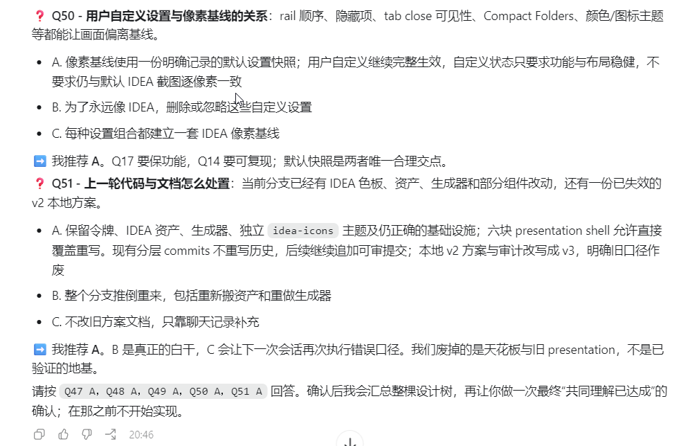
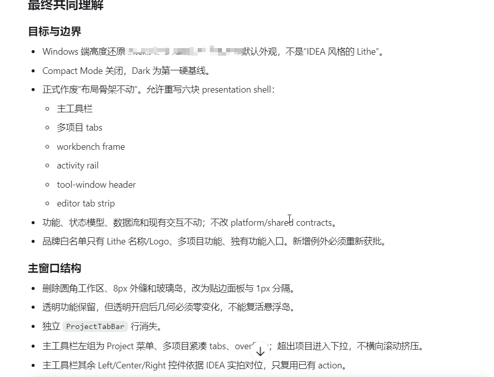

大家好，我是「山丘代码铺」。

最近我在帮忙做一个开源项目，叫 [Lithe IDEA](https://github.com/1lck/Lithe-IDEA)。

它是一款面向 AI 时代的轻量 IDE。项目希望工具和服务按需启动，让工作区一直保持轻快，也方便开发者检查、运行和审查 AI 改过的代码。

我最近主要在帮忙打磨它的 UI。

原因也很直接。

很多后端开发常年用 IntelliJ IDEA，操作习惯已经长在手上了。可 IDEA 确实越来越重，内存、索引和一大堆插件叠在一起，机器配置稍微差一点，风扇先开始工作。

Lithe 想轻一点。

可用户从 IDEA 转过来，不能连熟悉的工作方式也一起丢掉。所以这次做界面，我希望它在布局、工具栏、项目切换和窗口结构上尽量贴近 IDEA，让迁移过程舒服一点。

一开始，我没有使用 `grill-me`。

我直接把 IDEA 的界面、目标和一些参考资料交给 Codex，让它照着做。

结果很差劲。

单独看每个组件，好像都有点 IDEA 的样子。放到一起，哪里都不顺。按钮在，侧栏也在，标签页也做了，可我自己看着就觉得不对。

这种不对又很难用一句提示词讲清楚。

你说再像 IDEA 一点，AI 可能继续抄颜色和间距。你说做得更舒服，它又会主动加一堆自认为舒服的设计。改来改去，页面越来越满，产品该有的使用感觉反而没出来。

后来我把 `grill-me` Skill 调了出来。

然后，Codex 开始问问题。

一轮。

又一轮。

问到后面，我看了一眼编号，已经到 Q50、Q51 了。。。



问到 Q50、Q51 时，Codex 仍然没有开始实施

它会问，自定义设置和 IDEA 像素基线发生冲突时，应该保留用户设置，还是为了还原 IDEA 直接忽略。

它会问，当前分支已经有一部分 IDEA 资源和组件改动，上一版失败方案也留着，接下来应该保留哪些基础设施，哪些方案要明确作废。

它每次都给几个选择，也会给出推荐答案。可最后拍板的人还是我。

Q50、Q51 回答完以后，它没有马上开始改代码。

它先把前面五十多个问题收成了一份「最终共同理解」。

里面写清了目标和边界，也把主窗口结构、工具栏、项目标签、activity rail、editor tab strip 这些组件逐项定下来。界面层能改到哪里，功能和数据流哪些不能动，都有明确答案。上一版失败方案也被正式作废。



五十多个问题最终收敛成一份共同理解

看到这份东西的时候，我第一次有了一种很强的参与感。

前一版更像我在远处给 AI 下装修指令，它自己理解，自己画，自己改。

这一次，我要一遍遍回答，一个 IDEA 用户会怎么看这个 rail，多个项目的 tab 应该怎样排列，自定义设置能不能偏离默认像素基线，透明面板打开以后几何结构要不要跟着变化。

问到后面，我开始按每天使用它的方式判断每个按钮和间距，参考截图反而退到了后面。

我感觉自己既在参与开发，也真的在用这个产品。这个体验很奇妙。

## 它为什么会有用

我后来又把 `grill-me` 的 `SKILL.md` 打开看了一遍。整个文件只有 1.8KB，做法却非常明确。

它会把一个想法拆成一棵决策树。树根是最上游的选择，下面每根树枝挂着依赖这个选择的问题。

当前已经具备前置条件的问题，叫作 `frontier`。

每一轮，它会把当前 frontier 一次问完。问题带编号，也会给推荐答案。你答完以后，决策树继续向下展开，下一批问题才会出现。

依赖关系还没确定的问题，不会提前混进来。

拿 Lithe 这次改版来说，主窗口结构没定以前，讨论某个图标应该放左边还是右边，价值很低。等结构和交互基线定下来，图标位置才有了判断依据。

这和苏格拉底式追问有点像。

AI 暂时忍住了马上交付答案的冲动。它通过连续提问，逼着我把脑子里那些模糊的感受说出来。与此同时，这些答案也会约束 AI，让它动手前先把目的、边界和依赖关系想清楚。

Skill 里还有一句我很喜欢的话。

事实由 Agent 负责，决定由用户负责。

代码库里有什么组件，旧方案改过哪些文件，哪份文档已经失效，这些事实 Codex 自己去查。

像素还原和用户自定义发生冲突时选哪边，哪些体验必须保留，什么结果才算做对，这些取舍由我回答。

两类问题分开以后，我不会被版本号和文件路径反复打断，Codex 也不会偷偷替我决定产品方向。

它还有最后一道刹车。

只要决策树没有走完，双方没有确认已经形成共同理解，它就不会开始实施。

五十多个问题确实有点磨人。

可跟着错误方向做完一整版 UI，再从头推倒相比，这点时间很值。

## 最简单的安装方法

安装比我一开始想的还简单。`grilling` 的原文件就在 [mattpocock/skills](https://github.com/mattpocock/skills/tree/main/skills/productivity/grilling) 仓库里。

把下面这句话交给有本机文件权限的 Codex、Claude Code 或其他 Agent。

```text
请从下面这个 GitHub 仓库路径安装 grilling Skill，并放到当前 Codex 的用户级 Skill 目录。安装完成后检查 SKILL.md 是否完整，告诉我最终安装路径，并提醒我新建一个任务再使用。

https://github.com/mattpocock/skills/tree/main/skills/productivity/grilling
```

就完事了。Agent 会读取仓库里的原始文件，定位当前 Skill 目录并完成安装。这样也不会因为不同 Agent 临时改写规则，装出几个行为不一样的版本。

OpenAI 官方文档把 Skill 定义为一套可重复使用的工作流。名字和描述帮助 ChatGPT、Codex 判断它在什么任务里适用。请求和用途匹配时，产品可以自动选择，Codex 也支持用 `$` 明确点名。

## 怎么用

新建一个 Codex 任务，输入 `$grilling`，再把你的需求说清楚就行。

我这次的提示词，大意可以写成这样。

```text
$grilling

我正在给 Lithe IDEA 打磨 Windows 端主界面，希望从 IntelliJ IDEA 迁移过来的用户更顺手。

请先阅读代码、现有文档和界面资源，把这个 UI 改造拆成决策树。事实你自己查，需要我取舍的问题逐轮问我，每题给出推荐答案。

在所有 frontier 清空、你汇总最终共同理解、我明确确认以前，不要开始修改代码。
```

接下来它就会开始罗列第一轮问题。

你回答这一轮，它再根据答案继续问下一轮。需要调整推荐答案也没关系，决定本来就应该由你来做。

不想记 `$grilling`，自然语言也能触发。

```text
别顺着我，狠狠盘问这个方案。
把没有说清楚的假设全部找出来。
事实你自己查，需要取舍的地方逐轮问我。
在形成最终共同理解以前不要动手。
```

## 什么时候值得用

我现在会强烈推荐把它放在大改版、大功能和新产品的前面。

项目越复杂，返工代价越高，这种追问越值钱。产品设计、系统架构、课程规划和长期内容系列也都适合。

任务已经很明确时，它会显得重。

改一个错别字、调整一个字段、修复能稳定复现的 Bug，直接给目标和验收条件就够了。为了这些事情再回答五十个问题，多少有点折磨自己。

`grill-me` 也不会替你逃掉决定。

它会查事实，会给推荐答案。走到分叉口，选哪条路仍然得你自己说。

我现在愿意推荐它，就是因为自己真用过，而且第一次用就问到了五十多题。

这五十多题没有让我觉得 AI 在拖延。它让我第一次真切地感觉到，我在以一个用户的身份参与产品开发。

如果你对轻量 IDE、IDEA 风格工作流，或者 AI 改完代码以后怎样检查和运行感兴趣，可以看看 [Lithe IDEA](https://github.com/1lck/Lithe-IDEA)。

截至 2026 年 8 月 19 日，项目有 340 个 Star、47 个 Fork。macOS 版本已经可以下载，Windows 版还在发布前验证。

欢迎来试，也欢迎给项目点个 Star。发现问题可以提 Issue，想一起做也可以交 PR。

一个好问题，不会替你完成产品。

它能让人和 AI 在动手以前，终于开始做同一道题。

文中 `grill-me` 的行为来自 [mattpocock/skills 中的 grilling Skill](https://github.com/mattpocock/skills/tree/main/skills/productivity/grilling)，Skills 机制参考 [OpenAI Skills 与 Plugins 官方说明](https://learn.chatgpt.com/docs/skills-and-plugins)，Lithe 项目信息参考 [Lithe IDEA GitHub 仓库](https://github.com/1lck/Lithe-IDEA)。
