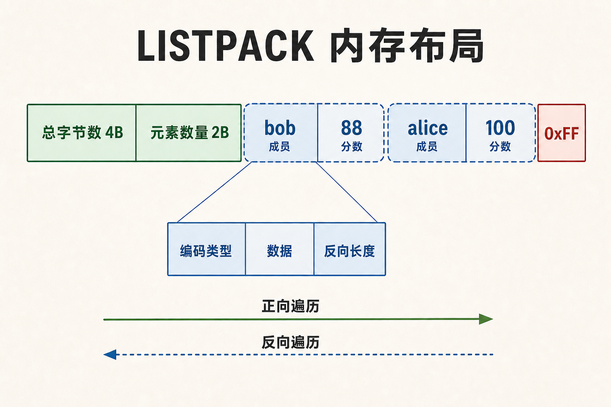

大家好，我是「山丘代码铺」。

今天在复习 Redis 八股的时候，发现 ZSet 的压缩列表在 Redis 7.0 被废弃了。

更准确一点，ZSet 本身当然还在，换掉的是小 ZSet 使用的 `ziplist` 内部编码。

以前那道八股题通常会说，ZSet 在元素较少时使用压缩列表，元素多了以后再转成跳表加哈希表。到了 Redis 7.0，答案里需要改一个词，`ziplist` 换成了 `listpack`。

八股背到这里并不难。`ziplist` 划掉，旁边写上 `listpack`，这道题似乎就结束了。

可我盯着这个新名字看了一会儿，脑子里还是没有画面。

这个 listpack 到底长什么样？

ZSet 的 member 和 score 在里面怎么放？它和 ziplist 都是一段连续内存，Redis 为什么还要把旧结构换掉？

我顺着 Redis 7 发布说明、`t_zset.c` 和 2017 年的 listpack 设计规范查了一遍。listpack 没有引入什么高深算法，它做的事很朴素。

把一小批数据挤在一起，少申请几次内存，少存几个指针。ziplist 最麻烦的级联更新，也在这次重做里被拿掉了。

先把它的身份说清楚。

listpack 是 Redis 的内部编码，应用侧没有一条命令能直接创建它。我们创建的是 Hash、List、Set、ZSet 或 Stream，Redis 再根据数据规模选择内部怎么存。`OBJECT ENCODING` 能让我们看见这个选择。

## 一段连续内存，挨个往里放

listpack 可以看成一段连续的字节数组。

它的整体布局很短。

```text
[total-bytes 4B][num-elements 2B][entry 1]...[entry N][0xFF]
```

开头六个字节是固定头部。前四个字节记录整个 listpack 占了多少空间，后两个字节记录元素数量。末尾的 `0xFF` 表示到头了。

中间每个 entry 又分成三块。

```text
[encoding][data][backlen]
```

`encoding` 告诉 Redis 里面是字符串还是整数，也顺手带上一部分长度信息。`data` 放数据本身。`backlen` 记住当前 entry 前面两部分有多长，Redis 从尾部往前读时，就知道该往回跳多少字节。

这里有个很能体现 Redis 性格的小设计。

一个数只要能按整数存，listpack 就不会老老实实留下那串字符。`0` 到 `127` 甚至可以直接塞进一个编码字节里。更大的整数再按 13 位、16 位、24 位、32 位或 64 位选择合适的编码。

短字符串也一样。长度不超过 63 字节时，一个编码字节就能同时说明类型和长度，不用再配一个完整整数记录字符串有多长。

拿 `hello` 算一下就很直观。

它需要一个编码字节、五个数据字节，再加一个字节的 backlen，一共七个字节。算上 listpack 的六字节头部和末尾标记，一个只装了 `hello` 的 listpack，原始格式一共十四个字节。

如果里面放一组 ZSet 数据，member 是 `bob`，score 是整数 `88`，两条 entry 加上头尾一共十四个字节。这个数字只算 listpack 自己，不算外面的 Redis 对象和内存分配器开销，但已经足够看清它为什么省。

数据全挨在一起，每个元素旁边不用再挂一个独立节点，也不用给每个小字符串都配一套指针。

## 回到 ZSet，member 和 score 怎么放

listpack 自己只认识字符串和整数。ZSet 要放 member 和 score，Redis 就把它们交替排列。

```text
[member 1][score 1][member 2][score 2]...[member N][score N]
```

源码里的 `zzlLength` 写得很直接，listpack 的 entry 数量除以二，就是 ZSet 的元素数量。

score 能无损转成整数时，Redis 会调用 `lpAppendInteger`，直接按整数编码。带小数的 score 会先转成字符串，再写进 listpack。读取时，Redis 把 score entry 重新解析成 double。

顺序也没有丢。

`zzlInsert` 会沿着 listpack 比较 score，找到插入位置。score 相同时，再按 member 的字典序排列。所以执行下面这条命令时，虽然 `alice` 先写在命令里，分数更低的 `bob` 会排在 listpack 前面。

```redis
ZADD leaderboard 100 alice 88 bob
OBJECT ENCODING leaderboard
```

第二条命令通常会返回 `listpack`。

它里面的逻辑顺序可以画成这样。

```text
[bob][88][alice][100]
```



图中每个 member 和 score 都是独立 entry。向前读取时看 encoding 和 data，向后读取时利用 entry 末尾的 backlen 找到它的开头。

前面算过，一组 `[bob][88]` 加上 listpack 头尾需要十四个字节。再放进 `[alice][100]`，原始格式一共二十三个字节。`88` 和 `100` 都落在单字节整数编码范围里，各自加上 backlen 只占两个字节。

ZSet 规模小时，这种排列很合适。member、score 全挨在一起，不需要给每个元素单独分配跳表节点和哈希表节点。查找 member 需要线性扫描，插入时还可能搬动后半段内存，Redis 用阈值把代价压在较小范围里。

Redis 7.0 默认允许 listpack 编码的 ZSet 保存 128 个元素，member 最长 64 字节。超过其中一个边界，Redis 会转成跳表加哈希表。业务层继续使用 ZADD 和 ZRANGE，内部编码已经换了。

不同版本和实例可能改过阈值，线上环境直接查配置更可靠。

```redis
CONFIG GET zset-max-listpack-*
```

## ziplist 最麻烦的地方，listpack 绕开了

listpack 出现以前，Redis 用 ziplist 承担这份工作。

两者都把元素排在连续内存里，也都支持从前往后和从后往前遍历。listpack 保留了紧凑存储，改掉了 ziplist 里最让人头疼的一处设计。

ziplist 的每个 entry 前面会记录前一个 entry 的长度。

```text
[prev-entry-length][entry-data]
```

前一个 entry 较小时，这段长度信息只占一个字节。前一个 entry 变大以后，长度信息也要跟着扩成更多字节。

麻烦就出在这里。

中间某个 entry 被改大，它后面的 entry 需要扩大 prevlen。后面这个 entry 变大，又可能让再后面的 prevlen 跟着扩。一次局部修改，最坏时会一路向后传，源码里得专门处理这种级联更新。

2017 年的 listpack 规范记录了当时那次审查。Redis 开发者花了几周检查 ziplist，大家最后达成的判断很一致，这份代码太复杂，副作用也很难审计，继续修补已经不划算了。

listpack 把长度放到了当前 entry 的尾部。

```text
[encoding][data][backlen]
```

向后遍历时，先读前一条 entry 末尾的 backlen，再跳到它的开头。每条 entry 只描述自己，后面的 entry 不再保存前一条有多长。

前面某条数据变大，当前 entry 的 backlen 跟着变。事情到这里就收住了，不会再逼着后面每条 entry 改自己的元数据。

这一下去掉的是级联更新和相关代码复杂度。

连续内存本身的代价还在。向中间插入数据，源码照样需要 `realloc` 和 `memmove`，后半段字节仍然要挪位置。随机找第 N 个元素，也需要沿着 entry 逐个走过去。

listpack 没把这些操作变成 `O(1)`。

它只是把最难控制的连锁反应拿掉了，让格式更容易解析，也更容易检查损坏数据。

## Redis 为什么不做一个巨大的 listpack

既然这么省，能不能把所有数据都塞进一整块 listpack？

真这样做，前面省下来的空间很快会换成延迟。

listpack 越大，扫描一个元素要走得越远。中间插入或删除一次，需要搬动的字节也越多。Redis 的命令执行长期依赖单线程处理核心数据路径，一次很大的内存搬移，后面的请求都得等。

所以 listpack 在 Redis 里经常和外层结构一起出现。

List 使用 quicklist。外面是一条双向链表，每个节点里面放一块 listpack。定位和拆分由 quicklist 管，一小段数据的紧凑存储交给 listpack。默认的 `list-max-listpack-size -2` 会把单个节点控制在大约 8 KB。

Stream 用 radix tree 管索引，树节点里再放 listpack。一批相邻消息挤在一起，查找范围和控制节点大小交给外面的树。

小 Hash 可以直接用 listpack，字段多了再转哈希表。小 ZSet 把 member 和 score 成对排进去，规模上去以后换成跳表加哈希表。当前上游源码里的小 Set 也能使用 listpack，全是整数时则会优先选择 intset。

这几种组合看着不同，取舍是同一套。

外层结构负责规模，listpack 负责局部密度。

Redis 7 的发布说明里有一项很关键的变化，Hash、List 和 ZSet 里的 ziplist 被 listpack 替换。加载旧版 RDB 时，Redis 7 还会把 ziplist 编码的 key 转成 listpack。我们今天在 `OBJECT ENCODING` 里看到的 `listpack`，就是那次迁移留下来的结果。

## 线上要不要调大阈值

看到 listpack 更省内存，很容易冒出一个想法，把阈值调大，让更多数据一直留在 listpack 里。

这件事得克制。

阈值变大，确实可能少用一些内存。查找扫描和内存搬移也会一起变长。某个 ZSet 有几千个 member，每次查成员或插入新分数都要在连续字节里往后走，省下来的那点指针成本，未必抵得过命令延迟。

更稳妥的做法，是先看自己的数据。

`OBJECT ENCODING` 能确认 key 当前用了什么编码，`MEMORY USAGE` 能看单个 key 大概占多少内存，`CONFIG GET` 能查实例上的实际阈值。把这些结果和慢命令、延迟监控放在一起，才知道有没有必要动配置。

还有一条边界需要记住。

内部编码属于 Redis 的实现选择。应用代码可以依赖 Hash、List、Set、ZSet 和 Stream 的命令语义，不要依赖某个 key 永远返回 listpack。数据规模会变，Redis 版本也会变，编码转换应该留给 Redis 自己处理。

## listpack 留下的工程判断

再在 Hash、ZSet、quicklist 和 Stream 的源码里看到 listpack，它就没那么神秘了。六个字节的头部，一串紧挨着的 entry，能压成整数就压成整数，每条 entry 自己记住自己的长度。数据小时，它省掉指针和独立分配，数据长大以后，外层结构接着处理规模问题。

listpack 留下的工程判断也很朴素。每次准备给数据加节点、加对象、加索引以前，可以先问一句，这一小段数据，真的值得为每个元素都放一个指针吗？

资料参考 [Listpack 设计规范](https://github.com/antirez/listpack/blob/master/listpack.md)、[Redis 7 发布说明](https://raw.githubusercontent.com/redis/redis/7.0/00-RELEASENOTES)、[Redis listpack 源码](https://github.com/redis/redis/blob/unstable/src/listpack.c)和[当前上游配置示例](https://github.com/redis/redis/blob/unstable/redis.conf)。
