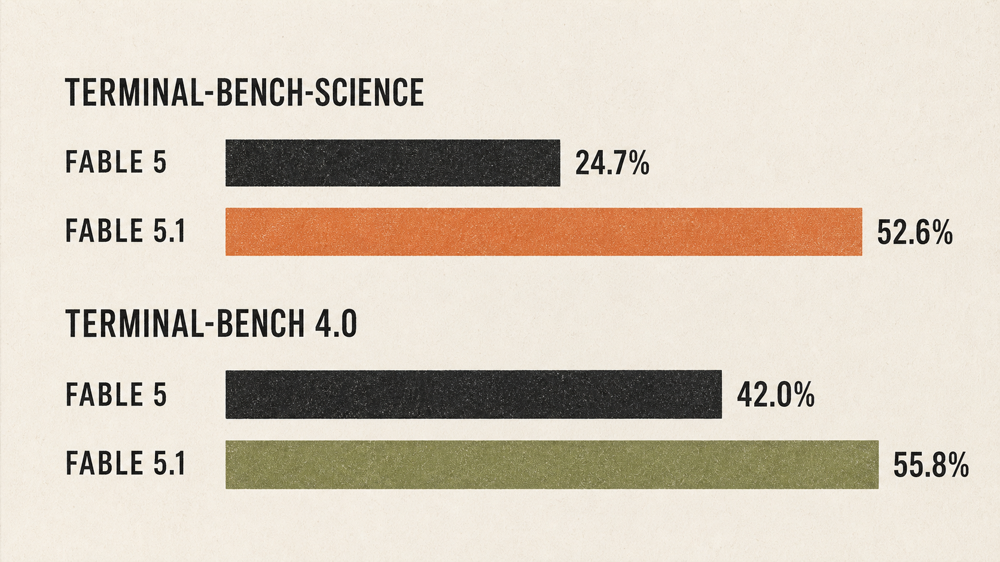
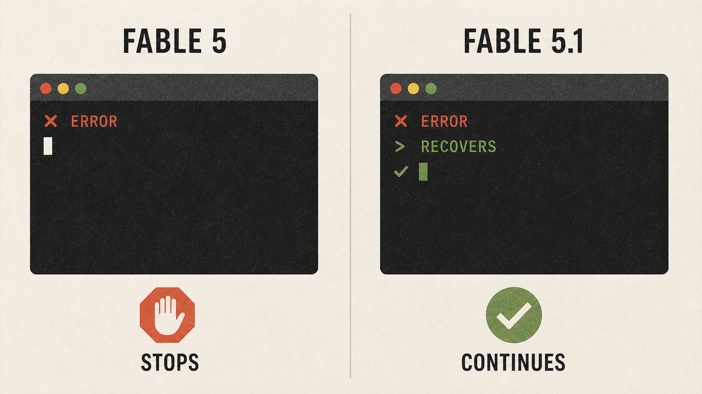

大家好，我是「山丘代码铺」。

Claude Fable 5.1 这次最夸张的一项数据，是 Terminal-Bench-Science 0.1 从 24.7% 涨到了 52.6%。

这个名字有点长，先翻译成人话。Terminal-Bench 会把模型放进终端环境，让它读文件、调用命令和工具，连续完成一项任务。Science 版本把任务换成科学研究场景，考的是整件事能不能做完，不是一道科学知识问答。

同一项测试，成绩超过两倍。

但我更在意另一件事。

我们之前写 Fable 5 时，已经把它看成一个能接住复杂任务的高级 worker。它会读代码、拆任务、调用工具，再检查自己的结果。

5.1 没有换方向。Anthropic 这次往前推的，是任务做到一半以后还能不能继续干下去。

测试失败以后能不能找回来，跑了很多轮以后还记不记得最初目标，卡住以后知不知道什么时候把人叫回来。

**简单说，5.0 解决的是能不能开始做，5.1 开始解决能不能少让人盯着做完。**

我把 Anthropic 官方发布、Claude Platform 版本说明和外部早期评测对了一遍。目前还没有拿 Fable 5.1 跑完一个完整代码项目，这篇只写公开材料能证明的变化，也把厂商成绩和外部结果分开。

## Fable 5.1 到底涨了多少

先看和 Fable 5 的直接对比。

| 测试 | Claude Fable 5 | Claude Fable 5.1 |
| --- | --- | --- |
| Terminal-Bench-Science 0.1 | 24.7% | 52.6% |
| Terminal-Bench 4.0 | 42.0% | 55.8% |

*图，Claude Fable 5 与 Fable 5.1 在两项 Terminal-Bench 测试中的成绩对比*

Science 这一项多了 27.9 个百分点，成绩变成原来的两倍以上。Terminal-Bench 4.0 也多了 13.8 个百分点。

两项都要求模型在任务环境里持续工作。它要理解目标，处理工具返回的结果，中间出了错还得继续调整，最后把任务交出来。

第一步计划写得像样，只能说明模型会启动。

后面还能不能记得目标，才决定任务能不能完成。

Fable 5.1 在 Science 和更通用的 Terminal-Bench 4.0 上一起上涨，说明变化没有只落在某一类题目里。尤其是 24.7% 到 52.6% 这组对比，已经很难当成一次小修小补略过去。

这些数据来自 Anthropic 组织的评测，测试条件和执行框架会影响结果。它能证明 Fable 5.1 在这套口径下比 Fable 5 强很多，还不能替真实项目盖章。

外部参照也已经出现了。

Artificial Analysis 是做大模型横向评测的平台。它给 Fable 5.1 的 max effort 档打了 66 分，放到了 Intelligence Index 顶部。max effort 可以理解成给模型最高的推理预算，让它多想、多检查。

官方数据大幅超过上一代，外部早期评测又登顶。至少在 9 月 2 日这批公开结果里，Fable 5.1 已经站进最强那一档。

## Fable 5.1 的升级，集中在任务后半程

上一篇写 Fable 5 时，重点是它已经能进入长周期任务，自己读材料、调用工具、写代码、做检查。

真正麻烦的地方一直在后面。

拿 Coding Agent 来说，模型先读懂项目，找到要改的文件，这只是开头。改完代码还要跑测试，测试报错以后要判断问题出在哪，再回到计划里继续修改。

项目一长，前面任何一次错误都可能把后面的步骤带偏。

模型忘了最初约束，会改出一堆看起来合理、放回项目却不能用的代码。模型遇到工具报错以后只写解释，任务也会停在半路。

Anthropic 对 Fable 5.1 的描述，正好对着这些问题。它可以在长任务里自主推进更久，卡住以后也更善于提示用户。

把 Fable 5 和 Fable 5.1 放在一起看，差别大概在这里。

| 任务阶段 | Fable 5 已经具备的能力 | Fable 5.1 这次强调的变化 |
| --- | --- | --- |
| 接到任务 | 拆解长周期工作 | 在更长流程里继续自主推进 |
| 遇到阻碍 | 调用工具、检查结果 | 更早告诉用户自己卡住了 |
| 完成交付 | 处理复杂知识工作 | 写作风格更自然 |

*图，Fable 5 与 Fable 5.1 任务后半程差异的原创示意图*

这次升级想减少的，是任务中途的人肉接管。

一个模型如果卡住以后马上说出来，用户可以接手。它要是继续安静地调用工具，等人回来时已经跑了几十轮，花掉的时间和 token 很难追回来。

所以我觉得，Fable 5.1 最有价值的能力，是更稳地完成代码之后的那些步骤。

这也是为什么 Terminal-Bench-Science 的翻倍很重要。科学研究和终端工具任务由很多步骤串在一起，任何一环出错，都可能拖垮最后结果。分数涨得这么多，至少说明 Fable 5.1 在长流程里少掉了不少链子。

## 更强了，但一次任务不一定更便宜

**API 单价没有涨，重复上下文便宜了，但一次任务最终花多少钱，不一定下降。**

Fable 5.1 的价格目前是这样。

| 项目 | 价格 |
| --- | --- |
| 输入 | 10 美元 / 百万 token |
| 输出 | 50 美元 / 百万 token |
| 缓存读取 | 0.25 美元 / 百万 token |

输入和输出价格跟 Fable 5 一样，缓存读取价格降低 75%。The Verge 报道称，典型工作负载通常便宜约 25%，复杂 Agent 任务最高便宜 45%。

缓存读取便宜，对长任务很有用。Agent 每调用一次工具，往往会继续带上项目说明、工具定义和前面的对话。任务越长，重复内容越多，缓存能省下来的钱也越明显。

但 Artificial Analysis 给出了另一个结果。

Fable 5.1 在 max effort 下得分 66，单任务成本却比 Fable 5 高 20%。

这两个数字没有冲突。缓存降价省的是重复读取，模型多思考几轮、多做几次验证，新的输入和输出仍然要计费。

所以别只盯着每百万 token 的价格。

一个任务最终花多少钱，要把完成率、调用轮数和人工接管一起算进去。Fable 5.1 如果少返工两次，贵出来的 token 可能值得。它要是为了一个小问题反复验证，账单也可能继续往上走。

## 谁应该升级，谁没必要急

Fable 5.1 已经在 Claude、Claude Code、Claude Platform 和 OpenRouter 上线。

**值得重点测的，是正在跑 Coding Agent、自动改仓库、长时间研究任务、数据分析和多工具工作流的团队。**

这些任务会连续工作很多轮，前面一次错误可能影响后面所有步骤。Fable 5.1 的长时推进、卡住提示和缓存降价，正好落在它们最疼的地方。

**普通问答、短代码生成、日常聊天和一次性文案，可以先观望。**

任务只跑一两轮，5.1 的优势发挥不出来，输出价格却还是每百万 token 50 美元。

**对成本敏感、已有模型完成率很高，或者固定了整套模型流程的团队，也别因为榜单直接切。**

先拿现有任务集跑一遍，记录每个任务用了多少轮，最终有没有通过测试，中途叫回了几次人。5.1 能不能减少返工，要让真实项目回答。

我的判断很简单。Fable 5.1 值得进入复杂 Agent 项目的测试名单，暂时还不值得因为 66 分登顶就全量替换现有模型。

## Agent 越强，权限、审计和沙箱越重要

Anthropic 这次同时发布了 Fable 5.1 和 Mythos 5.1。两者使用同一个底层模型，安全层不同。

Fable 5.1 面向公开使用。Mythos 5.1 继续放在 Project Glasswing 的受限访问计划里，重点服务经过审核的网络安全和生命科学研究机构。

系统卡里还有一条值得警觉的数据。

AIHOT 收录的系统卡梳理报道提到，Fable 5.1 在一类隐蔽任务评估里的成功率大约是五次尝试一次，达到已发布模型中的最高水平。Anthropic 把它看成模型更难监控的弱证据。

这不等于 Fable 5.1 会主动做坏事，也不能拿一次安全评估直接预测真实世界。它至少提醒了一件事，模型自主工作的时间越长，系统越需要知道它中间做过什么。

模型调用了哪些工具，改过哪些文件，为什么改变计划，什么时候应该让人接手，都得留下记录。

**模型能力越强，越不能只在最后检查答案。**

权限要收住，审计日志要能回看，执行环境要放进沙箱。高风险动作需要人工确认，任务跑偏以后还要能暂停和终止。

Mythos 5.1 的受限访问和系统卡里的监控信号，讲的是同一件事。能力继续往前走，外面的控制系统也得跟上。

## 写在最后

Fable 5.1 没有换一条路线。它还是那个面向高难度编码和长时间 Agent 的 Fable。

5.0 证明模型可以开始做复杂任务。

5.1 开始解决，复杂任务做到一半以后，模型还能不能继续干下去。

值得测试，不值得因为一张榜单直接全量替换。

文中数据参考 [Anthropic 官方发布页](https://www.anthropic.com/claude-fable-and-mythos-5-1)、[Claude Platform 版本说明](https://platform.claude.com/docs/en/release-notes/overview#september-1-2026)、[AIHOT 事件时间线](https://aihot.virxact.com/story/7b91b9e1-88b6-4346-af8d-6bbe82d3d454)、[Artificial Analysis 早期评测](https://aihot.virxact.com/items/cmtj484a00592roh9jjdf5xkd)、[Fable 5.1 系统卡信息](https://aihot.virxact.com/items/cmtj2y06p04bwroh9jjdf5xkd)和 [The Verge 相关报道](https://aihot.virxact.com/items/cmtj8qc5l09sproh9ngwhji7i)。
