大家好，我是「山丘代码铺」。

最近有件挺有意思的事，Kimi Code Desktop 刚上线没多久，小米也把 MiMo Desktop 端了出来。装下来以后，我第一反应是，怎么大家越来越像 Codex 了？

项目和会话放在左边，中间聊天，下面选模型、调权限。Agent 会读文件、跑命令、开浏览器，最后把产物交给你。

当然，我不是说谁抄谁。

大家做的事情相近，界面有相似的地方很正常。只是我最早长期用的这类桌面 Agent 就是 Codex，所以后来每打开一个新的客户端，总会有点熟悉感。

Kimi Code Desktop 是 9 月 21 日发布的，Mac 和 Windows 一起上线。小米此前做过邀测，9 月 22 日凌晨又带着 MiMo-V2.6 和桌面端一起发布。

我打开小米以后，第一印象还挺好。

登录页上有小米账号、支付宝、微信、QQ、微博。用熟悉的账号就能进，不用先想 API Key 是什么。

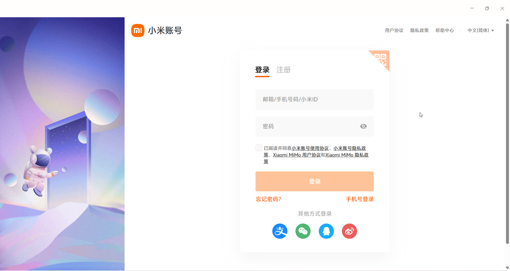

首页也很干净，新建任务、插件、产物中心，基本不用琢磨每个入口是干什么的。

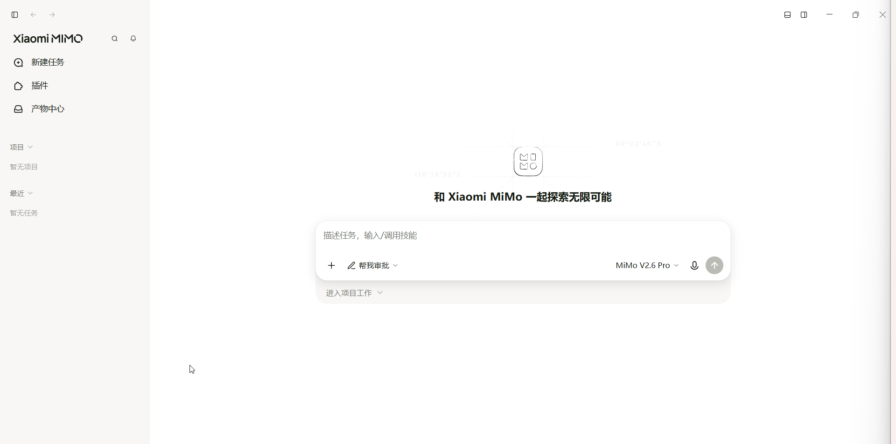

个人资料页里可以挑头像和背景色，主题和应用图标也准备了好几套。果冻蓝、素雅银、蒙德里安，挑一个顺眼的就行。

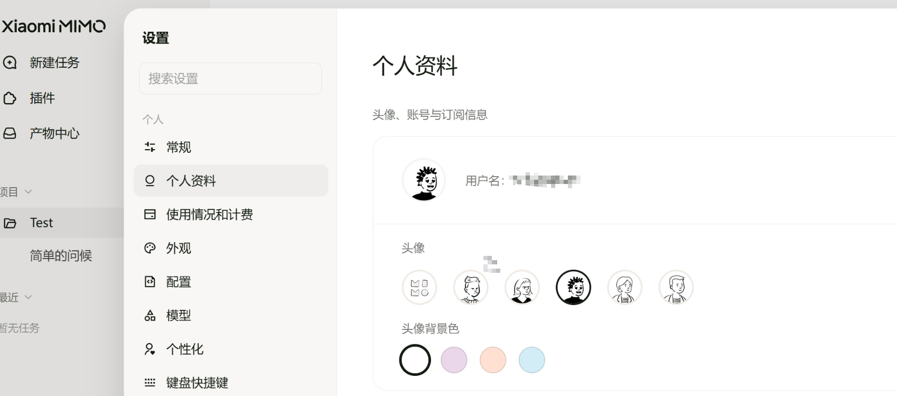

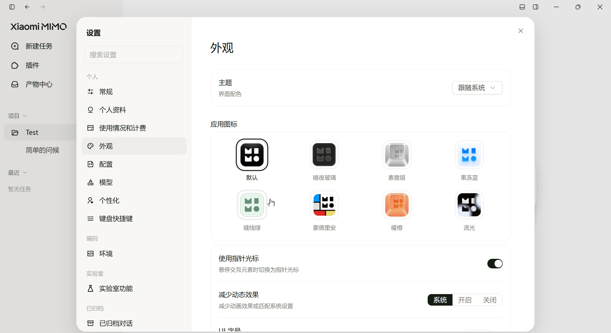

小米确实挺懂消费产品。软件能做事，细节也不全是冷冰冰的设置项。

Kimi Code 的欢迎页更像开发工具，先选语言和外观，再去配模型。

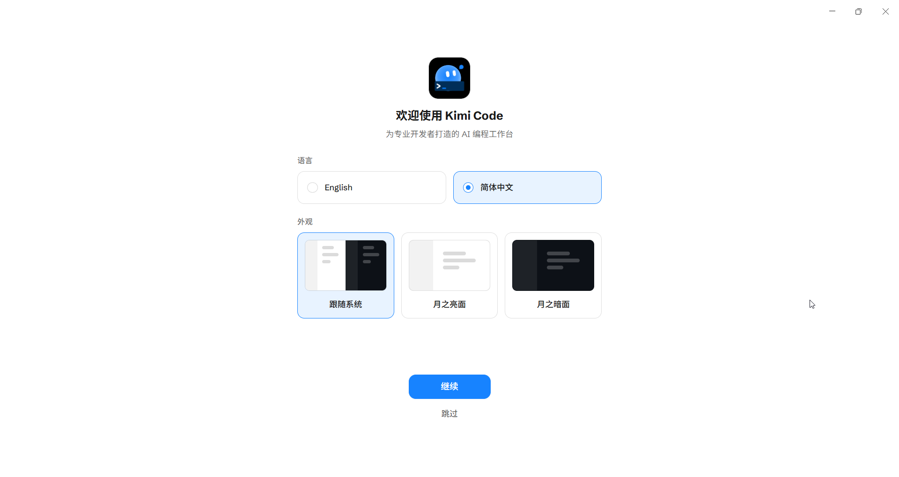

点开设置以后，两边都支持第三方模型。小米把 DeepSeek、Kimi、GLM、千问、MiniMax 等供应商预设放好了，还能自己添加，配置只保存在本地。

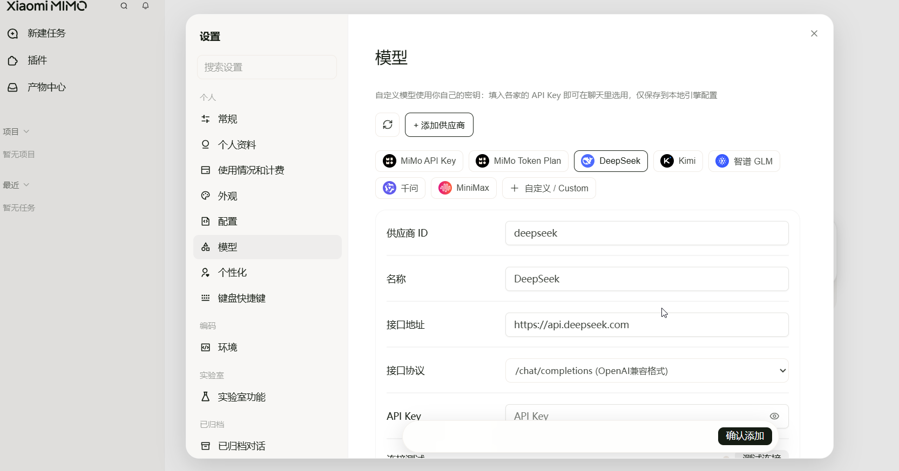

Kimi 也有供应商预设，也能自定义 API 地址和模型。并且它把「思考」开关直接放在模型选择器旁边。

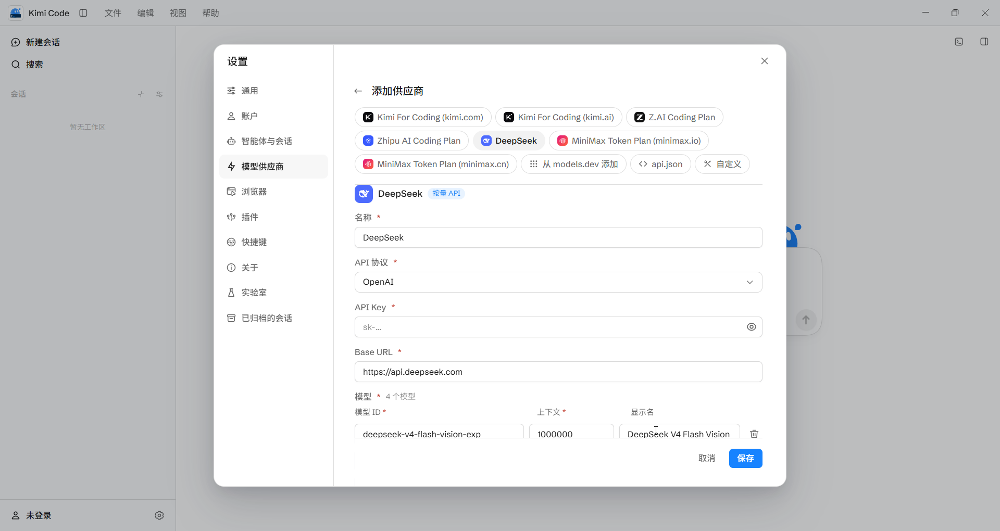

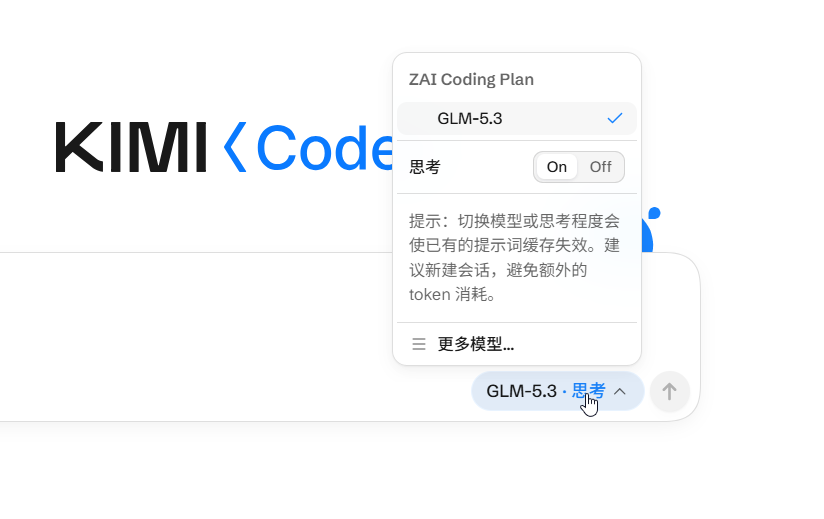

小米的产品细节让我有好感，Kimi 的配置看起来也很灵活。但 Kimi 和小米我都是第一次使用，真正跑起任务以后，两家的整体体感都很差，小米尤其差。这一点我先放在这里，后面说过程。

我当时更好奇的是另一件事。

如果大家的界面都差不多，模型和下面那套 Harness，各自会怎样影响 Agent 的使用体验？

我决定做个简单测试。

## 我先把模型变量拿掉

Kimi 和小米都能接第三方模型，我这次没有用它们自家的模型，而是在三个客户端里都选了智谱 GLM-5.3-Flash。三边的界面显示名称都是 GLM-5.3-Flash，小米写作 Glm 5.3 Flash。

ZCode 也一起拉进来。

同一个模型，同一道题，看看三个客户端会怎么把任务做完。

题目是一只赶飞机的企鹅。要求在当前工作目录创建一个完整可运行的单文件 HTML，用 SVG 做机场自动步道动画。企鹅得自然走路，行李箱跟着移动、轮子随之旋转，步道持续运行；点击企鹅可以暂停和继续，按空格能在一倍速和两倍速之间切换。

这题的要求跨了画面、代码和交互。Agent 得创建文件、写动画逻辑，最好还要把页面打开检查一遍。

这是一轮个人上手对比。我统一了提示词和界面上选择的模型，没有校准底层请求、推理预算、重试和上下文设置，所以这里记录的是我这次实际用下来的表现，不是严格的 Harness 跑分。

三个任务我几乎同时发了出去。

## 同样的任务，过程先不一样了

ZCode 是最先让我感受到「它在干活」的一个。

页面写完以后，它自己尝试打开浏览器，发现 file 协议不支持，就启动了本地 HTTP 服务，再重新打开页面检查。

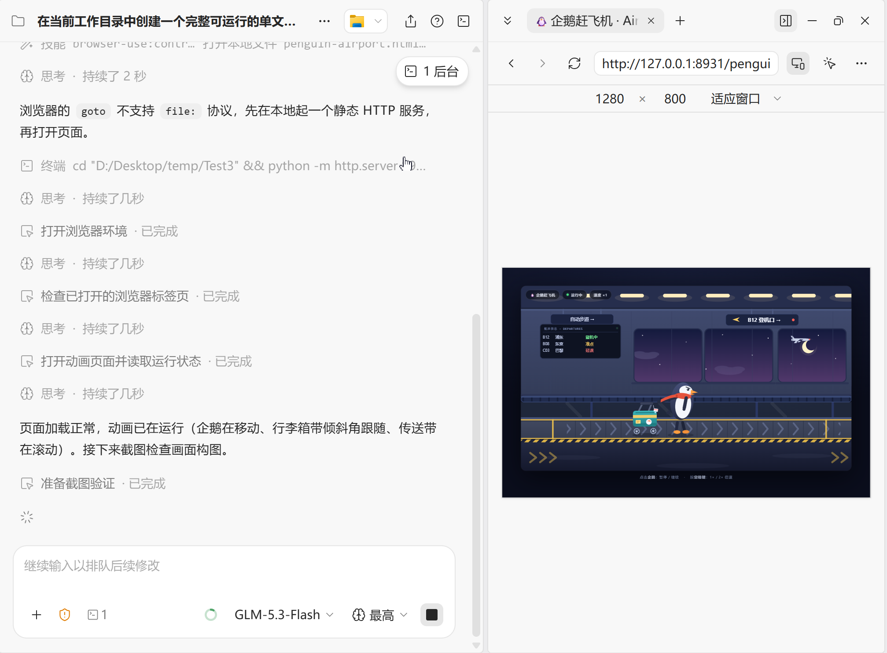

它接着截图，看画面，再往下检查。我不需要猜它走到哪一步了。

Kimi 也会打开内置浏览器。它刷新页面、截取页面，再把截图放进对话。

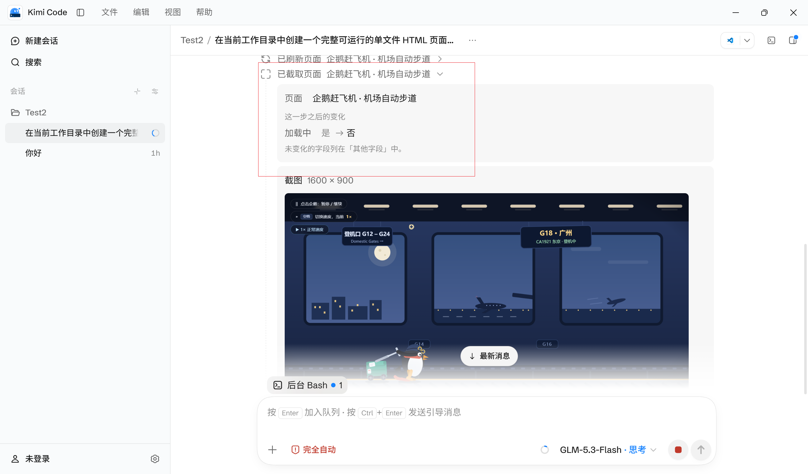

过程能看到，这点确实比全程盯着计时器好。但Kimi还是花了大约34分钟。第一次用下来，我对这个速度和整体体感都不满意。

哥们，一只企鹅有这么难吗？

至少我知道它还在运行命令、检查页面，事情往前走到哪儿也看得见。这是它这次做得相对好的一点。

ZCode 这一轮用时约26分30秒。画面里有航班信息牌、登机口和窗外夜景，一只戴红围巾的企鹅拖着绿色行李箱往前赶。

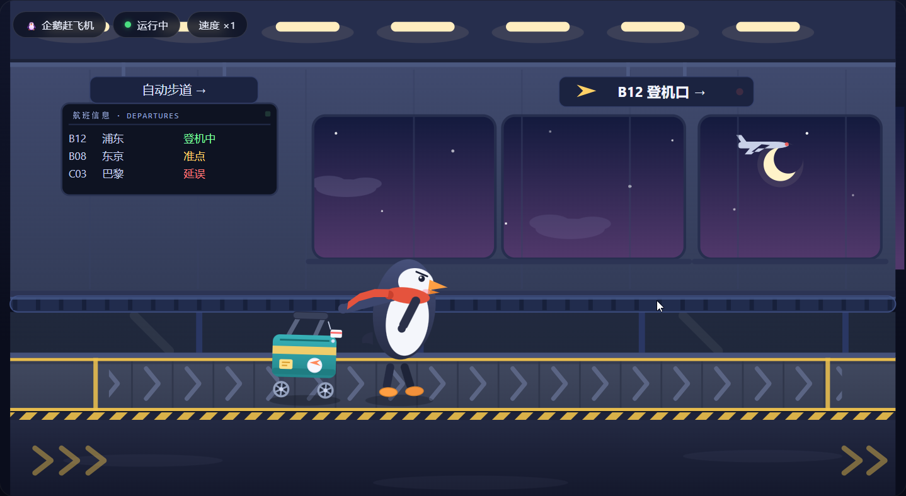

Kimi 花了约34分钟。它给企鹅加了帽子，还在后面放了一只拿气球的小企鹅，机场窗外也有飞机和灯光。

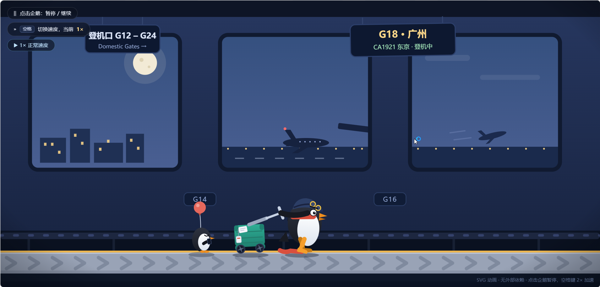

单看静态截图，只能比较构图和场景，不能据此断定走路、轮子和快捷键都验收通过。但至少页面确实打开了，过程也留在会话里。

Kimi 的34分钟已经让我觉得很久。小米那边，我很快连自己在等什么都不知道。

## 小米让我不知道还要不要等

第一轮三个任务几乎同时开始。小米显示「已处理 25m 7s」，下面只有加载状态，右侧任务清单和产物都是空的。

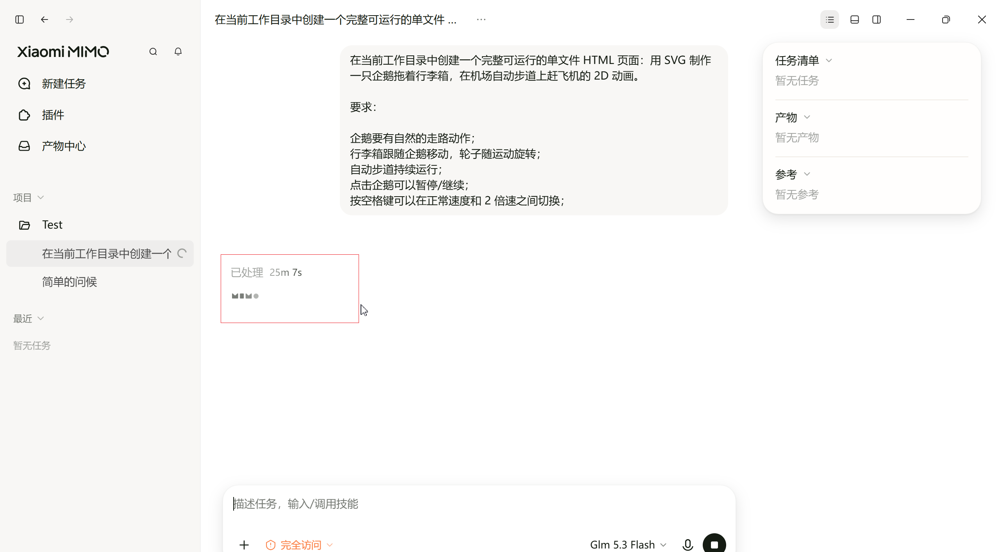

我以为它只是慢，就继续等。

四十多分钟，接近五十分钟，还是没有任何输出。

它是在等模型返回？工具卡住了？正在重试？还是已经挂了？

我什么也不知道。

后来我重开一个会话，把题目重新发了一遍。界面还是只显示已处理时间。到凌晨一点，我还在看它转圈。

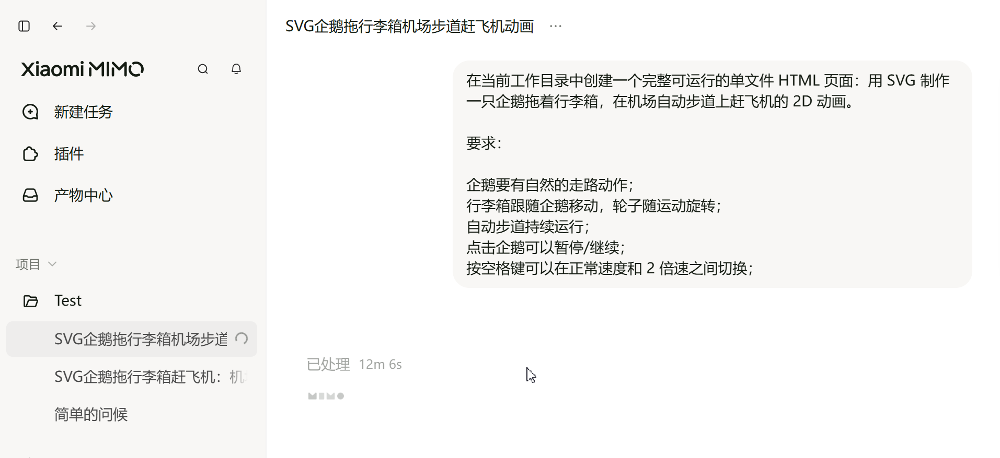

这时候我已经不想看头像和主题了。我只想知道它到底在不在工作。

我把卡住的截图发给小米另一个会话询问。这个新会话能正常输出文字，也显示了搜索、命令执行记录，还说要去查引擎日志。

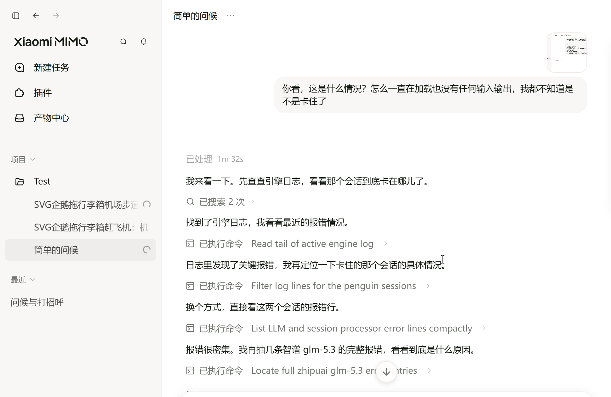

所以问题不是我能证明 MiMo 永远不会展示过程。截图里另一个会话就展示了。

我碰到的是，这几次动画任务长时间没有可读的进度，另一个会话却可以正常输出。到底是请求、模型适配还是客户端状态出了问题，光靠我这几张截图还不能定论。可当时的使用感受很确定，我完全不知道该继续等还是停下来。

之后我又截到一段补充记录。会话已经显示「已处理 28m 1s」，下面还是没有能读懂的回答。我追问「还没有做完吗」，又问「还得多久才能做完」。

后续消息显示处理了4分多钟，才说现在把完整文件写入磁盘，并给出了 penguin-airport.html。

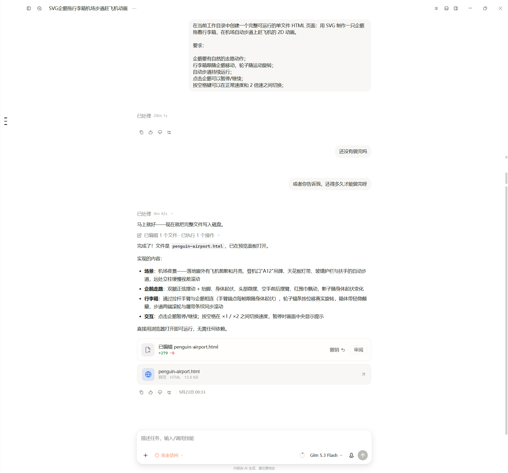

所以小米最后交付了，任务不算彻底失败。让我难受的是，前面几十分钟只有计时器，我还得自己追问它是否做完。

这几个数字来自不同会话和不同轮次，不能简单加起来当成小米的总完成时间。第一轮等了四五十分钟没有可见输出，是我的等待记录；28分1秒和后续4分多钟，是补充截图里的界面计时。

最后的画面是这样。

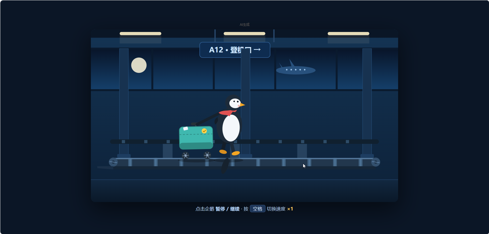

机场、企鹅和行李箱都有了。只看这张静态图，我觉得场景比 ZCode 和 Kimi 简单，企鹅脚下还多了一块突兀的深色形状。动画是否自然、交互是否生效，还是要实际运行才能判断。

这一轮我最不满意的是小米。等得最久，过程中最让人摸不着头脑，最后画面也最不合我意。

## 同一个模型，不代表同一个 Agent

这才是我觉得这次测试有意思的地方。

同一个 GLM，收到同一条提示词，最后给我的画面不同，过程也不同。

ZCode 遇到浏览器打不开，自己切到本地 HTTP 服务。Kimi 会刷新页面、截图，把结果拿给我看。小米在那几个企鹅会话里长时间只显示处理时长，得靠我重新开会话、追问才能知道它后面有没有完成。

Harness 这个词最近经常出现。之前我对它的理解还比较工程化，就是模型外面的执行部分，负责给工具、接结果、管理上下文，再让 Agent 接着往下跑。

这次我第一次很直观地感受到，它会直接影响使用体验。

模型拿到什么上下文，什么时候调工具，失败后怎么处理，何时算完成，最后怎样把状态告诉用户，这些都会改变 Agent 做事的过程。

同一个模型，不等于同一个 Agent。

模型更像大脑。它装进什么样的执行程序，有什么工具，怎么看见自己的操作结果，同样重要。

这轮也不能把所有输出差异都归因于 Harness。我没抓底层请求，没校准推理预算和重试机制。但用户实际打开的本来就是整个客户端，界面、模型和执行过程一起构成了产品体验。

至于大家为什么越做越像 Codex，界面相似本身说明不了谁用了谁的代码。OpenAI 公开了 Codex CLI、SDK 和 App Server 等组件，其他开发者可以研究；单靠相似布局，没法判断某个桌面端具体借鉴或复用了什么。

最近还赶上 MiMo-V2.6 发布，以及 Qoder 给 Qwen3.8-Flash 的限时免费活动。模型能力和价格当然值得关注。ZCode 的上传争议也提醒大家，Agent 接触本地项目以后，代码和文件究竟怎样处理，同样得说清楚。

不过回到我这次的企鹅题，Kimi Code 和小米都是第一次使用，整体体感都差，小米最差。

26分多的 ZCode 和34分钟的 Kimi 都慢，但过程至少看得见。小米最后也交付了文件，可那些没有反馈的等待，让我一度连要不要继续等都不知道。

我折腾到凌晨一点，最后脑子里只剩一个问题。

哥们，这只企鹅到底赶上飞机没有？

---

桌面端发布和模型信息参照 [Kimi Code Desktop 上线消息](https://aihot.news/items/cmuaytowf0c4oroln02tacq0c)、[Kimi Code 官方文档](https://www.kimi.com/code/docs/)与 [MiMo-V2.6 发布报道](https://www.ithome.com/1/005/496.htm)。Codex 开源组件见 [OpenAI 官方列表](https://developers.openai.com/codex/open-source)。Qoder 优惠活动见[活动说明](https://www.ithome.com/1/004/011.htm)。ZCode 调查与后续参照 [原调查更新](https://blog.ferstar.org/en/posts/zcode-silent-workspace-snapshot-upload)和[智谱整改回应](https://www.ithome.com/1/005/046.htm)。使用时长来自本次个人记录，非统一条件下的性能榜单。
