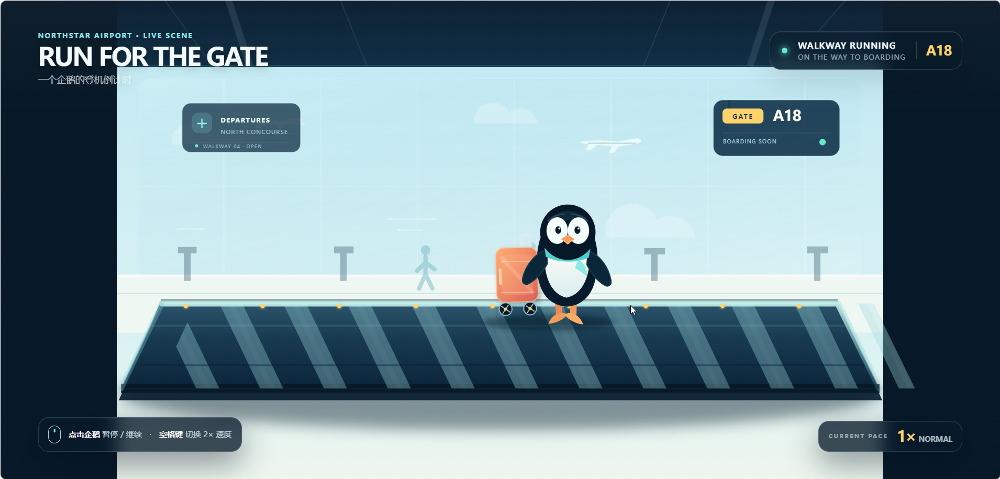
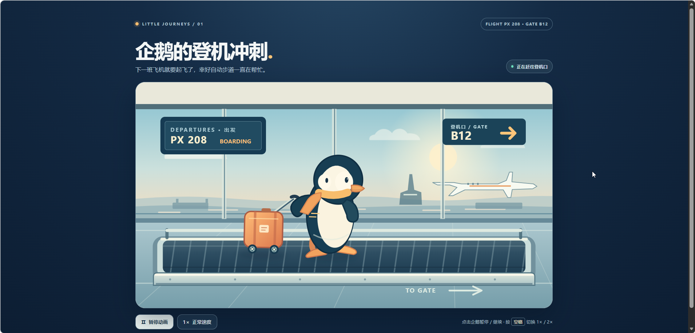
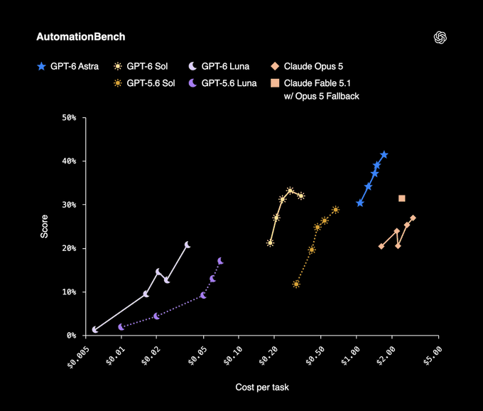
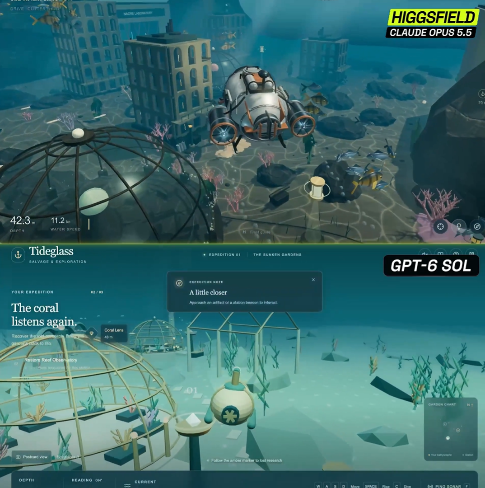
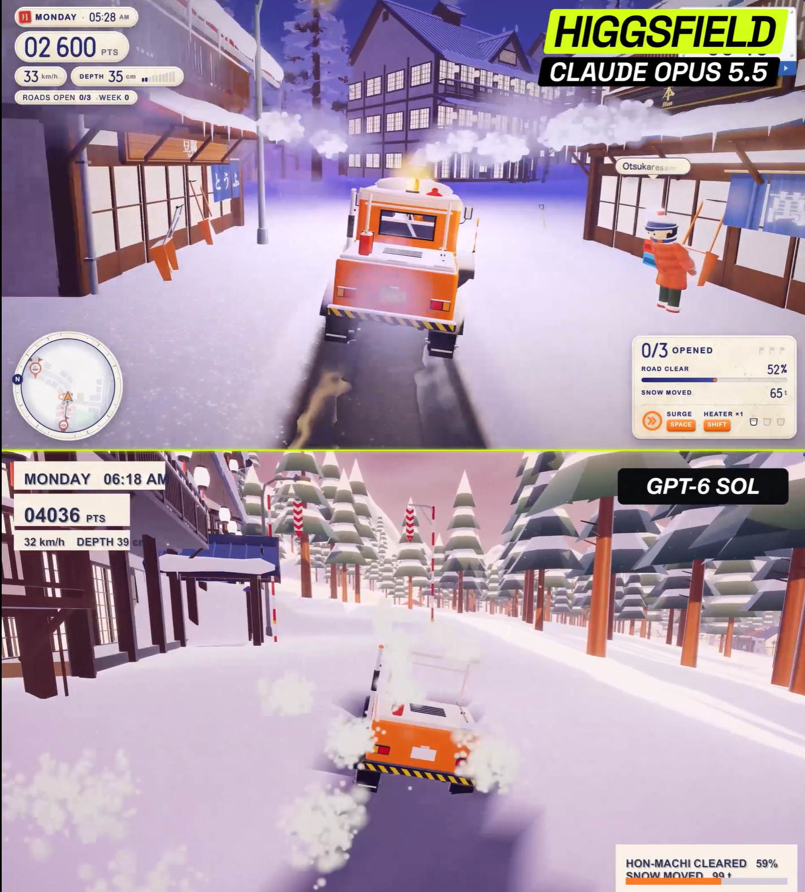
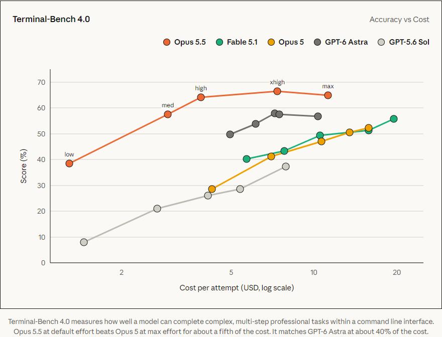

Claude Opus 5.5、GPT-6 Sol 和 GPT-6 Luna 前后脚都来了。

三个模型挤在一起，我更想看它们实际交活是什么样。Opus 这回暂时没法亲测，先看 Sol 和 Luna 的同题结果。

两款同属 GPT-6，API 单价却差了 20 倍。同一道题，交出来的页面会差多少？

题目是一只拖着行李箱赶飞机的企鹅。两边都要交付单文件 HTML，用 SVG 做出走路、轮子转动和持续运行的自动步道，点击企鹅能暂停，按空格能切换倍速。

这一轮配置是 Luna + Max、Sol + 极高。

图：GPT-6 Luna + Max 的最终页面，我自己跑的。

图：GPT-6 Sol + 极高的最终页面，我自己跑的。

Luna 把画面交给了整个机场，自动步道几乎横贯页面，企鹅站在中间，显得有点小。Sol 把企鹅和箱子放大，航班牌和登机口退到后面。两只都挺憨，但 Sol 那只一眼就是主角，Luna 的企鹅差点被步道抢了戏。

## Sol 可比 Luna 贵 20 倍嘞

GPT-6 Sol 的 API 输入、输出价格是每百万 token 2 美元和 10 美元。Luna 是 0.10 美元和 0.50 美元。按 token 单价算，Sol 正好贵 20 倍。

OpenAI 发布资料里的 DeepSWE v1.1 代码修复测试，Sol Max 得分 68.8%，Luna Max 得分 66.6%，只差 2.2 个百分点。单价差 20 倍，代码修复这一题却咬得很近。

换成需要连续做事的任务呢？下面这张 AutomationBench 图有好几条线，先找 Sol 和 Luna。横轴是完成一次任务的花费，纵轴是得分。

图：OpenAI 开发者社区发布的 AutomationBench 图，[原帖在这里](https://community.openai.com/t/announcing-gpt-6-sol-and-gpt-6-luna-in-the-api-codex-and-chatgpt/1399925)。

在这张官方图里，Luna 的点靠左，花得少；Sol 的高分点更靠右，成本也更高。代码修复只差 2.2 个百分点，换到多步任务，价格和成绩的距离都拉开了。

## Opus 5.5，我想测，账号先没了

刚给 Claude 账号充完钱，号就被封了。Opus 5.5 这次没法和 Sol、Luna 同题跑，挺抽象。

我只好去 X 上看 Higgsfield AI 的公开展示。账号这边让我很不爽，图又确实把我看服了。

先看海底这一组。Opus 的画面像潜艇穿过水下建筑，Sol 带着任务提示，更像一款水下探索游戏。

图：Higgsfield 的 Unreal Engine 3D 游戏开发对照截图，[查看 X 原帖](https://x.com/higgsfield_ai/status/2102533401110802552)。

还有一组雪地铲车。Opus 把小镇、道路和驾驶界面都铺出来了；Sol 的车也在雪地里，场景显得简单一些。

图：另一组标有 Higgsfield 的雪地铲车对照，原帖链接待补。

单看这两组画面，我会选 Opus 5.5。它的场景更对我胃口，Sol 这两张显得单薄些。可这些是别人挑出的截帧，没有完整提示词和可玩的版本。标题里问「真完败了」，我现在最多只能说：这两组画面，Opus 更对我胃口；模型总体谁强，没法凭两张截帧下结论。

我更想知道它做长任务到底强了多少。Anthropic 公布的 Terminal-Bench 4.0 考 Agent 在终端里完成多步任务，Opus 5.5 得分 66.4%，Opus 5 是 52.3%。下面这张图有五个模型，先看橙色的 Opus 5.5 和黄色的 Opus 5。官方还说新模型输出快了 30% 以上。

图：Anthropic 官方 [Terminal-Bench 4.0 对比图](https://www.anthropic.com/claude-opus-5-5)。图中的 Sol 是 GPT-5.6 Sol，不是这次发布的 GPT-6 Sol。

发布页里的早期测试案例更好理解。一位测试者拿约 20 万行代码给模型审查、修复，Opus 5.5 用了不到 3 小时，Opus 5 超过 20 小时。这是厂商公布的单个案例，换一个项目未必能快这么多。至少它把这次升级的方向说清楚了，少绕路，把长活做完。

Anthropic 还说，默认设置下典型任务成本低了 40%。这里比单次回答省几秒更有意思，Agent 每走一步都要带着上下文往前跑，少用 token、缓存读得便宜，跑一整段任务才会明显省下来。

两家公司这轮还把价格一起往下调了，放在一张表里看更清楚。下面是每百万 token 的基础 API 单价。

| 模型 | 输入，旧价 → 新价 | 输出，旧价 → 新价 |
| --- | ---: | ---: |
| Claude Opus 5 → 5.5 | $5 → **$4** | $25 → **$20** |
| GPT-5.6 Sol → GPT-6 Sol | $4 → **$2** | $20 → **$10** |
| GPT-5.6 Luna → GPT-6 Luna | $0.20 → **$0.10** | $1.20 → **$0.50** |

Luna 到现在我已经用了一整天，我还是愿意叫它「性价比之王」。便宜，能接不少活，复杂问题里也确实会犯傻。

Sol 我也试了。企鹅这页比 Luna 顺眼，但还没到让我惊艳的程度。

至于 Opus 5.5，我是真想自己试。账号那关没过去，先欠着。

---

Opus 5.5 的发布资料和 Terminal-Bench 数据来自 [Anthropic 官方发布页](https://www.anthropic.com/claude-opus-5-5)。Sol 与 Luna 的定位、规格参照 [GPT-6 Sol](https://developers.openai.com/api/docs/models/gpt-6-sol)、[GPT-6 Luna](https://developers.openai.com/api/docs/models/gpt-6-luna) 官方文档和 [OpenAI 开发者社区公告](https://community.openai.com/t/announcing-gpt-6-sol-and-gpt-6-luna-in-the-api-codex-and-chatgpt/1399925)。DeepSWE 成绩来自 [MarkTechPost 对 OpenAI 发布资料的整理](https://www.marktechpost.com/2026/09/22/openai-releases-gpt-6-sol-and-luna-50-cheaper-api-pricing-and-benchmarks)。旧价参照 [GPT-5.6 Sol](https://developers.openai.com/api/docs/models/gpt-5.6-sol) 和 [GPT-5.6 Luna](https://developers.openai.com/api/docs/models/gpt-5.6-luna) 官方模型页。
