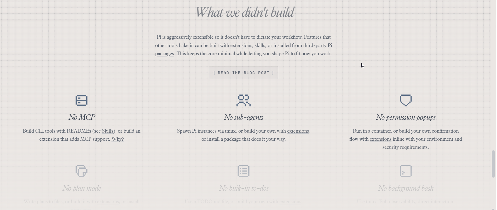
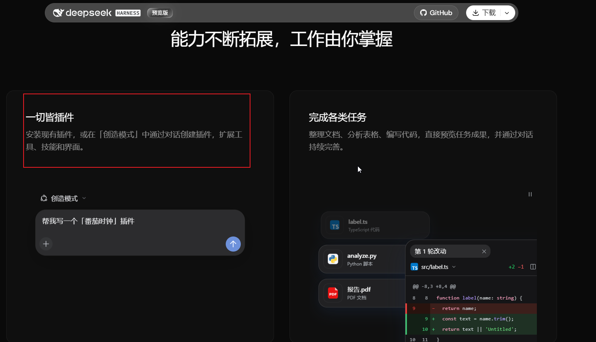

最近各家基本上把自己的 Coding Agent 都端出来了，我也一直在测评各家的 Agent！
同样的模型放进不同的 Agent，跑出来的东西真是参差不齐，所以我一直在想一个东西——

**Harness。**

以前我对 Agent 的理解其实挺简单的。

一个大模型，加几个工具，再套一个 Agent Loop。

模型负责想，工具负责干，循环几轮，把任务做完。

这不就是 Agent 吗？

但昨天晚上看 Pi Agent 和 DeepSeek Harness（下文简称 Harness）的时候，我发现这个理解好像还是太粗了。

因为这两个项目干了一件挺有意思的事。

Pi 在拼命做减法。

Harness 则干脆连 Agent Loop 都拆了。

一个嫌 Harness 管得太多。

另一个担心 Harness 以后大到自己都改不动。

接下来我们一块儿来聊聊这个事。

## 先看 Pi：它的哲学其实非常鲜明

Pi 官网现在直接把自己叫：

> **minimal agent harness**

而且一句话就是：

> **Adapt Pi to your workflows, not the other way around.**

也就是：

> **不是让我规定你怎么使用 Agent，而是我给你最小的一套原语，你自己把 Harness 塑造成适合你的样子。**

Pi 官网有一栏，叫「What we didn't build」。
然后我往下拉，发现：

MCP、Sub-agent、Plan Mode、权限弹窗、Todo……别家 Agent 常拿来介绍自己的功能，它一个个写着「不内置」。
那就是说啥都没有呗。。。不——“啥都没有”恰恰就是它的设计，哈哈！



图：Pi 官网的「What we didn't build」清单，MCP、Sub-agent、Plan Mode 等功能都在“不内置”一栏。

它默认启用的核心工具只有四个：

`read`

`bash`

`edit`

`write`

这里要注意，不是说 Pi 总共只会这四件事。

它还有 `grep`、`find`、`ls` 等内置工具，也可以自己启用；需要 MCP、Sub-agent、Plan Mode，同样可以通过 Extension、Skill 或其他方式加进去。

所以真正有意思的并不是：

**Pi 功能少。**

而是：

**它为什么故意不把这些东西做成默认功能？**

我以前做 Agent 的时候，其实特别容易有一种冲动。

Plan 得有吧？

Memory 得有吧？

Sub-agent 得有吧？

工具越多越好吧？

权限系统也得整一个吧？

感觉每加一层东西，Agent 就智能一点。

但 Pi 的思路刚好反过来。

它更像是在问：

**这些东西为什么一定属于核心？**

模型想查 GitHub PR，`bash` 调个 `gh` 不行吗？

想做计划，为什么一定非得 Harness 内置一个 Plan Mode？

想增加新的工作流，就自己写 Extension。

Pi 官网有句话我挺喜欢：

**Primitives, not features.**

翻成人话差不多就是：

**先给你积木，别急着替你把玩具拼好。**

这也是我觉得 Pi 最有意思的一点。

它不是没能力做复杂。

而是它不着急替你规定：

**“一个 Agent 就应该这样工作。”**

代价当然也非常明显。

自由给你了，责任也一起给你。

比如 Pi 默认不会每次执行工具之前都弹一个权限确认框，工具本身就是用当前运行 Pi 的系统用户权限干活。

如果真要执行不可信任务，沙箱、容器、虚拟机、专用账户，或者额外的安全扩展，都得你自己考虑。

所以 Pi 给我的感觉越来越像一张工作台。

桌子我给你。

螺丝刀、扳手也给你。

至于你最后要把它改造成木工房、修车铺还是实验室：

**你自己决定。**

**DeepSeek 这儿，好家伙：**

## DeepSeek Harness：那我干脆连工作台都做成插件

然后再看 Harness。

事情突然又往另一个方向走了。

它的核心理念直接叫：

**Everything is a Plugin.**



图：DeepSeek Harness 官网的插件演示界面，红框处强调通过插件扩展能力。

模型连接是插件。

工具注册是插件。

Session 是插件。

Agent Loop……

**也是插件。**

我第一次看到这里的时候，确实愣了一下。

因为以前我潜意识里一直觉得：

Agent 外面的东西可以换。

工具可以换。

模型可以换。

Prompt 可以换。

但 Agent Loop 本身，不就是整个 Agent 的“心脏”吗？

结果 Harness：

**心脏也能拔。**

它基于 Cordis 把这些能力组织成一棵插件树，没有一个“你想改系统就必须进来动刀”的特权核心。

这时候它和 Pi 看起来特别像。

Pi：

需要什么，自己往上装。

DeepSeek：

我也全都能换。

但继续往下看，我发现两边其实还是不太一样。

Pi 更像：

**我先少替你做决定。**

Harness 更像：

**我知道真实系统最后一定会变复杂，所以干脆提前让每一块复杂度都能换。**

比如它的 `dsh-base`，已经默认组合了模型连接、文件和 Shell 工具、搜索、Sub-agent、可持久化 Session，以及 Sandbox 和审批策略。

也就是说，它并不是一个什么都没有的空壳。

相反，它先给了一套相对完整的默认组合。

但这些东西尽量都不是焊死的。

这里面有一个我觉得特别能体现这种思路的设计：

**Seam。**

Agent 不直接写死：

我要操作本地文件系统。

而是依赖：

我要一个“文件系统能力”。

今天这个能力由本机提供。

明天把它换成远程 Sandbox。

上面的 Agent Loop 不一定要跟着重新写一套。

看到这里，我才真正理解它为什么这么执着于 Plugin。

它不是单纯为了“插件化看起来比较优雅”。

而是在解决一个很现实的问题：

**Agent 一旦从一个终端小工具长成真正的平台，复杂度到底怎么控制？**

网页里要跑。

无界面任务也要跑。

今天执行命令在本机。

明天为了安全，要扔进远程 Sandbox。

如果这些东西从一开始全都和 Agent Loop 缠死，后面想拆，可能才是真正的噩梦。

所以 DeepSeek 给我的感觉更像：

设备我先帮你接了一套。

但每根线中间，我尽量都给你留个插头。

以后哪里不喜欢：

**拔掉，换。**

## 到这里，我才觉得自己有点懂了

Pi 和 Harness，其实不是在比谁更先进。

一开始我很容易掉进一个坑：

Pi 和 Harness 谁设计得更好？

后来我发现这个问题好像就问错了。

Pi 更像：

```
一个很小的内核
+
一套非常开放的扩展能力
```

Harness 更像：

```
整个系统本身
=
一棵可以自由组合的插件树
```

Pi 在强调：

**别帮用户做太多决定。**

Harness 在强调：

**连“系统由什么构成”都不要写死。**

所以一个偏向**极简主义**，一个偏向**组合主义**。

**Harness 本身必须是可编程的。**

### 所以 Harness 的哲学我会总结成

把 Agent 做成一个高度模块化、可替换、可组合、可恢复的 Runtime，每个能力都是明确的 Service / Plugin / Seam，通过不同 Profile 组合出不同 Agent 产品。

如果 Pi 是：

> **“别给 Harness 加太多东西。”**

Harness 更像：

> **“复杂能力可以有，但一定要模块化，谁都不能成为不可替换的上帝模块。”**

我感觉这两家也有相似之处，就是都支持高度自定义。无论是 Pi，你都可以自定义很多东西；Harness 也一样，可以通过插件加上自己的能力。

所以我觉得，未来某一天，每个人都可能有一个属于自己的 Agent。它可能不只是 Coding Agent，也可能帮你干各种各样的活儿，当然也可能不止一个！
