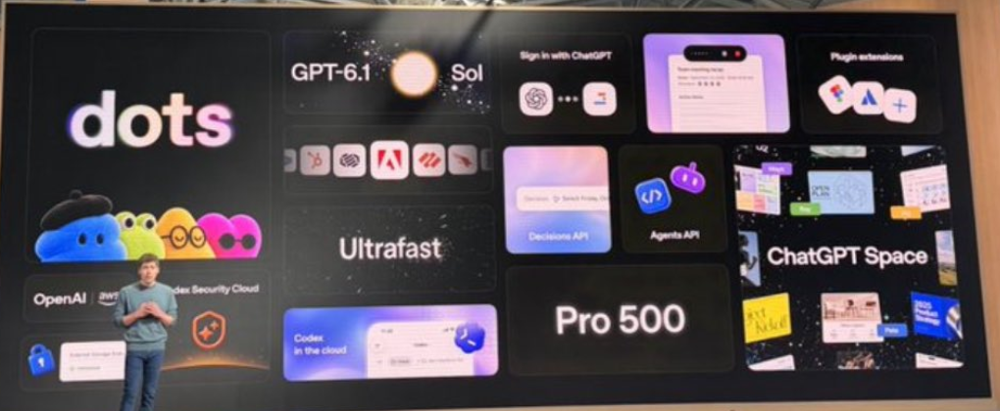
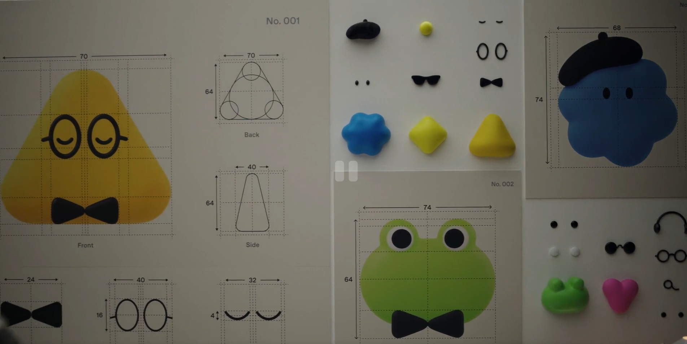
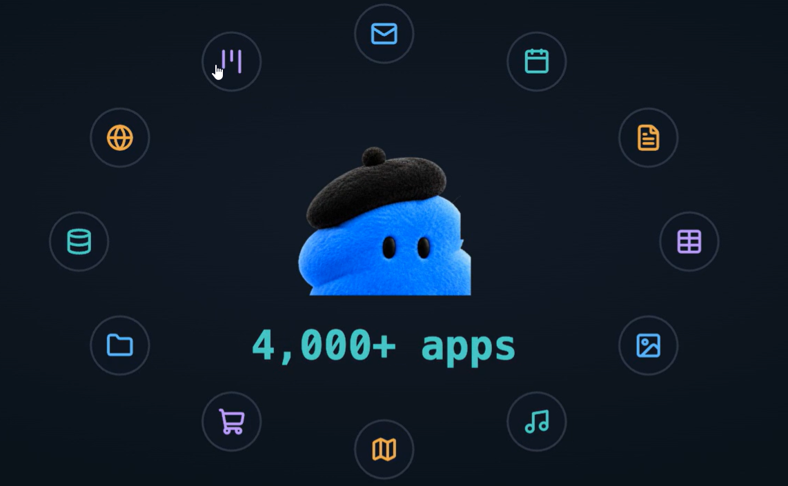
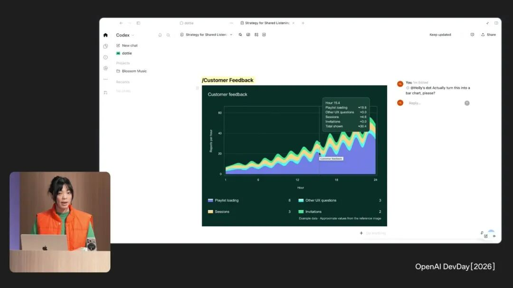
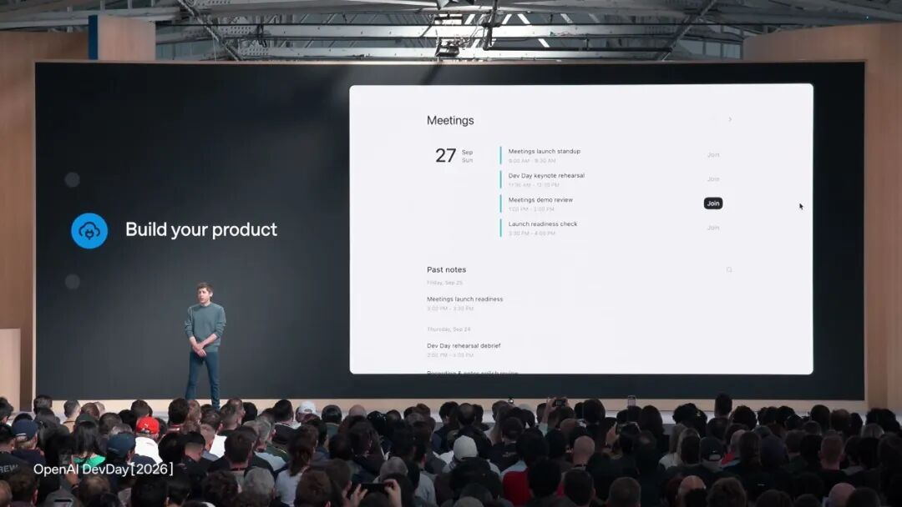
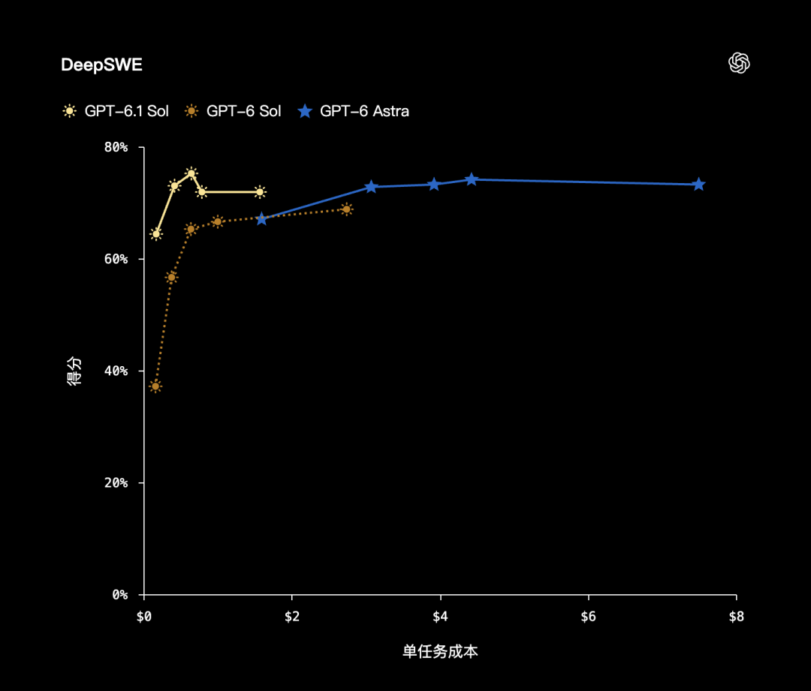
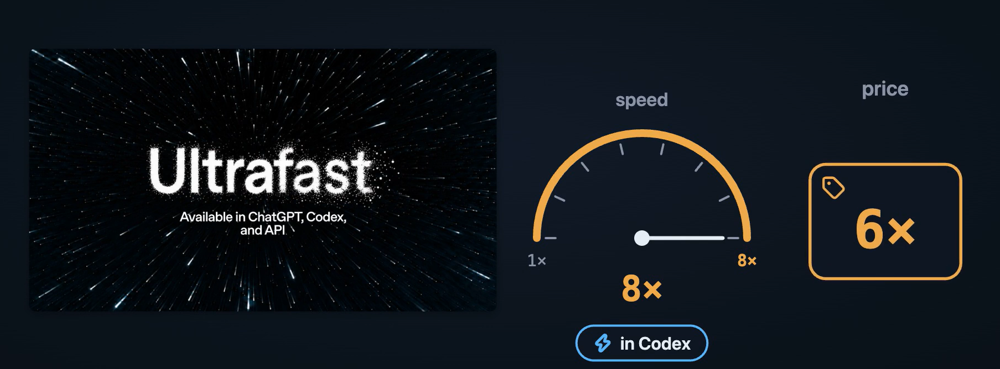
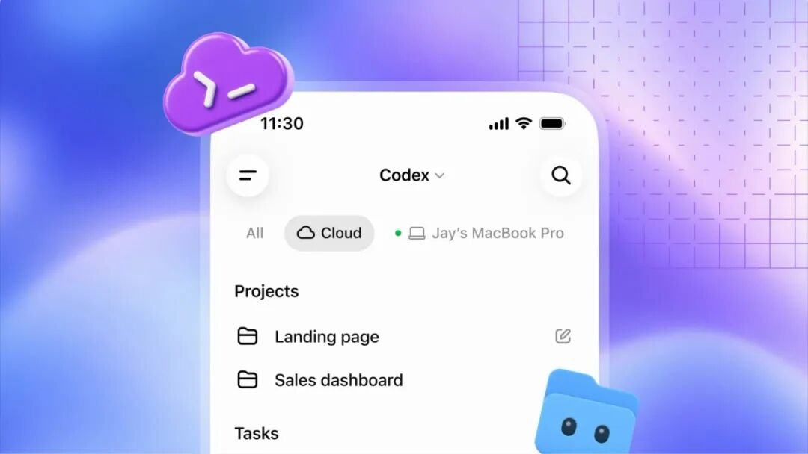
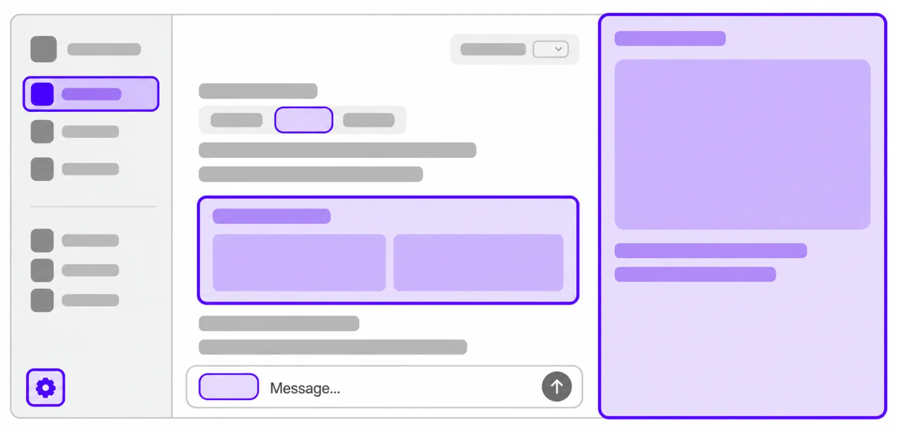
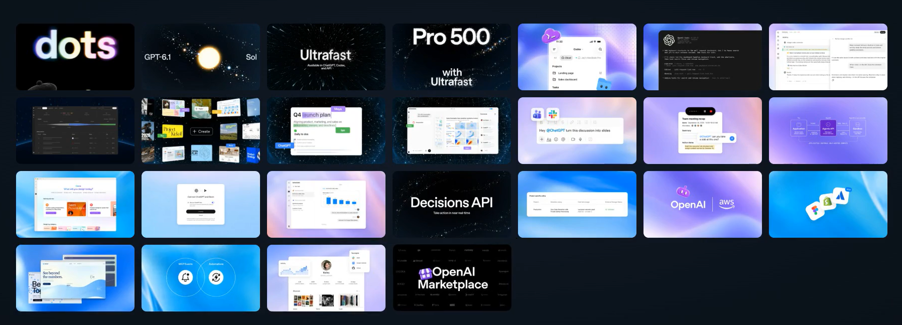

看了一早上OpenAI开发者大会的一些东西,一场大会，20 多项更新!

GPT-6 Sol 才发布七天，OpenAI 又把 GPT-6.1 Sol 放出来了(GPT-6 Sol 享年 0.019 岁（7天）)

9 月 22 日发一个，9 月 29 日再发一个。上一个名字还没叫顺，下一个已经来了。

但昨天这场 DevDay，模型只是其中一项。

OpenAI 还给个人 Agent 配上了云电脑，把能和 AI 一起编辑的文档做进了 ChatGPT，让 Codex 的开发环境可以反复使用，又加了一个每月 500 美元的订阅档。
我们一块儿看一下有啥好玩儿的

## Dots

**Dots 这次最值得停下来看的，是 OpenAI 真给每个 Dot 配了一台自己的云端电脑。**
我觉得这个和grok BOT差不多但是我上次用grok那个，感觉不怎么好用,不知道OpenAI这个好不好用,晚点试一下

你合上笔记本，它还能在那里继续做事。把任务交出去，过几个小时再回来看看进度，这种用法就更接近找人接手一件事了。

而且，OpenAI 给这些“同事”做了自己的样子。

蓝色云朵戴着贝雷帽，黄色三角戴圆眼镜、系领结，绿色角色顶着两只大眼睛。宣传片里还有人给自己的 Dot 起名 Alfred；Holly Li 的那一个，则叫 Dottie。

外观可以自己挑，名字也可以自己起。几种轮廓很简单，放到侧边栏里也能认出来。给它发消息、打电话、把它叫进页面时，出现的都是这个角色。

它由 GPT-6 Astra 驱动，有自己的浏览器，能在云电脑里查资料、写代码、处理文件。你也可以打开那台电脑，看看它正做到哪一步，需要自己处理时接管。

这份工作可以跨过一次聊天。它会保存相关笔记，带着已有对话、偏好和任务背景继续推进。中途你补了一个要求，或改了优先级，就接着告诉它，不必再从头交代一遍。

任务多的时候，它还可以拆给后台 Agent。你继续跟 Dot 沟通，后台的工作也能往前走。

关机这件事也要说清楚。继续跑的是云端任务；如果要用你本地电脑里的文件和应用，电脑和 ChatGPT 客户端仍然得在线。接外部应用，则使用你已经连接并授权的账号和权限。

每个dot都有自己的云电脑，能连接4000多个应用！

按[官方说明](https://learn.chatgpt.com/docs/dots)，Dots 正逐步向符合条件的 Pro、Business Premium 和 Enterprise 用户开放，个人 Pro 有年龄和地区要求，企业需管理员开启。跟 Dot 聊天不占普通对话额度，它交给 Work、Codex 的任务照常计算用量。

所以plus用户现在是没有办法正常使用的
如果要让它一直跟进项目，还有个实际问题：新消息来了，它怎么知道？

这次的 **MCP Events**，让外部软件有变化时可以主动通知 ChatGPT。你设置好要盯哪份文档、哪个频道，新评论或新消息一来，就能叫它继续处理，不用每件事都由你回来提醒。

和它配套的 **Team Tasks**，可以把这些活交给团队共同管理，保存成长期任务。每周整理一次进展也行，等指定消息出现再做也行。

## ChatGPT Space

ChatGPT Space 可以先理解成一个大家能和 AI 一起改文档的地方。

以前让 ChatGPT 写个方案，写完还得复制到 Notion 或 Docs。你改一段，同事提几条意见，再把这些粘回聊天框，让 AI 重新写。

Space 把这几步放到了一起。聊天里写出的东西可以直接变成一份文档，名字叫 **Pages**。你自己改字，同事对某一段留意见，想让 AI 接着改，就在评论里 @ 它，把要求说清楚。

现场有一段演示，比较容易看明白。OpenAI 产品团队的 Holly Li，用一个虚构的音乐应用展示发布前的工作。她让自己的 Dot 补一份常见问题说明，又把测试用户的反馈画成图表。

**图表出现在页面里，可以筛选、查看具体数据。刚才交代的常见问题说明，也补进了同一份文档。**

工程师后来发来新用户上手流程的数据，她可以继续让 Dot 加进去；同事还有补充意见，也能让它一起考虑。不用每收到一点新信息，就把整份方案复制出来再问一遍。

会议记录也能放进这里。新出的 Meetings 插件会生成会议摘要和待办事项，存进 Space。开完会，团队可以在这些记录上继续问：项目计划该改哪几处，哪些事还没跟进。

图：Meetings 的发布画面，图源为赛博禅心实录。

如果团队平时用 Slack 或 Microsoft Teams 这些聊天软件，现在也能在群里直接 **@ChatGPT**，让它根据当前讨论帮忙处理事情。

Space、Pages 面向 Pro、Business、Enterprise，先在桌面和网页端使用。会议插件首发是 Pro、Business 的 macOS 测试版，协作幻灯片会在未来几周推出，完成后可以导出到 PowerPoint 或 Google Slides。

## GPT-6.1 Sol

**Sol 6.1 值得多看一眼的，先是这个价格。**

每百万 token，标准输入 2 美元，输出 10 美元。Astra 对应的是 10 美元和 50 美元。

输入、输出单价，都是 Astra 的五分之一。

| 每百万 token，美元 | GPT-6 Sol | GPT-6.1 Sol | GPT-6 Astra |
| --- | ---: | ---: | ---: |
| 输入 | 2 | 2 | 10 |
| 缓存输入 | 0.20 | 0.10 | 1 |
| 输出 | 10 | 10 | 50 |

表中是输入不超过 272K token 的标准档价格，长上下文、加速档和工具另有计费。

价格便宜了，能力差多少？看 OpenAI 的这张 DeepSWE 代码任务图。横轴是单任务花费，纵轴是得分，先找浅黄色的 Sol 6.1 和蓝色的 Astra。

浅黄色的点在更靠左的位置，达到相近分数。各个点对应不同推理档位。

这也是 OpenAI 给 Sol 6.1 的定位，复杂编码、电脑操作和专业工作上，以更低成本提供接近 Astra 的表现。官方评测可以作为选型参考，换到自己的代码库，还得跑一轮。

和上一代 Sol 相比，输入输出价没涨，缓存输入价又减了一半。Agent 反复带着同一批代码背景和工具说明请求模型，命中缓存的部分能少花一些钱。

模型已进入 API、ChatGPT Work 和 Codex，Plus 及以上套餐可以在相应的 Work、Codex 入口使用。

## Ultrafast 和 500 美元 Pro

便宜的模型发完，OpenAI 另一边又在卖“时间”。

写代码要反复生成、运行、看结果、再改。每轮少等一点，速度就有了可以付费的价值。

**但快也会多扣额度。**[官方文档](https://learn.chatgpt.com/docs/agent-configuration/speed)写的是，Codex 中的 token 生成速度最高达到标准模式的 8 倍，套餐内额度也按 8 倍消耗。购买积分和企业按量付费，则按标准费率的 6 倍计算。

这里比较的是 token 生成速度，外部工具的等待不会跟着缩短八倍。

那个 **每月 500 美元的 Pro**，就在这里接上了。个人订阅目前有 100、200、500 美元三档，500 美元档能在 ChatGPT Work 和 Codex 里用 Ultrafast，另外还有符合条件的企业、教育套餐。API 则另行计费。

更快的按钮和更快的额度消耗，得放在一起看。

## Decisions API

大会还演示了一个 AI 在网页上订机票的过程。它得不断判断下一步该点哪里，实录里记录的画面没有加速，操作也很快。

这里用的是预览中的 **Decisions API**。你给它当前看到的文字或图片，再给几个选项，让模型选下一步。只需要选一个动作，就不用先生成一大段回答。

它以 GPT-6 Luna 为基础，用来分邮件类别、把请求交给合适的 Agent，或者选择网页里的按钮。这种用途和 Jev 很接近。Every 提前测试时，各有胜负；目前价格还没公布，真要接入，得再比自己任务上的效果和花费。

## Codex Cloud

现场另一项任务是让 Codex **用 Rust 重写整个后端**。也就是把一套后台程序换一种编程语言重写，显然要做很久，Romain 就把它留在云端继续跑了。

这样，本地电脑可以休眠，你过一阵从手机、网页或桌面回来，看看做到哪了，再补要求。

图：OpenAI 发布的手机端界面示意。

云端 Codex 早就有了，这次还改了一件很实际的事：项目需要的代码仓库、依赖和工具，可以先准备好，后面的任务继续用这套环境，各自处理自己的代码修改。少了每次重新拉代码、装工具的等待，具体流程在[官方文档](https://learn.chatgpt.com/docs/cloud)里。

写完代码还得检查有没有漏洞。**Codex Security Cloud** 可以定期看仓库和新提交，调查问题，准备好修复供你审核。目前还是研究预览，这次补了定时扫描、重复问题合并和新的管理界面。

常在终端里用 Codex 的开发者，也多了语音交代任务的方式，同时查看多个任务、回来接着上次的工作也更方便了。

想在自己的产品里做这种助手，已有的 **Agents API** 这次增加了操作浏览器的能力，让 Agent 真正打开网页、点击按钮来处理任务；网站访问和登录仍由应用处理。大会还介绍了与亚马逊云服务 AWS 的合作，让相关 Agent 能力可以放到那边运行。

## 插件和订阅互通

大会展示 Figma 接入时，设计稿和 ChatGPT 对话可以并排打开。你在旁边讨论怎么改，它就可以继续处理设计，不用来回切软件。

这次的 **Plugin Extensions**，就是让插件在 ChatGPT 里有自己的界面。可以打开侧边栏、看文件、用编辑器，越来越像直接装在 ChatGPT 里面的小应用。

图：[官方插件扩展入口示意](https://developers.openai.com/plugins/build/extensions)。

创建、提交和发现插件的流程也调整了，开发者能看审核进度和反馈，ChatGPT 可以在对话里推荐能帮忙的插件。Free、Go 的网页扩展还在后续开放安排里。

你自己做的 **Site** 也能接插件。把一个工具分享给团队后，同事用自己的账号登录，就能带上各自的数据和权限。

还有一个省钱相关的变化，**ChatGPT 订阅可以带到部分外部工具里用**。

通过 Sign in with ChatGPT 授权，Plus、Pro 用户能让符合条件的合作产品使用已有套餐额度，报道提到了 Devin、Notion、Vercel 等。你本来就在付 ChatGPT 的订阅费，换个工具时就有机会继续用这份额度。用量仍算在原套餐里，外部工具自己的收费另算。

企业侧另外还有 **Marketplace** 和 **Private Intelligence**。前者让企业把部分已经承诺给 OpenAI 的采购预算，用在获批合作伙伴的软件上，首批有 32 家；后者预览更严格的数据隐私处理能力。这两项主要是公司采购和保密的事，这里就不展开了。

## 最后，还有一张重置卡

所以，20多项发布正在朝着一个方向发展!就是ChatGPT从一个等待你打字的聊天助手变成一个一直在干活的同事,他有自己的电脑，有自己的应用，在你的团队空间有自己的工位！
在未来，或许我们每个人都有自己的Agent员工，Agent同事
至于AI发展的这件事情，我觉得已经停不下来了啊，我们也只能去接受一下它，当然，我们也期待国产模型带来更好的表现!不能把这么一个危险的东西掌握在外国人手里，这是一件很恐怖的事情，我觉得!
