GPT-6.1 Sol 更新了，这次直接给它出题。

企鹅赶飞机、雨夜书店，两组场景，都让它们用代码做出来。SVG 是用代码画出的图，HTML 是能在浏览器里打开的网页。

把上一代 GPT-6 Sol 和 GLM-5.3 也拉进来，前者看升级变化，后者作另一家的参照。

同题同提示词。两个 GPT 用 Codex，GLM 用 ZCODE，推理都选“高”。每题只给一次任务，不追加修改，也不手工修结果。

**这里比较的是两套 AI 编程工具实际交回来的作品，客户端的影响也在里面。** 接下来先看要求有没有做对、人物和物件有没有接好，再看构图和网页安排。

## 先看三只企鹅

第一题很短。

> 生成一个 SVG：一只企鹅拖着行李箱，在机场自动步道上赶飞机。

先别急着数细节。题目要求“拖着箱子”，就看**企鹅有没有真的拿住拉杆**。再看第一眼落在企鹅身上，还是先看到整座机场。

GPT-6.1 Sol 这只戴蓝围巾，拖黄色箱子，另一只翅膀拿着登机牌。脸颊、头上的小毛、箱子贴纸都补上了，还写了一句“小短腿，也要准时抵达”。

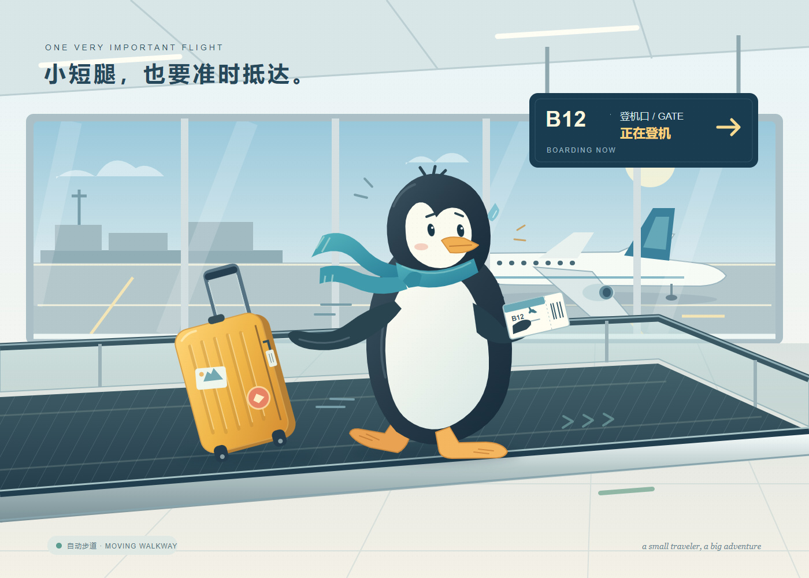

图：GPT-6.1 Sol，静态 SVG。

企鹅和箱子摆得很大。后面的飞机、玻璃墙和登机口，负责把机场交代清楚，第一眼还是落在主角身上。

不过，顺着它左边的翅膀看过去，翅膀和行李箱拉杆之间隔着一段明显空隙。企鹅、箱子都画了，**“拖着”这个关系却没接上**。脸颊和贴纸再丰富，这一处也不能靠可爱蒙混过去。

再看上一代 Sol。

图：GPT-6 Sol，静态 SVG。

脸更圆，身子更短，红围巾和黄箱子很醒目。飞机和步道用了更简单的形状，整张图更像一幅直接的小插画。它同样把企鹅放在正中间，没有让背景抢走注意力。

GLM-5.3 这张，就把镜头往后拉了。

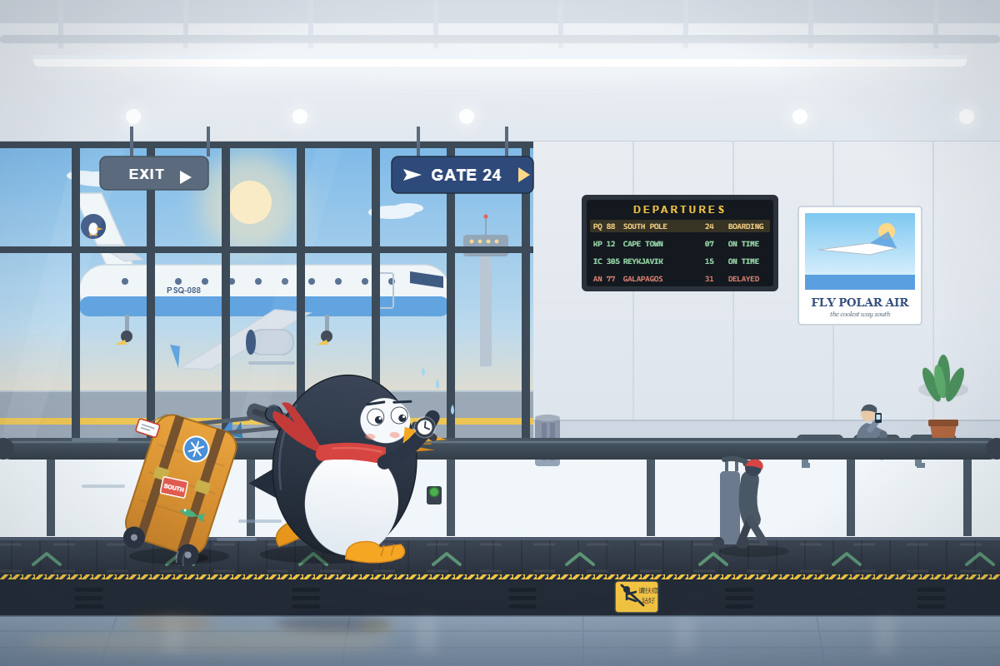

图：GLM-5.3，静态 SVG。

机场里多了其他乘客，墙上有海报，航班牌列出了几行目的地，步道边缘还有警示贴。企鹅在低头看表，赶飞机的动作挺明确，但它和箱子占的地方比前两张小。

所以这题得看两遍。一遍看构图，谁把主角推近，谁把环境铺开；另一遍看要求，有企鹅和箱子，还得让读者看出它真的在拖箱子。

提示词没有指定构图和画风，空出来的地方，它们各自填了不同的东西。

## 再看做成网页的样子

同一题还有动态版，要求做一个完整可运行的单文件 HTML。

提示词还要求企鹅和步道动起来，能暂停和切换速度。这里放的是页面截帧，主要看画面和页面安排。

换成网页，这轮看**它们把空间分给了谁**。标题、按钮和机场各占多少地方，企鹅还够不够醒目？截图先回答这些，走路和暂停效果不能靠一帧图判断。

先看 GPT-6.1 Sol。

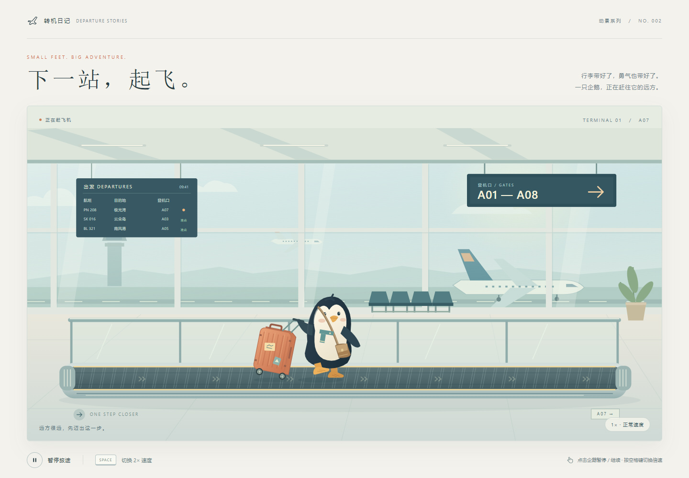

图：GPT-6.1 Sol，动态 HTML 页面截帧。

它额外搭了一套页面，上面是“下一站，起飞”的标题，下面有状态、暂停和倍速控制。画面留给机场的空间多了，企鹅反而比静态图小不少。

同一个模型，换成做网页以后，主角的大小也跟着变了。

旧 Sol 的页面更直接。

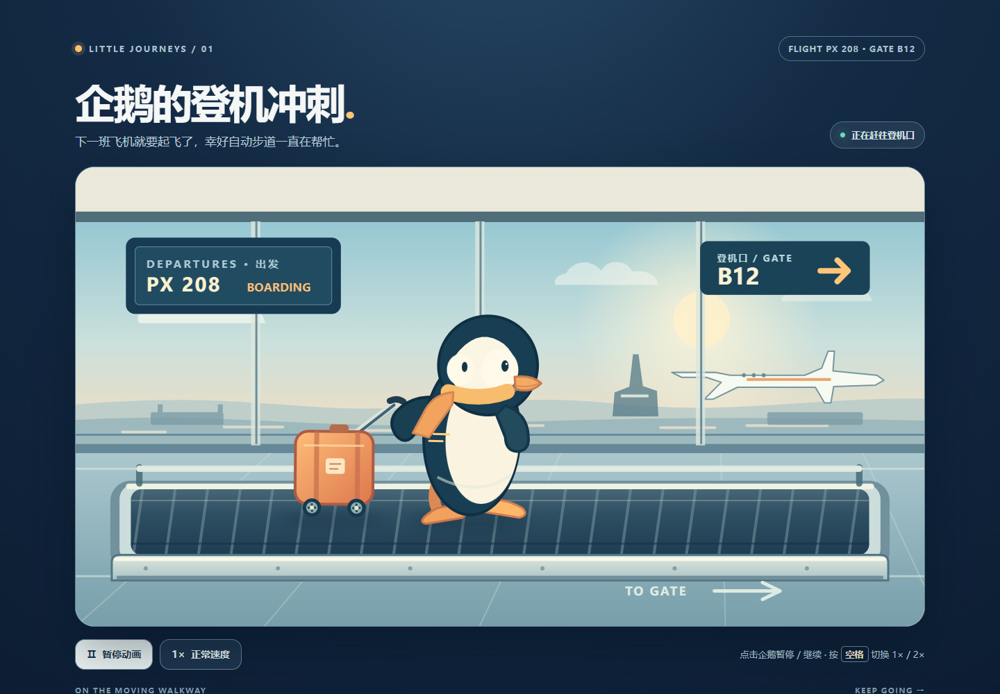

图：GPT-6 Sol，动态 HTML 页面截帧。

深蓝底、圆角画面，两颗控制按钮。企鹅仍然占着中间的大块位置，围巾、箱子和登机口的颜色很醒目，第一眼更容易落在主角身上。

GLM-5.3 的页面用了浅色背景，画面外包了一圈白色边框。

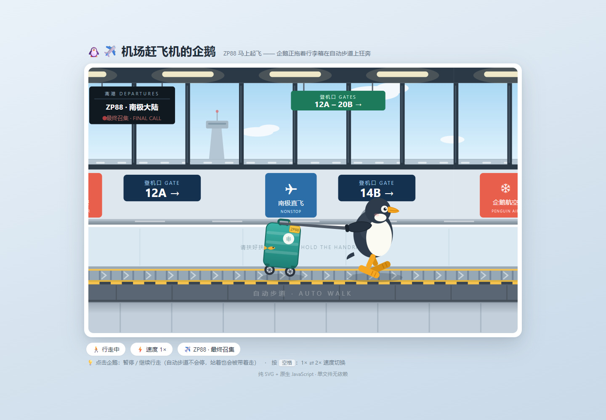

图：GLM-5.3，动态 HTML 页面截帧。

企鹅和箱子留在前面，登机口、离港牌和广告占了更多位置，底下还有几个状态气泡。和前两版相比，它更愿意把机场里的东西铺出来。

只看这几张截帧，就已经能看出区别。Sol 6.1 更像做了一张完整展示页，旧 Sol 把企鹅放得更突出，GLM 则留了更多场景信息。

## 换一场雨，再看一遍

另一道题，是雨夜骑车。

> 生成一个 SVG：雨夜，一位撑伞的骑车人经过街角一家亮着暖灯的小书店。

这题多了几处要接好的关系。**沿着伞杆找手，再看另一只手和车把的位置。** 最后看书店的暖光落在哪片地面，骑车人会不会淹没在夜色里。

GPT-6.1 Sol 用了一把红伞。

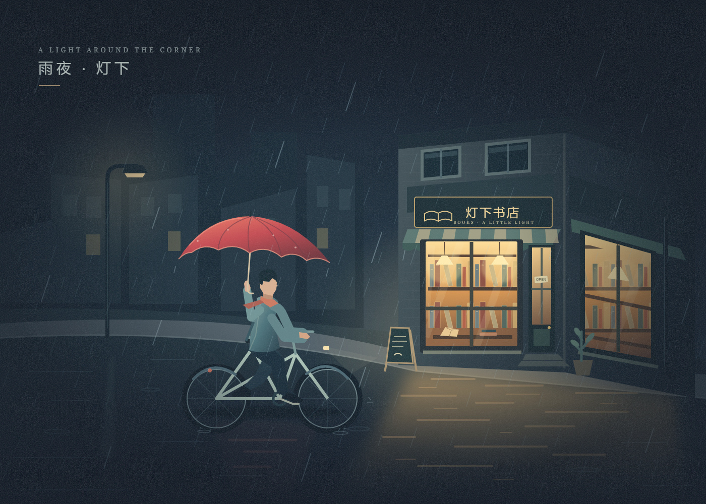

图：GPT-6.1 Sol，静态 SVG。

暗蓝色的街道里，红伞和书店的暖灯很容易被看见。橱窗里的书、侧面的玻璃、门口的小黑板、地面的反光，都围着这两处亮色展开。画面还有细细的颗粒感。

这张撑伞的手接在伞杆上，另一只手伸向车把，动作比只画个人坐在自行车上更容易读懂。书店窗下那片暖色反光，也把亮着灯的店和湿地面连了起来。

旧 Sol 给的是蓝伞。

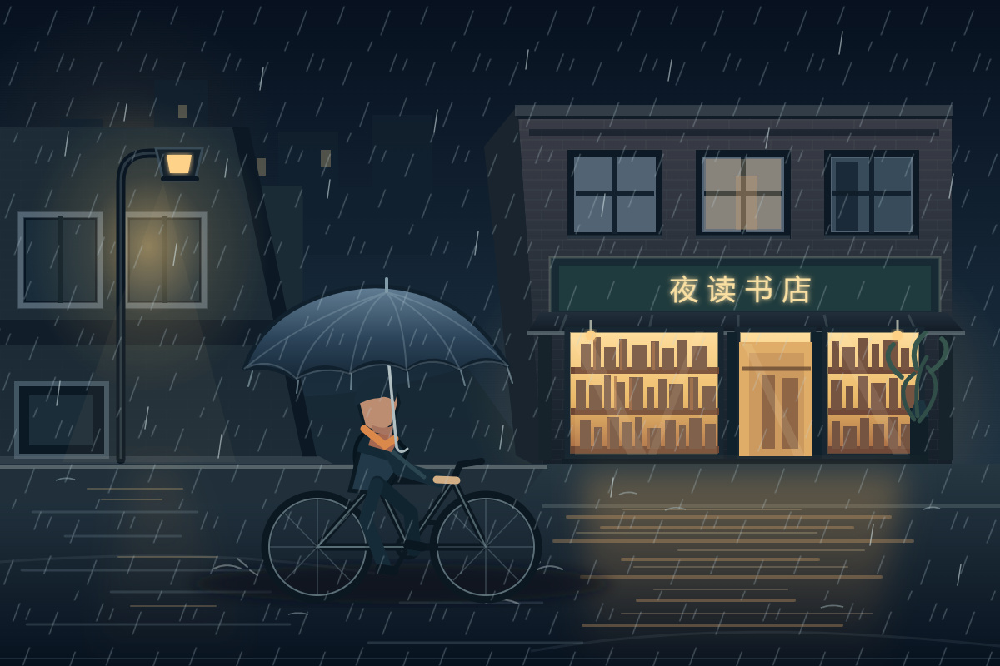

图：GPT-6 Sol，静态 SVG。

人、伞和雨夜都在偏蓝的颜色里，书店的窗户更亮。形状依旧简洁，雨线和地面的反光也画出来了，但骑车人不像红伞那张那么突出。

它的蓝伞几乎融进了蓝色背景，倒是脸、围巾和车把旁边的手更容易找到。所以这一张第一眼吸引人的，主要还是书店的灯。

GLM-5.3 这边，店里还有人在忙。

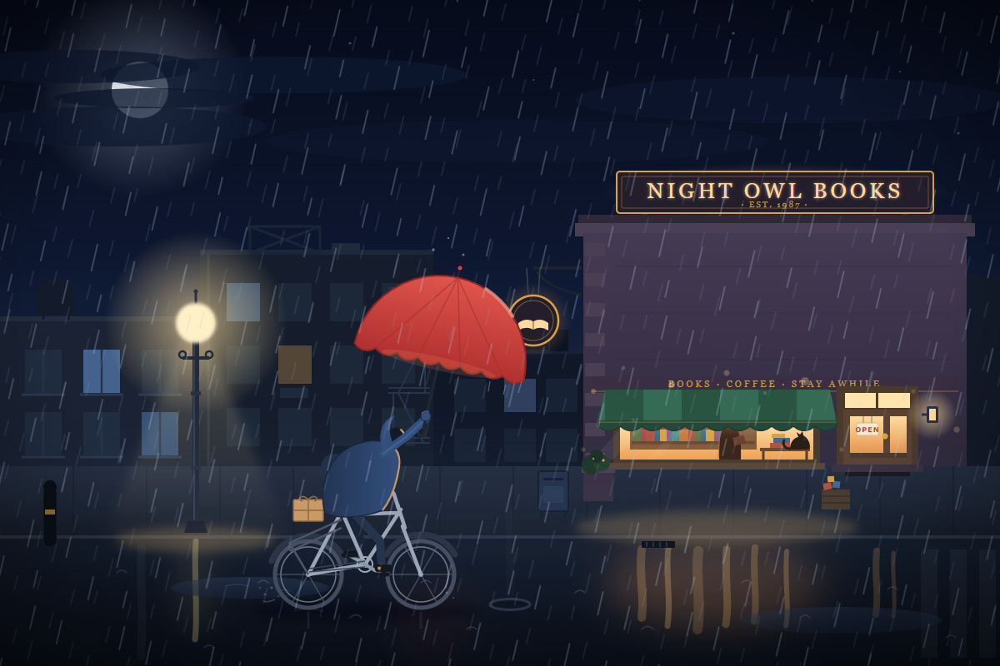

图：GLM-5.3，静态 SVG。

橱窗里有个人和一只猫，旁边挂着 OPEN，小招牌写着 BOOKS、COFFEE、STAY AWHILE。再往外看，是月亮、路灯、后面的楼和水面的反光。

骑车人也穿了深蓝衣服，脸压在兜帽的暗色轮廓里，缩小看不太容易辨认。红伞很抢眼，人物的手和车把就得多找一下。周围可以看的东西多了，主角未必也跟着更清楚。

这些都是提示词没单独交代的细节。前面的机场里，它补乘客、航班和海报；到书店这里，又往周围加了一点生活。

静态题看完，Sol 6.1 的红伞和暖灯形成了很清楚的焦点，GLM 则给了更多可以慢慢看的边角。两种方向都能在图里找到依据。

## 雨夜做成网页，Sol 6.1 又多搭了点东西

动态题只要求，用一个自包含 HTML，让撑伞骑车人经过暖灯书店，没有额外要求按钮和音效。

前面看了灯光，这里再看**场景之外多了什么，以及这些东西占了多少位置**。同样交一份网页，有的把街景铺满，有的还搭了一套展示页。

GPT-6.1 Sol 又做出了一整页。

图：GPT-6.1 Sol，动态 HTML 整页截图。

标题变成了“雨夜，书页与归途”，主场景下面有暂停、雨声和雨量控制。

这些控制都是提示词没要求的。它把场景、文案和操作区一起摆出来，已经有一个小展示页的样子。

旧 Sol 和 GLM 更接近直接把场景铺满屏幕。

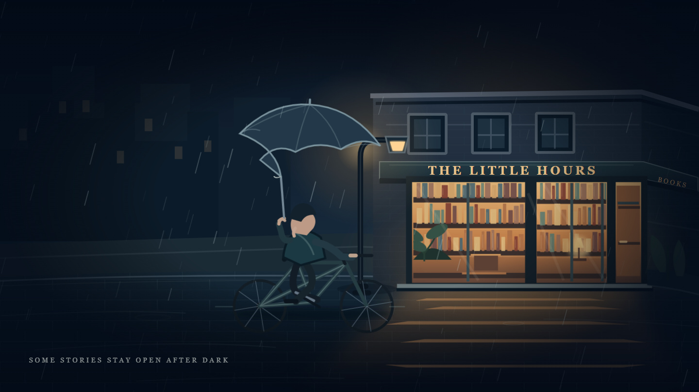

图：GPT-6 Sol，动态 HTML 场景截帧。

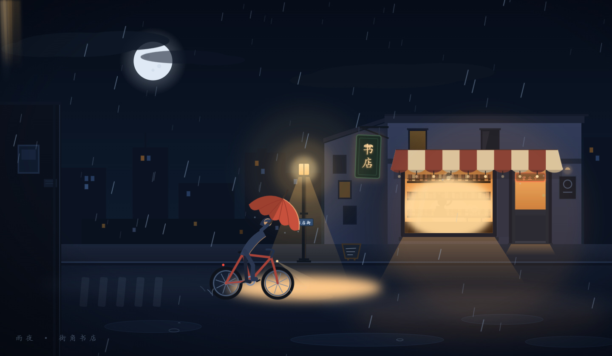

图：GLM-5.3，动态 HTML 场景截帧。

旧 Sol 的书店橱窗和骑车人占得更大，蓝伞和夜色仍是同一套配色。GLM 的画面留给街道更多空间，窗里的身影、路灯照亮的地面和水洼，都还能看见。

这回能看出 Sol 6.1 对“交一个 HTML”的理解，和另外两份结果有点区别。它连续两题都在场景之外加了标题、状态和控制，摆出来更像一个做完的网页。

只是，页面搭得更完整，和插画主角是否更突出，也得分开看。它的静态企鹅很大，动态页的企鹅就小了；有时候多留给页面和环境一点地方，角色也会退后一点。

拿来做作品展示，这样摆已经很完整。只需要一幅场景的话，额外的标题、按钮和文案，就得看自己需不需要了。

每题只有一次交付，这些差异先记在本轮作品上，不急着推成某个模型的一贯水平。

## 价格也放在这里

图看完了，用起来花多少钱也得交代。这张表是 OpenAI 系列按处理文字量计费的标准 API 单价，Astra 没参加这轮画图，只放进来作价格参照。

| 每百万 token，美元 | GPT-6 Sol | GPT-6.1 Sol | GPT-6 Astra |
| --- | ---: | ---: | ---: |
| 输入 | 2 | 2 | 10 |
| 缓存输入 | 0.20 | 0.10 | 1 |
| 输出 | 10 | 10 | 50 |

表中适用于输入不超过 272K token 的标准档请求，长上下文、加速档和工具另有计费。数据来自 [GPT-6 Sol](https://developers.openai.com/api/docs/models/gpt-6-sol)、[GPT-6.1 Sol](https://developers.openai.com/api/docs/models/gpt-6.1-sol)、[GPT-6 Astra](https://developers.openai.com/api/docs/models/gpt-6-astra) 的官方模型页。

**Sol 6.1 的标准输入、输出单价，都是 Astra 的五分之一。和上一代 Sol 相比，输入输出价没变，缓存输入价又减了一半。**

反复带着同一批项目背景请求模型，命中缓存的部分能少花钱。不过这张表是 API 计费，和本次 Codex、ZCODE 的订阅额度不是同一个口径。

## 简单总结一下

这批结果看完，Sol 6.1 的红伞和暖灯、两份 HTML 额外搭出的展示页，都很容易留下印象。GLM 则在机场和街道周围添了更多生活细节，旧 Sol 的几张图更简洁，主角也摆得大。

但企鹅那张也提醒了一件事，画得细，和把要求做对，要分开看。翅膀有没有接住拉杆，比箱子上多几张贴纸更能说明“拖着”有没有画出来。

两组场景还远远谈不上定胜负。至少看这些作品时，除了第一眼漂不漂亮，还得顺着人物的手，把箱子、伞和车把之间的关系看一遍。

今天深度体验了一天，我感觉 6.1 Sol 还是挺强的！OpenAI 给它的定位是接近 Astra 的表现，标准输入、输出价格只有五分之一。

用了一天，感觉还是非常耐用的。不知道大家有没有这个感觉，就是今天更新之后，感觉 GPT 变得更加耐用了！

我和我朋友都这么觉得!

但是这个速度啊，真是一言难尽，真的要多慢有多慢！以至于我在网上看了这么一张图，真的快笑死我了！

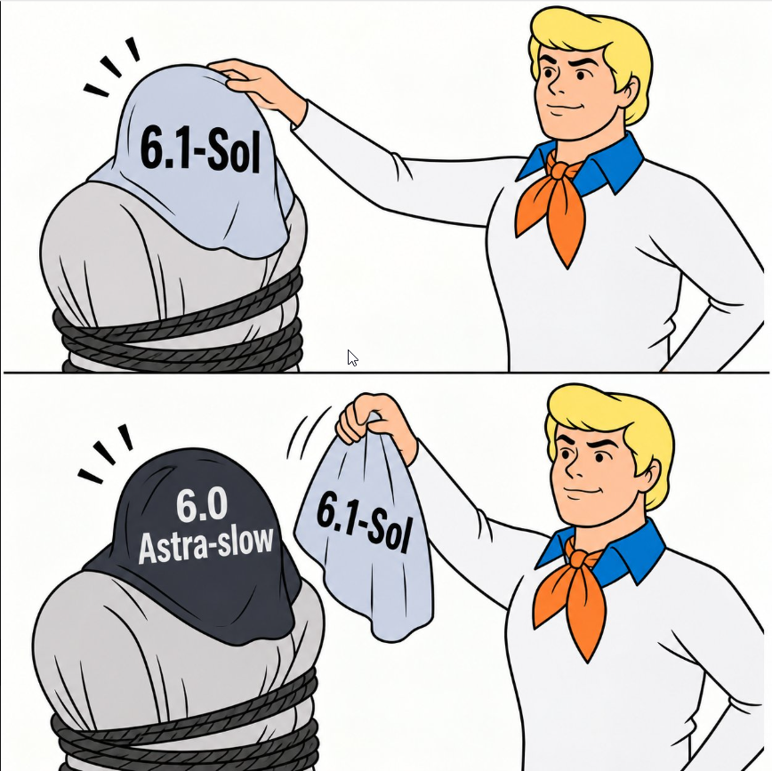
