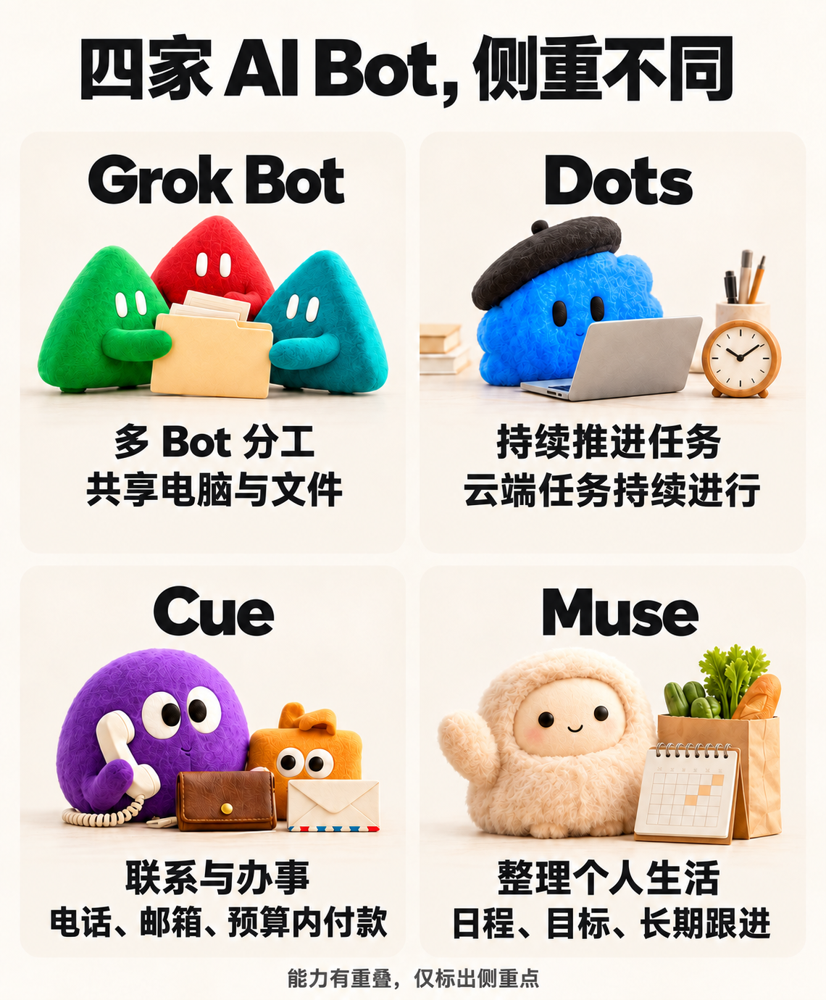
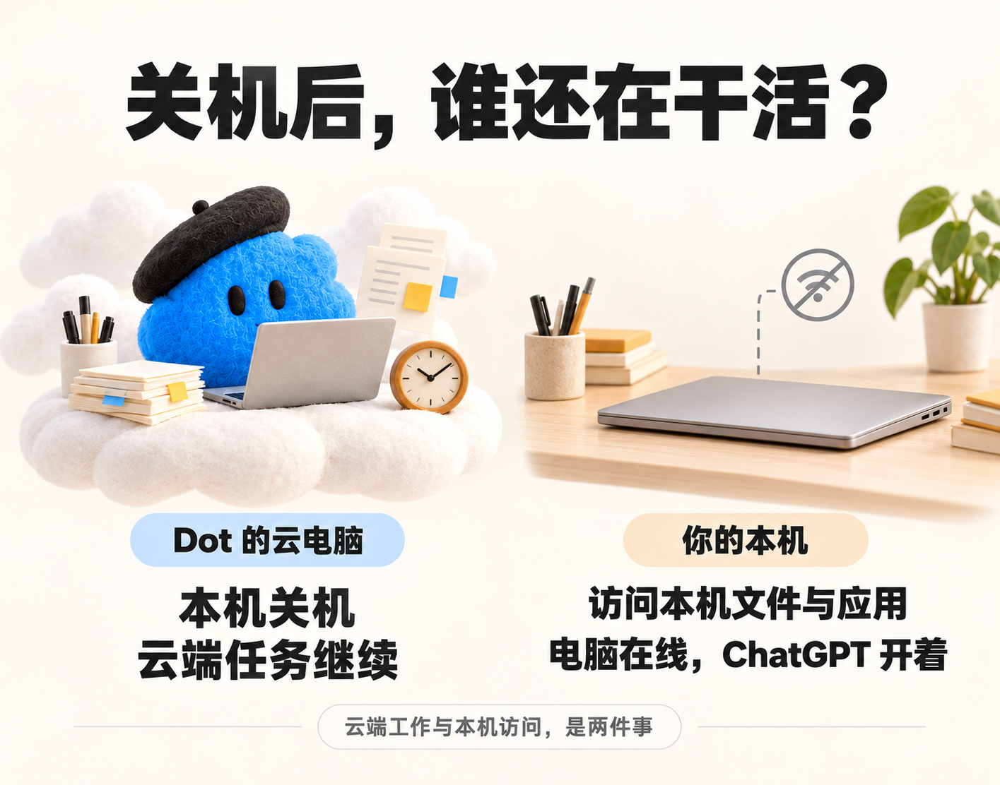

最近这一个多月，xAI、OpenAI、Manus、Meta，陆续把自己的 AI Bot 摆到了台前。

**Grok Bot、Dots、Cue、Muse。**

乍看都挺像：有自己的电脑，能接任务，也不只是陪你聊天。

但我把四家的资料放到一起以后，发现它们想做的东西差得还挺远。

**同样叫 AI Bot，四家公司其实给出了四种答案。**

先放张图，一眼看个大概，后面再沿着官方材料，一个一个拆。

图：封面及正文配图均为原创示意图，角色为非官方形象。这里只突出各家侧重，能力并非互斥。

## Grok Bot

**Grok Bot 最容易让人记住的，是你可以自己搭一支 AI 小队。**

每个 Bot 都能有名字、职责和长期保留的工作背景。你可以让一个盯邮件，一个处理报销，另一个专门复现软件里的问题。

xAI 在[发布介绍](https://x.ai/news/introducing-grok-bot)里，举过一个很具体的内部用法。

工程 Bot 先在产品界面里复现 bug，建好问题单，再把修复工作交给负责调试的 Bot。销售 Bot 则会更新客户管理系统里的通话笔记，准备后续联系的草稿。

这些例子最值得看的，是交接发生在哪里。

我们平时用几个 AI，往往还是自己在中间搬东西。这个查资料，那个写稿，再开一个检查。每换一次，都要贴背景、贴文件、解释刚才做到了哪一步。

Grok Bot 允许 Bot 直接给彼此发消息，也可以把几个 Bot 放进同一个群聊，自己分配工作、交接结果。

用在内容生产里，很容易想象出一种分法。一个搜集新闻，一个整理证据，一个写初稿。稿子有一处事实没查清，写稿的 Bot 可以把问题交回去。

这个例子是我们可以尝试的用法，前面的修 bug 和销售跟进，才是 xAI 自己公开的案例。

还有个细节，比“多 Agent 协作”这几个字更实在。

按[官方文档](https://docs.x.ai/grok-bot/overview)，**同一个账号下的 Bots，共用一台云电脑。**

文件、浏览器登录状态、应用账号都在这里。各个 Bot 的对话和记忆分别保留，但可以通过共享文件和消息交接背景。前一个整理好的材料，后一个能接着用。

它们也可以并行工作，每个 Bot 有自己的操作屏幕。所以这个“小队”既有各自的工作位置，也有共同放东西的地方。

再往下，是怎么把一次做成的事留下来。

Grok Bot 把这件事分成两步。**Skill 保存做法，Routine 负责什么时候再做。** 比如每周整理客户近况，先把查哪些系统、怎么判断异常、输出什么内容写成技能，再安排固定时间运行。

官方还提供示范教学的方式。这个入口可用时，你操作一遍浏览器，Bot 跟着记录，再生成技能草稿。生成以后仍然要检查，遇到缺数据怎么办、哪一步需要你拍板，这些不会因为看过一遍操作就自动齐全。

Grok Bot 目前仍是 beta，可通过支持的 SuperGrok 或 Cursor 付费套餐使用。

它比较适合从一个有明确职责的 Bot 开始。等确实出现稳定分工，再加第二个。一下创建十几个“员工”，光记谁负责什么，也够忙的。

## Dots

到了 OpenAI 的 Dots，可以先抓住一件事。

**每个 Dot 都有自己的云端电脑和浏览器。你关掉本机，它的云端任务还能继续。**

前几天写 OpenAI 开发者大会时，我已经聊过这个“AI 工位”。这次放到四家里面看，重点更容易看清了。

你交给它的，可以是一件一直有后续的事。

比如准备团队出行。场地要比较，人数会变，预算有上限，别人的回复也不会同时到齐。查完一次资料，距离事情办完还差好几轮。

OpenAI 的[官方文档](https://learn.chatgpt.com/docs/dots)就用这个场景解释 Dots。它可以随着参加者确认更新人数，发现需要重新询价时，再向你确认是否发送请求。

这里多出来的，是等待之后的那一步。

你不用每次收到一点新信息，就重新开个聊天，把整个活动背景再讲一遍。Dot 带着已有笔记、决定和任务进度继续做，碰到需要你判断的地方，再来找你。

它能决定什么时候暂停、什么时候醒来接着处理，也能把几件工作交给后台 Agent 并行推进。你还可以继续跟它聊天，中途改预算、补要求、调整优先级。

真正的工作经常就是这样。正在做的事没停，老板又想起了一条要求。

Dots 还把这种连续性放到了联系渠道里。

在 ChatGPT 里发消息，在 Slack 或 Teams 里联系，或者跟它通话，接到的都是同一个 Dot。换个入口，不会重新生成一个失忆的助手。

不过，把它加进群聊，也不等于它就开始监听所有消息。你得告诉它关注哪些变化、什么时候提醒你。它保存的任务笔记，才让这些零散联系能接到同一件事上。

云电脑也让它有地方真正操作。开网页、处理文件、运行软件，需要查看时，你可以打开那台电脑，接管其中一步，再把控制权还给它。

如果任务涉及代码，它可以创建 Work 或 Codex 任务，使用配置好的 Codex 云环境，也能继续处理已连接电脑上的本地 Codex 任务。

这里有个容易被宣传里的“关机后继续工作”带偏的地方。

**能关机后继续的是云端工作。要访问你本机的文件和应用，本机仍需在线，而且 ChatGPT 客户端要开着。** 云电脑的浏览器，也不会自动继承你本机所有登录状态。

图：云端任务可以继续，访问本机则需要本机在线。

所以，给 Dot 工位只是第一步。它要处理的材料、能用的账号、该回来问你的决定，都得跟具体任务一起交代。

Dots 正逐步向符合条件的 Pro、Business Premium 和 Enterprise 用户开放。个人 Pro 还有年龄与地区条件，Enterprise 需要管理员开启；Plus 暂不在这份开放名单里。与 Dot 对话不占普通聊天额度，它交给 Work、Codex 的工作照常计算用量。

## Cue

Manus 的 Cue，这次给 Agent 配的东西就更直观了。

**邮箱、电话号码、钱包、电脑，一个都没少。**

这是 Manus 在[2.0 发布介绍](https://manus.im/zh-cn/blog/introducing-manus-2-0)里写明的能力。Cue 是一款独立应用，和 Manus 使用同一套基础设施，每个 Agent 都有自己的身份。

图：电话标的是接听用户来电，付款标的是用户设定的预算。

为什么电话和钱包会让人多看一眼？

因为很多事情卡住的位置，恰好就在“联系别人”和“付钱”这两步。

让 AI 找餐厅，它能给出候选。让它比较服务，它能整理价格。但到了要联系商家、确认需求、下单付款，事情往往又回到你手上。

Cue 给 Agent 独立联系方式和支付能力，就是希望把后面的动作也接起来。

官方说，它可以发送消息，在你设定的预算内付款，也可以接听你的电话，然后在 Cue 里留下摘要。

电话这一点也得说准。公开介绍明确写到了接听用户电话；“有电话号码”本身，还不足以证明它能稳定拨打任何商家的电话，把所有预约都办完。这部分需要具体用起来再看。

不过，Manus 已经给出了一个更贴近日常的场景。

**人在餐厅里扫二维码，由 Agent 帮你点餐或者排队。**

这个动作很小，却很能说明 Cue 想走的方向。任务的终点到了服务现场，结果是订单或排队状态，光回一段建议已经不够了。

邮箱也是同样的道理。一项服务要询价、补需求、确认回复，有一个可以持续联系的身份，这件事才容易接着往下走。

钱包则多加了一条约束。官方的说法是“在你设定的预算内付款”。预算就是你交代任务的一部分，要花多少钱、买什么、哪些情况需要回来确认，都得说清楚。

Cue 也能组队。官方举的例子是准备纽约发布会，一个 Agent 调研场地，一个筛选候选，第三个起草演示文稿。它们放在同一个群聊里合作，你决定方向和最终选择。

所以，多 Agent 在 Cue 里也有。但把它放进这次对比，我更想记住那四样东西。它们让 Agent 有了一套能持续联络、操作和付款的条件。

Cue 目前处于早期体验阶段，需要邀请码。官方列出了网页、桌面和移动端，iOS 版本随 App Store 审核通过陆续推出。发布页上的体验邀请码有名额限制，能否使用仍以当前入口为准。

## Muse

Meta 的 Muse，最容易从一个生活场景看懂。

你在 Instagram 存了一条菜谱视频，下周打算请朋友吃饭，某个朋友不能吃某种食物。这些信息现在可能散在收藏、聊天和你脑子里。

Meta 在[官方介绍](https://about.fb.com/news/2026/09/introducing-muse-personal-ai-agent/)里说，Muse 可以把保存的菜谱转成购物清单，建议聚餐菜单，并在发邀请之前考虑朋友的饮食限制。

**它想接住的，是这种零散、私人、还有后续的小事。**

图：日历、目标、待办和长期记忆，把零散的生活信息接起来。

同样的思路，也用在长期目标上。你告诉它想完成什么，它帮你安排时间和资源，然后继续推进。健身计划会随着你的生活安排变化，账单可以尝试协商，旅行也能接着办理。

这些仍然是 Meta 给出的能力说明。还有一个第三方的实际例子，可以放在一起看。

Ethan Mollick 在[10 月 1 日的文章](https://www.oneusefulthing.org/p/the-dot-and-the-swarm)里写到，Muse 注意到他的一笔可以抵扣机票的额度快过期了。他提出要求后，Muse 联系了航空公司申请延期。

这件事最有价值的地方，是先发现那笔快被忘掉的额度，再由用户决定是否让它处理。很多生活助理的价值，就在这些你没有天天盯着的小地方。

Muse 也有自己的云电脑。你可以在 Muse 应用里联系它，也能通过 WhatsApp 跟它说话，关掉应用后，较长的任务可以继续进行。

因为它要接触邮件、账号、消费和个人计划，Meta 专门做了 **Muse Secure VM**。可以把它理解为一台独立的云电脑，Agent 和你连接的资料放在里面，与其他用户的环境隔开。

按官方设计，还有一个独立的 Sentinel Agent 检查对外操作。密码和支付凭据放在安全存储里，Muse 可以使用，但看不到具体内容。

Muse 也能通过 Stripe 的 Link 付款。发邮件、购买等敏感动作，需要向用户确认，也会留下操作记录。所以，付钱办事这条路，Meta 同样在走。

这套设计说明 Meta 在处理什么问题，实际执行仍然得看结果。

[The Verge 的报道](https://www.theverge.com/ai-artificial-intelligence/1003399/meta-openai-ai-agents-muse-dots-battle)提到，Muse 曾因在 Facebook Marketplace 交易中向陌生人提供用户住址引发争议。独立云电脑能隔离运行环境，至于 Agent 有没有准确理解你允许它做什么，还要另外检验。

还有一点，也把它和 Dots 拉开了距离。Muse 在美国逐步开放，覆盖 iOS、Android 和网页，官方说多数日常需求可以免费使用，想做更多则有订阅方案。Dots 目前先从付费高档套餐开放。

一个先希望你把长期工作交出去，一个先希望更多人把日常琐事交出去。这个差别，连入口和价格都能看出来。

四个看下来，我现在反而不太愿意把它们统称成一种“AI Bot”了。

Grok Bot 想的是怎么让一群 Bot 分工。

Dots 更在意一件事能不能一直往前推进。

Cue 已经开始碰电话、邮件、支付这些现实世界里的事情。

Muse 则明显想钻进一个人的长期生活里。

功能会重叠，但各家最想接住的那件事，确实不一样。

**名字都叫 Bot，四家公司对“AI 到底应该替人干什么”这件事，给出的答案已经很不一样了。**

这也是我觉得这四个东西值得放在一起看的原因。
